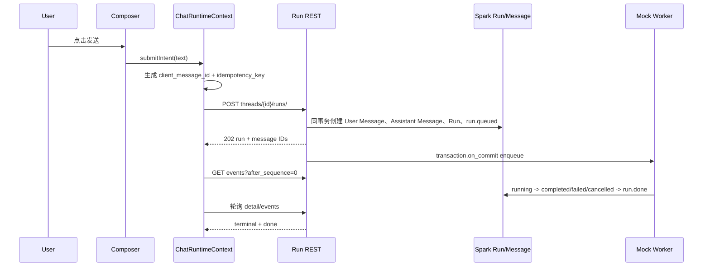
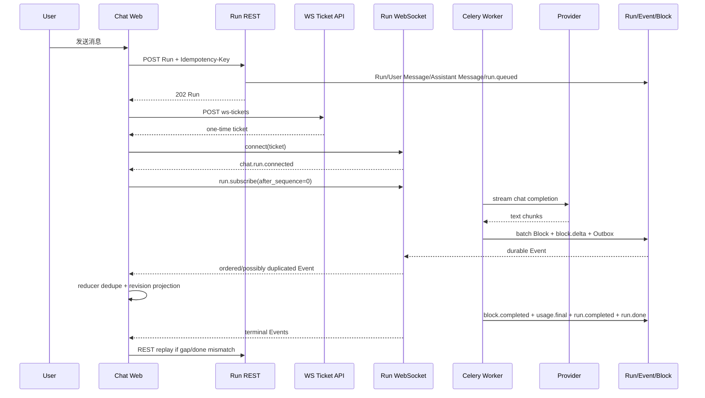

# AI 对话 Web App P0–P7 分阶段实施计划

## 1. 文档定位

本文档是 `chat-web/` 分阶段建设的唯一事实源，统一维护 Web 实现范围、服务端联调门禁、DeepTutor 源码迁移边界、用户可见 UI、`CHAT-WEB-*` 工单归属和出口验收。

配套文档只维护专项细节，不再分别维护 P0–P7 阶段表：

- [AI 对话 Web App 实现工单](./AI%20对话%20Web%20App%20实现工单.md)：模块、流程、状态、接口和完整工单定义。
- [AI 对话 Web App 源码迁移清单](./AI%20对话%20Web%20App%20源码迁移清单.md)：五级迁移分类、源文件范围、许可证和目标目录。
- [AI 对话 Web App Plain Text UI 设计](./AI%20对话%20Web%20App%20Plain%20Text%20UI%20设计.md)：页面结构、尺寸、交互和响应式设计。

`当前事实`：SparkService 当前尚未创建 `chat-web/`；服务端已经存在 v1 契约 fixture、Run/Event REST、Run WebSocket 路由、Mock executor 和初步纯文本 Provider 代码，但生产开关默认关闭，且各服务端阶段仍需按其门禁继续验收。本文 Web 阶段内容均为 `建议演进`，完成前不得标记为当前 Web 能力。

## 2. 接入时间结论

- `P0`：Web 立即开始，建立工程、契约、Reducer、迁移登记和静态 UI。
- `P1`：接入现有账号能力和 Run REST 控制面；生成使用 Mock Worker。
- `P2`：首次接入真实服务端 AI 流式输出，形成可内部试用的文本对话闭环。
- `P3–P6`：增量接入上下文、服务端工具、等待交互、Capability 和延迟工具。
- `P7`：全量切换、生产加固和旧配置清理，不是 Web 首次开发或首次联调阶段。

### 2.1 第一阶段交付边界

本文所称“第一阶段”完整覆盖 `P0 → P1`：

```text
P0 工程 / 契约 / 静态 UI
  -> P1 Auth / Thread Sync / Run REST / Mock Worker
  -> 第一阶段出口
```

第一阶段完成时，Web 已能真实登录、管理同一套 Thread、创建/查询/取消/重生 Run，并通过 REST 观察 Mock Worker 收敛；尚不能把 Mock 结果称为 AI 回答，也不包含真实 Provider、WebSocket 流式、上下文、工具或 Capability。上述能力从 P2 起进入下一阶段。


## 3. 全阶段执行规则

### 3.1 契约、兼容与 Feature flag

1. 每阶段先更新服务端 `tests/contracts/` fixture、Web TypeScript 类型和 reducer 测试，再实现 Gateway 与组件。
2. Web 不根据自然语言或 DeepTutor interface 猜测 Spark 字段；Spark API/Event/Block Schema 是唯一契约来源。
3. Event/Block 保留 `schema_version`、`sequence` 和未知类型 fallback；新类型不能让旧 Web 丢失整条消息。
4. P0/P1 可使用版本化 Mock，但不得自定义第二套 DTO、状态名或错误码。
5. 每阶段能力使用独立 feature flag；关闭入口后，历史消息、活动 Run、取消和终态恢复仍可用。
6. 至少验证“当前 Web × 当前服务端”和“上一稳定 Web × 当前服务端”。

### 3.2 迁移与许可证

- 每个迁移 PR 标注阶段和 `CHAT-WEB-*` 工单，登记 DeepTutor 源 commit、路径、五级分类、修改摘要和验证证据。
- 只迁移当期真正使用的文件或符号，不因同目录已有文件而整目录复制。
- DeepTutor API、认证、Session/Turn、Provider Key、数据库和工具执行语义一律不得进入 `chat-web/`。
- `LICENSE` 与 `THIRD_PARTY_NOTICES.md` 从第一个迁移 PR 开始持续维护，不在 P7 集中补录。

### 3.3 每阶段通用交付证据

- typecheck、lint、单元/组件/契约测试。
- 390、768、1024、1440px 截图基线。
- 键盘、焦点、`aria-live`、对比度和减少动效检查。
- 正常、空、失败、取消、离线、刷新恢复和 feature flag 关闭状态。
- 至少一条 Playwright trace、端到端录像或等价可复核证据。

## 4. P0：契约、工程与静态 UI 基线

### 4.1 阶段目标与进入门禁

目标是建立可独立构建、测试和视觉验收的 `chat-web/`。进入本阶段前需要冻结 Event/API/Block v1 fixture、错误码草案、DeepTutor 参考 commit/hash 和 Apache-2.0 归属。

### 4.2 Web 实现与可见 UI

- 创建 Next/React/TypeScript/Tailwind 工程、路由、Token、主题和测试配置。
- 实现 `types/chat.ts`、`event-reducer.ts`、`turn-reconcile.ts`、`composer-keyboard.ts` 和 `single-flight.ts`。
- 完成静态登录、App Shell、最右导航、会话侧栏、消息卡、`ChatBlockRenderer` 和 Composer。
- 建立 loading、empty、recoverable error、forbidden、offline 和 unknown Block fixture。
- UI 数据全部来自版本化静态 fixture，不宣称已连接真实账号、Run 或模型。

### 4.3 DeepTutor 迁移边界

- 允许：工程配置、纯 Hook/工具函数、基础 UI、Shell/Sidebar/Composer/消息卡静态结构和对应测试。
- 必须重写：Spark 类型、Event reducer、Chat Runtime Context 和 fixture 映射。
- 禁止：DeepTutor API、Auth、`unified-ws`、Run Context、Session/Turn 标识和工具业务状态。

### 4.4 工单与出口验收

工单：`CHAT-WEB-000`、`001`、`009`、`004` 静态部分、`008` 测试/视觉基线，以及 `CHAT-WEB-016A/B` 统一 Toast 基础设施。

- [ ] 工程可独立启动、测试和构建，不影响另外两个 Web App。
- [ ] 重复、乱序、revision 和未知 Event/Block 有 reducer 测试。
- [ ] 静态工作区通过四个目标视口和键盘路径验收。
- [ ] DeepTutor 来源均有迁移分类和许可证登记。
- [ ] 运行时代码没有 DeepTutor API/Auth/WS import。

### 4.5 P0 已核验基线

| 核验项 | 当前事实 | P0 处理方式 |
| --- | --- | --- |
| Web 工程 | 仓库只有 `open-web/`、`backoffice-web/`，没有 `chat-web/` | 新建根级独立 App，不修改两个 Vue App 的职责 |
| 包管理 | 两个 Spark Web App 使用各自的 `pnpm-lock.yaml`；DeepTutor Web 使用 `package-lock.json` | `chat-web/` 使用独立 `package.json + pnpm-lock.yaml`，不复制参考 lockfile |
| 跨端契约 | `chat_sync/tests/contracts/` 已有 manifest、6 个 v1 Schema、合法/非法 fixture 和 SHA-256 | 以该目录为唯一源，通过同步/校验脚本生成 Web 契约快照 |
| Run 控制面 | `chat_sync/ai_api/`、`ai_services/run_service.py`、migration `0003` 已存在 | P0 只生成类型和 fixture，不调用真实 REST；真实控制面联调归 P1 |
| Run WS | `chat_sync/ai_routing.py` 已声明 `/ws/chat/runs/`，并挂入 ASGI | P0 不建立连接；重连和实时事件接入归 P2 |
| 服务端开关 | `CHAT_AI_SERVER_RUNS_ENABLED=false`、`CHAT_AI_RUN_EXECUTOR=disabled` 为默认值 | P0 不要求改变任何服务端运行开关 |
| DeepTutor 来源 | 参考仓库当前 commit 为 `684d615393322cd18d9edb3a85eacb3beba0d811`，Apache-2.0 | P0 在 NOTICE 固化 commit；参考工作树非完全干净，复制文件还需记录源文件 SHA-256 |
| DeepTutor P0 文件 | Composer 键盘、自动高度、IME、通用 Hook、Button/Tooltip、Shell/Sidebar 等源文件已核验存在 | 严格按“直接复用/部分迁移”逐文件执行，不复制整个 `web/` |

### 4.6 P0 目标目录与文件职责

P0 结束时至少形成下列目录。`chat-web/` 当前不存在，以下均为本阶段待创建文件。

```text
chat-web/
├── app/
│   ├── (auth)/login/page.tsx                 # 静态登录状态，不调用 Auth API
│   ├── (workspace)/
│   │   ├── layout.tsx                        # App Shell 组合根
│   │   └── chat/[[...threadId]]/page.tsx     # fixture 驱动 Chat Workspace
│   ├── p0-fixtures/chat/page.tsx             # 仅开发/测试可达的状态画廊
│   ├── globals.css                           # Spark Token、focus、reduced-motion
│   └── layout.tsx                            # metadata、字体和全局 Provider
├── components/
│   ├── auth/LoginPreview.tsx
│   ├── chat/home/
│   │   ├── ChatComposer.tsx
│   │   ├── ComposerInput.tsx
│   │   ├── ChatMessages.tsx
│   │   ├── ChatBlockRenderer.tsx
│   │   └── UnknownBlock.tsx
│   ├── layout/
│   │   ├── AppShell.tsx
│   │   ├── ResponsiveAppShell.tsx
│   │   └── GlobalNavigationRail.tsx
│   ├── sidebar/
│   │   ├── SidebarShell.tsx
│   │   └── WorkspaceSidebar.tsx
│   └── ui/
│       ├── Button.tsx
│       └── Tooltip.tsx
├── contracts/spark-chat-v1/                  # 服务端契约的只读快照
│   ├── manifest.json
│   ├── schemas/
│   ├── valid/
│   └── invalid/
├── context/ChatRuntimeContext.tsx             # P0 仅 fixture/reducer，不含网络
├── fixtures/chat/                             # 页面状态场景，不保存真实用户数据
├── hooks/
│   ├── useLockBodyScroll.ts
│   └── useMeasuredHeight.ts
├── lib/
│   ├── composer-keyboard.ts
│   ├── debounce.ts
│   ├── event-reducer.ts
│   ├── relative-time.ts
│   ├── turn-reconcile.ts
│   ├── use-auto-sized-textarea.ts
│   └── use-ime-composing.ts
├── scripts/
│   ├── sync-chat-contracts.mjs               # 从 ../chat_sync/tests/contracts 同步
│   └── check-chat-contracts.mjs              # manifest/hash/漂移检查
├── tests/
│   ├── contracts/
│   ├── unit/
│   ├── components/
│   └── visual/
├── public/spark/                              # 只放 Spark 品牌资产
├── LICENSE
├── THIRD_PARTY_NOTICES.md
├── package.json
├── pnpm-lock.yaml
├── next.config.ts
├── playwright.config.ts
├── tailwind.config.ts
└── tsconfig.json
```

目录约束：

- `app/p0-fixtures/` 在生产构建中必须返回 404，不能成为公开演示入口；不使用下划线目录，避免被 Next App Router 视为私有目录而不生成路由。
- `fixtures/chat/` 只使用固定 UUID、虚构姓名和脱敏健康文本，不读取开发者真实账号数据。
- `contracts/spark-chat-v1/` 是可审计快照，不是新的事实源；修改必须从服务端契约同步而来。
- P0 不创建 `lib/api.ts`、`lib/auth.ts`、`lib/chat-ws.ts` 的虚假实现；这些文件分别在 P1/P2 创建。
- `ChatRuntimeContext` P0 只封装 reducer 和 fixture selection，不保存 Token、WebSocket 或 Provider 配置。

### 4.7 契约同步与 TypeScript 类型

#### 4.7.1 契约来源

P0 必须消费 `chat_sync/tests/contracts/manifest.json` 中全部合同，但只实现 Run/Event/Block/API Envelope 的 UI 类型；ToolCall 和 PendingInteraction 暂按未知类型保留，分别在 P4/P5 增加专用 UI。

| Contract ID | P0 Web 行为 |
| --- | --- |
| `spark.chat.api-envelope.v1` | 定义成功/错误 envelope 和稳定错误 fallback |
| `spark.chat.run.v1` | 定义完整 RunStatus 联合类型，未知状态进入 `unknown` 展示而非崩溃 |
| `spark.chat.event.v1` | 定义 Event Envelope，保留未知 `type`、`payload_version` 和原始 payload |
| `spark.chat.block.v1` | 实现 `text` 与 unknown kind Renderer，按 revision 更新 |
| `spark.chat.tool-call.v1` | P0 仅通过 Schema 校验，不实现工具卡 |
| `spark.chat.pending-interaction.v1` | P0 仅通过 Schema 校验，不实现等待卡 |

同步流程：

```text
chat_sync/tests/contracts/manifest.json
  -> 校验 manifest 内每个 SHA-256
  -> 同步到 chat-web/contracts/spark-chat-v1/
  -> 再次计算目标文件 SHA-256
  -> TypeScript contract tests 读取 valid/invalid fixture
  -> reducer/component tests 只引用同步后的快照
```

`contracts:check` 必须在源和快照不一致时失败，并打印变化文件；不得静默重写。开发者显式运行 `contracts:sync` 后才能更新快照并提交 diff。

#### 4.7.2 P0 最小类型集合

`types/chat.ts` 至少定义：

- `ChatRunStatus`：queued、running、waiting_for_user_input、waiting_for_client_tool、completed、failed、cancelled、interrupted。
- `ChatRunDTO`：id、thread_id、status、capability、message IDs、last_sequence、error 和时间字段。
- `ChatEventEnvelope<TPayload>`：type、event_id、payload_version、run_id、thread_id、sequence、timestamp、payload。
- `ChatBlockDTO`：id、kind、status、revision、order_key、父子/工具关联、node_role、anchor、payload 和时间字段。
- `KnownChatEvent` 与 `UnknownChatEvent`；未知事件必须保留 `fallback_text` 和原始 envelope。
- `TextBlockPayload` 与 `UnknownBlockPayload`；unknown kind 优先显示 `fallback_text`。

P0 不自动生成带大量 `any` 的类型文件。若使用 Schema 生成器，生成文件必须与手写的 UI discriminated union 分层：Wire 类型负责容错，UI 类型负责已知 Renderer。

### 4.8 Event Reducer 与投影规则

#### 4.8.1 P0 状态模型

```text
ChatRuntimeState
├── runsById
├── messagesById
├── blocksById
├── orderedBlockIdsByMessage
├── seenEventIdsByRun
├── lastAppliedSequenceByRun
├── bufferedEventsByRun
├── replayRequiredByRun
└── unknownActivitiesByRun
```

#### 4.8.2 应用事件算法

1. 先验证 envelope 最小字段；非法事件进入可观测错误，不修改投影。
2. `event_id` 已消费时直接忽略；不得重复追加文本或卡片。
3. `sequence <= lastAppliedSequence` 时视为重复/旧事件；除审计计数外不更新 UI。
4. `sequence > lastAppliedSequence + 1` 时把事件放入 buffer，将 Run 标记 `replay_required`，P0 fixture UI 显示“等待补齐事件”。
5. sequence 连续时应用事件，然后连续清空 buffer 中已补齐的后续事件。
6. Block 更新仅接受 `revision > current.revision`；相同/更旧 revision 不覆盖新内容。
7. `block.delta` 只更新对应 Block；Block 不存在时先标记缺少 `block.created`，不凭空创建不可审计 Block。
8. 业务终态由 `run.completed/failed/cancelled/interrupted` 决定；`run.done` 只标记流已结束，不替代业务终态。
9. 未知 Event 保存为 activity，并显示安全 `fallback_text`；没有 fallback 时显示“此内容需要更新版本查看”。
10. 切换 Thread 时按 `thread_id/run_id` 隔离状态，禁止把上一 Thread 的 delta 投影到当前消息。

#### 4.8.3 P0 必备 fixture 场景

现有服务端 fixture 已包含 `run.started`、`block.delta`、`run.done`、unknown event、text block 和 unknown block。进入 P0 UI 验收前还需由契约源补齐以下确定性场景：

- queued → started → block.created → 多个 delta → block.completed → run.completed → run.done。
- 相同 event 重复两次。
- sequence 乱序后补齐，以及 sequence 永久缺口。
- 相同 Block 的旧 revision 晚到。
- failed、cancelled、interrupted 和 retryable/non-retryable error。
- empty Thread、历史消息、活动 Run 和 unknown Run status。

Web 可以组合事件形成页面场景，但不得修改服务端原始 fixture 的字段和值。

### 4.9 P0 静态 UI 场景清单

| 场景 ID | 页面/组件 | 必须呈现的状态 | 数据来源 |
| --- | --- | --- | --- |
| `P0-AUTH-EMPTY` | Login | 手机号、Apple、协议未勾选 | Web fixture |
| `P0-SHELL-DESKTOP` | App Shell | 左二级侧栏、主工作区、右动作栏、最右全局导航 | Web fixture |
| `P0-SHELL-MOBILE` | App Shell | Drawer、底部导航、safe area | Web fixture |
| `P0-CHAT-EMPTY` | Chat Workspace | 空对话建议、Composer 可输入 | Web fixture |
| `P0-CHAT-HISTORY` | Message list | 用户消息、助手 Markdown、附件摘要 | Web fixture + Block contract |
| `P0-RUN-STREAMING` | Run projection | queued/thinking/streaming 的静态轨迹 | Event contract sequence |
| `P0-RUN-GAP` | Run projection | sequence gap、等待恢复提示 | 乱序 fixture |
| `P0-BLOCK-UNKNOWN` | Block Renderer | fallback text 和升级提示 | unknown block fixture |
| `P0-OFFLINE` | Workspace | 离线窄条、历史可读、发送禁用 | Web fixture |
| `P0-FORBIDDEN` | Workspace | 不显示上一账号缓存、返回登录操作 | Web fixture |

状态画廊必须能通过查询参数或测试 ID稳定定位场景，方便 Playwright 截图；不得依赖随机数据、当前时间或外部 API。

### 4.10 P0 文件迁移明细

DeepTutor Web 来源基线：commit `684d615393322cd18d9edb3a85eacb3beba0d811`。首次复制前对每个源文件执行 `git diff --quiet <commit> -- <path>` 并记录 SHA-256；工作树中存在的无关修改不能被带入目标文件。

| DeepTutor 源文件 | P0 处理 | Spark 目标 | P0 修改点 |
| --- | --- | --- | --- |
| `lib/composer-keyboard.ts` | 直接复用 | `lib/composer-keyboard.ts` | 保留 IME 229 和 Enter/Shift+Enter 语义 |
| `lib/use-auto-sized-textarea.ts` | 直接复用 | 同名 | 使用 28–200px 约束 |
| `lib/use-ime-composing.ts` | 直接复用 | 同名 | 保留 compositionend 延迟清理 |
| `lib/debounce.ts` | 直接复用 | 同名 | Timeout 类型改为浏览器兼容写法时需记录 |
| `lib/relative-time.ts` | 直接复用 | 同名 | 明确 Spark 时间戳单位和 zh-CN locale |
| `hooks/useLockBodyScroll.ts` | 直接复用 | 同名 | Drawer 打开时补偿 scrollbar |
| `hooks/useMeasuredHeight.ts` | 直接复用 | 同名 | 无 ResizeObserver 时安全降级 |
| `components/ui/Button.tsx` | 原文件迁移 | 同名 | 替换 Token、loading 文案和 class 组合方式 |
| `components/ui/Tooltip.tsx` | 原文件迁移 | 同名 | 移除长期 `dt-*` 命名并补键盘触发 |
| `components/layout/AppShell.tsx` | 部分迁移 | 同名 | 只取 Drawer/inert/Escape/h-dvh，重写四区布局 |
| `components/layout/ResponsiveAppShell.tsx` | 部分迁移 | 同名 | 改为 Spark 桌面/平板/手机断点 |
| `components/sidebar/SidebarShell.tsx` | 部分迁移 | 同名 | 移除 Capability/Book/CoWriter/VersionBadge |
| `components/sidebar/WorkspaceSidebar.tsx` | 部分迁移 | 同名 | 使用 fixture Thread ViewModel，不接 DeepTutor Context |
| `ChatComposer.tsx`、`ComposerInput.tsx` | 部分迁移 | `components/chat/home/` | 只取表面、textarea、附件槽和工具栏布局 |
| `ChatMessages.tsx` | 部分迁移 | `components/chat/home/` | 只取消息布局，改为 Spark Block Renderer |

P0 明确延后：`single-flight.ts` 到 P1 Token refresh；`reconnecting-websocket.ts`、`useSmoothStreamText.ts` 和 `useChatAutoScroll.ts` 到 P2。若 P0 页面确实需要其中某个纯能力，必须先补充使用点和测试，不以“后续会用”为由提前复制。

### 4.11 P0 依赖与工程配置

`package.json` 不从 DeepTutor 原样复制。版本以锁定参考工程为兼容基线，再由 `pnpm-lock.yaml` 固化实际解析结果。

| 类型 | P0 最小依赖 | 暂不引入 |
| --- | --- | --- |
| Runtime | Next、React、React DOM、Lucide React、clsx/tailwind-merge；静态 Markdown 如验收需要再加入 `react-markdown + remark-gfm` | chart.js、cytoscape、docx-preview、exceljs、mermaid、jspdf、html2canvas |
| Styling | Tailwind CSS 3、PostCSS、Autoprefixer、Spark CSS Variables | DeepTutor 全量 `globals.css`、品牌图标脚本 |
| Test | TypeScript、ESLint、Vitest、Testing Library、jsdom、Playwright、AJV/格式扩展 | DeepTutor 全量 scripts、性能和 i18n 审计脚本 |
| Motion | 优先 CSS transition；只有 Shell/Drawer 验收确需弹簧动画时加入 Framer Motion | Capability/图表/文件预览动画依赖 |

必须提供稳定脚本：`dev`、`build`、`start`、`lint`、`typecheck`、`test`、`test:contracts`、`contracts:check`、`contracts:sync` 和 `test:visual`。

### 4.12 P0 工作包与实施顺序

| 工作包 | 内容 | 主要文件 | 前置 | 完成证据 |
| --- | --- | --- | --- | --- |
| `WEB-P0-01` | 基线与许可证 | `LICENSE`、`THIRD_PARTY_NOTICES.md`、源文件 hash 登记 | 无 | commit/hash/分类/许可证审查 |
| `WEB-P0-02` | 工程骨架 | package、Next、TS、Tailwind、ESLint、Playwright | 01 | clean install、build、空测试 |
| `WEB-P0-03` | 契约快照 | contracts、sync/check scripts、AJV 测试 | 02、服务端 manifest | hash 一致、valid 通过、invalid 拒绝 |
| `WEB-P0-04` | Wire 类型和 reducer | `types/chat.ts`、`event-reducer.ts`、`turn-reconcile.ts` | 03 | 去重/乱序/revision/unknown 单测 |
| `WEB-P0-05` | 通用源码迁移 | Composer 工具、Hook、Button、Tooltip | 01、02 | 原测试或等价测试、来源登记 |
| `WEB-P0-06` | Shell 与导航 | AppShell、Sidebar、GlobalNavigationRail、响应式 | 05 | 桌面/平板/手机组件测试 |
| `WEB-P0-07` | 静态聊天工作区 | Messages、Block Renderer、Composer、fixture Context | 04、05、06 | 状态画廊和组件测试 |
| `WEB-P0-08` | 视觉/无障碍门禁 | Playwright 截图、键盘、焦点、reduced motion | 07 | 四视口基线和审计报告 |
| `WEB-P0-09` | P1 交接 | P0 状态报告、契约版本、遗留项和 API 接点 | 03–08 | P0 出口评审记录 |

推荐按上述工作包拆分 PR，不把工程初始化、许可证迁移、Reducer 和完整 UI 放入一个不可审查的大 PR。

### 4.13 P0 测试矩阵

| 测试层 | P0 必测内容 | 禁止用作替代的证据 |
| --- | --- | --- |
| Contract | manifest hash、全部 Schema、valid/invalid、敏感键扫描 | 只证明 JSON 能解析 |
| Reducer | event_id 去重、sequence gap/buffer、revision、terminal/done、unknown | 只测单条正常事件 |
| Utility | IME、自动高度、debounce、relative time、body scroll | 手工点一次 Composer |
| Component | Login、Sidebar、Composer、text/unknown Block、错误/离线 | 只有快照、没有行为断言 |
| Accessibility | Tab 顺序、焦点返回、Drawer inert、aria-live、reduced motion | 只跑静态 lint |
| Visual | 390/768/1024/1440px 的关键场景 | 只验收桌面 1440px |
| Build | clean install、typecheck、lint、test、production build | 开发服务器能打开 |
| Boundary | DeepTutor import/品牌/未登记文件、Provider Key/Base URL 扫描 | 只搜索 `deeptutor` 一个关键词 |

P0 建议门禁命令：

```text
pnpm install --frozen-lockfile
pnpm contracts:check
pnpm typecheck
pnpm lint
pnpm test
pnpm test:visual
pnpm build
```

### 4.14 P0 明确不做

- 不调用 Auth、Thread、Run REST 或 WebSocket；P0 页面数据均来自确定性 fixture。
- 不保存 JWT、Cookie、Provider Key、真实附件、健康记录或用户标识。
- 不实现发送到服务端、取消、重生、断线重连或真实流式平滑动画。
- 不实现 ToolCall、AskUser、HealthKit、定位、MCP、Capability 和结构化深度能力。
- 不复制 DeepTutor 全量 `package.json`、`globals.css`、locales、品牌资产或教学业务组件。
- 不为知识库、医疗、饮食、运动、记忆和设置创建有业务行为的空壳；P0 只提供路由/导航/通用 PageState 基线。

### 4.15 P0 完成定义与 P1 交接物

只有以下条件全部满足，P0 状态才能从“进行中”改为“完成”：

- [ ] `chat-web/` 从干净环境可独立安装、测试、构建和启动。
- [ ] Web 契约快照与服务端 manifest/hash 完全一致，并记录契约版本。
- [ ] reducer 对重复、乱序、revision、unknown 和终态/done 规则有自动化证据。
- [ ] P0 状态画廊覆盖 4.9 所列场景并完成四视口截图。
- [ ] 所有 DeepTutor 来源逐文件登记，未携带参考品牌、API 或未使用重依赖。
- [ ] fixture 路由在 production build 不可访问，fixture 不含真实敏感数据。
- [ ] 键盘、焦点、Drawer inert、aria-live、对比度和 reduced-motion 通过验收。
- [ ] 明确记录未完成项，不能把 P1/P2 的网络能力包装成 P0 已完成。

交给 P1 的固定产物：

1. `types/chat.ts` 和经过验证的契约快照。
2. 可接入 Gateway 的 `ChatRuntimeContext + eventReducer`，但不含网络实现。
3. 登录、Thread、Run 控制状态需要的页面组件接口和 fixture。
4. `THIRD_PARTY_NOTICES.md` 与文件级迁移登记。
5. P0 测试、截图、无障碍报告和阶段状态表记录。

## 5. P1：认证、Run 控制面与 Mock 联调

### 5.1 阶段目标与进入门禁

目标是接入 SparkService 现有账号能力和 Run REST 控制面，用 Mock Worker 验证完整控制状态。门禁是 Auth API 可供 Web 调用，Run 创建/详情/活动 Run/取消/重生契约可用，服务端幂等、单活和权限测试通过。

### 5.2 Web 实现与可见 UI

- 手机 OTP、Apple 登录回调、Token 安全存储、单飞刷新、路由守卫和退出。
- Thread 列表、新建、选择、重命名和删除，复用现有 `chat_sync` API。
- Run REST Gateway、创建/查询/取消/重生操作；请求进入真实 Django API，由服务端 Mock Worker 收敛。
- queued/running/completed/failed/cancelled 和 409 单活冲突界面。
- 页面刷新后查询活动 Run，恢复控制状态。
- 真实登录与 Thread 使用服务端数据；Mock 回答只用于开发、测试和非生产预览。

### 5.3 DeepTutor 迁移边界

- 允许：loading/error/cancel 纯展示片段和无业务依赖的表单工具。
- 必须重写：Spark Auth/Run Gateway、Token 生命周期、幂等和冲突处理。
- 禁止：DeepTutor Auth、Session API、Cookie 命名、session/turn ID 语义和真实流式假设。

### 5.4 工单与出口验收

工单：`CHAT-WEB-002A`、`002B`、`002C`、`003`、`006` REST/Mock 部分，以及 `CHAT-WEB-016C–F` 统一错误提示接入。

统一 Toast、错误目录、呈现分流、去重和无障碍的完整规格见 [AI 对话 Web App 统一错误提示工单](./AI%20对话%20Web%20App%20统一错误提示工单.md)。

- [ ] 重复点击只产生一个 Run，并使用稳定幂等键。
- [ ] 409 冲突能定位已有 Run，不创建本地幽灵会话。
- [ ] 取消、重生、终态和越权错误映射正确。
- [ ] 刷新或重新登录后能恢复活动 Run 控制状态。
- [ ] 前端不使用 Mock transport 冒充 Run API；Mock 仅由服务端测试环境 executor 提供。

### 5.5 P1 目标目录增量

P1 在 P0 目录上新增网络、认证和真实会话状态，但不创建 WebSocket Gateway：

```text
chat-web/
├── app/
│   ├── (auth)/
│   │   ├── login/page.tsx
│   │   ├── login/phone/page.tsx
│   │   ├── login/verify/page.tsx
│   │   └── apple/callback/page.tsx
│   ├── (workspace)/chat/[[...threadId]]/page.tsx
│   └── api/auth/
│       ├── phone/request/route.ts
│       ├── phone/verify/route.ts
│       ├── apple/callback/route.ts
│       ├── bootstrap/route.ts
│       └── logout/route.ts
├── components/
│   ├── auth/
│   │   ├── LoginMethodPicker.tsx
│   │   ├── PhoneLoginForm.tsx
│   │   ├── OTPCodeInput.tsx
│   │   └── AppleLoginButton.tsx
│   └── chat/home/
│       ├── RunControlStatus.tsx
│       └── RunConflictNotice.tsx
├── context/
│   ├── AuthContext.tsx
│   └── ChatRuntimeContext.tsx
├── lib/
│   ├── api/
│   │   ├── http-client.ts
│   │   ├── chat-sync-api.ts
│   │   └── run-api.ts
│   ├── auth/
│   │   ├── auth-client.ts
│   │   ├── access-token-memory.ts
│   │   ├── refresh-single-flight.ts
│   │   └── auth-errors.ts
│   ├── idempotency-key.ts
│   └── request-id.ts
├── types/
│   ├── auth.ts
│   ├── chat.ts
│   └── sync.ts
└── tests/
    ├── auth/
    ├── api/
    ├── integration/
    └── e2e/
```

目录约束：

- Next Route Handler 只承担登录 Token 安全适配，不建立 Thread、Message 或 Run 数据库。
- P1 不创建 `lib/chat-ws.ts`；Run 状态通过 REST detail/events/active-run 恢复。
- 所有业务 API 都经过统一 `http-client.ts`，组件不得拼接 URL、Authorization 或错误 envelope。
- `ChatRuntimeContext` 只持有当前账号的 Thread/Run 投影；账号变化时必须整体清空并重新拉取。

### 5.6 P1 认证落地方案

#### 5.6.1 Token 边界

当前 Django 登录接口以 JSON 返回 access/refresh token。Web 第一阶段采用以下边界：

```text
Browser login form
  -> same-origin Next Auth Route Handler
  -> Django Auth/OTP API
  -> refresh token 写入 Secure + HttpOnly + SameSite Cookie
  -> access token 只返回 AuthContext 内存
  -> Browser 使用内存 access token 调 Spark REST
```

- access token 只存在运行时内存，不写 localStorage、sessionStorage、IndexedDB 或可读 Cookie。
- refresh token 只存在 HttpOnly Cookie；JavaScript 不读取、不回显、不写日志。
- 页面刷新时调用同源 `/api/auth/bootstrap`，由 Route Handler 读取 refresh Cookie、调用 Django refresh，再把新 access token 返回内存。
- refresh 使用 `single-flight`，同一时刻只允许一个刷新请求；其他 401 请求等待结果后最多重放一次。
- refresh 失败时清除 Cookie、AuthContext、Thread/Run 状态和内存缓存，并回到登录页。
- BFF Auth Route 必须校验 Origin/Host、限制 JSON 大小、使用 CSRF 防护并禁用敏感响应缓存。
- P1 不通过 WebSocket URL query 传 access token；浏览器 WS 认证方案必须在 P2 前改为短期 ticket、同源 Cookie 或等价安全协议。

#### 5.6.2 手机 OTP 流程

| 步骤 | Django API | Web 输入/状态 |
| --- | --- | --- |
| 请求验证码 | `POST /api/v1/otp/phone/request/` | E.164 手机号、`bundle_id`、稳定 `device_id`、scene=`login` |
| 等待验证码 | 无请求 | 使用服务端 `otp_id/expires_in` 驱动倒计时，不使用客户端假过期时间 |
| 验证并登录 | `POST /api/v1/otp/phone/verify/` | `otp_id`、同一手机号、验证码、bundle/device 字段 |
| 建立会话 | `GET /api/v1/auth/session/` | access token 可用后确认当前账号 |

P1 首期国家码固定 `+86`，发送前标准化为 E.164。重复发送、验证码错误、过期、锁定、频控和短信失败必须映射为不同 UI 状态；错误不得清除用户已经输入的手机号。

#### 5.6.3 Apple Web 登录

1. Web 生成高熵 `state + nonce`，以短 TTL HttpOnly Cookie 保存摘要。
2. 使用 Apple Web Service ID 和 HTTPS Return URL 发起授权。
3. 回调 Route Handler 先消费并校验 state，再将 identity token、authorization code、nonce 和首次用户资料提交 Django `POST /api/v1/auth/apple/login/`。
4. Django 成功返回后按 5.6.1 保存 refresh token、返回 access token，并回到原目标路由。
5. 用户取消、回调过期、state/nonce/audience 不匹配和账号冲突时不建立本地会话。

`当前缺口`：现有 `AppleLoginSerializer` 接收 `bundle_id`，P1 联调前必须确认服务端 Apple audience 校验支持 Web Service ID；未确认前不得只把 iOS bundle ID 替换成前端字符串绕过校验。

### 5.7 P1 API 对接矩阵

#### 5.7.1 认证与会话

| 能力 | 方法与路径 | P1 Web Adapter | 关键处理 |
| --- | --- | --- | --- |
| 手机验证码请求 | `POST /api/v1/otp/phone/request/` | Auth BFF | 倒计时、频控、request_id |
| 手机验证码验证 | `POST /api/v1/otp/phone/verify/` | Auth BFF | Token 分离存储、错误保持输入 |
| Apple 登录 | `POST /api/v1/auth/apple/login/` | Auth BFF | state/nonce/audience、首次资料 |
| Token 刷新 | `POST /api/v1/auth/token/refresh/` | Auth BFF | single-flight、Cookie 轮换 |
| 当前会话 | `GET /api/v1/auth/session/` | `auth-client` | 页面恢复和账号一致性 |
| 退出 | `POST /api/v1/auth/logout/` | Auth BFF | 服务端注销后清理全部本地状态 |

#### 5.7.2 Thread 同步

| Web 操作 | Spark API | P1 语义 |
| --- | --- | --- |
| 初次/增量加载会话 | `GET /api/v1/ai/chat/sync/thread-pull/?cursor=&limit=` | 按 cursor 拉全量页，不把单页当完整列表 |
| 新建/重命名/置顶 | `POST /api/v1/ai/chat/sync/thread-push/` | 使用同一个 thread_id 幂等更新 |
| 删除会话 | `POST /api/v1/ai/chat/sync/thread-delete/` | 软删除；成功后从当前列表移除 |
| 查询会话消息头 | `GET /api/v1/ai/chat/sync/thread-head/?thread_id=` | 判断是否需要继续拉消息 |
| 拉取历史消息 | `GET /api/v1/ai/chat/sync/pull/?thread_id=&cursor=&limit=` | 复用 Message/Block，同 iOS 数据源 |

P1 不新建表面更方便的 Web 私有 Thread CRUD。`chat-sync-api.ts` 负责把 Push/Pull 协议映射为 Sidebar ViewModel，并保留 cursor、server_updated_at、软删除和账号隔离语义。

#### 5.7.3 Run REST 控制面

| 能力 | 方法与路径 | P1 处理 |
| --- | --- | --- |
| 创建 Run | `POST /api/v1/ai/chat/threads/{thread_id}/runs/` | 发送 `Idempotency-Key`，接受 202/重放 200 |
| 活动 Run | `GET /api/v1/ai/chat/threads/{thread_id}/active-run/` | 打开 Thread 或刷新页面时恢复 |
| Run 详情 | `GET /api/v1/ai/chat/runs/{run_id}/` | 轮询 Mock 状态和终态 |
| Event 回放 | `GET /api/v1/ai/chat/runs/{run_id}/events/?after_sequence=N&limit=200` | 验证 reducer/sequence，不建立 WS |
| 取消 Run | `POST /api/v1/ai/chat/runs/{run_id}/cancel/` | UI 先显示 cancelling，不本地伪造 cancelled |
| 重生 Run | `POST /api/v1/ai/chat/runs/{run_id}/regenerate/` | 使用新的幂等键，保留目标 Run 关系 |

P1 创建请求只允许 capability=`chat` 和纯文本；`references/attachments` 必须为空。Web 发送字段固定包含 `client_message_id`、content、capability、client.platform=`web`、client.version 和稳定 device_id。

P1 环境开关固定如下：本地/集成环境使用 `CHAT_AI_SERVER_RUNS_ENABLED=true + CHAT_AI_RUN_EXECUTOR=mock`；生产继续保持 `false + disabled`。前端不得通过环境变量绕开服务端开关，也不得在服务端返回 disabled 时回退为浏览器直连模型。

### 5.8 幂等、轮询与状态恢复

#### 5.8.1 幂等键生命周期

- 用户第一次点击发送时生成幂等键，并与该 draft intent 绑定。
- 网络超时、502/503 或响应丢失后的重试复用原键和完全相同 payload。
- 用户修改正文后视为新 intent，生成新 `client_message_id + Idempotency-Key`。
- 重生使用新的幂等键；重复点击同一次重生复用该键。
- 收到 `chat_idempotency_conflict` 时停止自动重试，显示请求冲突并重新拉活动 Run。

#### 5.8.2 P1 REST 恢复流程

```text
进入 Thread / 页面刷新
  -> GET active-run
  -> 无活动 Run：显示可发送
  -> 有活动 Run：GET detail
  -> GET events after lastAppliedSequence
  -> reducer 重建控制状态
  -> queued/running：退避轮询 detail/events
  -> terminal + run.done：停止轮询
```

- 前台轮询建议 1s → 2s → 3s 退避，最长间隔 5s；页面隐藏时降低频率。
- 轮询以 `last_sequence` 和 `has_more` 决定是否继续翻页，不使用固定次数猜测完成。
- 组件卸载、切换 Thread、退出账号时取消对应 AbortController。
- P1 不做流式文本动画；Mock Run 只有控制状态，不渲染虚构助手正文。
- cancelling 只是客户端临时状态，刷新后必须以服务端 Run status 覆盖。

### 5.9 P1 错误与用户反馈

| 类别 | 示例 | Web 行为 |
| --- | --- | --- |
| 未认证 | 401、token_not_valid | single-flight refresh 一次；失败则退出 |
| 无权限/不存在 | 403/404、thread/run not found | 清除当前选择，禁止显示上一账号缓存 |
| 幂等冲突 | `chat_idempotency_conflict` | 不自动换 key 重试；拉活动 Run 并提示 |
| 单活冲突 | Thread 已有 active Run | 聚焦已有 Run，提供查看/取消，不创建第二张卡 |
| 服务端未开放 | `chat_server_runs_disabled` | 显示环境未开放，不回退前端直连模型 |
| 请求不支持 | P1 references/capability 非 chat | 保留草稿，指出当前阶段限制 |
| 网络/超时 | fetch abort、5xx | 保留 intent 与幂等键，允许安全重试 |
| Mock 失败 | `chat_mock_failure` | 显示测试环境失败，不包装为模型错误 |

错误组件只展示稳定 code 对应的用户文案；原始响应 body、JWT、手机号、Apple token 和 request payload 不进入日志/遥测。

### 5.10 P1 工作包与实施顺序

| 工作包 | 内容 | 前置 | 完成证据 |
| --- | --- | --- | --- |
| `WEB-P1-01` | Auth DTO、BFF、内存 access/HttpOnly refresh | P0 contracts | Cookie/CSRF/刷新安全测试 |
| `WEB-P1-02` | 手机 OTP 页面与流程 | 01、短信环境 | 正常/错误/过期/限流 E2E |
| `WEB-P1-03` | Apple Web 登录与回调 | 01、Service ID/Return URL | state/nonce/audience/取消测试 |
| `WEB-P1-04` | Auth bootstrap、路由守卫、退出/账号切换 | 01–03 | 刷新恢复和缓存清理测试 |
| `WEB-P1-05` | Thread Sync Adapter 和 Sidebar | 04 | cursor、push、delete、账号隔离测试 |
| `WEB-P1-06` | Run REST Gateway 和幂等键 | 04、05 | 202/200 replay/409/disabled 契约测试 |
| `WEB-P1-07` | Mock Run 控制 UI、轮询和恢复 | 06 | create/detail/events/cancel/regenerate E2E |
| `WEB-P1-08` | 第一阶段安全/视觉/兼容回归 | 02–07 | 四视口、无障碍、Token/Key 扫描 |
| `WEB-P1-09` | P2 交接和 WS Auth 决策 | 07、08 | 第一阶段出口评审记录 |

### 5.11 P1 测试矩阵

| 测试层 | 必测内容 |
| --- | --- |
| Auth unit | Token 内存、single-flight、401 最多重放一次、logout 清理 |
| Auth integration | OTP、Apple callback、refresh Cookie、CSRF/Origin、no-store |
| Sync adapter | cursor 分页、重复 Thread、软删除、账号切换、Block 映射 |
| Run API | header/payload、202/200、active-run、events page、cancel、regenerate |
| Reducer | 使用真实 P1 Event fixture 验证 sequence 和终态 |
| Component | OTP、Sidebar、Run status、conflict、disabled、retry |
| E2E | 登录 → 新建 Thread → 创建 Mock Run → 恢复 → 取消/重生 → 退出 |
| Security | refresh 不可被 JS 读取；access 不落盘；日志/构建无 Token/Provider Key |
| Compatibility | 当前 Web/上一稳定 fixture × 当前服务端契约 |

### 5.12 P1 明确不做

- 不连接 `/ws/chat/runs/`，不通过 URL query 暴露 access token。
- 不调用真实 Provider，不显示真实 AI 文本、Usage 或流式速度。
- 不上传附件、不提交 references，不开放非 chat Capability。
- 不实现 ToolCall、AskUser、客户端工具、HealthKit、MCP 或写业务工具。
- 不以 localStorage 长期保存 access/refresh token、医疗数据、附件内容或 Run payload。
- 不把 Next Route Handler 扩展为第二套聊天后端或数据库。

### 5.13 第一阶段 P0→P1 完成定义

第一阶段只有在 P0 与 P1 出口全部满足后才完成：

- [ ] `chat-web/` 工程、契约快照、Reducer、静态 UI 和来源登记通过 P0 门禁。
- [ ] 手机 OTP 和 Apple ID 使用 SparkService 同一账号体系真实登录。
- [ ] refresh 位于 HttpOnly Cookie，access 只在内存；刷新、退出和账号切换无数据串号。
- [ ] Thread 列表、新建、重命名、删除和历史读取复用现有 Sync API。
- [ ] Run create/detail/active/events/cancel/regenerate 完成真实 REST 联调。
- [ ] 同一用户意图的重试幂等，同一 Thread 只聚焦一个活动 Run。
- [ ] Mock Worker 的成功、失败、取消和页面刷新恢复有 E2E 证据。
- [ ] 页面明确标识测试/Mock 环境，不展示虚构 AI 回复。
- [ ] Web 不含 Provider Key、模型直连、DeepTutor API/Auth/WS 或第二套聊天事实源。
- [ ] P2 所需 WS Auth 方案、真实流式接入点和遗留风险已有评审结论。

### 5.14 P1 Wire DTO 与响应归一化

#### 5.14.1 统一 API Envelope

SparkService 正常响应固定为：

```json
{
  "code": 0,
  "msg": "ok",
  "data": {}
}
```

`APIError` 仍使用相同结构，HTTP status 与业务 `code` 同时存在；DRF serializer 校验错误的 `code=-1`，且 `msg` 可能是结构化 detail。`http-client.ts` 必须统一归一化为：

```text
SparkApiResult<T> = { ok: true; data: T; requestId?: string }
SparkApiFailure = {
  ok: false;
  httpStatus: number;
  code: number;
  messageKey: string;
  details?: unknown;
  requestId?: string;
  retryable: boolean;
}
```

组件只消费 `SparkApiFailure`，不得分别解析 fetch exception、DRF detail 和业务错误。`request_id` 优先取响应 `data.request_id`，否则沿用请求头 `X-Request-ID`。

#### 5.14.2 OTP DTO

请求验证码：

```json
{
  "phone_number": "+8615312345678",
  "bundle_id": "<Web Service ID>",
  "device_id": "<browser-device-uuid>",
  "scene": "login"
}
```

成功 `data` 至少消费 `otp_id` 和 `expires_in`。验证验证码：

```json
{
  "otp_id": "<otp-id>",
  "phone_number": "+8615312345678",
  "code": "123456",
  "bundle_id": "<Web Service ID>",
  "device_id": "<same-browser-device-uuid>"
}
```

Django 返回的 `access_token/refresh_token/expires_in/token_type/user_id` 只能由 Auth BFF 解析；浏览器响应中必须移除 `refresh_token`。

#### 5.14.3 Run 创建 DTO

```json
{
  "client_message_id": "00000000-0000-0000-0000-000000000201",
  "content": "这是 P1 Mock Run 测试消息",
  "capability": "chat",
  "preferences_revision": null,
  "references": [],
  "attachments": [],
  "client": {
    "platform": "web",
    "version": "<chat-web-version>",
    "device_id": "<browser-device-uuid>"
  }
}
```

请求头必须包含：

```text
Authorization: Bearer <memory-access-token>
Idempotency-Key: <stable-intent-key>
X-Request-ID: <uuid>
Content-Type: application/json
```

202 首次创建或 200 幂等重放的 `data`：

```json
{
  "run": {
    "id": "<run-uuid>",
    "thread_id": "<thread-uuid>",
    "status": "queued",
    "capability": "chat",
    "capability_version": "v1",
    "user_message_id": 1001,
    "assistant_message_id": 1002,
    "last_sequence": 1,
    "error": null,
    "created_at": "<UTC ISO-8601>",
    "started_at": null,
    "finished_at": null
  },
  "subscription": {
    "websocket_path": "/ws/chat/runs/",
    "resume_after_sequence": 0
  }
}
```

P1 保存 `subscription` 供 P2 接管，但不建立 WebSocket。

#### 5.14.4 Event 分页 DTO

```json
{
  "events": ["ChatEventEnvelope"],
  "next_after_sequence": 4,
  "has_more": false
}
```

- 下一页游标只能使用响应 `next_after_sequence`，不能用数组长度推算。
- `has_more=true` 时立即继续拉取同一 Run 的下一页，再进入退避轮询。
- 空页必须保留原 after_sequence，不重置为 0。

### 5.15 P1 前端状态机

#### 5.15.1 Auth 状态机

```text
uninitialized
  -> bootstrapping
      -> authenticated
      -> anonymous
      -> bootstrap_failed

anonymous
  -> requesting_otp
  -> awaiting_otp
  -> verifying_otp
  -> apple_authorizing
  -> authenticated

authenticated
  -> refreshing
      -> authenticated
      -> session_expired -> anonymous
  -> signing_out -> anonymous
```

规则：

- `uninitialized/bootstrapping` 期间工作区显示全屏 Session Skeleton，不能短暂闪出登录页。
- `bootstrap_failed` 只用于网络可恢复错误；401/refresh invalid 必须进入 anonymous。
- AuthContext 状态变化携带 `sessionEpoch`；每次账号建立或失效都递增，用于废弃旧异步响应。
- 收到旧 `sessionEpoch` 的 Thread/Run 响应直接丢弃，防止退出后旧请求回填数据。

#### 5.15.2 OTP 状态机

```text
idle -> requesting -> code_sent -> verifying -> succeeded
                    -> request_error
code_sent -> expired | locked | verify_error | resending
```

- `otp_id/phone/expiresAt` 只存在 Auth 流程状态，不写 localStorage。
- 刷新验证码页面后回到手机号输入页，避免恢复过期/跨会话验证码。
- invalid code 不清空全部输入；expired/used/unavailable 才要求重新发送。
- locked 状态使用服务端可重试信息；无 retry-after 时不自行承诺具体解锁秒数。

#### 5.15.3 Thread 状态机

```text
idle -> loading_page -> ready
ready -> creating | renaming | deleting | loading_more
mutation -> ready | mutation_failed
ready -> account_changed -> cleared -> idle
```

Thread 变更使用 server ack 作为事实源。允许 UI 显示 pending 行，但不得在 API 失败后留下“看似已创建”的本地 Thread。

#### 5.15.4 Run 控制状态机

```text
idle
  -> creating
  -> queued
  -> running
  -> cancelling
  -> completed | failed | cancelled | interrupted

任意非终态 -> recovering -> 服务端真实状态
creating -> conflict -> recovering(existing run)
```

- `creating/cancelling/recovering/conflict` 是 Web 临时状态，不写回服务端 Run status。
- waiting 状态在 P1 理论上不应产生；若服务端返回，显示“当前版本需要继续交互”fallback，不把它映射为 failed。
- terminal 状态不可在本地重新打开；重生创建新 Run ID。

### 5.16 P1 文件与类级职责

| 文件 | 唯一职责 | 不得承担 |
| --- | --- | --- |
| `app/api/auth/phone/request/route.ts` | 校验同源请求并转发 OTP request | 保存 access/refresh、访问 Thread |
| `app/api/auth/phone/verify/route.ts` | 交换 Token、写 refresh Cookie、返回 access/session | 把 refresh 返回浏览器 JS |
| `app/api/auth/apple/callback/route.ts` | state/nonce 校验、Apple 回调交换、Cookie、redirect | 信任前端传回 state 或 audience |
| `app/api/auth/bootstrap/route.ts` | refresh Cookie 换 access、返回当前会话 | 建立长期服务端 Session 数据库 |
| `app/api/auth/logout/route.ts` | 调 Django logout、清 Cookie | 仅清 Cookie 不通知 Django |
| `access-token-memory.ts` | get/set/clear 进程内 access | localStorage、Cookie、日志 |
| `refresh-single-flight.ts` | 合并并发刷新、一次结果广播 | 无限 401 重放或持久化 Token |
| `http-client.ts` | Bearer、request_id、envelope、401 一次恢复、AbortSignal | 页面导航、Toast、业务状态 |
| `chat-sync-api.ts` | Thread/Message Push/Pull DTO 和 cursor | Run、Auth、WebSocket |
| `run-api.ts` | Run command/query DTO | reducer、组件状态、Provider 调用 |
| `AuthContext.tsx` | Auth 状态机和 sessionEpoch | Thread/Run 数据 |
| `ChatRuntimeContext.tsx` | 当前账号 Thread/Run 投影和 intent | Token 刷新、Auth Cookie |
| `RunControlStatus.tsx` | 渲染服务端/临时控制状态 | 发请求、修改 reducer |

页面组件通过 command 方法调用 Context/Application 层，不直接 import Route Handler、Django 路径或 Token store。

### 5.17 Thread Sync 落地算法

#### 5.17.1 冷启动

1. Auth 进入 authenticated 并取得新 `sessionEpoch`。
2. 清空上一账号 Thread/Message/Run 内存。
3. 从空 cursor 调 `thread-pull?limit=100`。
4. 按 `thread_id` upsert；`is_deleted=true` 从可见列表移除。
5. `has_more=true` 时使用响应 cursor 继续分页，直到 false。
6. 按 pinned、pinned_at、server_updated_at 生成 Sidebar ViewModel；不修改服务端时间。
7. 路由存在 threadId 时验证其属于当前账号且未删除，否则跳到空对话。

P1 默认冷启动重新拉 Thread，不把跨账号 cursor 持久化。未来需要缓存时，缓存键必须包含 user_id 和合同版本。

#### 5.17.2 新建与重命名

- Web 生成 UUID v4 thread_id，先显示 pending Thread 行。
- 调 `thread-push`，最小字段包括 thread_id、title、scenario=`chat`、is_deleted=false。
- 只用响应 Thread 替换 pending 行；409 thread_id conflict 时重新生成 ID 并要求用户确认重试，不能静默覆盖别人的 Thread。
- 重命名复用同一 thread_id，输入做长度/空白校验；API 失败回滚到上一次 server ack 标题。

#### 5.17.3 删除与消息历史

- 删除调用 `thread-delete`，服务端为软删除；成功后取消该 Thread 的轮询、清理当前选择并导航空对话。
- 删除失败保留 Thread 和消息，不做本地 tombstone 假成功。
- 进入 Thread 后用消息 pull 的 cursor 拉历史；Message/Block 以服务端 ID、client_message_id 和 revision 去重。
- 账号退出或切换时清除全部内存消息、草稿引用和 Run intent；不得显示上一账号瞬时缓存。

### 5.18 Run 创建、对账与恢复时序

#### 5.18.1 创建 Run



关键规则：

- Web 不再通过 `sync/push` 单独写同一条用户消息；Run 创建事务已经创建 user Message 和 text Block。
- UI 可以在 202 前显示 optimistic draft，但收到响应后必须用 `user_message_id/assistant_message_id` 对账。
- 请求超时且未知是否创建成功时，使用相同 payload 和 Idempotency-Key 重试；不得先 Push 消息再换 key 创建 Run。
- 200 replay 与 202 accepted 都进入同一恢复流程，不能因 200 被误判为旧错误。
- P1 assistant Message 可能没有正文 Block；UI 只显示 Mock 状态，不生成本地“测试回复”。

#### 5.18.2 取消与重生

- queued Run 可能在 cancel API 内直接进入 cancelled；running Run 可能先返回 cancel requested，UI 必须继续轮询终态。
- 对终态 Run 重复 cancel 是幂等行为，UI保持原终态。
- regenerate 产生新 Run 和新 assistant Message；历史原 Run 保持不可变。
- 重生成功后路由仍停留同一 Thread，但活动指示和 event cursor 切到新 Run ID。

#### 5.18.3 页面恢复

- URL 只保存 thread_id，不把 Run payload、Token 或正文写入 query。
- 恢复优先查询 active-run；无 active Run 时再用消息历史展示终态结果。
- 本地保存的 last sequence 只能作为性能提示，服务端 detail.last_sequence 和 events page 才是事实源。
- 若 terminal Event 已存在但 `run.done` 暂缺，保持 recovering 并继续低频查询；不重启 Run。

### 5.19 BFF Cookie 与安全头约定

| 项目 | 生产约定 | 本地开发 |
| --- | --- | --- |
| Refresh Cookie 名 | `__Host-spark_refresh` | `spark_refresh_dev` |
| HttpOnly | 必须 true | 必须 true |
| Secure | 必须 true | HTTP localhost 可 false |
| SameSite | `Lax`；若 Apple form_post 场景验证失败，单独评审回调策略 | `Lax` |
| Path | `/` | `/` |
| Domain | 不设置，满足 `__Host-` 约束 | 不设置 |
| Max-Age | 不超过服务端 refresh TTL，轮换时同步更新 | 同服务端 |
| Cache-Control | `no-store, private` | 同生产 |

其他约束：

- Apple state 与 nonce 使用独立短 TTL HttpOnly Cookie，成功、失败或超时都立即删除；Apple 使用跨站 `form_post` 回调时，这两个临时 Cookie 必须为 `SameSite=None; Secure`，不能沿用 refresh Cookie 的 Lax 属性。若改用 GET 回调，仍需通过真实浏览器验证 Cookie 和 state 可用性。
- 所有 Auth Route Handler 校验 Content-Type、Origin、Host 和请求体大小；拒绝开放重定向，return path 只允许站内路径。
- Django access/refresh token、Apple identity token/authorization code 和 OTP code 不进入 Next error log。
- Set-Cookie 只由 Auth BFF 生成，不把 Django 任意响应头原样透传给浏览器。
- Logout 即使 Django 暂时失败也要清浏览器 refresh Cookie，但 UI需记录“服务端撤销未确认”并禁止自动恢复旧会话。

### 5.20 P1 环境变量与部署前置

| 配置 | 可见范围 | 用途 |
| --- | --- | --- |
| `SPARK_INTERNAL_API_BASE_URL` | Server-only | Next Auth BFF 调 Django 内网地址 |
| `NEXT_PUBLIC_SPARK_API_ORIGIN` | Public | 浏览器调用 Bearer REST；不得包含凭证/query |
| `SPARK_WEB_SERVICE_ID` | Server-only | Apple client/audience 与 Django bundle_id |
| `APPLE_WEB_REDIRECT_URI` | Server-only | Apple HTTPS Return URL |
| `APPLE_WEB_TEAM_ID/KEY_ID/PRIVATE_KEY` | Server-only/如流程需要 | Apple 服务端交换；绝不使用 `NEXT_PUBLIC_` |
| `CHAT_WEB_COOKIE_SECRET` | Server-only | state/nonce 或 Cookie 完整性保护 |
| `CHAT_WEB_ENABLE_FIXTURES` | Server-only | 仅本地/测试状态画廊；生产固定 false |
| `NEXT_PUBLIC_CHAT_WEB_VERSION` | Public | Run client.version 和诊断版本 |

服务端部署必须把 Chat Web origin 加入 `CORS_ALLOWED_ORIGINS`，并设置准确 `DJANGO_ALLOWED_HOSTS`；生产不得使用 `CORS_ALLOW_ALL_ORIGINS=true`。BFF 与 Django 跨代理时还需验证 HTTPS、Host 和真实客户端 IP 传递规则。

### 5.21 P1 稳定错误码映射

#### 5.21.1 Auth/OTP

| code | 服务端语义 | Web message key / 动作 |
| --- | --- | --- |
| `42901` | OTP 请求过频 | `auth.otp.rate_limited`，保留手机号并按 details 恢复 |
| `40411` | OTP 不存在 | `auth.otp.not_found`，返回发送页 |
| `40041` | OTP 已使用 | `auth.otp.used`，重新发送 |
| `40042` | OTP 已过期 | `auth.otp.expired`，重新发送 |
| `40043` | OTP 错误 | `auth.otp.invalid`，保留输入焦点 |
| `40044` | bundle_id 不一致 | `auth.client_mismatch`，停止重试并上报配置 |
| `40045/40046` | OTP 不可用/SMS 未发送 | `auth.otp.delivery_failed`，允许重新请求 |
| `42311` | OTP 临时锁定 | `auth.otp.locked`，禁用验证直到服务端允许 |
| `40102` | Token 无效 | 清会话并登录 |
| `40103` | 用户不可用 | 清会话，显示账号状态 |
| `40321` | Apple bundle/audience 不允许 | `auth.apple.configuration_error`，禁止循环授权 |
| `40124` | Apple nonce 不匹配 | 清 state/nonce，重新发起授权 |

#### 5.21.2 Run

| code | 服务端语义 | Web 动作 |
| --- | --- | --- |
| `40091` | Run 请求/cursor 非法 | 保留草稿，定位字段，不自动重试 |
| `40094` | 上下文父消息非法 | P1 视为协议异常；重拉 Thread，不自行替换 |
| `40491` | Thread/Run 不存在或不可见 | 清当前活动引用，避免泄露资源存在性 |
| `40991` | Thread 已有活动 Run | 读取 details.run_id 或 active-run，聚焦已有 Run |
| `40992` | 同幂等键 payload 不同 | 停止重试，保留原 intent 供诊断 |
| `40993` | Preferences revision 冲突 | P1 重拉 Thread；不静默覆盖 |
| `50392` | 服务端 Run 未开放 | 显示环境未开放，不回退浏览器模型调用 |

未知 code 使用 HTTP family 的安全通用文案，同时保留 request_id 供排障；不得把 `msg` 原文直接当 HTML 渲染。

### 5.22 P1 可观测性与隐私

#### 5.22.1 可记录字段

- `request_id`、Web version、route、HTTP status、业务 code、耗时和 retry count。
- user_id 的不可逆/短期会话标识；不在第三方遥测保存真实 user_id。
- thread_id/run_id 可用于内部一方日志，发送第三方前必须脱敏或采样。
- Auth 状态变化、Thread page 数、Run 状态变化和轮询次数，不记录正文。

#### 5.22.2 禁止记录字段

- access/refresh token、Authorization、Cookie、Apple token/code、OTP code。
- 完整手机号、邮箱、真实姓名、健康内容、消息正文、Prompt 和附件内容。
- Idempotency-Key 原值；如需关联只记录不可逆 hash 的短前缀。
- Django/Next 原始错误 body 中可能包含的敏感 detail。

#### 5.22.3 P1 最小指标

| 指标 | 用途 |
| --- | --- |
| `auth_login_success/failure{method,code}` | 登录成功率和配置问题 |
| `auth_refresh_success/failure` | Session 稳定性 |
| `thread_sync_duration/page_count/failure` | Sidebar 冷启动质量 |
| `run_create_duration/status/code` | Run 控制面可用性 |
| `run_poll_count/terminal_latency` | Mock 收敛和轮询成本 |
| `run_cancel_latency` | 取消体验 |
| `frontend_contract_unknown_event/block` | 前向兼容漂移 |

### 5.23 P1 PR 与验收证据模板

每个 `WEB-P1-*` PR 必须填写：

```text
阶段/工单：WEB-P1-xx / CHAT-WEB-xxx
服务端契约：manifest hash + API commit
变更文件：
接口/错误码：
安全影响：Cookie / Token / PII / CSRF / CORS
正常证据：unit / integration / E2E
失败证据：401 / 409 / 429 / 503 / offline
视觉证据：390 / 768 / 1024 / 1440
回滚方式：
遗留项与 P2 依赖：
```

P1 最终验收包至少包含：

- Auth、Thread、Run 三条端到端 trace。
- Mock success/failure/cancel/replay/refresh-recovery fixture 或录像。
- Cookie 属性、Token 落盘、日志脱敏和构建产物扫描报告。
- 契约 manifest/hash、Web commit、服务端 commit 和环境开关快照。
- Apple Service ID、Return URL、audience 和 state/nonce 的配置验收记录。
- P2 WebSocket Auth ADR；未完成 ADR 时不得开始浏览器 WS 联调。

## 6. P2：真实纯文本服务端闭环

### 6.1 阶段目标与进入门禁

目标是首次通过服务端 Provider、Run、Outbox 和 WebSocket 获得真实 AI 文本。门禁是 Provider、StreamWriter、Usage、Outbox、WS、`after_sequence` 回放、租约、取消和孤儿 Run 恢复达到服务端 P2 标准，且 Provider Key 只保存在服务端。

### 6.2 Web 实现与可见 UI

- 实现 `chat-ws.ts`、重连和短期一次性 WS ticket 鉴权；禁止把长期 JWT 放入 WebSocket URL。
- reducer 支持 delta、Block revision、Usage、错误和唯一 done。
- 接入真实历史、Markdown、发送/停止、失败重试和刷新恢复。
- 展示 queue、thinking 阶段、首 Token、streaming、cancelled、failed 和 completed。
- REST 回放作为 WS 丢事件或页面刷新的恢复来源。
- 用户可见真实文本流、Usage、错误和恢复；暂不开放健康上下文、模型工具和隐藏推理原文。

### 6.3 DeepTutor 迁移边界

- 允许：通用重连算法及其纯测试。
- 必须重写：Spark `chat-ws`、Event reducer、Run/Message/Block 投影、错误和 Usage 映射。
- 禁止：DeepTutor Event 字段、前端 Provider Key、模型直连和第二套消息事实源。

### 6.4 工单与出口验收

工单：`CHAT-WEB-004`、`005` 基础部分、`006` 真实流式、`007` 错误/Usage 基础状态。

- [ ] 文本流在断网、重连和刷新后不重不漏。
- [ ] WS 断开不取消服务端 Run，恢复使用服务端 sequence。
- [ ] 停止操作最终到达合法终态。
- [ ] Mock 回答已从生产路径移除。
- [ ] API、日志、浏览器存储和构建产物中没有 Provider Key。

### 6.5 P2 已核验服务端基线与阻断项

#### 6.5.1 当前已存在

| 模块 | 当前代码事实 | Web 可依赖程度 |
| --- | --- | --- |
| Provider Gateway | `providers/openai_compatible.py` 已使用 httpx 解析 OpenAI-compatible SSE | 可作为服务端基础，仍需完整 SSE/超时/Usage 测试 |
| Provider Route | `providers/factory.py` 从 `ai_config` 解析模型、endpoint 和 Key | Web 不读取；Key 只能留在 Worker |
| Think Filter | `agentic/think_filter.py` 过滤 `<think>` | Web 只接公开文本，不显示原始 reasoning |
| Text Loop | `run_text_loop` 支持单轮纯文本 | P2 必须关闭 Agentic 工具开关 |
| StreamWriter | 已把 Provider 文本写入 assistant text Block | 事件名和 revision 尚未符合 v1 Block 契约 |
| Run Task | executor 支持 `mock/provider`，有错误适配和有限重试 | 可灰度，但租约、Usage、取消检查仍需补齐 |
| Outbox | 已有 `ChatEventOutbox` 和 Channels relay task | 调度/失败重试不能满足实时流门禁 |
| Recovery | 已有 running Run 扫描任务 | 当前 Worker 未形成完整 lease 续期闭环 |
| Run WS | `/ws/chat/runs/` 支持 subscribe、backlog 和 live group | 浏览器认证和协议控制事件仍需收口 |
| REST replay | events API 支持 `after_sequence + limit<=200` | 是 Web 断线恢复的最终兜底 |

#### 6.5.2 Web 联调前阻断项

| 阻断项 | 当前问题 | P2 进入 Web 联调前必须达到 |
| --- | --- | --- |
| Event 名称 | `StreamWriter` 当前写 `text.delta`，v1 契约定义 `block.created/delta/completed` | 服务端统一输出 v1 `block.*`，禁止 Web 长期兼容私有事件 |
| Block revision | `text.delta` payload 缺 message_id/revision/content_type | 每次 delta 带权威 block_id + revision，完成事件带最终 revision |
| WS 鉴权 | 当前 middleware 主要从 `?token=<access JWT>` 读取 | 新增短期、单次、用户级 WS ticket；URL 中不出现 access/refresh JWT |
| Usage | ProviderChunk 有 usage，但 Run task 未持久化/发布 `usage.final` | completed 前写 UsageRecord，并发布 reported/unavailable |
| Reasoning 状态 | reasoning delta 被过滤但没有稳定 `assistant.status` | 只发布 thinking/answering 状态，不发布 reasoning 原文 |
| Delta 写入 | 当前每个 Provider chunk 单独事务和 Event | 以 50ms 或 256 字符先到者批量 flush，避免 DB/WS 风暴 |
| First event timeout | 设置存在，但 Gateway/Task 未完整应用 | connect、first event、idle、run deadline 分开生效 |
| Lease | Run 字段存在，claim/heartbeat/Worker 调用未形成完整闭环 | Worker 持有 lease token、定期续期；过期 recovery 可安全收敛 |
| Cancel | Provider loop 不在每次 flush 前检查 cancel | 取消可在有限延迟内停止写入，并落合法终态 |
| Outbox 实时性 | Beat 当前每分钟 relay，不适合 token 流 | on_commit/常驻 relay 低延迟投递，Beat 仅兜底；失败项可重新领取 |
| Outbox retry | failed 项设置 available_at 后，当前查询只取 available_at IS NULL | 修正为 available_at<=now 或 NULL，并处理 stale processing |
| WS 限制 | 当前无明确订阅上限、输入错误和慢消费者策略 | 每连接订阅上限、消息大小、非法命令和 backpressure 有明确行为 |
| 集成测试 | 现有 P2 runtime 测试只覆盖 think filter 和 endpoint normalization | 增加 fake SSE、MySQL/Redis/Channels/Celery 和浏览器断线恢复证据 |

P2 Web 不得通过同时接受 `text.delta` 与 `block.delta` 来掩盖服务端漂移。若开发期需要临时兼容，必须放在带删除日期的 adapter 中，生产门禁前删除，并以契约 fixture 证明只剩 v1 事件。

### 6.6 P2 Web 目标目录增量

```text
chat-web/
├── components/chat/home/
│   ├── AssistantStatus.tsx                 # thinking/answering，不展示私有推理
│   ├── StreamingTextBlock.tsx              # 权威文本 + 视觉平滑层
│   ├── RunConnectionStatus.tsx             # reconnecting/offline/replay
│   ├── RunErrorCard.tsx
│   └── UsageSummary.tsx
├── context/ChatRuntimeContext.tsx           # 增加 WS/replay orchestration
├── hooks/
│   ├── useChatAutoScroll.ts
│   └── useSmoothStreamText.ts
├── lib/
│   ├── api/ws-ticket-api.ts
│   ├── chat-ws.ts                           # Spark WS 控制协议
│   ├── reconnecting-websocket.ts            # 仅连接生命周期
│   ├── run-stream-coordinator.ts             # WS + REST replay + reducer
│   ├── run-replay.ts
│   ├── visibility-reconnect.ts
│   └── stream-metrics.ts
├── types/
│   ├── chat.ts
│   └── chat-ws.ts
└── tests/
    ├── websocket/
    ├── streaming/
    ├── recovery/
    └── e2e/
```

职责约束：

- `reconnecting-websocket.ts` 只管理 open/close/backoff/ping，不理解 Run/Event。
- `chat-ws.ts` 只编码/解析 `connected/subscribe/subscribed/error/ping/pong` 控制消息。
- `run-stream-coordinator.ts` 决定先回放还是订阅、何时补洞、何时停止；它是唯一网络编排入口。
- `event-reducer.ts` 仍是唯一 Run/Block 投影入口，不能因为 WS 接入在组件中追加第二份正文。
- `useSmoothStreamText` 只处理视觉呈现，输入必须是 reducer 已合并的权威文本。
- `UsageSummary` P2 默认仅在完成后显示；普通用户是否展示金额由产品权限决定。

#### 6.6.1 P2 DeepTutor 文件迁移明细

| DeepTutor 源文件 | P2 分类 | Spark 目标 | 必须修改/验证 |
| --- | --- | --- | --- |
| `lib/reconnecting-websocket.ts` | 直接复用后小改 | 同名 | 移除 DeepTutor URL/事件假设；补 ticket 过期、visibility、jitter 测试 |
| `hooks/useSmoothStreamText.ts` | 直接复用 | 同名 | 只接 authoritative Block text；terminal/reduced-motion 立即追平 |
| `hooks/useChatAutoScroll.ts` | 原文件迁移 | 同名 | 对齐 Spark `data-chat-*` 锚点、用户上滚锁定和新消息按钮 |
| `components/chat/home/ChatMessages.tsx` | 部分迁移 | 同名 | 只取消息列/滚动布局，删除教学 Block 和 DeepTutor Context |
| `components/chat/home/TracePanels.tsx` | 部分迁移 | `AssistantStatus.tsx` | 只取通用阶段头/时间轴外观，不迁移 Tool 类型分支 |
| Markdown/代码块样式片段 | 部分迁移 | `globals.css` + Renderer | 限定消息作用域，验证增量围栏、表格、链接和 XSS |
| `lib/unified-ws.ts` | 不迁移 | `lib/chat-ws.ts` 新写 | DeepTutor 事件、URL、鉴权和 Turn 语义全部不兼容 |
| `context/UnifiedChatContext.tsx` | 不迁移 | 扩展 `ChatRuntimeContext.tsx` | 从 Spark reducer/Run REST/WS ticket 出发实现 |
| DeepTutor API/Auth/Provider UI | 不迁移 | 无 | 禁止模型直连、Key/Base URL 和第二套 Session |

迁移每个文件时继续使用 P0 锁定的 DeepTutor commit/hash 和 `THIRD_PARTY_NOTICES.md`。P2 不因开始流式功能重新复制整个 Chat Workspace。

### 6.7 WebSocket 一次性 Ticket 方案

#### 6.7.1 为什么不能沿用当前 JWT query

浏览器原生 WebSocket 不能设置任意 Authorization header。当前 `JWTAuthMiddleware` 接受 `?token=<JWT>`，会让 access token 出现在代理访问日志、浏览器诊断和错误采集 URL 中，与 P1“access 只在内存且不落日志”的边界冲突。

#### 6.7.2 建议协议

新增服务端命令端点：

```text
POST /api/v1/ai/chat/ws-tickets/
Authorization: Bearer <memory-access-token>

200 data:
{
  "ticket": "<opaque-random-value>",
  "expires_in": 30,
  "websocket_path": "/ws/chat/runs/"
}
```

Ticket 约束：

- 128 bit 以上随机值，只保存 hash；Redis TTL 建议 30 秒。
- 绑定 user_id、用途=`chat_run_ws` 和 ticket_id；不能用于 REST 或其他 WS。
- 握手成功即原子消费，重复使用返回 4401。
- 不包含 access JWT、user_id、run_id 或可解码敏感信息。
- ticket 仍可能出现在 URL 日志，因此代理必须对 `ticket` query 脱敏；短 TTL/单次消费不是日志脱敏的替代。
- 连接建立后每个 `run.subscribe` 仍由服务端按当前 user 校验 Run 所有权。

连接地址：

```text
wss://<api-host>/ws/chat/runs/?ticket=<one-time-ticket>
```

P2 不使用 refresh Cookie 直接认证跨域 WS，不通过 Sec-WebSocket-Protocol 传长期 JWT，也不在浏览器保存 ticket。

### 6.8 WS 控制协议与连接生命周期

#### 6.8.1 控制消息

控制消息不写入 `ChatRunEvent`，也不占 Run sequence：

| 方向 | type | 必要字段 | Web 行为 |
| --- | --- | --- | --- |
| S→C | `chat.run.connected` | 可选 server time/connection id | 进入 connected，开始订阅 |
| C→S | `run.subscribe` | run_id、after_sequence | 请求 backlog + live |
| S→C | `run.subscribed` | run_id、resume_after_sequence | 记录订阅成功，但不直接修改 Run 终态 |
| S→C | `run.error` | code、run_id?、retryable? | 归一化为连接/订阅错误 |
| C→S | `ping` | client timestamp? | 只用于活性检测 |
| S→C | `pong` | server timestamp? | 更新最后活跃时间 |

持久 Event 必须满足 `spark.chat.event.v1`，以 type/event_id/run_id/thread_id/sequence/payload 识别；控制消息必须先分流，不能送入 Event reducer。

#### 6.8.2 连接顺序

```text
获取 ticket
  -> 建立 WebSocket
  -> 收到 chat.run.connected
  -> 发送 run.subscribe(after_sequence=本地连续游标)
  -> 服务端先加入 group
  -> 服务端发送持久 backlog
  -> 收到 run.subscribed
  -> 持续接收 live Event
```

由于“先加入 group、再读 backlog”可能产生重复 Event，Web 必须依靠 event_id/sequence 幂等，不得假设 WS 消息仅一次。

#### 6.8.3 连接数量与订阅范围

- 每个浏览器 Tab 最多一个 Run WS 连接。
- P2 默认只订阅当前 Thread 的活动 Run；切换 Thread 后取消旧订阅或重建连接。
- 服务端建议每连接最多 20 个 Run group，非法/超限命令返回稳定错误并可关闭连接。
- 多 Tab 可以各自连接，但都只读同一服务端 Event；不能用 BroadcastChannel 作为唯一事实源。

### 6.9 P2 Canonical Event 契约

P2 Web 只以以下持久事件作为已知类型：

| Event | 必要 payload | Web 投影 |
| --- | --- | --- |
| `run.queued` | status、queue | Run=queued，显示排队 |
| `run.started` | status、attempt | Run=running |
| `run.cancel_requested` | requested_at | 显示 stopping，Run status 暂不伪造 |
| `assistant.status` | state、label | thinking/answering 阶段，不保存 reasoning |
| `block.created` | message_id、block_id、kind、order_key、revision | 建立 assistant Block |
| `block.delta` | block_id、revision、delta、content_type | 按 revision 追加权威文本 |
| `block.completed` | block_id、revision、payload_hash | Block=ready，停止该 Block 流式指示 |
| `block.failed` | block_id、revision、error | Block=failed，保留已显示文本 |
| `usage.final` | source、token/调用/费用快照 | 完成后展示或记录 unavailable |
| `run.completed` | status、last_sequence? | Run 业务成功终态 |
| `run.failed` | status、error | 无可见输出的失败终态 |
| `run.interrupted` | status、error | 已有输出或执行中断，保留部分正文 |
| `run.cancelled` | status | 取消终态 |
| `run.done` | terminal_status | 传输结束哨兵，停止订阅/轮询 |

规则：

- `run.done` 必须在业务终态之后且每 Run 唯一；只收到 done 未收到 terminal 时触发 REST replay。
- Event 中禁止包含 Provider Key、Prompt、原始 reasoning、完整医疗正文或原始 Provider body。
- 未知 Event 进入 P0 的 unknown fallback；不能让整个消息渲染失败。
- `text.delta` 不属于 canonical v1；P2 生产 Web 不接受它作为正式协议。

### 6.10 文本流投影与视觉平滑

#### 6.10.1 三层文本模型

```text
Wire delta
  -> eventReducer 合并为 authoritative block text
  -> StreamingTextBlock 读取 authoritative text
  -> useSmoothStreamText 生成短暂 display text
```

- authoritative text 只由 Event/REST/Message Block 更新，刷新后可完整重建。
- display text 可以落后，但不能领先、改写、丢字或持久化。
- 收到 block.completed、terminal、页面隐藏或 reduced-motion 时立即追平 authoritative text。
- Markdown 未闭合期间使用稳定增量渲染策略；代码围栏、表格和链接不得每个字符触发整页布局抖动。
- `prefers-reduced-motion` 下关闭逐字平滑，直接显示 reducer 文本。

#### 6.10.2 Block revision 规则

- block.created 建立 revision 基线。
- block.delta 只接受 `revision = current + 1`；更旧事件忽略，更大跳号触发 replay_required。
- REST replay 后仍缺 revision 时，调用 Thread/Message sync 拉权威 Block 快照，而不是猜补 delta。
- block.completed 的 revision 不能低于当前 revision；payload_hash 不一致时重新拉 Block。
- `ChatMessageBlock` 快照与 Event 投影冲突时，较高 revision 胜出；revision 相同但 payload 不同视为协议错误。

### 6.11 P2 端到端主流程



页面刷新或 WS 中断不改变服务端 Run；新页面从 active-run/detail + REST events 恢复，再获取新 ticket 订阅 live。

### 6.12 断线、补洞与恢复算法

#### 6.12.1 断线分类

| 情况 | Web 行为 |
| --- | --- |
| 浏览器 offline | 显示离线条，不取消 Run；等待 online 后 REST replay |
| 4401 ticket/auth 失败 | 获取新 ticket 一次；再次失败进入 session refresh/登录 |
| 4403/Run 无权 | 停止重连，清活动 Run 引用并显示无权限 |
| 1006/网络断开 | 指数退避 + jitter，期间低频 REST replay |
| 1012/服务重启 | 短退避重连并立即 replay |
| 正常 1000 + run.done | 不重连该 Run |
| done 缺 terminal | REST replay；仍缺则显示 recovering 并告警 |

#### 6.12.2 重连步骤

1. 冻结每个 Run 的 `lastContiguousSequence`，不能使用最后收到但未连续应用的 sequence。
2. 先调用 events REST 拉到 `has_more=false`。
3. 获取新一次性 ticket 并建立 WS。
4. 发送 subscribe(after_sequence=lastContiguousSequence)。
5. reducer 去重 backlog/live 重叠事件。
6. 收到 run.subscribed 后比较 `resume_after_sequence` 与本地游标；服务端更大时再次 REST 补洞。
7. terminal + done 且 Block revision 完整后停止重连和轮询。

退避建议：0.5s、1s、2s、4s、8s，最大 15s，增加 20% jitter；每次成功收到 pong/Event 后重置。不得无限高频重连。

### 6.13 P2 UI 状态与交互

| 服务端/连接状态 | 用户可见 UI | Composer/主按钮 |
| --- | --- | --- |
| queued | “正在排队” | 发送按钮变停止 |
| running + thinking | “正在思考”及耗时，不显示思维原文 | 可停止 |
| running + first delta | 助手正文开始出现，状态转回答中 | 可停止 |
| reconnecting | 保留已显示正文，顶部显示“正在恢复连接” | 可通过 REST 请求取消 |
| offline | 历史可读、正文保留、离线提示 | 禁止新发送；已有 Run 不本地取消 |
| cancel_requested | “正在停止” | 按钮 disabled，防重复提交 |
| completed + done | 文本 ready，可复制/反馈 | 恢复发送 |
| failed | 错误卡；无正文时可安全重试 | 根据 retryable 显示重试 |
| interrupted | 保留部分正文并标明中断 | 提供重试/继续提问 |
| cancelled | 保留已生成部分并显示已停止 | 恢复发送 |

P2 reasoning UI 只能显示阶段、耗时和公开 label。`reasoning_delta`、`<think>` 内容、Prompt 或内部 checkpoint 永不进入 DOM、React state、Event 日志或前端遥测。

### 6.14 Usage 与错误展示

#### 6.14.1 Usage

- `usage.final.source=reported` 时展示服务端确认的 prompt/completion/reasoning tokens；金额只对有权限的管理/调试视图显示。
- Provider 不返回 Usage 时仍发布 `source=unavailable`，Web 显示“用量暂不可用”，不能用字符数伪装精确 token。
- Usage 必须与 run_id 一一对应，迟到/重复事件按 sequence 去重。
- P2 不在浏览器计算价格，不下载 Provider 价格表。

#### 6.14.2 稳定 Run 错误

| error.code | UI message key | 重试策略 |
| --- | --- | --- |
| `provider_auth_failed` | `chat.error.provider_configuration` | 不自动重试，提示服务配置异常 |
| `provider_rate_limited` | `chat.error.rate_limited` | 服务端未自动恢复后允许稍后重试 |
| `provider_timeout` | `chat.error.timeout` | 无可见输出可重试；有输出显示 interrupted |
| `provider_error` | `chat.error.provider_unavailable` | 按 retryable 决定操作 |
| `provider_unavailable` | `chat.error.temporarily_unavailable` | 稍后重试 |
| `run_lease_expired` | `chat.error.execution_interrupted` | 保留输出，重新拉 Run 后再决定重试 |

- Web 只展示稳定错误文案和 request_id，不展示 Provider 原始 body、endpoint 或 error_message 技术细节。
- retryable 只控制是否展示建议动作，不允许浏览器在终态后静默创建新 Run。
- 重试是新的用户意图或明确 regenerate 命令，必须有新幂等键。

### 6.15 P2 服务端联调门禁

Web 开始真实 Provider/WS 联调前，服务端至少提供以下证据：

- [ ] canonical `block.created/delta/completed/failed`、`usage.final`、terminal、done fixture 已进入 manifest 并锁定 hash。
- [ ] StreamWriter 使用 revision 和 batch flush，Event 与 Block 在同一事务提交。
- [ ] Provider connect/first-event/idle/run deadline 有独立测试。
- [ ] Provider Key、Prompt、reasoning、response text 不出现在 API/Event/日志。
- [ ] Worker lease claim/renew/recovery、取消观察和 terminal/done 修复通过 MySQL 集成测试。
- [ ] Outbox 实时投递、失败重试、stale processing 和 Channels 断开通过 Redis/Channels 集成测试。
- [ ] WS ticket TTL/单次消费/用户绑定/日志脱敏通过安全测试。
- [ ] WS subscribe backlog/live race、重复事件、订阅上限和非法输入通过测试。
- [ ] fake SSE server 覆盖真实分块、半包、断流、空流、非法 JSON、429、5xx 和 timeout。
- [ ] `CHAT_AI_AGENTIC_TOOLS_ENABLED=false` 时 Provider 不收到工具 Schema，P2 保持纯文本边界。

任一门禁缺失时，Web 可继续用 canonical fixture 开发，但不能把环境标记为“P2 联调完成”。

### 6.16 P2 环境与灰度配置

| 环境 | 服务端 executor | Provider | Web 行为 |
| --- | --- | --- | --- |
| Unit/Component | 不启动 | 无 | 使用 canonical fixture |
| Integration | `provider` | 本地 fake SSE | 验证流、错误和恢复 |
| Staging | `provider` | 测试 Provider/受限真实模型 | 仅白名单账号，完整 WS/Outbox |
| Production 初始 | 默认 disabled | 已配置但不开全量 | feature flag 小流量灰度 |
| Production 扩大 | provider | 正式 Provider | 通过 SLO/故障演练后逐步放量 |

P2 服务端建议配置基线：

```text
CHAT_AI_SERVER_RUNS_ENABLED=true
CHAT_AI_RUN_EXECUTOR=provider
CHAT_AI_AGENTIC_TOOLS_ENABLED=false
CHAT_AI_PROVIDER_CONNECT_TIMEOUT_SECONDS=10
CHAT_AI_PROVIDER_FIRST_EVENT_TIMEOUT_SECONDS=30
CHAT_AI_PROVIDER_STREAM_IDLE_TIMEOUT_SECONDS=30
CHAT_AI_RUN_DEADLINE_SECONDS=180
```

具体数值通过压测调整，但 Web 不读取这些服务端变量。Web 只通过 stable error/status 展示结果。

### 6.17 P2 工作包与实施顺序

| 工作包 | 内容 | 前置 | 完成证据 |
| --- | --- | --- | --- |
| `WEB-P2-01` | 冻结 P2 Event/WS 控制契约 | P1 完成、服务端门禁 | manifest/hash + TypeScript fixture |
| `WEB-P2-02` | WS ticket API 与客户端 Adapter | 01、服务端 ticket | TTL/重放/4401/日志脱敏测试 |
| `WEB-P2-03` | ReconnectingWebSocket 迁移 | P0 迁移登记 | 原测试 + backoff/visibility 测试 |
| `WEB-P2-04` | `chat-ws.ts` 控制协议 | 02、03 | connected/subscribe/subscribed/error 测试 |
| `WEB-P2-05` | Stream coordinator + REST replay | 01、04 | gap/backlog/live/duplicate 测试 |
| `WEB-P2-06` | Block reducer 与正文渲染 | 01、05 | revision/unknown/completed/hash 测试 |
| `WEB-P2-07` | 平滑文本、自动滚动、Markdown | 06 | reduced-motion/代码块/滚动锁定测试 |
| `WEB-P2-08` | 状态、错误、Usage、停止 UI | 05、06 | terminal/error/interrupted/cancel E2E |
| `WEB-P2-09` | 真实 Provider/fake SSE E2E | 02–08、服务端集成环境 | 流式/断线/刷新/取消完整 trace |
| `WEB-P2-10` | 灰度、安全和 SLO 验收 | 09 | Key/reasoning 泄露扫描和放量报告 |

### 6.18 P2 测试矩阵

| 测试层 | P2 必测内容 |
| --- | --- |
| Contract | 所有持久 Event、WS 控制消息、unknown、Usage、terminal/done |
| WS unit | ticket、open/close、ping/pong、backoff、Abort、visibility、订阅上限 |
| Reducer | duplicate、out-of-order、gap、revision、done-before-terminal、unknown |
| Stream UI | Markdown 增量、代码围栏、长文本、reduced-motion、auto-scroll |
| REST recovery | events 分页、空页、has_more、active-run、Block 快照对账 |
| E2E | 发送→首字→断线→后台继续→刷新→回放→完成，正文恰好一次 |
| Failure E2E | 401 ticket、429、timeout、Provider 5xx、Worker kill、Redis/Channels 中断 |
| Cancel | queued/running/首字后取消、重复取消、取消与 terminal race |
| Security | JWT/Key/Prompt/reasoning/正文不进 URL、日志、遥测和构建产物 |
| Compatibility | 上一稳定 Web 对新 Event 的 fallback；当前 Web 对重复 Outbox 投递幂等 |

P2 核心端到端断言：

```text
Provider 发送“你”“好”
  -> Web 首次显示“你”
  -> 断开 WS
  -> Provider/Worker 完成“好”与终态
  -> 页面刷新
  -> REST + 新 WS ticket 恢复
  -> 最终正文严格为“你好”且只出现一次
```

### 6.19 P2 明确不做

- 不启用服务端 Agentic Tool Loop、MCP、Client Tool 或 `ask_user`。
- 不开放附件、成员健康资源和完整统一上下文 UI；这些属于 P3。
- 不展示或保存 chain-of-thought/reasoning 原文。
- 不由浏览器调用 OpenAI/豆包，不向 Web 下发 Provider Key、endpoint 或价格配置。
- 不用 WebSocket 消息代替数据库持久 Event，也不把前端内存作为 Run 事实源。
- 不在 P2 建立多端全量切换；iOS/Web 全量统一属于 P7。
- 不让平滑动画、Markdown Parser 或自动滚动阻塞权威事件落库与 reducer。

### 6.20 P2 完成定义与 P3 交接

P2 只有在以下条件全部满足后才能标记完成：

- [ ] Web 通过短期一次性 ticket 建立 WS，URL 中无 access/refresh JWT。
- [ ] canonical block/status/usage/terminal/done 事件与 v1 fixture 一致，不再依赖 `text.delta`。
- [ ] WS backlog/live 重复、断线、刷新、sequence gap 和 Block revision 可自动恢复。
- [ ] 真实 Provider 文本通过服务端 Run 持久化并流到 Web，最终 Message/Block 可由 sync API 拉取。
- [ ] 发送、停止、失败、interrupted、Usage 和 retryable 状态有完整 UI。
- [ ] Worker kill、Redis/Channels 失败、Provider 429/5xx/timeout 均收敛到可解释终态。
- [ ] reasoning 原文、Provider Key、Prompt 和响应正文未进入禁止位置。
- [ ] 当前 Web 与上一稳定 Web 的 Event/Block 兼容测试通过。
- [ ] P2 灰度指标达到约定 SLO，回滚只关闭新 Run，不删除事实数据。

交给 P3 的固定产物：

1. 稳定的 Run/Event/Block/Usage Web reducer 与 Renderer。
2. WS ticket、重连和 REST replay 基础设施。
3. 可复用的发送/停止/错误/恢复状态机。
4. P2 契约 fixture、E2E trace、视觉/无障碍和安全报告。
5. 在不改变流式核心的前提下添加 Preferences/Snapshot/Reference UI 的扩展点。

### 6.21 P2 实际落地记录（2026-08-25）

P2 已完成代码落地，生产环境验收仍需按下方门禁执行。实现以 Spark 自有 Run/Event/Block 为事实源，没有迁移 DeepTutor 的 Session、鉴权或 Provider Key 逻辑。

#### 6.21.1 已完成代码

| 能力 | 已落地位置 | 当前结果 |
| --- | --- | --- |
| Provider 流 | `chat_sync/ai_runtime/providers/openai_compatible.py`、`factory.py` | OpenAI-compatible/豆包 SSE、connect/first-event/idle/run deadline、Usage 与 reasoning token 归一化 |
| Run Worker | `chat_sync/ai_tasks/run_tasks.py` | Provider 执行、有限重试、50ms/256 字符缓冲、隐藏 reasoning 过滤、空响应失败、流中取消和 lease heartbeat |
| Block/Event | `chat_sync/ai_services/stream_writer.py` | 统一输出 `block.created/delta/completed/failed`，revision 单调递增，完成前写 `usage.final` |
| Run 租约 | `chat_sync/ai_services/run_service.py` | claim 生成 owner/token/expiry，续租校验，终态清 lease；regenerate 可进入 provider executor |
| Outbox | `chat_sync/ai_tasks/outbox_tasks.py` | transaction on-commit 触发低延迟 relay，Beat 兜底，支持 available_at 重试、指数退避和 stale lock 恢复 |
| Recovery | `chat_sync/ai_tasks/recovery_tasks.py` | lease 到期后按有无可见输出收敛为 interrupted/failed |
| WS 安全认证 | `chat_sync/ai_models/run.py`、`ai_api/views.py`、`auth.py`、migration `0008` | Ticket 只存 SHA-256 hash，30 秒过期、路径绑定、DB 行锁单次消费；长期 JWT 不进入 Run WS URL |
| WS 订阅 | `chat_sync/ai_consumers.py` | 用户级 Run 鉴权、订阅上限、非法输入错误、分页 backlog 和 sequence 恢复游标 |
| 日志安全 | `common/middleware/request_logging_middleware.py` | ticket/access/refresh token、Prompt、正文、引用和附件统一脱敏 |
| Web 编排 | `chat-web/context/RunControlContext.tsx` | Ticket 建连、指数退避重连、WS 事件合并、REST 补洞/刷新恢复、轮询降级、停止与重新生成 |
| Web 消息 | `ThreadContext.tsx`、`ChatMessages.tsx`、`ChatWorkspace.tsx` | 使用 chat_sync 历史 + Run 实时 Block，不再以 P0 fixture 作为生产消息事实源 |
| Web reducer/API | `event-reducer.ts`、`run-api.ts` | revision 去重、sequence 缺口缓冲、terminal/failed Block 投影和 WS Ticket API |

一次性 Ticket 最终选择 MySQL 持久表而非 Redis 临时键：原因是当前项目已具备 Django/MySQL 事务环境，可用 `SELECT ... FOR UPDATE` 明确保证跨 Worker 单次消费。后续若迁移 Redis，必须使用 `GETDEL` 或 Lua 原子消费并保持相同 REST/WS 契约。

#### 6.21.2 部署启用顺序

```bash
python manage.py migrate
python manage.py check
celery -A SparkService worker -Q chat.ai,chat.events,chat.recovery -l INFO
celery -A SparkService beat -l INFO
```

服务环境至少配置：

```text
CHAT_AI_SERVER_RUNS_ENABLED=true
CHAT_AI_RUN_EXECUTOR=provider
CHAT_AI_AGENTIC_TOOLS_ENABLED=false
CHAT_AI_OUTBOX_IMMEDIATE_RELAY=true
CHAT_AI_PROVIDER_CONNECT_TIMEOUT_SECONDS=10
CHAT_AI_PROVIDER_FIRST_EVENT_TIMEOUT_SECONDS=30
CHAT_AI_PROVIDER_STREAM_IDLE_TIMEOUT_SECONDS=30
CHAT_AI_RUN_DEADLINE_SECONDS=180
CHAT_AI_LEASE_TTL_SECONDS=45
CHAT_AI_WS_TICKET_TTL_SECONDS=30
CHANNEL_LAYER_BACKEND=channels_redis.core.RedisChannelLayer
```

此外必须在 `ai_config` 中启用 `ScenarioKey.CHAT` 模型绑定与服务端 Provider Credential；Key 只进入 Django/Celery 环境，不进入 `chat-web` 环境变量、接口、日志或构建产物。

#### 6.21.3 已执行验证

- Django `manage.py check`：通过。
- Django AI runtime/services/contracts：25 项通过。
- P2 新增 Provider 闭环、投影、Usage、取消、Outbox、单次 Ticket：5 项通过。
- Web ESLint：0 error、0 warning。
- Web TypeScript：通过。
- Web Vitest：5 个文件、15 项通过。
- Web Next.js production build：通过，`/chat/[[...threadId]]` 构建成功。
- `makemigrations --check --dry-run`：无遗漏模型变化。

#### 6.21.4 尚未冒充完成的环境门禁

- [ ] 使用测试 Provider Key 跑一轮真实豆包/OpenAI-compatible SSE，核对首 Token、Usage 和 Provider request id。
- [ ] 启动 MySQL、Redis、ASGI、Celery worker/beat 的独立进程完成跨进程 Outbox/WS 验证。
- [ ] 注入 Worker kill、Redis 短断、WS 断网、Provider 429/超时，核对 replay、lease recovery 和唯一 `run.done`。
- [ ] 用浏览器完成发送、停止、刷新恢复、切换 Thread、重复 Ticket 拒绝和日志采样验收。
- [ ] 执行数据库 migration `0008_chat_websocket_ticket` 的预发备份、升级与回滚演练。

只有上述环境门禁全部通过，才将 6.4 的 P2 出口验收项改为完成并开放 P3 前端能力。

## 7. P3：统一上下文 UI

### 7.1 阶段目标与进入门禁

目标是让 Web 用户能够明确管理「这个 Thread 以后都使用的上下文」与「只对本轮有效的引用」，并保证 Web、iOS 和 Worker 看到的是同一份服务端事实。

P3 的核心不是在 Composer 上增加几个选择器，而是完成以下闭环：

```text
Thread 粘性配置
  → Preferences revision 保存
  → 本轮一次性引用组装
  → Create Run 冻结 request_snapshot
  → Worker 鉴权并构建 Context Snapshot
  → Web 只读展示安全摘要
  → 发送成功后清空一次性引用
```

P3 开始前必须满足：

- P2 的 Run REST、Event replay、Block 投影和 WS 恢复通过真实环境门禁；上下文不再走独立消息通道。
- `ChatThreadPreferences`、`ChatTurnContextSnapshot` 与 migration `0005_chat_ai_unified_context.py` 已在目标环境生效。
- `GET/PATCH /api/v1/ai/chat/threads/{thread_id}/preferences/` 可用，并以 `revision + If-Match` 实现乐观锁。
- Create Run 稳定接受 `preferences_revision`、`context_parent_message_id`、`references`、`attachments`，限制一轮引用总数不超过 16。
- Reference Resolver 必须在 Worker 构建时再次校验用户、Thread、Member、Medical Resource 和 ManagedFile 的访问权。
- Regenerate 必须复用源 Run 的 request/context 语义，不读取重生时 Composer 内新选的一次性引用。
- 服务端必须提供「安全 Context 摘要」；Web 不能直接读取 system prompt、历史摘要原文、医疗资料拼接原文、`trim_trace`、`tool_manifest` 或内部 token 路由。

### 7.2 已核验的当前基线

#### 7.2.1 服务端已有能力

| 能力 | 当前代码位置 | P3 结论 |
|---|---|---|
| Thread 粘性配置 | `chat_sync/ai_models/context.py::ChatThreadPreferences` | 可作为单一事实源 |
| Turn 上下文快照 | `chat_sync/ai_models/context.py::ChatTurnContextSnapshot` | 可用于审计与重生，不可原样下发 Web |
| Preferences API | `chat_sync/ai_api/views.py::ThreadPreferencesView` | GET/PATCH 可用，已有 `If-Match` 冲突控制 |
| Run 请求冻结 | `chat_sync/ai_services/run_service.py::_freeze_preferences` | 已保存 Preferences revision 和值快照 |
| 历史分支 | `context_builder.py` + `history_selector.py` | 支持 `context_parent_message_id`、排除新分支 |
| 预算与裁剪 | `budget.py`、`token_counter.py`、`history_selector.py`、`summary.py` | 可用，当前摘要是确定性 fallback |
| Prompt 组装 | `prompt_assembler.py` | 已区分系统块与不可信参考资料 |
| Member/健康资源 | `reference_resolver.py` | 已在构建时校验成员绑定和资源归属 |
| 附件 | `reference_resolver.py::_resolve_file` | 可鉴权 ManagedFile，但尚无正文抽取 |
| Context 稳定性 | `ChatTurnContextSnapshot.snapshot_hash` | 同一 Run 重建不一致时会拒绝 |

#### 7.2.2 Web 当前差距

`chat-web` 当前已有 `AuthContext`、`ThreadContext`、`RunControlContext`、`SparkRunApi` 和 P2 Composer，但 Run 创建仍固定发送空 `references` / `attachments`，尚无：

- Preferences 获取、缓存、编辑、乐观锁保存和多 Tab 冲突处理。
- 粘性上下文与一次性引用的独立状态容器。
- Member、健康资源、ManagedFile 的选择器与权限失效处理。
- 上传中/登记中/可引用/失败的附件状态。
- Context 构建中、裁剪、降级、鉴权失败的用户可见投影。
- 发送接受后清空一次性引用的精确时机。

#### 7.2.3 不得冒充完成的能力

- `knowledge_chunk` 当前会返回 `chat_knowledge_backend_unavailable`，因此知识库可先完成外观和 feature flag，但不得开放真实发送。
- ManagedFile 当前只向模型提供文件名、MIME 和大小，`content_status=unavailable`；未接文本抽取/OCR 前不能宣称「AI 已读取附件正文」。
- Snapshot 暂无面向 Web 的安全摘要 API/Event；不能为了快速上 UI 而暴露数据库 JSON 字段。
- `llm_selection`、`persona`、`enabled_tools` 等 Preferences JSON 当前仍是宽松 `Dict/List` DTO；模型选择 UI 上线前，服务端必须补充模型目录 allowlist、字段 schema、长度/数量限制，并确认 `llm_selection` 真正参与 Run 路由，不只是保存了一份无效 JSON。
- `member_id` 属于 `ChatThread`，不属于 Preferences。Web 不得把它塞入 Preferences PATCH，应通过 Thread 创建/受控更新语义绑定成员。

### 7.3 P3 内部交付分段

| 子阶段 | 目标 | Web 可见范围 | 真实数据 | 出口 |
|---|---|---|---|---|
| P3.0 契约冻结 | 固化 Preferences/Reference/Safe Snapshot DTO | 无新入口 | Contract fixture | 前后端 schema 和错误码通过 |
| P3.1 粘性配置 | 接入 Preferences 读写和冲突 | 模型、语言、角色摘要 | Preferences API | 切换 Thread 不串配置 |
| P3.2 一次性引用 | 建立 TurnContextDraft | `+` 菜单、Chip、移除/重试 | File/Medical API | 引用可进入 Create Run |
| P3.3 发送冻结 | 把 Preferences revision 和 Draft 接入 Run | 发送、网络未知、并发冲突 | Run API | 无重复 Run、无引用丢失 |
| P3.4 安全回显 | 展示 Context 安全摘要与裁剪 | 本轮使用项、裁剪提示 | Safe Snapshot API/Event | 不泄露 Prompt/医疗原文 |
| P3.5 失效恢复 | 撤权、删除、跨账号、重生 | 可操作错误与替换入口 | 真实错误码 | 失效资源不绕过鉴权 |
| P3.6 验收与灰度 | 无障碍、隐私、多 Tab/多设备验收 | feature flag 灰度 | 预发数据 | 满足 P4 进入门禁 |

### 7.4 Web 目标目录与职责

P3 在现有 `chat-web` 上增量实现，不新建第二套 Chat Workspace：

```text
chat-web/
├── components/chat/context/
│   ├── ContextToolbar.tsx              # 粘性配置摘要与一次性引用入口
│   ├── StickyContextSummary.tsx        # 模型/角色/成员/知识库摘要
│   ├── ContextSettingsPopover.tsx      # Preferences 编辑容器
│   ├── ModelSelector.tsx               # 只选服务端允许的模型配置
│   ├── PersonaEditor.tsx               # 角色/风格配置，非 DeepTutor Persona ID
│   ├── MemberContextChip.tsx           # Thread 当前成员只读摘要
│   ├── AddContextMenu.tsx              # 一次性引用总入口
│   ├── ContextItemChip.tsx             # ready/uploading/invalid 统一表达
│   ├── AttachmentPicker.tsx            # ManagedFile 选择与上传登记
│   ├── HealthResourcePicker.tsx        # 按 Thread member 筛选健康资源
│   ├── KnowledgeBaseSelector.tsx       # P3 默认 flag off，后端可用后开放
│   ├── ContextSnapshotSummary.tsx      # 服务端安全投影
│   ├── ContextConflictDialog.tsx       # Preferences revision 冲突
│   └── ContextErrorNotice.tsx          # 撤权/删除/超预算错误
├── context/
│   └── ChatContextProvider.tsx          # Preferences + Turn Draft，不接管 Run/Event
├── hooks/
│   ├── useThreadPreferences.ts
│   ├── useTurnContextDraft.ts
│   ├── useContextResourcePicker.ts
│   └── useContextSnapshotSummary.ts
├── lib/api/
│   ├── preferences-api.ts
│   ├── context-summary-api.ts
│   ├── medical-resource-api.ts
│   └── managed-file-api.ts
├── lib/context/
│   ├── preferences-reducer.ts
│   ├── turn-context-draft.ts
│   ├── context-item-key.ts
│   ├── context-request-builder.ts
│   └── context-error-mapping.ts
├── types/context.ts
└── tests/context/
    ├── preferences-reducer.test.ts
    ├── turn-context-draft.test.ts
    ├── context-request-builder.test.ts
    └── context-lifecycle.test.tsx
```

职责边界：

- `ChatContextProvider` 只管理 Preferences 和未发送的 Turn Draft；Run 状态仍归 `RunControlContext`。
- `RunControlContext.createRun` 改为接收结构化 `CreateTurnIntent`，不直接从多个 UI 组件拼 DTO。
- `ThreadContext` 仍是 Thread/member 归属事实源；Context Provider 只读当前 `member_id`。
- API 层只返回 DTO，reducer 负责状态迁移，组件不保存业务真相。

### 7.5 上下文领域模型

#### 7.5.1 粘性会话上下文

Web 对 Preferences 定义显式 DTO，不使用 `Record<string, unknown>` 贯穿 UI：

```ts
interface ThreadPreferencesDTO {
  revision: number;
  capability: "chat";
  enabled_tools: string[];
  knowledge_bases: string[];
  subagent: Record<string, unknown>;
  persona: { custom_text?: string; preset_key?: string };
  llm_selection: { provider_key?: string; model?: string; config_version?: string };
  language: "" | "zh-CN" | "en-US" | string;
  voice_preferences: Record<string, unknown>;
}
```

P3 只开放 `llm_selection`、`persona`、`language`、`knowledge_bases` 中服务端已有可验证目录的部分。`enabled_tools`、`subagent`、`voice_preferences` 保留读取与向前兼容，但不在 P3 UI 提前开放编辑。

#### 7.5.2 一次性 Turn Draft

```ts
type TurnContextItem =
  | { key: string; kind: "attachment"; fileId: string; title: string; status: "uploading" | "registering" | "ready" | "failed" }
  | { key: string; kind: "health_resource"; resourceType: HealthResourceType; resourceId: string; memberId: number; title: string; status: "ready" | "invalid" }
  | { key: string; kind: "knowledge_chunk"; resourceId: string; title: string; status: "ready" | "invalid" };

interface TurnContextDraft {
  threadId: string;
  contextParentMessageId: number | null;
  items: TurnContextItem[];
  lifecycle: "idle" | "editing" | "submitting" | "accepted" | "invalid";
}
```

一次性 Draft 的生命周期规则：

1. 仅存在于当前 Thread 的 Composer 草稿中，不写入 Preferences。
2. 不默认写入 `localStorage`、URL、日志、Sentry breadcrumb 或行为埋点。
3. 切换 Thread 时按 `threadId` 隔离；退出登录、账号切换或授权失效时立即清空。
4. 只有服务端明确返回 `202 accepted` 或幂等重放的 `200 replayed` 后才清空。
5. 网络超时且结果不明时，保留 Draft 并使用原 `Idempotency-Key` 查询/重试，不生成新意图。
6. Run 被 Provider 拒绝或生成失败时，Draft 仍已属于该 Run，不自动塞回下一轮。用户通过「重新编辑」明确恢复。

#### 7.5.3 Snapshot 只读投影

Snapshot 是 Run 的不可变事实，不是可编辑表单。Web 只保留：

- `run_id`、`build_status`、`preferences_revision`、`language`。
- 安全化的来源摘要：`source_id`、`type`、`title`、`availability`，不含 content/hash/医疗详情。
- `selected_history_count`、`history_trimmed`、`summary_used`，不含历史摘要原文和 message id 列表。
- 粗粒度预算等级 `normal | near_limit | exceeded`，不暴露 Provider 内部窗口、价格与调度轨迹。

### 7.6 Preferences API 与并发保存

#### 7.6.1 读取

```http
GET /api/v1/ai/chat/threads/{thread_id}/preferences/
Authorization: Bearer <access-token>
```

Thread 切换时取消上一个请求；返回结果必须再校验 `threadId` 才可写入 store，避免慢请求污染新 Thread。

#### 7.6.2 保存

```http
PATCH /api/v1/ai/chat/threads/{thread_id}/preferences/
If-Match: "7"
Content-Type: application/json

{
  "language": "zh-CN",
  "persona": { "custom_text": "用简洁、审慎的方式解释" },
  "llm_selection": { "provider_key": "ark", "model": "approved-model" }
}
```

成功后服务端修订号 `+1` 并返回新 `ETag`。Web 必须以响应 DTO 覆盖本地已保存基线，不自行推算 revision。

保存策略：

- 语言、模型、预设角色选择为离散操作，选择后立即 PATCH。
- `persona.custom_text` 为连续输入，使用明确「保存」按钮；不逐字 PATCH。
- 同一 Thread 同一时间只允许一个 Preferences PATCH in-flight；后续编辑排队合并。
- 保存期间 Composer 仍可编辑，但发送必须等待当前保存结果，不能发送一个用户以为已生效、服务端却未保存的配置。

#### 7.6.3 冲突

| HTTP/业务码 | Web 行为 |
|---|---|
| `428 / 42891 chat_preferences_revision_required` | 视为客户端缺陷，重新 GET，不盲目无条件 PATCH |
| `409 / 40993 chat_preferences_revision_conflict` | 拉取最新值，展示「已在其他窗口更改」，允许保留我的草稿或使用服务端值 |
| `404 / 40491 chat_thread_not_found` | 退出该 Thread，刷新侧边栏，不留存敏感 Draft |

冲突时不做字段级自动合并 `persona`、`llm_selection` 等 JSON，因为部分合并可能产生用户从未确认过的模型/角色组合。

### 7.7 粘性上下文 UI

Composer 上方使用单行 `ContextToolbar`，优先展示当前有效摘要，不把每个配置都常驻展开：

```text
[小鲸健康助手] [张三] [中文] [审慎解释] [设置…]
```

- 模型：只展示服务端当前用户可用、CHAT 场景允许的选项。不允许输入 Base URL、API Key 或自由模型名。
- 成员：显示 `ChatThread.member_id` 对应成员的最小摘要；切换成员需走 Thread 业务流程，并在切换前提示本轮健康引用将被清空。
- 语言：P3 只开放服务端已验证的中文/英文 locale；显示文案与发送 DTO 使用标准 locale。
- 角色：定义为回答风格与专业语气，不冒充真实医生身份；`custom_text` 有长度提示和安全说明。
- 知识库：只在目录 API、Resolver 和鉴权都就绪后开启；不可用时不显示假的可选列表。

加载失败时保留 Composer 输入，但禁止带「配置未知」状态发送；用户可重试读取或退回线程列表。

### 7.8 一次性引用与 `+` 菜单

P3 的 `+` 菜单只展示 Spark 已有数据源：

| 入口 | P3 状态 | 服务端请求形式 |
|---|---|---|
| 上传新文件 | 条件开放 | OSS 直传 → `/api/v1/files/register/` → `{file_id}` |
| 从我的文件选择 | 开放 | `GET /api/v1/files/` 后写入 `attachments` |
| 健康资源 | 有 Thread member 时开放 | `GET /api/v1/medical/resources/?kind=...&member_id=...` |
| 知识库片段 | 默认关闭 | Resolver 可用后写入 `knowledge_chunk` |
| 聊天记录/书籍/笔记本/题库 | P3 不开放 | Spark 尚无对应 Reference Resolver 契约 |

健康资源允许的类型与 Resolver 严格一致：

```text
medical_case
health_exam_report
examination_report
medication_plan
member_key_indicator
```

选择器规则：

- 医疗 API 仅用于显示当前用户可见项，Run 构建时仍必须二次鉴权。
- 空状态区分「暂无资料」「未选择成员」「无权查看」和「加载失败」。
- 搜索结果不在客户端跨成员聚合；每次请求都携带当前 `member_id`。
- 引用唯一键为 `attachment:file:{file_id}` 或 `health:{resource_type}:{resource_id}`，同一轮去重。
- 达到 16 项后禁止继续添加并告知限制；不等到服务端 400 才提示。
- 附件 `uploading/registering/failed` 状态不得进入 Run DTO，发送按钮在上传未完成时给出可解释状态。
- 因正文抽取未完成，附件 Chip 必须标记「已附上文件信息」，不显示「已读取全文」。

### 7.9 Create Run 接入与冻结时序

`RunControlContext.createRun(content)` 改为内部接收不可变意图：

```ts
interface CreateTurnIntent {
  intentId: string;                 // 同时作为 Idempotency-Key 生命周期主键
  clientMessageId: string;
  threadId: string;
  content: string;
  preferencesRevision: number;
  contextParentMessageId: number | null;
  references: Array<
    | { type: "health_resource"; resource_type: HealthResourceType; resource_id: string }
    | { type: "knowledge_chunk"; resource_id: string }
  >;
  attachments: Array<{ file_id: string }>;
}
```

请求示例：

```json
{
  "client_message_id": "542e8214-795f-4bc7-a155-68d6ce51835a",
  "content": "请结合这份体检报告说明需要关注的项目",
  "capability": "chat",
  "preferences_revision": 7,
  "context_parent_message_id": 12031,
  "references": [
    {
      "type": "health_resource",
      "resource_type": "health_exam_report",
      "resource_id": "913"
    }
  ],
  "attachments": [
    { "file_id": "4201" }
  ],
  "client": {
    "platform": "web",
    "version": "p3",
    "device_id": "<stable-web-device-id>"
  }
}
```

发送时序：

1. 校验 Thread 未切换、Preferences 已 ready、没有未保存配置、所有附件已 ready。
2. 从 Context store 创建深拷贝 Intent；请求期间 UI 不再改变该 Intent。
3. 用 `intentId` 固定幂等键，调用 Create Run。
4. `40993` 表示配置 revision 已变：不自动用新配置发送，先让用户确认服务端最新配置。
5. `202/200 replayed` 后将 Intent 标记 accepted，清空该 Thread 对应 Draft，开始现有 P2 replay/WS 流程。
6. Run 的 Context 出错时保留消息和 Snapshot 审计关系，不删除失败的用户消息来「看起来成功」。

### 7.10 Context 安全摘要契约

P3 需在服务端增加只读投影，建议使用：

```http
GET /api/v1/ai/chat/runs/{run_id}/context-summary/
```

建议响应：

```json
{
  "code": 0,
  "msg": "ok",
  "data": {
    "run_id": "8f2d...",
    "build_status": "ready",
    "preferences_revision": 7,
    "language": "zh-CN",
    "history": {
      "selected_count": 18,
      "trimmed": true,
      "summary_used": true
    },
    "budget_level": "near_limit",
    "sources": [
      {
        "source_id": "health_exam_report:913",
        "type": "health_exam_report",
        "title": "体检报告",
        "availability": "available"
      },
      {
        "source_id": "file:4201",
        "type": "file",
        "title": "2026-体检.pdf",
        "availability": "metadata_only"
      }
    ]
  }
}
```

安全投影必须使用 allowlist serializer 逐字段生成，禁止 `model_to_dict(snapshot)` 或直接返回 `sources/token_budget/trim_trace/route_snapshot`。即使这些数据属于当前用户，也不代表它们适合进入浏览器。

Web 展示规则：

- `ready` 显示「本轮已使用 N 项参考」。
- `trimmed=true` 显示「较早对话已压缩」，不显示具体被删 message id。
- `metadata_only` 明确表达 AI 未读取文件正文。
- 历史 Run 打开时查询该 Run 的 Summary，不用当前 Preferences 反推。
- Regenerate 成功后展示「沿用原轮上下文」，新 Run 仍有自己的 Snapshot/Summary 投影。

### 7.11 上下文状态机

#### 7.11.1 Preferences

```text
idle → loading → ready → dirty → saving → ready
                   └→ error
                              saving → conflict → reloading → ready/dirty
```

- `loading/error/conflict` 是业务状态，不用一个 `isLoading` 概括。
- 从 `saving` 返回时若本地又有新编辑，响应只更新 saved baseline，不覆盖新 draft。

#### 7.11.2 Turn Draft

```text
idle → editing → validating → submitting → accepted → cleared
          ↑            └→ invalid
          └─ upload/register failed ──┘
```

#### 7.11.3 Context Build

```text
pending → building → ready
                   ├→ degraded   # 例如附件只有 metadata
                   └→ failed     # 鉴权/资源/预算/快照错误
```

P3 实现时应由 Safe Summary 或标准 Run Event 驱动 Context Build UI，不通过「首个 text delta 还没来」猜测正在构建上下文。

### 7.12 错误映射与用户恢复

| 服务端错误 | 用户文案方向 | 恢复操作 |
|---|---|---|
| `chat_context_access_revoked` | 对该成员或资料的访问权已变更 | 移除失效引用、重新选择 |
| `chat_context_resource_not_found` | 资料不存在或当前不可访问 | 刷新列表，不区分「删除」与「无权」 |
| `chat_context_reference_invalid` | 引用格式或分支锚点无效 | 移除对应项，重新构造 Intent |
| `chat_knowledge_backend_unavailable` | 知识库暂不可用 | 保留文本，移除知识库引用后发送 |
| `chat_context_too_large` | 本次内容超过模型可处理范围 | 缩短文本或减少资料 |
| `chat_context_snapshot_stale` | 上下文校验不一致，本轮已停止 | 保留审计信息，创建新轮；不强制覆盖 |
| `40993 chat_preferences_revision_conflict` | 会话设置已在其他端更改 | 确认最新设置再发送 |

错误卡保留已输入文本，但不自动恢复已失效的医疗引用。前端不显示服务端 exception message、文件存储路径、内部 model/provider 错误或资源是「存在但无权」还是「不存在」。

### 7.13 Member、医疗资源与附件鉴权

- 选择前：列表 API 返回当前用户可见资源。
- 发送时：Create Run 只接受 ID，不接受客户端上送的医疗原文、member name 或 file URL。
- 构建时：Worker 再查 active member binding、resource.member_id、`is_deleted` 和 `user_can_access_file`。
- 展示时：Summary API 再校验 Run 归属，只下发安全标题和 availability。
- 账号退出/切换：清空 Preferences cache、Turn Draft、文件候选列表、医疗候选列表和已打开详情。
- 撤权竞态：即使选择后、发送前撤权，Worker 也必须失败并且不调用 Provider。

医疗标题、成员姓名和文件名可能本身就是敏感信息，不应进入 URL query、analytics properties、console log 和通用错误上报。

### 7.14 DeepTutor 对齐与迁移边界

DeepTutor 参考基线继续使用 P0 锁定的 commit `684d615393322cd18d9edb3a85eacb3beba0d811`，P3 不重新锁定新版本。

| DeepTutor 源文件 | 分类 | Spark 目标/处理 | 不可保留的语义 |
|---|---|---|---|
| `web/components/chat/home/ModelSelector.tsx` | S2 部分迁移 | `components/chat/context/ModelSelector.tsx` | DeepTutor Provider/Base URL/Key、本地模型持久化 |
| `web/components/chat/home/PersonaSelector.tsx` | S2 部分迁移 | `PersonaEditor.tsx` | DeepTutor persona ID、Space 归属、教学角色 API |
| `web/components/chat/home/KnowledgeSelector.tsx` | S2 外观参考 | `KnowledgeBaseSelector.tsx` 重写数据层 | DeepTutor KB ID、index job、跨轮继承规则 |
| `web/components/chat/home/ContextBudgetChip.tsx` | S2 部分迁移 | `ContextSnapshotSummary.tsx` | 原始 token 预算、本地计数作为事实 |
| `web/components/chat/home/ContextReferenceTree.tsx` | S2 布局参考 | Spark 安全 source summary 重写 | Book/Page/Notebook 实体、DeepTutor citation ID |
| `web/lib/file-attachments.ts` | S2 算法参考 | `managed-file-api.ts` + Draft helper | DeepTutor 上传 API、attachment URL、本地访问权假设 |
| `web/lib/attachment-limits.ts` | S1/S2 可部分迁移 | 客户端预检，以 Spark 服务端限制为准 | DeepTutor 文件类型/大小数值 |
| `web/context/UnifiedChatContext.tsx` | S3 不直接迁移 | 只参考 Provider 拆分，Spark 新写 | Session/Turn、工具、KB、模型混合状态 |
| `web/hooks/useKnowledgeBases.ts` / `lib/knowledge-api.ts` | S3 不迁移数据层 | 等 Spark KB API 后新写 | DeepTutor endpoint、cache key、error model |

允许复用的是菜单层级、Popover 交互、Chip 密度、键盘导航和纯格式化函数。Preferences、Snapshot、Member、Medical Resource、ManagedFile、Run Intent 和权限状态必须使用 Spark 契约重写。

### 7.15 UI 交互、响应式与无障碍

- Desktop：Context Toolbar 位于 Composer 上方，设置使用 Popover，大型医疗/文件选择器使用侧抽屉。
- Mobile Web：`+` 菜单与资源选择使用底部 Sheet；不让键盘遮挡已选引用和发送按钮。
- Chip 删除按钮有独立可访问名称，例如「移除附件 2026-体检.pdf」，不只读为「关闭」。
- Popover/Sheet 支持 Esc 关闭、焦点圈、关闭后焦点返回触发器，选项支持方向键与 Enter。
- 保存、上传、冲突、失效和 Context 构建结果通过 `role=status`/`aria-live=polite` 宣布；严重错误用 `role=alert`。
- 状态不仅依赖颜色；上传中、无效和 metadata-only 同时有文字/图标。
- 遵守 `prefers-reduced-motion`，打开选择器和 Chip 删除不使用必须观看才能理解的动画。

### 7.16 工单拆分与依赖

| 工单 | 范围 | 依赖 | 交付证据 |
|---|---|---|---|
| `CHAT-WEB-005A` | Context DTO、Preferences API、reducer | P2 HTTP client | Contract + reducer tests |
| `CHAT-WEB-005B` | `ChatContextProvider`、Thread 切换/账号清理 | 005A | lifecycle component tests |
| `CHAT-WEB-005C` | ContextToolbar、模型/语言/角色 UI | 005A/B、模型目录契约 | Desktop/Mobile 截图 |
| `CHAT-WEB-005D` | Turn Draft、`+` 菜单、Chip | 005B | Draft 纯函数测试 |
| `CHAT-WEB-005E` | ManagedFile 列表/上传登记 | OSS/File API | 上传失败/重试录屏 |
| `CHAT-WEB-005F` | Member/健康资源选择 | Medical API、Thread member | 跨成员/撤权测试 |
| `CHAT-WEB-005G` | Create Run Intent 与清空时机 | 005D/E/F | 幂等/网络未知测试 |
| `CHAT-WEB-005H` | Safe Context Summary 及历史回显 | 服务端 Summary API | 隐私 allowlist 契约测试 |
| `CHAT-WEB-010A` | 知识库选择器静态/flag | KB 未就绪时不开放 | flag off 不可达验收 |
| `CHAT-WEB-010B` | 真实 KB 参考 | Spark KB Catalog/Resolver | 真实检索与撤权测试 |

`005H` 与服务端 Summary API 可并行开发 fixture，但未通过真实契约前不得将 fixture UI 带入生产路由。`010B` 不阻塞文件和健康资源上线，但知识库入口必须保持 flag off。

### 7.17 测试矩阵

#### 7.17.1 单元与组件测试

- Preferences：GET 正常、PATCH 成功、revision 冲突、保存中再编辑、Thread 快速切换。
- Draft：去重、16 项上限、状态过滤、发送后清空、网络未知保留、账号切换清空。
- DTO：只将 ready attachment 写入 `attachments`，只将支持的 reference 写入 `references`，不上送 title/content/member name。
- UI：Popover 键盘导航、Sheet 焦点管理、Chip 可访问名称、loading/error/empty/invalid 四类状态。
- Summary：`metadata_only`、`trimmed`、未知 source type 向前兼容，不渲染服务端原始 JSON。

#### 7.17.2 契约测试

- Preferences GET/PATCH 成功 fixture 与 `42891/40993/40491` 失败 fixture。
- Create Run 含 health reference/file attachment/context parent/preferences revision fixture。
- Safe Context Summary 的 ready/degraded/failed/unknown-field fixture。
- Python serializer 与 TypeScript parser 对同一 fixture 给出一致结果。
- Schema 明确 `additionalProperties` 策略：服务端下发 DTO 向前兼容，客户端上送 DTO 严格限制。

#### 7.17.3 E2E

1. 在 Thread A 修改语言/角色，切到 Thread B 不串值，再回 A 恢复服务端值。
2. 选文件和健康资源发送，第二轮不自动带入。
3. 上传中无法发送，上传失败可移除/重试，输入文本不丢失。
4. 另一个 Tab 更改 Preferences，当前 Tab 发送前触发冲突确认，不静默改用新模型。
5. 选中医疗资源后撤销成员授权，Run 在 Provider 调用前失败，Web 不泄露资源是否仍存在。
6. Create Run 响应丢失后使用原幂等键恢复，只创建一个 Run，Draft 只清空一次。
7. 重生使用原 Context；当前 Composer 新加的引用不被偷偷带入。
8. 刷新历史 Run 页后，安全摘要与原轮一致，不受当前 Thread Preferences 影响。

#### 7.17.4 隐私与安全测试

- 扫描 local/session storage、URL、console、埋点与错误上报，不得出现医疗原文、附件 URL、system prompt 和 access token。
- 伪造其他用户 `file_id`、其他 member 的 resource id、非本 Thread `context_parent_message_id` 均失败。
- 文件名和资源标题经 React 默认转义；不使用 `dangerouslySetInnerHTML`。
- 资料内含「忽略系统规则」等文本时，仍被 Prompt Assembler 包装为 untrusted reference。

### 7.18 Feature Flag 与灰度

| Flag | 默认 | 作用 |
|---|---|---|
| `NEXT_PUBLIC_CHAT_CONTEXT_UI_ENABLED` | off | P3 Context Toolbar 总开关 |
| `NEXT_PUBLIC_CHAT_HEALTH_REFERENCES_ENABLED` | off | 医疗资源选择入口 |
| `NEXT_PUBLIC_CHAT_FILE_REFERENCES_ENABLED` | off | 文件选择/上传入口 |
| `NEXT_PUBLIC_CHAT_KNOWLEDGE_REFERENCES_ENABLED` | off | 知识库入口，Resolver 未就绪前不开 |
| `NEXT_PUBLIC_CHAT_CONTEXT_SUMMARY_ENABLED` | off | 历史 Run 安全摘要 |

Public flag 只控制 UI 可见性，不是鉴权。服务端仍需校验所有 ID、场景、成员绑定和文件访问权。灰度顺序建议为：内部账号 → 非敏感文件 → 单成员健康资源 → 多成员/多设备 → 全量。

### 7.19 非目标

P3 不实现：

- 工具调用、Tool Activity 和 Agent Loop UI，归 P4。
- `ask_user`、HealthKit、定位、授权弹窗和客户端工具，归 P5。
- Quiz/Research/Visualize/Solve 结构化能力和延迟工具，归 P6。
- 浏览器中的 Provider Key/Base URL/模型直连。
- 在 Web 端拼接完整 system prompt、执行历史摘要或决定最终 token 裁剪。
- 在实体契约存在前照搬 DeepTutor 的书籍、笔记本、题库、Persona 和 KB 数据。

### 7.20 P3 出口验收

功能：

- [ ] 粘性上下文和一次性引用在入口、视觉、存储和生命周期上可区分。
- [ ] Preferences 按 Thread 保留，切换 Thread/账号不串数据，多 Tab revision 冲突可恢复。
- [ ] 文件、成员和支持的健康资源可加入本轮，Create Run DTO 仅携带必要 ID。
- [ ] 一次性引用只在 Run 被接受后清空，不自动进入下一轮。
- [ ] 网络未知使用原幂等键恢复，不重复建 Run，不早清 Draft。
- [ ] 重生使用并显示原轮 Snapshot 语义，不混入当前 Composer Draft。
- [ ] 裁剪、压缩、metadata-only 和资源失效均有真实、可操作的 UI 反馈。

安全：

- [ ] Worker 在 Provider 调用前重新校验 Member/Medical/File 访问权，撤权不可绕过。
- [ ] Web 不接收 system prompt、医疗拼接原文、历史摘要原文、`trim_trace` 和 Provider Key。
- [ ] 医疗信息、成员姓名和附件详情不被不必要写入 storage、URL、日志或遥测。
- [ ] 知识库和附件正文能力在真实后端未就绪前保持关闭或准确降级表达。

质量：

- [ ] TypeScript、ESLint、Vitest、Contract test、Playwright 和 production build 通过。
- [ ] Desktop/Mobile 的默认、加载、空、冲突、失效、裁剪、metadata-only 截图归档。
- [ ] 键盘、读屏、焦点恢复、减少动效和 200% 缩放验收通过。
- [ ] DeepTutor 参考文件逐个登记来源 hash/分类，无 DeepTutor API、Auth、Session/Turn、KB/Persona ID 残留。

### 7.21 P4 交接条件

P3 交付给 P4 的不是一个「通用上下文大 store」，而是三个稳定边界：

1. `ThreadPreferencesDTO` 是粘性配置事实源，P4 的 `enabled_tools` 在同一 revision 机制上增量开放。
2. `TurnContextDraft` 只描述发送前的一次性引用，不容纳 Tool Call/Observation。
3. `ContextSnapshotSummary` 是 Run 的只读安全投影，P4 Tool Activity 使用 Event/Block 事实源，不把工具执行结果塞回 Context UI。

只有 P3 出口验收全部通过，且服务端 Agentic Tool Event/Block 契约冻结后，才开始 P4 用户可见接入。

### 7.22 P3 实际落地记录（2026-08-25）

#### 已实现

- Web 新增 `ChatContextProvider`，按 Thread 加载/隔离 Preferences 与本轮 Turn Draft。
- Web 新增 `SparkContextApi`，接入 Preferences GET/PATCH，使用 `If-Match` 和 revision 处理并发保存。
- Web 新增 `TurnContextDraft`纯函数：引用去重、总数上限16、只将 ready 项映射为 Run DTO。
- `RunControlContext.createRun` 已传入 `preferences_revision`、`context_parent_message_id`、`references` 和 `attachments`；只在 Run 接受后清空 Draft。
- Composer 新增 `ContextToolbar`，支持模型/语言/角色摘要、文件 ID 引用、当前 Thread 成员的健康资源 ID 引用、Chip 移除和对话式设置。
- 服务端新增 `GET /api/v1/ai/chat/runs/{run_id}/context-summary/`，仅返回 allowlist 安全摘要，不下发 Prompt 原文、资源正文、`trim_trace` 或内部路由。
- 新增 `context-draft.test.ts`；网站现有组件测试已兼容无 Provider 的 P0 静态渲染。

#### 已执行验证

- `pnpm exec tsc --noEmit`：通过。
- `pnpm exec eslint .`：0 error、0 warning。
- `pnpm exec vitest run`：8 个文件、24 项通过。
- `pnpm run build`：Next production build 通过。
- `python manage.py check`：通过。
- `python -m compileall -q chat_sync/ai_api`：通过。

#### 尚未开放为完成

- 当前文件和健康资源选择器先接受已有 ID，尚未完成专用文件列表、OSS 上传、医疗资源搜索和详情展示。
- `knowledge_chunk` 仍由服务端返回 `chat_knowledge_backend_unavailable`，知识库 UI 未开放。
- 附件正文抽取/OCR 仍未接入，文件只能按 metadata-only 表达。
- 真实 Django AI context 测试尚需在干净的 MySQL 测试数据库运行；当前环境的测试库已存在且表字段类型不兼容，未将该失败冒充为代码失败。

## 8. P4：服务端 Agentic 工具 UI

### 8.1 阶段目标与进入门禁

目标是将服务端的 Think → Act → Tool → Observe → Respond 循环，投影为 Web 上可理解、可回放、可降级的 Tool Activity，同时严格区分「用户可见执行进度」与「不应暴露的模型隐藏推理/工具原始数据」。

P4 闭环：

```text
Preferences.enabled_tools / Capability owned tools
  → 服务端 Composition 得到本轮有效工具集
  → Provider 返回 Tool Call
  → 参数校验、鉴权、去重、限流与执行
  → ChatToolCall / Tool Block / Event 持久化
  → Web 按 tool_call_id + revision 投影 Tool Activity
  → 模型观察结果并继续下一轮或最终回答
```

P4 只开放服务端、只读、无副作用工具。`ask_user`、HealthKit、定位、浏览器授权等需要暂停 Run 或客户端执行的工具归 P5；MCP、`load_tools` 与 Capability 动态工具归 P6。

P4 开始前必须满足：

- P3 Preferences revision、Context Snapshot、Member/Source 鉴权与 Run 冻结语义稳定。
- Provider route 只有在模型目录声明 `supports_tool_use=true` 时才可启动 Agentic Loop。
- `CHAT_AI_AGENTIC_TOOLS_ENABLED` 默认保持 off，只在契约、脱敏和恢复门禁通过后灰度开启。
- 服务端必须有可公开的 Tool Catalog 与 Tool Activity 投影，Web 不从注册表 schema 自行猜测显示规则。
- Tool Event/Block 必须可按 `sequence`、`tool_call_id`、`revision` 重放，刷新后与同步消息投影一致。
- 工具参数、结果、错误与 source reference 必须经服务端 allowlist 脱敏，不得原样将 `ChatToolCall.arguments/result_content/result_metadata` 下发 Web。
- Agent Loop 的最大轮次、每轮调用数、并发数、工具超时、Run deadline、取消与强制收尾行为有自动化证据。

### 8.2 已核验的当前基线

#### 8.2.1 服务端已有能力

| 能力 | 当前代码位置 | P4 结论 |
|---|---|---|
| Agentic 有界循环 | `chat_sync/ai_runtime/agentic/loop.py` | 已支持模型/工具多轮循环与超限后禁用工具强制收尾 |
| Provider Tool Call 流 | `agentic/round_runner.py` | 可合并流式 tool call delta，支持 parallel tool calls |
| Tool Registry | `ai_runtime/tools/registry.py` | 明确注册、禁止重名、保存 schema hash |
| Scoped Registry | `scoped_registry.py` | 本轮只能调用 Composition 选中的工具 |
| Tool Policy | `policy.py` | 当前只允许 `read_only + side_effect=none`，有 target/context/timeout/result limit 字段 |
| Composition | `composition.py` | 已检查 feature flag、模型支持、member/source 上下文和客户端能力 |
| Dispatcher | `dispatcher.py` | 已做 JSON 解析、本轮去重、每轮上限、并发限制和 provider 顺序回填 |
| Executor | `executor.py` | 已做 schema 验证、32 KiB 参数上限和单工具超时 |
| 持久化 | `ai_models/tool.py::ChatToolCall/ChatAgentCheckpoint` | 已有唯一 `run + tool_call_id`、状态、hash、结果、source refs 和 checkpoint |
| Event/Block 投影 | `ai_services/tool_state_service.py` | 已写 `tool.call.requested`、`tool.result`、`toolCall`、`toolResult` |
| Worker 集成 | `ai_tasks/run_tasks.py::_execute_provider` | 已在 Context tool manifest 非空且模型支持时进入 Agentic Loop |
| 通用运行状态 | `run_service.py::claim_mock` | Run 开始时已发 `assistant.status=thinking`，首段回答时转 `answering` |

当前 Registry 中与 P4 相关的服务端只读工具是：

| 工具 | 用途 | 上下文要求 | P4 显示名建议 |
|---|---|---|---|
| `get_current_member` | 读取当前 Thread 成员基础资料 | member | 查看当前成员 |
| `query_member_profile` | 按分区读取成员健康档案 | member | 读取健康档案 |
| `list_member_health_sources` | 列出可用健康资料 | member | 查找健康资料 |
| `get_health_resource_context` | 读取指定健康资源的安全上下文 | member | 读取健康资料 |
| `read_source` | 读取本轮 Context 已授权来源 | source | 读取参考资料 |

`ask_user`、`fetch_*_details`、`get_current_location` 虽已在 Registry 存在，但 P4 必须继续通过 `CHAT_AI_WAITING_ENABLED=false`、`CHAT_AI_ASK_USER_ENABLED=false`、`CHAT_AI_CLIENT_TOOLS_ENABLED=false` 隔离，不纳入 P4 Web 验收。

#### 8.2.2 Web 当前基线

`chat-web` 现有 reducer 能处理 Run、Text Block、`assistant.status`、Usage 和 Event gap replay，但：

- `tool.call.requested` 和 `tool.result` 会落入 `unknownActivitiesByRun`，没有 Tool Activity reducer。
- `ChatBlockRenderer` 对所有非 `text` Block 只显示「暂不支持的内容」。
- 没有 ToolCall/ToolResult DTO、工具名映射、安全参数摘要、结果预览、source 链接和状态 UI。
- 没有工具开关/Tool Catalog UI；P3 Preferences 也不应允许 Web 任意写入工具名。
- 没有并行工具分组、跨轮顺序、重放去重与刷新恢复 UI。

#### 8.2.3 当前必须先修正的服务端缺口

| 缺口 | 当前影响 | P4 必要修正 |
|---|---|---|
| Tool Block 无 Block Event | `tool_state_service` 写了 DB Block，但没有发 `block.created`/更新事件 | 补齐直播事件，保证 WS 与刷新同构 |
| Tool Event 信息不足 | requested 只有 id/name/round，result 只有 success/error | 下发服务端生成的安全 Tool Activity projection |
| 原始参数/结果可下发 | `_block_to_payload` 会原样合并 Block payload | 新增 public serializer，对 tool Block 使用 allowlist + redaction |
| 状态不完整 | 服务端工具通常 `requested → completed/failed` | 执行前持久 `running` 并发事件；取消/超时收敛终态 |
| Contract 枚举不一致 | Model 有 waiting/expired/rejected，schema 只有泛化 `waiting` | P4 冻结服务端工具子集，P5 再向前增量 |
| 跨轮排序键碰撞 | Block `order_key=1800/2000 + call_index` 未编入 round | 使用 `round_index + call_index + kind` 确定稳定顺序 |
| 结果限制未真正执行 | Policy 有 `max_result_tokens`，Executor 未按它截断 | 在写 transcript/DB/Event 前做结构化限制与安全摘要 |
| 工具可用目录缺失 | Preferences 可写任意 string，Web 无可用清单 | 提供按用户/Thread/Model/Context 计算的 Public Tool Catalog |
| P4 专项测试不足 | 现有测试主要覆盖协议纯函数和 P2 | 增加 Loop/Dispatcher/Persistence/Event/Recovery/Privacy 端到端测试 |

在上述缺口解决前，P4 UI 只能走 fixture 页，不得将 `CHAT_AI_AGENTIC_TOOLS_ENABLED` 用于生产流量。

### 8.3 P4 内部交付分段

| 子阶段 | 目标 | Web 可见范围 | 真实数据 | 出口 |
|---|---|---|---|---|
| P4.0 公开契约/脱敏 | 冻结 Tool Catalog、Activity Event/Block、状态与脱敏 | fixture 页 | Contract fixture | 原始 args/result 不进 Web |
| P4.1 工具选择 | 对接 Catalog 和 Preferences revision | 工具设置 | Catalog + Preferences API | 只能保存可用工具 |
| P4.2 实时投影 | 扩展 reducer、Block renderer、WS/replay | 请求/运行/结果状态 | 真实 Tool Event | 直播与刷新一致 |
| P4.3 并行/多轮 | 轮次分组、并行工具、去重和强制收尾 | Tool Activity timeline | 真实 Agent Loop | 无覆盖、无乱序 |
| P4.4 错误/恢复 | 超时、取消、Worker 重启、Event gap | 部分失败和恢复 UI | Checkpoint + replay | 终态收敛且不重执行 |
| P4.5 可用性/灰度 | 无障碍、性能、隐私、SLO | 受控真实流量 | 预发/灰度 | 满足 P5 交接条件 |

### 8.4 Public Tool Catalog 与用户开关

P4 需要一个面向用户的目录，它不等于内部 Registry schema：

```http
GET /api/v1/ai/chat/threads/{thread_id}/tools/
```

建议响应：

```json
{
  "code": 0,
  "msg": "ok",
  "data": {
    "catalog_revision": "sha256:...",
    "preferences_revision": 8,
    "tools": [
      {
        "name": "query_member_profile",
        "version": "v1",
        "display_name": "读取健康档案",
        "description": "在本轮需要时读取当前成员已授权的档案分区",
        "target": "server",
        "risk": "read_only",
        "enabled": true,
        "available": true,
        "unavailable_reason": null,
        "requires": ["member"]
      }
    ]
  }
}
```

目录规则：

- 服务端按 feature flag、Provider model support、Capability、Thread member/source 与用户权限计算 `available`。
- 不下发完整 JSON Schema、内部 prompt hints、timeout、result token 限制和鉴权实现细节。
- 开关保存仍走 P3 Preferences `enabled_tools + If-Match`，后端必须拒绝不在 Catalog allowlist 内的名称。
- `unavailable` 工具可以显示原因，但不可开启；例如「请先为该对话选择成员」。
- P4 不显示 `ask_user`、client target、deferred/MCP 工具，也不显示服务端内部别名。

Web 使用 `ToolSettingsPopover` 作为 Composer 粘性工具配置入口：

```text
可用工具

[开] 查看当前成员       只读
[开] 读取健康档案       只读
[开] 查找健康资料       只读
[关] 读取参考资料       需要先附加资料
```

开关只表示「允许模型在需要时使用」，不表示每轮必然调用。UI 必须在说明中明确这一点。

### 8.5 Tool Activity 公开契约

#### 8.5.1 Web DTO

```ts
type ServerToolStatus =
  | "requested"
  | "running"
  | "completed"
  | "failed"
  | "cancelled"
  | "timeout"
  | "unknown";

interface ToolActivityDTO {
  tool_call_id: string;
  name: string;
  version: string;
  display_name: string;
  target: "server";
  status: ServerToolStatus;
  round_index: number;
  call_index: number;
  revision: number;
  display_args: Record<string, string | number | boolean | string[]>;
  result_preview: string | null;
  source_refs: Array<{ source_id: string; type: string; title?: string }>;
  error: { code: string; message_key: string; retryable: boolean } | null;
  duplicate_of: string | null;
  started_at: string | null;
  finished_at: string | null;
}
```

Web 不定义与数据库 `ChatToolCall` 完全同构的 DTO。以下字段永不进入公开契约：

- 原始 `arguments`、`result_content`、`result_metadata`、`error_message`。
- `arguments_hash`、`schema_hash`、`execution_key`、`provider_index`、`lease_token`。
- 成员身份原文、医疗数值集、内部文件路径、SQL/ORM 查询与 exception stack。
- 模型隐藏 reasoning、chain-of-thought 和内部 observation transcript。

#### 8.5.2 Event

P4 保留现有事件命名并增补状态：

| Event | 触发时机 | 公开 payload |
|---|---|---|
| `tool.call.requested` | Provider Tool Call 已持久 | 完整安全 `activity` |
| `tool.call.started` | 校验通过、执行器开始 | `tool_call_id/status/revision/started_at` |
| `tool.result` | 成功或可恢复的工具级失败 | 完整安全 `activity` |
| `tool.call.cancelled` | Run 取消或 lease 丢失后收敛 | `tool_call_id/status/revision/finished_at` |

对应 Block Event：

- 首次建立 `toolCall` / `toolResult` 必须发标准 `block.created`。
- ToolCall 状态变化发 `block.updated`，携带完整安全 payload 和严格递增 revision。
- 终态后发 `block.completed` 或 `block.failed`，用于通用 Block 投影收敛。
- Tool Event 和 Block Event 来自同一个数据库事务/Outbox，不允许一个已投递、另一个丢失。

`tool.*` 用于 Tool Activity reducer，Block Event 用于通用消息树和历史同步。两者必须通过 `tool_call_id` 指向同一实体，前端不得因收到两类事件而渲染两张卡。

#### 8.5.3 Block

`toolCall` payload：

```json
{
  "tool_call_id": "call_01",
  "name": "query_member_profile",
  "display_name": "读取健康档案",
  "target": "server",
  "status": "running",
  "round_index": 1,
  "call_index": 0,
  "display_args": { "sections": ["过敏史", "慢性病"] }
}
```

`toolResult` payload：

```json
{
  "tool_call_id": "call_01",
  "name": "query_member_profile",
  "display_name": "读取健康档案",
  "status": "completed",
  "success": true,
  "result_preview": "已读取 2 个健康档案分区",
  "source_refs": [
    { "source_id": "member_profile:42", "type": "member_profile", "title": "健康档案" }
  ],
  "error": null
}
```

`result_preview` 是服务端为 UI 单独生成的短摘要，不是将提供给模型的 observation 截取前 512 字后直接下发。

### 8.6 服务端脱敏与显示投影

每个 Tool Adapter 或独立 `ToolPublicProjector` 必须定义：

```text
public_display_name(tool, locale)
public_args(arguments, user, thread)
public_result(result, source_refs, user, thread)
public_error(error_code)
```

不允许通用序列化器将未知 JSON 中的所有字段下发。

| 工具 | 可公开参数 | 可公开结果 | 禁止显示 |
|---|---|---|---|
| `get_current_member` | 无 | 「已确认当前成员」 | member id、姓名以外的身份细节 |
| `query_member_profile` | 翻译后的 section 名 | 「已读取 N 个分区」 | 过敏/慢病原文、ORM 字段名 |
| `list_member_health_sources` | 资源类型、数量上限 | 「找到 N 项可用资料」 | 未在 P3 授权显示的标题和 ID |
| `get_health_resource_context` | 类型显示名 | 「已读取健康资料」 + safe source ref | resource id、医疗原文 |
| `read_source` | 来源显示名 | 可用/metadata-only/不可用 | 文件路径、签名 URL、content hash |

错误统一映射为 `message_key`，Web 只按错误码与 locale 显示文案，不显示 `error_message` 原文。

### 8.7 Web 目标目录与职责

P4 在 P2/P3 状态层上增量实现：

```text
chat-web/
├── components/chat/tools/
│   ├── ToolActivityGroup.tsx          # 同一 round 的并行工具组
│   ├── ToolActivityRow.tsx            # 单个工具的主状态行
│   ├── ToolActivityDetails.tsx        # 安全参数/结果折叠详情
│   ├── ToolStatusIcon.tsx             # requested/running/终态图标
│   ├── ToolResultPreview.tsx          # result_preview + safe sources
│   ├── ToolSourceLinks.tsx            # 与 P3 source summary 对齐
│   ├── UnknownToolActivity.tsx        # 新工具/新版本安全降级
│   └── ToolSettingsPopover.tsx        # Public Catalog + Preferences 开关
├── components/chat/home/
│   ├── ChatBlockRenderer.tsx          # 增加 toolCall/toolResult renderer
│   └── AssistantActivityStatus.tsx    # 泛化思考/使用资料/整理回答
├── lib/api/tool-catalog-api.ts
├── lib/tools/
│   ├── tool-activity-reducer.ts
│   ├── tool-activity-selectors.ts
│   ├── tool-display.ts
│   ├── tool-error-mapping.ts
│   └── tool-block-normalizer.ts
├── types/tool.ts
└── tests/tools/
    ├── tool-activity-reducer.test.ts
    ├── tool-block-normalizer.test.ts
    ├── tool-display.test.ts
    └── tool-activity-lifecycle.test.tsx
```

职责边界：

- Tool Activity 继续放在 `ChatRuntimeState`，不创建一个与 Event reducer 平行的 WebSocket store。
- `ChatBlockRenderer` 只做 kind 路由；工具状态合并、去重和轮次分组放在纯 reducer/selector。
- `ToolSettingsPopover` 编辑 P3 Preferences，不直接修改当前正在运行的 Run tool manifest。设置只对下一个 Run 生效。
- Tool Result 不直接渲染 Markdown/HTML；`result_preview` 作为纯文本，source link 使用受控路由。

### 8.8 Web 状态模型与 reducer

`ChatRuntimeState` 增加：

```ts
interface ToolRuntimeSlice {
  toolActivitiesByKey: Record<string, ToolActivityDTO>;
  orderedToolKeysByRun: Record<string, string[]>;
  toolKeysByRound: Record<string, Record<number, string[]>>;
}
```

实体键使用 `${run_id}:${tool_call_id}`，不单独使用 `tool_call_id`，避免不同 Run 的 Provider 重用 ID 时覆盖。

reducer 规则：

1. Event 仍先通过现有 sequence gap/replay 检查，再进入 Tool reducer。
2. 同一实体只接受更大 `revision`；同 revision 的 Event/Block 重复投递无副作用。
3. 状态只能前进：`requested → running → terminal`；终态不被迟到的 running 覆盖。
4. `tool.result` 先到、requested 后到时，允许用 result 创建实体，但不回退状态。
5. Event 和同步 Block 指向同一 key，后来的更高 revision 更新实体，不生成重复卡片。
6. 未知 event type 继续进 `unknownActivitiesByRun`；已知 tool event 不再落入未知列表。
7. 未知 tool name 保留实体和通用状态，显示「正在使用服务工具」，不猜测名称含义。

### 8.9 Tool Activity UI 交互

#### 8.9.1 默认表达

```text
小鲸 AI

┌ 已使用 3 个工具                         [展开]
│  ✓ 查看当前成员
│  ✓ 查找健康资料              找到 4 项
│  ✓ 读取健康档案              2 个分区
└

根据你的健康资料，建议先关注……
```

- Run 运行中：Activity 默认展开，当前执行行带旋转状态和动词。
- Run 完成：若全部成功，默认收起为「已使用 N 个工具」；有失败则保留摘要可见。
- 并行工具：同 `round_index` 组内同时显示独立状态，一项失败不覆盖其他项。
- 多轮循环：按 round 排序，但 UI 不显示「第 1 步思考」等暗示 chain-of-thought 的文案；可用「查找资料」「整理结果」等泛化阶段。
- Tool Result 失败但 Run 继续成功时，将它标记为局部失败，不把整条回答标成生成失败。

#### 8.9.2 Assistant 阶段状态

P4 只展示可观测状态：

| 服务端状态 | Web 文案 |
|---|---|
| `assistant.status=thinking` | 正在分析问题… |
| 有 requested/running Tool | 正在查找和整理资料… |
| Tool 终态、尚无 text delta | 正在组织回答… |
| `assistant.status=answering` | 正在回答… |

Provider `reasoning_delta`、`<think>` 内容和 Agent transcript 不进入 UI。P4 不迁移 DeepTutor 展示 raw reasoning 的 `ModelThinkingCard` 行为。

#### 8.9.3 详情折叠

详情只显示：

- 服务端已生成的 `display_args`。
- `result_preview`、工具级错误文案和是否可重试。
- P3 安全 source summary 可见的链接。
- 用户有助于理解的耗时，如「用时 1.4 秒」；不显示 Worker/Provider 内部计时。

详情不提供「复制原始 JSON」「查看 observation」「查看完整推理」和「重放该工具」按钮。P4 的工具重试由 Agent Loop 或新 Run 控制，不允许 Web 绕过 Run 直接执行。

### 8.10 错误、取消与强制收尾

| 工具错误 | UI 状态 | 对 Run 的含义 |
|---|---|---|
| `invalid_arguments` / `schema_validation_failed` | 该工具请求无效 | 结果返回模型，允许修正后继续 |
| `tool_not_available` | 工具当前不可用 | 不泄露未注册还是无权 |
| `duplicate_tool_call` | 已处理相同请求 | 引用 `duplicate_of`，不重复执行 |
| `tool_call_limit` | 本轮调用已达上限 | 模型可使用已有结果回答 |
| `tool_timeout` | 工具超时 | 工具级可重试，不默认代表 Run 失败 |
| `tool_execution_failed` | 工具执行失败 | 展示通用文案，不暴露 exception |
| `tool_permission_denied` | 相关资料不可用 | 与「不存在」使用同级公开语义 |
| `chat_attachment_content_unavailable` | 附件正文暂不可读 | 准确表达 metadata-only |

取消规则：

- 用户停止 Run 后，尚未终态的 ToolCall 必须收敛为 `cancelled`，不永久停在 running。
- Python `CancelledError` 向上传播，不转换成「工具失败」；Run 取消语义优先。
- 已完成的只读工具结果保留供审计，未完成工具不生成假 result preview。
- 达到 `CHAT_AI_AGENT_MAX_ROUNDS` 后，服务端必须发可观测的收尾原因，禁用 tools 请求最终文本，Web 只显示「已基于当前可用结果完成回答」。
- 强制收尾仍无可见文本时，Run 必须 failed/interrupted，不得空白 completed。

### 8.11 Checkpoint、Worker 重启与幂等

- Checkpoint 必须在每个工具批次结果与 transcript 同步后持久化，保存累计 `tool_steps`，不是只保存最后一批数量。
- 恢复时校验 `context_hash + tool_manifest_hash + transcript_hash`；任一不一致就中止，不用当前 Preferences 重建一个另一套工具集。
- `execution_key` 与参数 hash 用于识别已完成调用；Worker 在「工具已执行、Event 尚未投递」时崩溃，恢复不得重复执行。
- 当前工具虽为只读，仍可能有外部查询成本与审计痕迹，不能把「无副作用」理解为「可无限重试」。
- 恢复后 Event sequence 继续在原 Run 递增，不新建影子 Run 或重置 sequence。
- Web 在 Event gap 时使用 P2 replay 流程；恢复期间显示「正在同步工具状态」，不将 running 自行超时标记为 failed。

### 8.12 DeepTutor 对齐与迁移边界

DeepTutor 参考基线继续使用 P0 锁定 commit `684d615393322cd18d9edb3a85eacb3beba0d811`。

| DeepTutor 源文件 | 分类 | Spark 处理 | 禁止带入 |
|---|---|---|---|
| `web/components/chat/home/TracePanels.tsx` | S3 视觉/交互参考 | 参考折叠层级、并行行和状态密度，Spark 拆小重写 | DeepTutor StreamEvent、thinking/observation、MCP/CLI/子代理语义 |
| `web/lib/trace-tools.ts` | S1/S2 部分迁移 | 可迁移纯文案截断/未知 Provider 降级思路 | 从工具名猜 Provider、原始 argv 显示 |
| `web/lib/session-activity.ts` | S2 纯 fold 思路参考 | 参考「消息 → 活动摘要」纯函数，改用 Spark Block DTO | Session/Space/Book/Notebook/KB 实体 |
| `web/components/chat/home/SessionActivityPanel.tsx` | S3 布局参考 | 仅参考活动摘要和附件分组，不直接复制 | DeepTutor API hooks、Space 路由、本地实体解析 |
| `web/components/common/ModelThinkingCard.tsx` | S3 不迁移行为 | 只可参考泛化状态卡视觉 | raw `<think>`/reasoning 流式展示 |
| `web/app/(utility)/settings/tools/page.tsx` | S3 不直接迁移 | Spark 使用 Thread ToolSettingsPopover | DeepTutor 全局设置、MCP/外部 Provider 管理 |
| `web/components/partners/ToolPicker.tsx` | S3 不迁移数据层 | 只参考可用/不可用列表交互 | Partner/Agent 身份和 DeepTutor tool id |

P4 不迁移 DeepTutor `UnifiedChatContext`、`unified-ws`、Trace Event 类型、前端工具执行器、Provider Key、MCP 注册表与 raw reasoning UI。

### 8.13 UI 响应式、无障碍与性能

- Desktop：Tool Activity 位于 assistant turn 内、最终文本前；不额外强制开启右侧栏。
- Mobile Web：使用全宽折叠组，工具名与状态优先，结果摘要最多两行；详情不水平滚动。
- 每个工具行使用语义化文字，不只用颜色/旋转图标表示状态。
- 新 ToolCall 通过 `aria-live=polite` 简短宣布；高频 progress/revision 不重复朗读。
- 折叠按钮使用真实 `button` 与 `aria-expanded/aria-controls`，键盘焦点在折叠后保留。
- running 动画遵守 `prefers-reduced-motion`；减少动效时改为静态状态图标和文字。
- 大量轮次只展示当前组与折叠摘要，避免每个 delta 造成整个 Message list 重渲染。
- Selector 使用 memoized selectors，单个 Tool revision 只更新对应行。

### 8.14 工单拆分与依赖

| 工单 | 范围 | 依赖 | 交付证据 |
|---|---|---|---|
| `CHAT-WEB-007A` | Tool DTO、Event/Block contract、fixture | P4.0 服务端契约 | Python/TS 双端 contract test |
| `CHAT-WEB-007B` | Tool Catalog API 与 Preferences 开关 | P3 Preferences | allowlist/冲突测试 |
| `CHAT-WEB-007C` | Tool Activity reducer/selectors | 007A、P2 event reducer | 乱序/重放/终态测试 |
| `CHAT-WEB-004T` | `toolCall/toolResult` Block renderer | 007A/C | 同步/直播一致截图 |
| `CHAT-WEB-007D` | ToolActivityGroup/Row/Details | 007C | Desktop/Mobile/无障碍证据 |
| `CHAT-WEB-007E` | 错误、取消、未知工具降级 | 007C/D | fault fixture + E2E |
| `CHAT-WEB-007F` | Checkpoint/replay/Worker 恢复联调 | 服务端 recovery | kill/restart 录屏与 DB 证据 |
| `CHAT-WEB-007G` | 隐私扫描、性能与灰度 | 全部 P4 工单 | SLO/脱敏/长轮次报告 |

`CHAT-WEB-007` 的 AskUser/Client Tool 子任务仍留在 P5，P4 只使用 `007A–007G` 中的 Server Tool Activity 范围。

### 8.15 测试矩阵

#### 8.15.1 服务端

- Composition：feature off、model unsupported、missing member、missing source、unknown tool、client tool 在 P4 被排除。
- Dispatcher：非 JSON、schema 失败、32 KiB 上限、重复调用、超每轮上限、并发上限、顺序保持。
- Executor：超时、取消传播、exception 脱敏、result token 上限、权限失效。
- Loop：无工具直接回答、一轮/多轮/并行工具、部分失败继续、最大轮次强制收尾、空收尾失败。
- Persistence：`run + tool_call_id` 唯一、revision 递增、round 排序、checkpoint 累计、duplicate_of、取消终态。
- Event/Outbox：Tool/Block 同事务、sequence 递增、重放一致、安全 payload、未发送 Outbox 恢复。
- Recovery：Worker kill 发生在调用前、调用中、结果已写/Event 未投递、checkpoint 已写四个边界。

#### 8.15.2 Web reducer/组件

- requested → running → completed/failed/cancelled/timeout 全状态。
- 同 event id 重复、同 revision 重复、sequence gap、result 先到、迟到 running、Event + sync Block 合并。
- 同轮 4 个并行工具互不覆盖，8 轮工具顺序稳定。
- 工具局部失败后 Run completed，Run failed 时未终态工具收敛。
- 未知工具名、未知 status、新 payload 字段向前兼容。
- `result_preview` 作为文本渲染，恶意 HTML/Markdown/超长文字不破坏页面。
- 读屏宣布节流、折叠焦点、减少动效和 200% 缩放。

#### 8.15.3 E2E 核心场景

1. 开启两个只读工具，新 Run 使用其中一个，当前正在运行的 Run 不受途中开关变更影响。
2. 一轮两个并行工具，一成功一失败，模型仍给出最终文本，UI 准确表达部分失败。
3. WS 断线丢失 `tool.call.started`，replay 补齐后卡片没有重复或倒退。
4. 刷新页面后从 sync Block/Run Event 恢复与直播结果一致的 Tool Activity。
5. 工具执行中停止 Run，未终态卡片收敛 cancelled，不继续追加结果。
6. 工具结果写入后 kill Worker，恢复不重执行，Event 仅出现一份有效终态。
7. 连续触发最大轮次，服务端禁用工具强制收尾，Web 无无限 spinner。
8. 伪造工具名、member id、resource id 或超大参数，执行被服务端拒绝且公开错误不泄露资源存在性。

### 8.16 隐私、安全与可观测性

隐私/安全：

- Web 只向 Run API 发送工具允许列表的 Preferences revision，不发送工具参数、执行命令或身份上下文。
- 模型输出的参数不可信；所有工具在执行时从 `ToolExecutionContext` 取 user/thread/member，不使用模型伪造的身份字段。
- `read_only` 仍需授权、超时、限频和审计；P4 不允许 write/side-effect 工具混入 Catalog。
- 扫描 WS、REST replay、sync pull、HTML、localStorage、console、Sentry 和 analytics，确认无 raw arguments/result/reasoning。
- 结果中的 source refs 再次通过 P3 安全投影解析，不信任工具返回的任意 URL。

可观测性：

- 指标：每 Run 工具调用数、工具成功率/P95 耗时、超时率、参数错误率、去重命中率、强制收尾率、checkpoint 恢复率。
- 维度：tool name/version、status、error code、round bucket、model/provider；不记录 arguments、result content、member/resource id。
- 日志关联：`request_id/run_id/tool_call_id`，不将 `execution_key` 或数据库主键当作用户可见 ID。
- 告警：工具超时率、强制收尾率、单 Run 工具数异常、Tool Event/Block 投影不一致、running 长时间不收敛。

### 8.17 Feature Flag 与灰度

| Flag | 当前/默认 | 作用 |
|---|---|---|
| `CHAT_AI_AGENTIC_TOOLS_ENABLED` | off | 服务端 Agentic Loop/Composition 总开关 |
| `NEXT_PUBLIC_CHAT_TOOL_UI_ENABLED` | off | Web Tool Activity 总开关 |
| `NEXT_PUBLIC_CHAT_TOOL_SETTINGS_ENABLED` | off | Web Tool Catalog/工具开关入口 |
| `CHAT_AI_WAITING_ENABLED` | off | P4 必须继续 off，P5 才启用 |
| `CHAT_AI_ASK_USER_ENABLED` | off | P4 必须继续 off |
| `CHAT_AI_CLIENT_TOOLS_ENABLED` | off | P4 必须继续 off |

灰度顺序：

1. fixture UI 与 contract test，服务端 Agentic flag 仍 off。
2. 内部账号 + 非敏感 mock 只读工具。
3. `get_current_member` 单工具、单轮。
4. 成员档案/健康资料工具，审计脱敏后小流量。
5. 并行工具和多轮 Agent Loop。
6. 全量 Web；P5/P6 工具仍保持独立 flag。

### 8.18 非目标

P4 不实现：

- raw chain-of-thought、reasoning delta、完整 observation 或 checkpoint transcript 展示。
- Web 直接调用工具、修改工具参数、单独重试工具或绕过 Run 执行。
- `ask_user`、用户确认、等待队列、HealthKit、定位与浏览器 Client Tool。
- MCP Catalog、`load_tools`、外部 App/CLI 工具、Capability 结构化输出。
- 有副作用的写入工具，如修改医疗档案、创建任务、发送消息或删除文件。
- 将 DeepTutor Trace UI 整件复制到 Spark，或把 DeepTutor Event 当作第二套事实源。

### 8.19 P4 出口验收

服务端契约与运行时：

- [ ] Public Tool Catalog 只返回当前 Thread/Model/Context 可用的 P4 只读工具。
- [ ] Preferences 拒绝任意工具名，修改只对新 Run 生效。
- [ ] ToolCall 经过 schema、身份、权限、去重、数量、并发和超时门禁。
- [ ] `max_result_tokens` 在进入 transcript、DB 公开投影和 Event 前真正执行。
- [ ] Tool Event 与 Tool Block 同事务可回放，状态、revision、round/call 排序一致。
- [ ] 取消、超时、lease 丢失、Worker 重启和最大轮次都收敛到唯一终态。
- [ ] Checkpoint 恢复不重复执行已完成工具，不改变原 Context/tool manifest。

Web 功能：

- [ ] requested/running/completed/failed/cancelled/timeout 均有稳定 UI，工具局部失败不冒充 Run 失败。
- [ ] 并行工具状态互不覆盖，多轮顺序不碰撞，重复 Event/Block 不生成重复卡片。
- [ ] WS 断线/replay/刷新/sync pull 均恢复相同 Tool Activity。
- [ ] 未知工具、未知字段和新 status 安全降级，不破坏整条消息。
- [ ] Assistant 只展示泛化 thinking/using tools/answering 状态，不展示 raw reasoning。
- [ ] 工具设置有明确的只读、可用条件和「允许使用，非必然调用」说明。

隐私、质量与发布：

- [ ] REST、WS、sync、HTML、storage、console、错误上报与埋点均无 raw arguments/result/reasoning。
- [ ] 医疗资源不存在与无权对 Web 使用同级安全文案，不泄露资源存在性。
- [ ] TypeScript、ESLint、Vitest、Django tests、Contract tests、Playwright 和 production build 通过。
- [ ] Desktop/Mobile 的运行中、并行、局部失败、取消、未知工具和刷新恢复截图归档。
- [ ] 读屏、键盘、焦点、减少动效、200% 缩放与长轮次性能验收通过。
- [ ] DeepTutor 来源逐文件登记，无 DeepTutor API/Event/Session/Tool ID、raw reasoning 和 MCP/CLI 逻辑残留。

### 8.20 P5 交接条件

P4 必须向 P5 交付以下稳定边界：

1. `ToolActivityDTO` 的服务端只读工具状态已稳定，P5 只增加 `waiting_for_user/waiting_for_client/expired/rejected` 而不重写已有状态。
2. Web reducer 已能按 `run_id + tool_call_id + revision` 去重与恢复，PendingInteraction 只是 Tool Activity 的暂停扩展。
3. Tool Public Projector 已建立 allowlist/脱敏机制，P5 的 AskUser/Client Tool schema 使用同一安全边界。
4. 取消、replay、checkpoint 和终态收敛已验收，P5 只增加跨时间/跨设备暂停恢复。

只有 P4 出口验收通过，且 PendingInteraction 公开契约冻结后，才开放 P5 `ask_user` 和 Web Client Tool UI。

## 9. P5：等待与 Web 客户端工具

### 9.1 阶段目标与进入门禁

目标是支持 `ask_user` 和 Web 浏览器能力，使 Run 可暂停、跨刷新等待并恢复。门禁是 PendingInteraction 查询/回复/取消/过期/竞争 API 和 waiting 状态契约可用。

### 9.2 Web 实现与可见 UI

- AskUser 1–4 个结构化问题、校验、提交和已回答状态。
- PendingInteraction 恢复、过期、取消、拒绝和 conflict UI。
- 浏览器定位、权限弹窗和文件选择 Client Tool Adapter。
- HealthKit/iOS-only 工具显示“转到 iPhone 继续”或替代方案。
- 多设备竞争后重新拉取服务端事实，不保留本地假成功。

### 9.3 DeepTutor 迁移边界

- 允许：AskUser 卡片通用布局和表单视觉片段。
- 必须重写：PendingInteraction、回复幂等、浏览器 Client Tool 和恢复状态。
- 禁止：内存 reply queue、DeepTutor interaction ID、HealthKit Web 伪实现和未授权业务写入。

### 9.4 工单与出口验收

工单：`CHAT-WEB-007` Interaction/Client Tool 增量；定位、文件选择和转 iOS 分拆子任务。

- [ ] 刷新、WS 断开和重新登录后仍能恢复 Interaction。
- [ ] 重复回复幂等，过期和多设备竞争显示服务端最终状态。
- [ ] 拒绝定位/授权后，模型获得结构化拒绝结果并可继续。
- [ ] Web 不伪装 HealthKit 调用成功。
- [ ] Pending 等状态不依赖组件内存判断。

## 10. P6：Capability、延迟工具与结构化 Block

### 10.1 阶段目标与进入门禁

目标是逐项开放研究、测验、可视化、解题、精通路径、沉浸式阅读和延迟工具。门禁是 Manifest/Router、Block Schema、`load_tools`、feature flag、fallback text 和独立契约 fixture 可用。

### 10.2 Web 实现与可见 UI

- Capability 入口、当前能力状态和可用性说明。
- 延迟工具发现/装载状态；Web 不实现工具注册或执行。
- Citation、Quiz、Visualization、Solution、Mastery Plan 和 Document Citation Block。
- 结构化 Block 的 loading/success/partial/error/fallback 和历史回放。
- 开启顺序建议：chat → research → quiz → visualization → solve → mastery → immersive reading → MCP/外部 App。

### 10.3 DeepTutor 迁移边界

- 允许：逐能力评审后的通用视觉容器、图表外壳、引用排版和空状态片段。
- 必须重写：Spark Capability Router、Block Renderer、权限、状态和业务语义。
- 禁止：整套 DeepTutor Quiz/Book/Notebook/Partner/Subagent/MCP 管理端、API 和实体模型。

### 10.4 工单与出口验收

工单：`CHAT-WEB-010` 研究基础、`004` Block 增量；每个能力建立独立 `CHAT-WEB-CAP-*` 子工单。

- [ ] 每个 Capability 可独立开启、关闭、回滚和测试。
- [ ] 未知 Block 显示 fallback text，不丢失整条消息。
- [ ] `load_tools` 不在 Web 暴露无权工具或敏感 Schema。
- [ ] 单个 Capability 失败不破坏基础聊天。
- [ ] 每个迁移组件重新完成分类、来源登记和视觉回归。

## 11. P7：全量切换与生产加固

### 11.1 阶段目标与进入门禁

目标是 Web 全量使用服务端 Run，并完成与 iOS 的同 Thread 一致性、生产观测、故障回滚和旧配置清理。门禁是服务端限流、熔断、恢复、指标、后台诊断、灰度规则和停止下发 Provider Key 的方案通过验收。

### 11.2 Web 实现与可见 UI

- 账号/版本/环境灰度、兼容升级和维护状态。
- Run/WS/Interaction 脱敏遥测和生产错误恢复。
- 限流/熔断提示和可安全重试动作。
- 删除生产 Mock、旧 Provider Key/Base URL 配置和未使用迁移中间层。
- 保留历史 Event/Block Renderer 和上一稳定 Schema fixture。

### 11.3 DeepTutor 迁移与清理边界

- 允许清理：确认无调用的 Mock、旧 Adapter、未使用样式和迁移中间文件。
- 必须保留：历史消息、旧 Schema fallback 和上一稳定 Web 所需 Renderer/fixture。
- 禁止：为临时兼容新增第二套协议、重新引入前端模型直连或删除服务端事实数据。

### 11.4 工单与出口验收

工单：`CHAT-WEB-008` 上线验收，`002C`/`006`/`007` 生产收尾，以及切换、Key 扫描和回滚子任务。

- [ ] Web 构建、配置、API、日志和浏览器存储中无 Provider Key。
- [ ] Web/iOS 同 Thread 的 Message、Block、Run 和 Interaction 一致。
- [ ] 429/5xx、Redis 短断、Channels 中断和维护模式均可恢复。
- [ ] 关闭新 Run 后，已有 Run 和待处理 Interaction 仍可收敛。
- [ ] 删除项经 `rg`、bundle analyzer、契约测试和生产 E2E 证明无调用。
- [ ] 回滚不删除事实数据，也不恢复双生成核心。

## 12. 工单与阶段总览

| 阶段 | 核心工单 | 阶段里程碑 |
| --- | --- | --- |
| P0 | `000`、`001`、`004` 静态部分、`008` 基线、`009` | 工程与静态工作区可验收 |
| P1 | `002A`、`002B`、`002C`、`003`、`006` REST/Mock | 登录、Thread 和 Run 控制面闭环 |
| P2 | `004`、`005` 基础部分、`006`、`007` 基础状态 | 真实文本流可内部试用 |
| P3 | `005` 上下文增量、`010` 基础部分 | 粘性/一次性上下文可控 |
| P4 | `004`/`007` Tool 增量 | 只读工具执行可解释 |
| P5 | `007` Interaction/Client Tool 增量 | Run 可暂停并由 Web 恢复 |
| P6 | `010` 研究基础、`CHAT-WEB-CAP-*` | 深度能力逐项灰度 |
| P7 | `008` 上线、`002C`/`006`/`007` 收尾 | Web 全量服务端 Run 与生产验收 |

`CHAT-WEB-011–015` 分别属于医疗、饮食、运动、记忆和设置工作区，不阻塞 P2 对话闭环。它们按各自 API 成熟度独立排期，但复用本计划的 Auth、App Shell、权限、错误和响应式基线。

## 13. 阶段状态维护表

每完成一个阶段，在本表登记真实证据。未提供证据时保持“未开始”或“进行中”，不得仅凭代码存在标记完成。

| 阶段 | 状态 | 服务端契约版本 | Web commit/PR | 测试与视觉证据 | 遗留项 | 验收人/日期 |
| --- | --- | --- | --- | --- | --- | --- |
| P0 | 已完成（代码基线） | `spark.chat.*.v1` | `chat-web` P0 基线 | build/lint/typecheck/14 tests/contracts:check | fixture 画廊与视觉基线仍需持续回归 | 2026-08-25 |
| P1 | 进行中（Wire DTO、Auth BFF、登录/Thread/Run UI 已完成） | `spark.chat.*.v1` | `types/*`、`lib/api/*`、`lib/server/*`、`app/api/auth/*`、`context/*` | typecheck/lint/14 tests/build/contracts:check | 后端真实环境 E2E、Apple 配置验收、Run 执行器联调 | 2026-08-25 |
| P2 | 未开始 | — | — | — | — | — |
| P3 | 未开始 | — | — | — | — | — |
| P4 | 未开始 | — | — | — | — | — |
| P5 | 未开始 | — | — | — | — | — |
| P6 | 未开始 | — | — | — | — | — |
| P7 | 未开始 | — | — | — | — | — |
