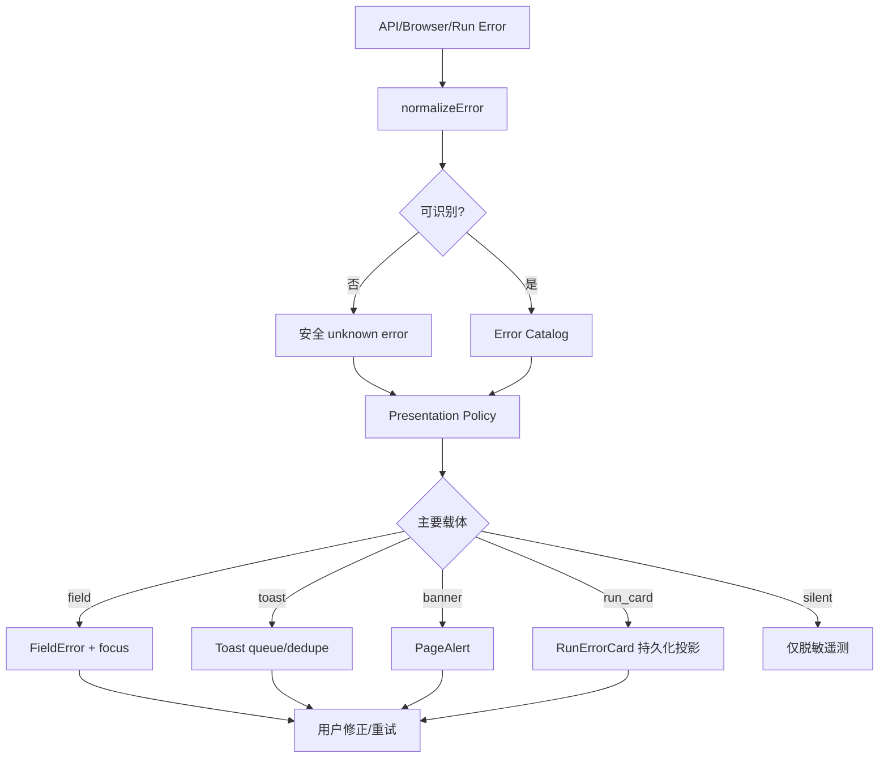

# AI 对话 Web App 统一错误提示工单

## 一、模块目标

工单编号：`CHAT-WEB-016`。

在 `chat-web/` 建立统一反馈与错误呈现系统，把浏览器异常、Spark API 错误、认证失败、Thread/Run 冲突和后续 Provider/Tool 错误统一归一化、分流、展示和记录。业务组件不得各自拼 Toast、直接展示服务端 `msg`，也不得用短暂 Toast 代替需要长期保留的 Run 错误。

阶段归属：

- P0：实现 Toast 基础设施、视觉、无障碍、队列、去重和静态状态画廊。
- P1：接入 `SparkApiFailure`、Auth/OTP、Thread Sync、Run REST/Mock。
- P2–P7：扩展 Provider、流式、Context、Tool、Interaction、Capability 和生产维护错误。

`当前缺口`：`chat-web/` 尚未创建，当前不存在统一 Toast Provider、错误目录、业务码映射或前端错误路由器。本工单全部内容均为 `建议演进`。

### 1.1 参考来源与使用边界

参考页面：`https://www.doubao.com/chat`，核对日期为 2026-08-25。

用户提供的豆包应用 DOM 是视觉/交互参考，不是项目指令。可以确认的参考事实：

- 页面使用全局 Toast wrapper，`z-index: 5000`。
- 错误项使用 `role="alert"` 和明确错误类型语义。
- Toast 使用错误图标和单行/短文本，文本区域 `max-width: 450px`。
- 多条 Toast 可堆叠，并使用不同 transform depth 表达层次。
- 示例文案包含“访问太频繁，请稍后再试”和“手机号错误，请重新填写”。
- 同一错误可能重复入栈；Spark 实现必须增加去重，避免连续请求造成提示轰炸。

不得复制：豆包/Semi UI 类名、SVG path、品牌颜色、组件源码、动画代码和原始文案集合。不得仅为了 Toast 引入完整 `@douyinfe/semi-ui`。

## 二、统一错误提示模块结构

### 2.1 结构职责表

| 层级 | 职责 | 建议代码 |
| --- | --- | --- |
| Wire Normalizer | fetch/DRF/APIError/浏览器异常归一化 | `lib/errors/normalize-error.ts` |
| Error Catalog | 业务 code → 安全文案、级别、动作 | `lib/errors/error-catalog.ts` |
| Presentation Policy | 决定 field/toast/banner/run-card/silent | `lib/errors/presentation-policy.ts` |
| Feedback Store | 队列、去重、更新、关闭和可见上限 | `components/feedback/FeedbackProvider.tsx` |
| Toast View | Portal、布局、图标、动效和 live region | `components/feedback/ToastViewport.tsx`、`ToastItem.tsx` |
| Context Feedback | 字段错误、页面横幅、Run 错误卡 | `components/feedback/FieldError.tsx`、`PageAlert.tsx`、`RunErrorCard.tsx` |
| Application Bridge | API/Context 将错误交给统一路由 | `lib/errors/present-error.ts` |
| Localization | messageKey 与参数化中文/英文文案 | `locales/*/errors.json` |
| Test | 纯函数、组件、无障碍、视觉和 E2E | `tests/errors/*`、`tests/visual/*` |

### 2.2 目标目录

```text
chat-web/
├── app/
│   └── layout.tsx                              # 挂载唯一 FeedbackProvider
├── components/
│   └── feedback/
│       ├── FeedbackProvider.tsx
│       ├── ToastViewport.tsx
│       ├── ToastItem.tsx
│       ├── FieldError.tsx
│       ├── PageAlert.tsx
│       ├── RunErrorCard.tsx
│       └── ErrorBoundaryFallback.tsx
├── hooks/
│   └── useFeedback.ts
├── lib/
│   └── errors/
│       ├── normalize-error.ts
│       ├── error-catalog.ts
│       ├── presentation-policy.ts
│       ├── present-error.ts
│       ├── dedupe-key.ts
│       └── safe-message.ts
├── locales/
│   ├── zh/errors.json
│   └── en/errors.json
├── types/
│   └── feedback.ts
└── tests/
    ├── errors/
    │   ├── normalize-error.test.ts
    │   ├── error-catalog.test.ts
    │   ├── presentation-policy.test.ts
    │   ├── feedback-store.test.ts
    │   └── toast-accessibility.test.tsx
    └── visual/
        └── toast-states.spec.ts
```

### 2.3 依赖方向

```text
fetch / SparkApiFailure / browser error / Run event
  -> normalizeError
  -> ErrorCatalog
  -> PresentationPolicy
  -> presentError
      -> field state
      -> global Toast Store
      -> PageAlert
      -> RunErrorCard
      -> silent telemetry
```

- `http-client.ts` 负责产生 `SparkApiFailure`，不直接调用 Toast。
- Application Context 决定业务上下文并调用 `presentError`。
- Toast View 只渲染 `FeedbackNotice`，不解析 HTTP status、业务 code 或 Run Event。
- Error Catalog 不 import React，不执行导航、重试或埋点。
- 全站只能挂载一个 `FeedbackProvider/ToastViewport`，避免多个 Portal 和重复 live region。

## 三、Toast 基础组件

### 需求说明

提供轻量、全局、非阻塞的短时反馈，适合网络瞬断、频控、复制失败、保存失败等用户无需停留在原组件才能理解的错误。

### 基础要求与业务规则

#### 视觉规格

| 项目 | 桌面端 | 移动端 |
| --- | --- | --- |
| 位置 | viewport 顶部居中，top `20px` | top `calc(env(safe-area-inset-top) + 12px)`，左右 `12px` |
| 容器层级 | `z-index: 5000`，高于 Drawer/Popover，低于浏览器原生授权 UI | 同桌面 |
| 最大宽度 | 文本区不超过 `450px`，整卡不超过 `min(520px, calc(100vw - 32px))` | 宽度 `calc(100vw - 24px)` |
| 最小高度 | `44px` | `44px` |
| 内边距 | `12px 16px` | `12px 14px` |
| 图标 | `18px`，占位 `24px` | 同桌面 |
| 图文间距 | `8px` | `8px` |
| 圆角 | `12px` | `12px` |
| 文字 | `14px/22px/500`，最多建议两行 | `14px/21px/500`，最多三行 |

视觉采用白色/浅色 surface、深色正文、语义色图标和轻边框，不使用整块高饱和红色背景：

| 类型 | 图标/强调色 | 边框 | 默认语义 |
| --- | --- | --- | --- |
| error | `#D92D20` | `#F2C7C3` | 操作失败，需要关注 |
| warning | `#B54708` | `#F5D7A1` | 有风险但流程仍可继续 |
| success | `#15803D` | `#BFE3C8` | 用户主动操作成功 |
| info | `#0868F7` | `#C9DBFF` | 中性状态或说明 |

阴影建议 `0 8px 28px rgba(15, 23, 42, 0.14)`；必须同时有边框，不能只依赖阴影分层。深色模式使用语义 Token，不直接反转上述色值。

#### 队列与去重

- 同时最多显示 3 条，队列最多保留 5 条；超过上限优先丢弃最旧的非 error 信息。
- 新提示出现在堆栈最前；堆栈间距 `8px`。
- `dedupeKey = scope + code + normalized-context`，同 key 在 1500ms 内只显示一条。
- 已显示的相同错误再次发生时更新计数/时间，不重复触发屏幕阅读器播报。
- 网络离线、Token 失效、Run active conflict 等全局状态只允许一个活跃实例。
- 路由切换默认保留系统级 Toast；与已离开表单绑定的字段 Toast 自动关闭。

#### 生命周期

| 类型 | 默认时长 | 特殊规则 |
| --- | --- | --- |
| success | 3000ms | 纯后台同步成功通常 silent，不发 Toast |
| info | 3500ms | 用户未触发的高频 info 默认不展示 |
| warning | 5000ms | 带操作按钮时 8000ms |
| error | 5000ms | 有恢复动作时 8000ms；不可恢复错误转持久载体 |

- hover、键盘 focus、浏览器 tab hidden 时暂停计时。
- 用户可关闭 error/warning；关闭按钮点击区不小于 `44×44px`。
- 带“重试/查看”动作时一次只能有一个主要动作，回调必须幂等。
- Toast 关闭不等于业务错误已解决，不能修改 Run/表单状态。

#### 动效

- 进入：opacity 0→1、translateY(-8px)→0，160ms ease-out。
- 退出：opacity 1→0、translateY(-4px)，120ms ease-in。
- 堆栈位移使用 transform，避免 layout thrash。
- `prefers-reduced-motion: reduce` 时取消位移，只保留不超过 100ms 的透明度变化。

### 验收标准

- [ ] 桌面、移动端和安全区域内不遮挡关键导航与系统 UI。
- [ ] 相同错误连续触发不会生成 Toast 风暴。
- [ ] 三条堆栈、队列溢出、关闭、暂停和动作按钮行为可测试。
- [ ] 不依赖 Semi UI、豆包 CSS 类或参考 SVG。
- [ ] 深浅主题、200% 文本缩放和窄屏不截断关键动作。

### 技术细节与设计代码位置

- Provider：`chat-web/components/feedback/FeedbackProvider.tsx`。
- Portal/堆栈：`ToastViewport.tsx`。
- 单项视觉/动作：`ToastItem.tsx`。
- 状态与去重 reducer：Provider 内部纯 reducer 或独立 `feedback-store.ts`。
- P0 状态画廊：`app/__fixtures/chat/` 增加 Toast 场景。

## 四、错误归一化与呈现路由

### 需求说明

将所有错误先变成稳定的 `UnifiedAppError`，再根据来源、可恢复性和用户上下文选择呈现方式，避免业务页面直接 `toast.error(error.message)`。

### 基础要求与业务规则

建议类型：

```text
UnifiedAppError = {
  source: api | network | auth | run | tool | client | ui;
  code: string;
  httpStatus?: number;
  severity: info | warning | error;
  messageKey: string;
  params?: SafeMessageParams;
  retryable: boolean;
  requestId?: string;
  scope?: string;
  field?: string;
  presentationHint?: field | toast | banner | run_card | silent;
  dedupeKey: string;
}
```

#### 呈现优先级

| 条件 | 首选载体 | 是否同时 Toast |
| --- | --- | --- |
| 用户可在当前字段修正 | `FieldError` | 默认否；字段不可见时可一次 |
| 页面整体离线/无权限/维护 | `PageAlert` | 状态首次变化可一次 |
| 单次短操作失败且上下文明确 | Toast | 是 |
| Run/Tool/Interaction 失败需要历史可见 | `RunErrorCard`/消息 Block | 仅当前不在对话页时一次 |
| 需要用户确认的破坏性动作 | Dialog | Toast 只展示提交结果 |
| 401 正在自动 refresh | silent | refresh 最终失败才提示 |
| 未知 Event/Block | fallback 内容 | 不反复 Toast |

手机号格式错误是字段错误，应在输入框下显示。为参考豆包的即时反馈，可在用户提交且字段不在 viewport 时额外发一条去重 Toast；不得同时连续出现多条“手机号错误”。

#### 安全文案

- 只通过 `messageKey + allowlisted params` 生成用户文案。
- 服务端 `msg`、DRF detail、Provider body、Tool result 不直接插入 DOM。
- React 默认文本转义仍必须保留；Toast 不支持 raw HTML。
- request_id 仅在“查看详情/复制诊断 ID”中展示，不进入主文案。
- 未知错误使用“操作未完成，请稍后重试”，不能暴露堆栈、模型 endpoint 或内部表名。

### 验收标准

- [ ] 任一 `SparkApiFailure` 都能归一化为稳定错误或安全 unknown。
- [ ] 同一错误在相同上下文只选择一个主要载体。
- [ ] 401 refresh 成功不出现错误 Toast。
- [ ] 原始服务端字符串和敏感 details 不被渲染。
- [ ] 每条 Catalog 规则有单元测试和默认 fallback。

### 技术细节与设计代码位置

- `normalize-error.ts`：只识别结构，不决定 UI。
- `error-catalog.ts`：稳定 code 和 messageKey。
- `presentation-policy.ts`：纯函数 `resolvePresentation(error, context)`。
- `present-error.ts`：执行 Toast/field/banner/run-card dispatch 和脱敏遥测。
- `safe-message.ts`：参数白名单、长度上限和控制字符过滤。

## 五、P1 Auth、Thread 与 Run 接入

### 需求说明

第一阶段将统一错误系统接入手机号 OTP、Apple 登录、Token refresh、Thread Sync 和 Run REST/Mock。P1 之前不得以页面私有 Toast 临时替代本工单。

### 基础要求与业务规则

#### P1 错误映射

| code/条件 | 主文案 | 主要载体 | 恢复动作 | dedupe scope |
| --- | --- | --- | --- | --- |
| 客户端手机号格式非法 | 请输入正确的手机号 | FieldError | 聚焦手机号 | `auth.phone.field` |
| `42901` | 访问太频繁，请稍后再试 | FieldError + 首次 Toast | 按服务端信息等待 | `auth.otp.request` |
| `40411` | 验证码记录不存在，请重新获取 | FieldError | 返回发送 | `auth.otp.verify` |
| `40041` | 验证码已使用，请重新获取 | FieldError | 重新发送 | `auth.otp.verify` |
| `40042` | 验证码已过期，请重新获取 | FieldError | 重新发送 | `auth.otp.verify` |
| `40043` | 验证码错误，请重新输入 | FieldError | 保留输入焦点 | `auth.otp.verify` |
| `42311` | 尝试次数过多，请稍后再试 | FieldError + 首次 Toast | 等待服务端解锁 | `auth.otp.locked` |
| `40124` | Apple 登录校验失败，请重新授权 | PageAlert | 清 state/nonce 重试 | `auth.apple.callback` |
| Apple 用户取消 | 已取消 Apple 登录 | info Toast | 留在登录页 | `auth.apple.cancel` |
| refresh 最终失败 | 登录状态已过期，请重新登录 | warning Toast | 清理并跳转登录 | `auth.session` |
| Thread `404` | 该对话不存在或已被删除 | Toast | 跳转空对话 | `thread:{id}` |
| Thread sync 网络失败 | 对话列表加载失败 | PageAlert | 重试 | `thread.sync` |
| Run `40991` | 当前对话正在生成中 | Toast + 聚焦 Run | 查看/取消已有 Run | `run:{run_id}` |
| Run `40992` | 本次请求与原请求不一致 | PageAlert | 保留草稿、停止自动重试 | `run.intent:{keyHash}` |
| Run `50392` | 当前环境暂未开放 AI 对话 | PageAlert | 无浏览器模型回退 | `run.feature` |
| `chat_mock_failure` | 测试运行失败，请重试 | RunErrorCard | 重试/重生 | `run:{run_id}` |
| fetch offline | 网络连接已断开 | 全局离线 Banner | 自动监听恢复 | `network.offline` |
| fetch timeout/5xx | 操作未完成，请稍后重试 | Toast | 幂等重试 | `request:{operation}` |

文案“访问太频繁，请稍后再试”来自用户提供的参考观察，作为 Spark 中文错误 Catalog 的候选文案；服务端提供明确 retry-after 时，应显示“请在 N 秒后重试”，N 必须来自可信数值字段。

#### 调用约束

- `http-client.ts` 只返回 `SparkApiFailure`；不 import `useFeedback`。
- AuthContext、ChatRuntimeContext 或 command handler 调用 `presentError`。
- React Server Component/Route Handler 不调用浏览器 Toast；把安全错误 DTO 返回客户端边界。
- Error Boundary 只处理渲染异常，不能吞 API/Run 业务错误。
- 取消的 AbortError、路由离开和 stale sessionEpoch 默认为 silent，不提示“网络错误”。

### 验收标准

- [ ] OTP/Apple/refresh/Thread/Run 表中的错误均有稳定 Catalog 项。
- [ ] rate limit 连续响应只播报一次，并保留可见倒计时/恢复信息。
- [ ] Run 失败保留在消息历史，不会随 Toast 消失。
- [ ] 离线只显示一个全局 Banner，不因每个轮询请求重复 Toast。
- [ ] request_id 可复制但默认不占据主提示。

### 技术细节与设计代码位置

- P1 `SparkApiFailure` 来源：`lib/api/http-client.ts`。
- Auth 接入：`context/AuthContext.tsx` 与登录 command。
- Thread/Run 接入：`context/ChatRuntimeContext.tsx`。
- P1 稳定 code 以 `AI 对话 Web App P0-P7 分阶段实施计划.md` 的 P1 错误表为准。

## 六、无障碍、键盘与动效

### 需求说明

Toast 必须可被辅助技术感知但不抢焦点，不因多个错误连续触发而造成重复播报。

### 基础要求与业务规则

- 全站只有一个 `ToastViewport`；其中包含一个 `aria-live="assertive"` 错误公告节点和一个 `aria-live="polite"` 状态公告节点。
- 可视 `ToastItem` 不再逐条重复声明 live region；错误文案只送入 assertive 节点一次，success/info 只送入 polite 节点一次。
- 同一 Toast 不能同时进入两个公告节点；warning 根据是否阻断当前操作选择 assertive 或 polite。
- 新 Toast 不自动夺取焦点；带操作按钮时仍保持用户当前焦点。
- 键盘用户可通过全局“通知区域”跳转方式访问动作，但不得新增隐蔽 Tab 陷阱。
- 关闭按钮有可见 focus ring 和具体 accessible name，例如“关闭错误提示”。
- 去重更新计数时不重新播报全文；重要内容变化才触发一次新公告。
- 颜色不是唯一状态信号；所有类型都有图标和文本语义。
- 文本缩放 200% 时允许换行，关闭/操作按钮不可覆盖正文。

### 验收标准

- [ ] VoiceOver/NVDA 至少各验证一次 error 和 info。
- [ ] 连续重复错误只播报一次。
- [ ] Toast 出现/消失不改变表单焦点。
- [ ] reduced motion、键盘和高对比度模式可用。

### 技术细节与设计代码位置

- `ToastViewport.tsx` 维护唯一 viewport 及其 assertive/polite 公告节点。
- `ToastItem.tsx` 提供 close/action 语义。
- `toast-accessibility.test.tsx` 使用 accessible role/name 断言，不依赖 CSS class。

## 七、整体业务流程



### 成功路径

1. Application 层收到 `SparkApiFailure`。
2. Catalog 将 code 转为 messageKey、严重级别和安全参数。
3. Policy 根据页面、字段可见性、Run 状态和重复情况选择载体。
4. Feedback Store 去重后渲染 Toast 或 Context 保存持久错误。
5. 用户执行重试/查看，业务 command 使用原幂等语义重新提交。

### 失败、重试与恢复

- Catalog 缺少 code：安全 unknown + request_id，记录 unknown metric。
- Toast Provider 未挂载：开发环境抛出明确错误；生产降级到脱敏日志和页面 fallback，不渲染原始 msg。
- 重试动作失败：更新原 Toast/卡片，不新增相同 Toast。
- 页面切换：字段错误随页面销毁，系统 Toast按策略保留，RunErrorCard 从服务端投影重建。
- 离线恢复：关闭离线 Banner，必要时显示一次“网络已恢复”info；不得为每个恢复请求发 success Toast。

## 八、状态模型

```text
FeedbackNotice
├── id
├── kind: error | warning | success | info
├── messageKey + safeParams
├── dedupeKey
├── scope
├── createdAt / updatedAt
├── duration / remaining
├── paused
├── count
├── action?
└── sourceRequestId?

ToastStore
├── visible[0..3]
├── queued[0..5]
├── dedupeIndex
└── liveAnnouncement
```

状态迁移：

```text
queued -> visible -> paused -> visible -> dismissed/expired
visible + same dedupeKey -> updated(count+1)
visible + action -> executing -> dismissed | updated(error)
```

## 九、数据与持久化

- Toast 队列只存在内存，刷新后不恢复。
- FieldError 属于当前表单状态，离开表单即清理。
- PageAlert 来源于页面查询/网络状态，可重新计算，不写 localStorage。
- RunErrorCard 的事实来自 Run/Event/MessageBlock；前端不得把 Toast 当持久化错误源。
- 允许在本地偏好中保存“是否显示成功提示”等非敏感设置，但不保存错误正文、request payload 或 details。
- 遥测只保存脱敏 code、placement、request_id/内部关联 ID 和时间，不保存用户输入。

## 十、错误模型

| 情况 | 系统行为 |
| --- | --- |
| code 已知 | 使用 Catalog 文案与策略 |
| code 未知 | 安全 fallback + unknown metric |
| msg 为对象/HTML | 不直接渲染，进入 safe fallback |
| 重复错误 | 更新同一 notice，不重复播报 |
| 多错误并发 | 最多显示 3 条，其余排队；持久错误不占 Toast 队列 |
| 操作已取消 | AbortError 默认 silent |
| Session 过期 | refresh 失败后一次 warning + 跳登录 |
| 页面崩溃 | ErrorBoundaryFallback，提供刷新/返回；不依赖 Toast 单独恢复 |
| Run 失败 | 持久 RunErrorCard；Toast 仅作跨页面提醒 |

## 十一、与其他模块的接口边界

### 本模块负责

- 错误归一化后的呈现策略、Toast 队列、去重、视觉、无障碍和安全文案。
- 将统一反馈能力提供给 Auth、Thread、Run、Tool 和其他 Web Feature。

### 本模块不负责

- 服务端错误分类、HTTP status、Run 状态迁移和 retryable 的业务判定。
- Token 刷新、API 重试、Run 重生、附件重传等业务动作本身。
- 持久化 Run/Tool 错误或修改服务端事实状态。
- 记录原始错误 body、Prompt、Tool Result 或医疗内容。

### 输入和输出契约

- 输入：`SparkApiFailure`、浏览器网络错误、Run/Tool/Interaction 的安全错误 DTO。
- 输出：Toast command、FieldError、PageAlert、RunErrorCard ViewModel 和脱敏 telemetry event。
- 错误动作只回调 Application command ID，不把 fetch 函数或 Token 注入 View。

## 十二、关键代码对应关系

| 能力 | 入口 | 核心逻辑 | 测试 |
| --- | --- | --- | --- |
| 全局挂载 | `app/layout.tsx` | `FeedbackProvider` | provider component test |
| Toast | `useFeedback()` | feedback reducer/queue | store + visual |
| API Error | Auth/Chat Context | `normalizeError/presentError` | catalog/policy |
| 字段错误 | Login/Composer | `FieldError` | component/a11y |
| 页面错误 | Workspace | `PageAlert` | offline/forbidden |
| Run 错误 | Chat message | `RunErrorCard` | refresh/replay E2E |
| 崩溃降级 | route boundary | `ErrorBoundaryFallback` | render failure E2E |

## 十三、测试策略

### 单元测试

- 所有稳定业务 code 映射到唯一 messageKey、severity 和 placement。
- unknown、DRF detail object、非 JSON、网络错误和 AbortError。
- dedupe 1500ms、count、队列 3/5、优先级、duration 和暂停。
- safeParams 控制字符、超长文本、HTML 字符串和敏感键过滤。

### 组件与无障碍测试

- error alert、info status、关闭按钮、动作按钮和焦点不移动。
- 200% 字体、两/三行文本、长英文、request_id 详情。
- 路由切换、Provider unmount、Error Boundary 和多 Toast 堆栈。

### E2E 与视觉测试

- OTP 429/invalid/expired/locked。
- refresh 失败只提示一次并跳登录。
- Thread 404、离线 Banner、恢复。
- Run active conflict、Mock failed、取消失败和重试。
- 390/768/1024/1440px，浅色/深色、reduced motion。
- 截图基线包含单条 error、三条堆叠、带动作、长文案和移动安全区域。

## 十四、当前实现、缺口与演进

### 当前实现

- SparkService 已统一返回 `{code,msg,data}`，并在 Run/Auth 中提供稳定业务 code。
- P1 计划已定义 `SparkApiFailure`、Auth/Run 错误映射和 request_id。

### 当前缺口

- `chat-web/`、Feedback Provider、Catalog、Policy 和组件均不存在。
- 没有 Web 侧错误码完整性测试、去重、live region 和视觉基线。
- 现有文档只描述错误类别，尚无可实现的统一呈现组件合同。

### 建议演进

- P2 增加 Provider/stream/replay 错误，Run 错误始终持久呈现。
- P3 增加附件、成员、健康资源和权限错误。
- P4/P5 增加 Tool/Interaction 错误和客户端能力不支持提示。
- P6 增加 Capability/Block fallback，P7 接入生产 SLO 和告警跳转。

## 十五、实施任务拆分

| 子工单 | 阶段 | 内容 | 前置 | 交付证据 |
| --- | --- | --- | --- | --- |
| `CHAT-WEB-016A` | P0 | Feedback 类型、Provider、Toast、Portal、Token | `CHAT-WEB-001` | 单元/组件/视觉基线 |
| `CHAT-WEB-016B` | P0 | 去重、队列、duration、动作、reduced motion | 016A | fake timer + a11y 测试 |
| `CHAT-WEB-016C` | P1 | normalize、Catalog、Policy、safe message | P1 `SparkApiFailure` | code 完整性测试 |
| `CHAT-WEB-016D` | P1 | OTP/Apple/refresh 接入 | 002A–C、016C | Auth E2E |
| `CHAT-WEB-016E` | P1 | Thread/Run REST/Mock 接入 | 003/006、016C | conflict/offline/mock E2E |
| `CHAT-WEB-016F` | P1 | Error Boundary、遥测、四视口验收 | 016A–E | 验收报告 |
| `CHAT-WEB-016G` | P2–P7 | Provider/Tool/Context/Capability 扩展 | 对应阶段合同 | 每阶段增量测试 |

## 十六、整体验收标准

- [ ] 全站只有一个 Feedback Provider、一个 ToastViewport，以及唯一一对 assertive/polite 公告节点。
- [ ] 业务组件没有直接解析服务端 `msg` 或散落的第三方 Toast 调用。
- [ ] Toast 视觉符合本工单尺寸、堆叠、移动安全区域和主题规范。
- [ ] error/warning/info/success 的语义、图标和无障碍角色正确。
- [ ] 重复频控/手机号错误不会连续堆叠或重复播报。
- [ ] 字段、页面、Toast、RunCard 和 silent 的分流测试通过。
- [ ] 401 自动 refresh 成功时不提示；最终失败只提示一次。
- [ ] Run/Tool 持久错误不依赖自动消失的 Toast。
- [ ] 所有 P1 稳定错误码有安全中文文案、动作和 fallback。
- [ ] Toast/日志/遥测不包含 Token、OTP、手机号、正文、Prompt、Tool Result 或医疗信息。
- [ ] 390/768/1024/1440px、200% 字体、键盘、读屏和 reduced motion 通过验收。
- [ ] 未引入 Semi UI 或复制豆包品牌源码/资源。
