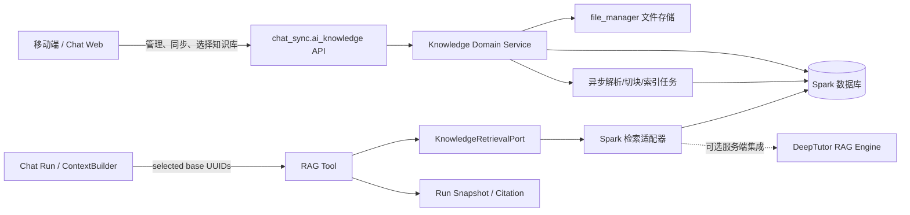
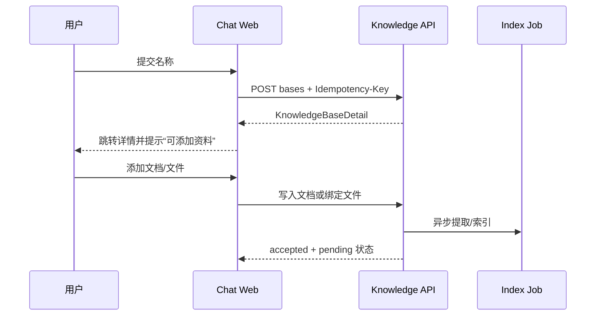
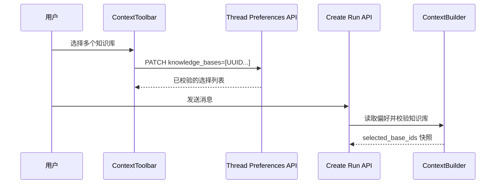
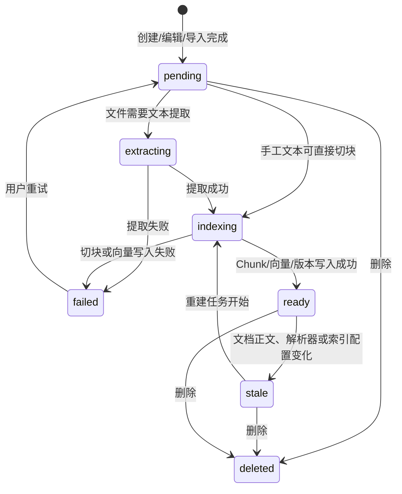

# KNOWLEDGE-CHAT-000002：知识中心与对话知识库接入及 DeepTutor 交互对齐需求工单

> 状态：待评审  
> 优先级：高  
> 类型：需求与详细设计工单（本工单不包含代码实现）  
> 关联工单：`KNOWLEDGE-SYNC-000001-客户端知识库多设备同步与服务端知识库架构需求及详细设计工单.md`  
> 范围：SparkService `chat_sync` + `chat-web`；DeepTutor 仅作为业务流程与交互参考，不作为客户端直接依赖。

## 1. 目标与边界

### 1.1 最终目标

在 SparkService 内形成一个以服务端数据库为唯一事实源的知识库能力：

- 知识中心可以展示、创建、管理知识库，并提供文档、文件、索引版本和设置页面；
- Chat Web 的对话上下文可多选知识库，并将选择持久化到当前会话；
- AI 运行时可通过 RAG 工具检索所选知识库，工具活动、检索快照和引用可追溯；
- iOS、Web、后续 Android/HarmonyOS 都通过 Spark API 同步或管理同一份知识库数据；
- DeepTutor 的本地知识目录、文件夹路径、提供商密钥永远不暴露给 Web 或客户端。

### 1.2 已确认的产品规则

| 规则 | 设计结论 |
| --- | --- |
| 同步是否阻塞用户操作 | 全部异步；失败不得影响创建文档、进入对话或普通聊天流程。 |
| 失败后的处理 | 客户端启动时异步补偿推送、拉取并记录日志；列表卡片展示同步/索引状态。 |
| 冲突裁决 | 服务端存储为准。客户端基于冲突响应拉取服务端版本，再决定覆盖本地缓存。 |
| 服务归属 | 不新增 Django app；知识模型继续放在 `chat_sync/ai_models/knowledge.py`，功能模块继续放在 `chat_sync/ai_knowledge/`。 |
| 对话接入 | 先持久化 `knowledge_base_id` 列表，后执行 RAG；不能把选中的库只留在前端临时状态。 |
| DeepTutor 接入 | 只能通过 Spark 的 `KnowledgeRetrievalPort` 服务端适配；Web/客户端不得访问 DeepTutor 本地目录或文件接口。 |

### 1.3 不在本期直接实现的内容

- 不把 DeepTutor 的本地路径、Obsidian 目录、LightRAG Server 地址、API Key 等配置复制到前端；
- 不让客户端直接写向量库、直接生成 embedding 或读取服务端磁盘；
- 不为了“页面一致”复制 DeepTutor 的本地文件系统模型；
- 不修改既有同步工单内容，也不在本工单阶段修改业务代码。

## 2. 当前事实与差距

### 2.1 SparkService 已存在的服务端基础

当前路由已挂载在 `SparkService/urls.py`：`/api/v1/ai/knowledge/`。现有接口只有：

| 当前能力 | 现有位置 | 说明 |
| --- | --- | --- |
| 默认个人库 | `chat_sync/ai_knowledge/api/views.py`、`default/` | 幂等获取或创建当前用户默认库。 |
| 客户端推送 | `sync/push/` | 批量 mutation、逐条确认、版本冲突和幂等回执。 |
| 客户端拉取 | `sync/pull/` | 按服务端更新时间的游标增量拉取。 |
| 数据模型 | `chat_sync/ai_models/knowledge.py` | 已有 `KnowledgeBase`、`KnowledgeDocument`、`KnowledgeChunk`、`KnowledgeIndexState`、`KnowledgeMutationReceipt`。 |
| 检索抽象 | `chat_sync/ai_knowledge/retrieval/port.py` | 已有 `KnowledgeRetrievalPort` 与 `ResolvedKnowledgeChunk`。 |
| 精确引用解析 | `chat_sync/ai_services/context/reference_resolver.py` | 已支持 `knowledge_chunk` 类型的已知 chunk 解析。 |
| 会话偏好字段 | `chat_sync/ai_models/context.py` | `ChatThreadPreferences.knowledge_bases` 已可持久化 ID 列表。 |

当前检索实现是不可用占位服务：`UnavailableKnowledgeRetrievalService`。它不执行向量检索；现有 ContextBuilder 仅快照 `knowledge_bases`，不会基于这些 ID 自动搜索。

### 2.2 本工单要补齐的差距

| 领域 | 缺口 | 本工单的落地方向 |
| --- | --- | --- |
| Web API | 没有知识库列表、详情、CRUD、文档查询、文件、索引版本和设置 API。 | 在 `chat_sync.ai_knowledge` 增加 Web 管理 API；与客户端同步 API 复用领域服务，不做两套写入规则。 |
| 知识中心 | `chat-web` 的知识页仍是占位。 | 建立列表、创建、详情页及四类管理区块。 |
| 文档与文件 | 文档有内容字段，但没有面向 Web 的管理体验；文件与文档的来源关系未建模。 | 以 `file_manager` 存二进制，知识模型保存业务关联、解析和索引状态。 |
| 索引版本 | `KnowledgeIndexState` 只表达当前状态，不能展示历史版本。 | 新增不可变 `KnowledgeIndexVersion`，保留当前状态作为快速读模型。 |
| Chat 选择 | 偏好字段已存在，但无选择器、无服务端校验、无运行时检索。 | `ContextToolbar` 多选、持久化、校验、状态提示。 |
| RAG | 工具注册、活动投影、Run 快照、引用记录尚未形成闭环。 | 引入服务端 RAG 工具，检索结果写入 snapshot/citation。 |

## 3. DeepTutor 反向对齐原则

DeepTutor 是体验与流程参考，不是 Spark 的运行时数据源。Spark 的数据库模型、鉴权、同步协议和工具运行记录保持自己的单一事实源。

| DeepTutor 参考模块 | Spark 需要对齐的内容 | Spark 不应复制的内容 |
| --- | --- | --- |
| `components/knowledge/KnowledgeHome.tsx` | 知识库卡片、状态、文档数量、进入管理页的路径。 | 本地目录或引擎连接信息。 |
| `components/knowledge/CreateKbModal.tsx` | 新建知识库的弹窗层级、表单反馈和创建成功后的跳转。 | Obsidian、本地文件夹、IMA、LightRAG Server 等连接入口。 |
| `KnowledgeBaseDetail.tsx` | 详情页结构：概览、文件/文档、索引版本、设置、失败提示。 | 以浏览器直连本地引擎的调用方式。 |
| `KbFilesTab.tsx`、`KbDocumentList.tsx` | 文件列表、预览、处理状态、删除确认、空态。 | 本地绝对路径和未鉴权的文件树。 |
| `KbIndexVersionsSection.tsx` | 索引版本历史、当前版本标识、失败原因和重建入口。 | 对用户暴露模型密钥或供应商内部配置。 |
| `components/chat/home/KnowledgeSelector.tsx` | 对话中多选、选中 chip、搜索与状态感知。 | 用名称作为唯一标识；Spark 必须用 UUID。 |
| `deeptutor/tools/rag_tool.py` | “显式选择知识库 → 检索 → 返回带来源答案”的工具语义。 | 直接访问 DeepTutor 本地知识目录。 |

**一致性的定义：** 信息架构、卡片密度、状态反馈、选择交互和详情页层级尽量与 DeepTutor 一致；数据来源、鉴权、文件处理和检索适配必须遵循 Spark 服务端架构。

## 4. 目标架构



### 4.1 责任划分

| 层 | 责任 |
| --- | --- |
| 客户端 / Web | 展示状态、提交命令、保存本地同步游标、选择知识库；不存储检索权威状态。 |
| `ai_knowledge` API | 用户鉴权、DTO 校验、版本控制、幂等、分页、返回 UI 所需读模型。 |
| Knowledge Domain Service | 知识库/文档命令、同步命令、文件绑定、索引状态推进的统一业务规则。 |
| 异步任务 | 文件提取、文本规范化、切块、embedding、向量写入、索引版本结算。 |
| `KnowledgeRetrievalPort` | 把“按 Spark 用户和知识库 UUID 检索”抽象为稳定接口。 |
| DeepTutor 适配器 | 仅在服务端把 Spark 规范映射至 DeepTutor 引擎；不可将 DeepTutor 的目录结构泄露给调用方。 |

## 5. 数据模型与 DTO 冻结（第 1 阶段）

### 5.1 冻结原则

1. 外部 API 只使用 UUID、稳定枚举和明确的时间字段；不暴露数据库自增 ID、服务器路径、向量内容或密钥。
2. `revision` 是并发控制版本，不等同于 `index_version`。
3. `KnowledgeIndexState` 是当前状态快照；历史版本必须不可变。
4. 查询 DTO 与写入 DTO 分离；前端不提交服务端计算字段。

### 5.2 必须冻结的读取 DTO

#### A. `KnowledgeBaseSummary`

| 字段 | 类型 | 说明 |
| --- | --- | --- |
| `id` | UUID | 知识库稳定标识。 |
| `name` | string | 展示名称。 |
| `kind` | enum | 对齐现有 `personal/shared/system/imported`。 |
| `is_default` | boolean | 是否默认个人库。 |
| `revision` | integer | 知识库元数据版本。 |
| `document_count` | integer | 非删除文档数。 |
| `file_count` | integer | 已绑定文件数；未实现文件条目时可暂不返回。 |
| `index_status` | enum | `pending/processing/ready/failed/stale` 的聚合状态。 |
| `active_index_version` | string/null | 当前可检索索引版本标识。 |
| `sync_status` | enum | `synced/pending/failed/conflict`；Web 由服务端态派生，移动端可补本地上传态。 |
| `server_updated_at` | ISO-8601 | 卡片刷新与排序依据。 |

#### B. `KnowledgeBaseDetail`

在 `KnowledgeBaseSummary` 基础上增加：`created_at`、`is_deleted`、`retrieval_config`、`documents_summary`、`latest_index`、`permissions`。`permissions` 至少包含 `can_edit`、`can_delete`、`can_reindex`，以便后续共享库扩展不重做 UI。

#### C. `KnowledgeDocumentDTO`

| 字段 | 说明 |
| --- | --- |
| `id`、`knowledge_base_id`、`revision` | 文档身份、归属与并发控制。 |
| `title`、`excerpt`、`content` | 列表只返回 excerpt；详情或编辑时返回 content，避免大列表过载。 |
| `source`、`scope`、`bound_model_id` | 复用现有字段，描述来源与作用范围。 |
| `source_file` | 可空文件摘要：`file_uuid`、`name`、`mime_type`、`size`、`preview_url`。 |
| `content_hash`、`is_deleted`、`deleted_at` | 同步和变更判断。 |
| `index_state` | 文档级当前索引状态、chunk 数、错误码、`indexed_revision`、`active_index_version`。 |
| `created_at`、`server_updated_at` | 排序与刷新。 |

#### D. `KnowledgeIndexStateDTO` 与 `KnowledgeIndexVersionDTO`

`KnowledgeIndexStateDTO` 用于列表即时展示：`status`、`indexed_revision`、`chunk_count`、`index_version`、`error_code`、`error_message`、`indexed_at`。

`KnowledgeIndexVersionDTO` 用于版本页：`id`、`knowledge_base_id`、`status`、`is_active`、`signature`、`document_count`、`chunk_count`、`embedding_provider`、`embedding_model`、`dimension`、`chunker_version`、`started_at`、`completed_at`、`error_code`、`error_message`。对外不要返回 provider key、endpoint 或内部路径。

#### E. `KnowledgeCitationDTO`

| 字段 | 说明 |
| --- | --- |
| `citation_id` | 本次 Run 内唯一引用 ID。 |
| `knowledge_base_id`、`knowledge_base_name` | 回答来自哪个已选择知识库。 |
| `document_id`、`document_title` | 可跳转到文档详情。 |
| `chunk_id`、`chunk_revision` | 可追溯到精确片段及其版本。 |
| `index_version` | 表明使用的索引版本。 |
| `snippet` | 受长度限制的安全摘录。 |
| `score` | 排序/置信参考；可按产品要求隐藏原始分数。 |

### 5.3 需要新增或演进的持久化模型（目标态）

现有模型保留在 `chat_sync/ai_models/knowledge.py`，不新增 app、不将模型拆到 `models.py`。

| 模型/字段 | 目的 | 说明 |
| --- | --- | --- |
| `KnowledgeDocument.source_file`（可空 FK 或稳定 `file_uuid`） | 将导入文档与 `file_manager.ManagedFile` 对齐。 | 手工文档为空；文件删除后保留文档历史或置空，策略见待定项。 |
| `KnowledgeFileEntry`（建议） | 支持文件页、相对目录、排序、处理状态和一个文件可重试提取。 | 二进制仍由 `ManagedFile` 保存，条目只保存知识库维度的元数据。若仅做扁平文件列表，可先用 `ManagedFileBusinessRelation`，但无法复刻文件夹/移动。 |
| `KnowledgeIndexVersion` | 保存每次重建的不可变版本历史。 | 不能仅覆盖 `KnowledgeIndexState`，否则版本页无真实数据。 |
| `KnowledgeBase.retrieval_config` | 保存可控的库级检索参数。 | 仅白名单字段，如 `top_k`、`score_threshold`、`rerank_enabled`；供应商配置由服务端运维管理。 |
| `KnowledgeRetrievalAudit`（可选） | 追查检索请求、耗时、命中数与失败。 | Run 已存在时优先关联 Run；单独表在审计要求较高时引入。 |

### 5.4 文件存储策略

1. 原始文件继续由 `file_manager.ManagedFile` 保存，复用 `ManagedFileBusinessRelation` 进行用户鉴权与业务关联。
2. 推荐每个知识库使用 `business_type=knowledge_base`、`business_id=<KnowledgeBase UUID>` 建立文件归属；提取成功后创建或更新对应 `KnowledgeDocument(source=import)`。
3. 若要完整支持 DeepTutor 的目录树、移动与同文件多次导入，新增 `KnowledgeFileEntry`，使用 `relative_path` 表达目录，不使用服务器绝对路径。
4. 文件上传成功不代表可检索：卡片和文件行必须分别展示 `uploaded`、`extracting`、`indexing`、`ready`、`failed`。

## 6. API 设计（第 2 阶段）

统一前缀：`/api/v1/ai/knowledge/`。所有接口必须按当前登录用户过滤；变更接口支持 `Idempotency-Key`，更新/删除使用 `revision` 或 `If-Match` 防止静默覆盖。

| API | 用途 | 核心规则 |
| --- | --- | --- |
| `GET bases/` | 知识中心卡片列表 | 返回 `KnowledgeBaseSummary`，支持 cursor、状态筛选、关键字搜索。 |
| `POST bases/` | 新建命名知识库 | 创建成功即返回详情；名称、kind 和默认策略服务端校验。 |
| `GET bases/{id}/` | 知识库概览 | 返回 `KnowledgeBaseDetail`。 |
| `PATCH bases/{id}/` | 修改名称与检索设置 | 必须带 revision；冲突返回服务端当前版本。 |
| `DELETE bases/{id}/` | 软删除知识库 | 默认库不可删除；要定义文档/文件保留和索引回收策略。 |
| `GET bases/{id}/documents/` | 文档分页列表 | 列表不返回正文全文。 |
| `POST bases/{id}/documents/` | 新建手工文档 | 与同步的文档命令共用领域写入服务。 |
| `GET/PATCH/DELETE documents/{id}/` | 查看、编辑、删除文档 | 变更后标记索引 `stale` 并异步重建。 |
| `GET/POST/DELETE bases/{id}/files/…` | 文件列表、绑定上传、解除绑定 | 文件处理异步；上传成功不等待索引完成。 |
| `GET bases/{id}/index-versions/` | 索引版本历史 | 只读、可分页。 |
| `POST bases/{id}/index-jobs/` | 请求重建/重试 | 幂等合并同一库的未完成任务，避免重复计算。 |
| `POST search/` | 管理端调试搜索（可选） | 仅授权用户、限流、记录审计；正式聊天经 Tool 调用。 |

### 6.1 与同步 API 的一致性

- `sync/push/`、Web 文档 CRUD、文件解析任务不得各自直接写不同字段规则；应共同调用 `DocumentCommandService`（名称可调整）。
- Web 在线创建可由服务端生成 UUID；移动端离线创建仍由客户端生成 UUID 并通过 mutation receipt 去重。
- 所有写入成功都应推进 `server_updated_at`，使其他设备下一次 `sync/pull/` 能拉到变更。
- Web 更新碰到 `409 conflict` 时，界面必须展示“已采用服务器版本，请刷新后再编辑”，不得偷偷重试覆盖。

## 7. 知识中心与页面落地（第 3 阶段）

### 7.1 页面信息架构

```text
/knowledge
├─ 知识库列表 / 卡片
├─ 新建知识库弹窗
└─ /knowledge/{knowledgeBaseId}
   ├─ 概览
   ├─ 文档
   ├─ 文件
   ├─ 索引版本
   └─ 设置
```

### 7.2 列表卡片规范

卡片需要显示：名称、默认标记、文档数、文件数、当前索引状态、最近更新时间、同步状态、失败原因摘要与进入详情操作。卡片不展示向量维度、路径、密钥或内部 provider 参数。

同步/索引状态分开显示：

| 状态类别 | 建议文案 | 交互 |
| --- | --- | --- |
| `sync.pending` | 等待同步 | 不阻止进入详情或聊天。 |
| `sync.failed` | 同步失败，稍后重试 | 提供重试与错误摘要。 |
| `index.processing` | 正在建立索引 | 可选择但提示“暂不可检索”或按待定规则禁用。 |
| `index.ready` | 可用于对话 | 可被选择器正常选中。 |
| `index.failed` | 索引失败 | 显示失败原因与重试索引。 |

### 7.3 新建知识库

参考 DeepTutor `components/knowledge/CreateKbModal.tsx` 的弹窗结构，但 Spark 首期只提供：名称、用途说明（可选）、是否设为默认、创建后立即添加文档/文件。

创建成功后的标准流程：



### 7.4 详情页与组件建议

以下是目标代码组织，属于后续实施定位，不在本工单直接创建：

| 功能 | 建议目标文件 |
| --- | --- |
| 知识中心列表页面 | `chat-web/app/(workspace)/knowledge/page.tsx` |
| 知识库详情页 | `chat-web/app/(workspace)/knowledge/[knowledgeBaseId]/page.tsx` |
| 新建知识库 | `chat-web/components/knowledge/CreateKbModal.tsx` |
| 列表与卡片 | `chat-web/components/knowledge/KnowledgeBaseList.tsx`、`KnowledgeBaseCard.tsx` |
| 文档管理 | `chat-web/components/knowledge/KnowledgeDocumentList.tsx`、`KnowledgeDocumentEditor.tsx` |
| 文件页 | `chat-web/components/knowledge/KnowledgeFilesTab.tsx` |
| 索引版本 | `chat-web/components/knowledge/KnowledgeIndexVersionsSection.tsx` |
| 设置 | `chat-web/components/knowledge/KnowledgeSettingsSection.tsx` |
| API / 类型 | `chat-web/lib/api/knowledge-api.ts`、`chat-web/types/knowledge.ts` |

页面视觉可以对齐 DeepTutor 的卡片尺寸、状态徽标、两栏文件预览与空态语义；必须沿用 `chat-web` 当前主题、路由、请求代理和鉴权机制，不能从 DeepTutor 拷贝本地依赖。

## 8. 对话 ContextToolbar 接入（第 4 阶段）

### 8.1 交互规则

1. 在 `chat-web/components/chat/context/ContextToolbar.tsx` 增加“知识库”入口与多选选择器。
2. 列表数据来自 `GET bases/`，选择值是 `knowledge_base_id` UUID，不是名称。
3. 选择结果写入当前线程的 `ChatThreadPreferences.knowledge_bases`；刷新、重新进入线程和跨设备都应读取服务端值。
4. 在创建 Run 前再次由服务端校验每一个 base 是否存在、属于当前用户、未删除、允许使用。
5. `ready` 库正常可选；`processing/stale/failed` 的可选与降级策略需要产品决策，推荐首期可见但不可用于检索，并显示原因。
6. 单轮临时来源（例如精确 `knowledge_chunk`）与线程持久化库选择分开表达；两者都要进入 Run snapshot。

### 8.2 数据流



### 8.3 必须改造的服务端规则

- 更新 `knowledge_bases` 偏好时，拒绝不存在、已删除、非本人可访问的 UUID；返回合法列表及非法项原因。
- Run 创建时重新校验，不能信任几分钟前写入的 preference。
- 选中库的名称、revision、active index version 必须冻结到 Run snapshot，确保以后重建索引后仍能解释当时的答案来源。

## 9. RAG 工具、活动状态、引用与 Run 快照（第 5 阶段）

### 9.1 工具定义

现有 `ai_config` 已有 `search_knowledge_bag` 枚举值。建议沿用该稳定值作为内部工具名，产品展示名为“检索知识库”。不要把它与 `ask_user_question` 混用：前者是后台检索，后者是需要用户回答的暂停工具。

| 项 | 设计 |
| --- | --- |
| 输入 | `query`、`knowledge_base_ids`、`top_k`、`score_threshold`（后两项由服务端限幅）。 |
| 调用方 | 仅 AI Runtime 服务端。前端不直接调用检索端口。 |
| 输出 | 命中数、受限摘录、文档/Chunk 标识、索引版本、citation 列表、耗时与降级原因。 |
| 失败语义 | 记录失败活动并让模型继续回答“未检索到可用资料”；不阻塞整个 Chat Run。 |
| 安全投影 | Tool public projector 不输出原始完整文档、向量、provider 配置或系统路径。 |

### 9.2 Tool 活动状态

为工具运行时间线增加下列状态，前端显示为“正在检索知识库 / 已引用 N 条资料 / 检索暂不可用”：

```text
queued -> running -> succeeded
                 -> empty
                 -> failed
                 -> skipped (没有选择知识库或无可用索引)
```

`empty` 是正常结果，不应该被渲染成系统错误；`failed` 需带可观察错误码但不得泄露内部堆栈。

### 9.3 Run 快照与引用规则

每次实际检索至少保存：

- `selected_knowledge_base_ids`、选择时的 base revision、索引版本；
- 实际查询文本的受控摘要或 hash；
- 检索参数（经过限幅后的 `top_k`、threshold）；
- 命中的 `KnowledgeCitationDTO` 列表、排序与分数；
- 工具状态、耗时、后端标识和错误码。

回答消息上的引用只引用该 Run 已冻结的 citation；不能在打开历史消息时重新检索并用新索引覆盖历史证据。

## 10. DeepTutor RAG 引擎服务端适配（第 6 阶段）

### 10.1 Port 契约保持不变

`chat_sync/ai_knowledge/retrieval/port.py` 的 `KnowledgeRetrievalPort` 是唯一业务入口。运行时只关心：

```text
search(user, base_ids, query, top_k, threshold) -> ResolvedKnowledgeChunk[]
resolve_chunk(user, chunk_id) -> ResolvedKnowledgeChunk
```

端口返回必须包含 Spark 的 `document_id`、`chunk_id`、文档 revision、hash、index version 与受控 metadata，保证引用可回链到 Spark 数据库。

### 10.2 适配器职责

| 能力 | Spark 适配器必须做的事 |
| --- | --- |
| 请求映射 | 将 Spark 用户、`knowledge_base_id` UUID 和查询映射为服务端可识别的租户/库范围。 |
| 结果校验 | 将 DeepTutor 返回的结果与 Spark 已登记的文档/Chunk 校验；无映射结果不得作为引用返回。 |
| 鉴权 | 在调用引擎前已完成 Spark 用户与库权限过滤。 |
| 可用性 | 超时、限流、失败熔断并返回可观察错误码；Chat Run 可降级。 |
| 数据回写 | 索引完成时回写 Spark 的 `KnowledgeIndexState` / `KnowledgeIndexVersion`，而不是依赖引擎内存状态。 |

### 10.3 明确禁止

- Web 或移动端直接调用 DeepTutor HTTP/本地端口；
- 浏览器传递 DeepTutor `kb_name`、目录路径或 provider 凭据；
- 用 DeepTutor `kb_config.json` 作为 Spark 的数据库事实源；
- 直接将 DeepTutor 检索结果文本当引用而不映射 `KnowledgeChunk`。

## 11. 多客户端同步、计算与异步流程细节

### 11.1 启动补偿流程

客户端启动后在后台执行，绝不阻塞首屏和聊天：

```text
读取本地未确认 mutation
  -> 批量 push（每批最多使用当前服务端限定）
  -> 逐条记录 ack / conflict / retryable failure
  -> 以最近成功 cursor 增量 pull
  -> 事务落地远端变更与 tombstone
  -> 仅整页成功后推进 cursor
  -> 更新卡片同步状态，记录汇总日志
```

### 11.2 防重复与并发规则

| 场景 | 规则 |
| --- | --- |
| 同一移动端重试 push | `mutation_id` + `KnowledgeMutationReceipt` 返回原 ack，不能重复创建文档。 |
| Web 重试创建库/文档 | 使用 `Idempotency-Key`；领域服务记录或复用命令结果。 |
| 设备 A/B 修改同一文档 | `base_revision` 不匹配即冲突；服务端版本胜出。 |
| 同一库重复请求重建索引 | 合并相同目标 revision 的未完成 job，避免重复 embedding 费用。 |
| 文件再次上传 | 用文件 hash + 库 ID 判断重复；相同内容按待定规则复用文档或创建新版本。 |
| 删除后收到旧设备更新 | tombstone/revision 规则由服务端裁决；旧更新不得复活已删文档，除非显式 `restore`。 |

### 11.3 索引计算规则

1. 文档正文或导入文件变更后，立即写业务数据、标记 `stale/pending`，再投递异步任务。
2. 索引任务按 `document_id + revision + content_hash` 去重；任务完成前内容再次变化时，旧任务结果不得覆盖新 revision。
3. Chunk 写入后再将对应状态置 `ready`；写向量失败则保留文档并置 `failed`，允许重试。
4. 删除文档/库后，先阻断检索，再异步回收 chunk/向量/文件关联；回收失败需有补偿任务。
5. 版本重建使用新 `KnowledgeIndexVersion`，新版本成功后原子切换 `is_active`；旧版本在保留期后回收。

## 12. 分阶段实施清单与验收

| 阶段 | 交付 | 最低验收 |
| --- | --- | --- |
| 1. DTO 冻结 | 本工单第 5 节 DTO、枚举、错误码、样例 JSON 经前后端确认。 | 不存在名称 ID 混用、revision/index version 混用。 |
| 2. 管理 API | 列表、详情、库 CRUD、文档 CRUD、搜索/索引接口及 OpenAPI/测试。 | 鉴权、幂等、分页、409 冲突、软删除均有测试。 |
| 3. 知识中心 | 列表卡片、新建、详情、文档/文件/索引/设置。 | 与 DeepTutor 信息架构一致；所有状态有空态/失败态。 |
| 4. ContextToolbar | 多选选择器与线程偏好持久化。 | 刷新与另一客户端登录后选择一致；无权限 ID 被拒绝。 |
| 5. RAG 闭环 | Runtime 工具、活动投影、snapshot、citation UI。 | 一次聊天可查看使用了哪些库、哪篇文档、哪个 chunk/索引版本。 |
| 6. DeepTutor 适配 | `KnowledgeRetrievalPort` 的生产实现与可用性策略。 | 浏览器不含 DeepTutor 地址/路径；故障时聊天可降级并可观察。 |

### 12.1 必须覆盖的测试矩阵

- 同一账号两个设备：A 创建/编辑/删除，B 经 pull 正确收敛；重复 push 不产生重复文档；
- 同一文档并发编辑：客户端获冲突且服务端版本保持不变；
- Web 新建知识库、添加手工文档、上传文件、索引失败重试、重新索引；
- 线程选择多个知识库后，刷新页面和跨端进入同一线程仍保留；
- 用户不能选择其他用户、已删除或无权访问的知识库；
- `ready`、`processing`、`failed`、`empty`、检索超时等状态在卡片、选择器、工具活动、消息引用中都可理解；
- 历史 Run 的 citation 在索引重建后仍指向当时版本；
- DeepTutor 引擎不可用时，Spark API 不泄露本地目录/服务地址，普通对话继续完成。

## 13. 待决策项（需产品确认）

| 问题 | 为什么必须先确认 | 建议方案 |
| --- | --- | --- |
| 用户能创建多少个命名知识库？ | 决定列表、配额、默认库与向量成本控制。 | 首期设可配置上限（建议 20），默认个人库不计入或单独标识。 |
| `processing/stale/failed` 的库能否在对话中选中？ | 影响用户预期和模型是否会“看起来用了知识库但实际没检索”。 | 可见但默认禁用；提供原因与“完成索引后可用”提示。 |
| 文件页是否需要完整文件夹树/拖拽移动？ | 现有 file relation 不保存相对路径，决定是否必须建 `KnowledgeFileEntry`。 | 首期扁平文件列表；若目标是 DeepTutor 文件页完整复刻，则在 P1 建条目模型。 |
| 删除知识库后文件与文档保留多久？ | 影响恢复能力、存储成本与跨端 tombstone 一致性。 | 软删除 30 天；检索立即禁用，异步清理向量；文件按引用计数处理。 |
| 同内容文件重复上传如何处理？ | 会影响用户体验与 embedding 费用。 | 同库内 hash 相同默认提示“已存在”并允许用户选择复用或新建。 |
| 共享库何时开放？ | 当前模型有 `shared/system` 枚举，但没有成员与权限模型。 | 本期仅个人库；接口保留 `permissions`，共享权限模型另立工单。 |
| 是否向用户展示检索分数？ | 原始 score 不同引擎间不可直接比较。 | 默认展示来源和相关性标签，不展示浮点原始分数。 |
| DeepTutor 如何部署和鉴权？ | 决定 adapter 的网络、重试、租户映射和数据安全。 | 由 Spark 后端内网服务凭据调用；每个请求带 Spark 内部租户/trace ID。 |

## 14. 关键代码改造范围（实施时）

### 服务端

- `chat_sync/ai_models/knowledge.py`：按第 5.3 节演进模型；保持模型在单文件内。
- `chat_sync/ai_knowledge/api/`、`urls.py`：新增管理 API，不破坏既有 `default/sync` 协议。
- `chat_sync/ai_knowledge/services/`：抽取统一命令服务、查询服务、文件/索引编排服务。
- `chat_sync/ai_knowledge/retrieval/`：保留 Port，新增 Spark→DeepTutor 适配实现与降级策略。
- `chat_sync/ai_services/context/`：在 Run 构建阶段冻结选择库及检索证据。
- `chat_sync/ai_runtime/tools/`：注册 `search_knowledge_bag`、增加安全 public projection 与工具活动事件。
- `chat_sync/ai_api/serializers.py`、`views.py`：对 `knowledge_bases` 做归属、删除态、可用状态校验。
- `file_manager/`：复用已有文件和业务关系能力；必要时补最小的知识库文件条目查询。

### Web

- `chat-web/app/(workspace)/knowledge/page.tsx`：由占位页替换为知识库中心。
- `chat-web/components/knowledge/`：新增卡片、创建弹窗、详情页 tabs、文档编辑/预览、文件和索引组件。
- `chat-web/lib/api/knowledge-api.ts`、`chat-web/types/knowledge.ts`：冻结 DTO 后建立类型化请求层，复用现有 `/api/v1/[...path]` 代理。
- `chat-web/components/chat/context/ContextToolbar.tsx`：加入知识库多选与状态显示。
- `chat-web/lib/context/turn-context-draft.ts`、`chat-web/types/context.ts`：区分线程持久化库选择与单轮精确 chunk 引用。
- 现有 Tool activity / message citation 组件：增加知识检索的安全展示、失败/空结果状态和文档跳转。

## 15. 评审结论要求

开始实施前必须确认第 13 节待决策项，至少确认：多知识库配额、文件夹范围、不可用索引库在聊天中的行为、删除保留期、DeepTutor 服务端部署边界。确认后按第 12 节顺序实施；不得跳过 DTO/API 契约冻结直接开发页面或将 DeepTutor 本地实现接入客户端。

## 16. 可执行接口契约样例

以下 JSON 用于前后端确认字段语义。字段名冻结后，仅允许以向后兼容方式扩展。

### 16.1 知识库列表

`GET /api/v1/ai/knowledge/bases/?cursor=<opaque>&limit=20&q=<keyword>&index_status=ready`

```json
{
  "items": [
    {
      "id": "5d38879b-0e62-4827-acb6-93ea9f1b3ed2",
      "name": "糖尿病随访资料",
      "kind": "personal",
      "is_default": false,
      "revision": 3,
      "document_count": 18,
      "file_count": 6,
      "index_status": "ready",
      "active_index_version": "idx_20260827_01",
      "sync_status": "synced",
      "server_updated_at": "2026-08-27T08:30:00Z"
    }
  ],
  "next_cursor": null
}
```

规则：默认按 `server_updated_at DESC, id DESC` 排序；`cursor` 必须是不透明令牌，不能要求前端拼装时间和 ID；返回空列表是 `200`，不是错误。

### 16.2 创建与更新知识库

```json
POST /api/v1/ai/knowledge/bases/
Idempotency-Key: 9f2be25b-6249-49ca-862e-12c335a8bd5c

{
  "name": "糖尿病随访资料",
  "kind": "personal",
  "make_default": false,
  "retrieval_config": {
    "top_k": 6,
    "score_threshold": 0.72,
    "rerank_enabled": false
  }
}
```

```json
PATCH /api/v1/ai/knowledge/bases/{id}/
If-Match: "3"

{
  "name": "糖尿病随访资料（2026）",
  "retrieval_config": {
    "top_k": 8,
    "score_threshold": 0.70,
    "rerank_enabled": true
  }
}
```

- `top_k` 建议服务端限制在 `1..20`；`score_threshold` 限制在 `0..1`。
- `make_default=true` 必须在一个事务内取消原默认库，保证每用户只有一个默认库。
- 更新冲突返回 `409`，包含 `server_revision` 和最小可展示的当前对象；前端必须让用户刷新，不得覆盖提交。

### 16.3 文档写入与详情读取

```json
POST /api/v1/ai/knowledge/bases/{base_id}/documents/
Idempotency-Key: 3cc4780e-d6e4-4b20-b92e-3928eb1883d5

{
  "title": "空腹血糖随访规范",
  "content": "……",
  "scope": "personal",
  "source": "user"
}
```

成功时返回 `201` 与完整 `KnowledgeDocumentDTO`；响应中的 `index_state.status` 可为 `pending`，这不是失败。文档正文最大长度、支持的文件 MIME 类型、单库文件数量和单文件大小必须由后端配置统一返回或在错误中明确说明，不能由 Web 私自硬编码。

### 16.4 线程知识库偏好

```json
PATCH /api/v1/ai/chat/threads/{thread_id}/preferences/
If-Match: "12"

{
  "knowledge_bases": [
    "5d38879b-0e62-4827-acb6-93ea9f1b3ed2",
    "1d4af7d8-1035-4c11-9f3f-10f8997752b1"
  ]
}
```

响应必须返回已去重、已鉴权、按用户选择顺序保留的 `knowledge_bases`，以及该 preference 的新 revision。无效项不能静默丢弃：至少返回 `rejected_ids` 与原因，便于客户端修正 UI。

### 16.5 错误响应统一格式

```json
{
  "code": "knowledge_base_revision_conflict",
  "message": "知识库已被其他设备更新，请刷新后重试。",
  "details": {
    "resource_id": "5d38879b-0e62-4827-acb6-93ea9f1b3ed2",
    "server_revision": 4
  },
  "request_id": "req_..."
}
```

建议错误码：`knowledge_base_not_found`、`knowledge_base_forbidden`、`knowledge_base_deleted`、`knowledge_base_revision_conflict`、`knowledge_document_revision_conflict`、`knowledge_file_unsupported`、`knowledge_file_too_large`、`knowledge_file_duplicate`、`knowledge_index_unavailable`、`knowledge_index_job_already_running`、`knowledge_retrieval_unavailable`、`knowledge_retrieval_timeout`。错误文案面向用户，`request_id` 用于日志追查。

## 17. 状态机、任务幂等与失败恢复

### 17.1 文档与索引状态机



`KnowledgeIndexState` 的 `document_revision` 必须等于成功写入的文档 revision 才能进入 `ready`。任务结束时发现正文 revision 已变化，应标记为 `superseded`（内部任务状态）并停止回写旧结果。

### 17.2 任务去重键与锁

| 任务 | 建议去重键 | 锁/幂等结果 |
| --- | --- | --- |
| 文件文本提取 | `file_entry_id + file_md5 + extractor_version` | 相同文件不重复提取；可复用提取文本。 |
| 文档切块/embedding | `document_id + revision + content_hash + index_signature` | 同版本只允许一个有效任务；重复请求附着到已有 job。 |
| 知识库整库重建 | `base_id + target_index_signature` | 合并请求；返回已有 job ID。 |
| 向量删除 | `base_id/document_id + deleted_revision` | 可重复执行，删除不存在向量视为成功。 |
| 客户端 mutation | `user_id + mutation_id` | 通过 `KnowledgeMutationReceipt` 返回第一次处理结果。 |

### 17.3 重试与死信

- 网络超时、限流、临时向量服务失败：指数退避重试，建议最多 5 次；
- 文件损坏、密码保护、格式不支持、正文超限：标记业务失败，不自动无限重试；
- 每次失败写入稳定 `error_code`、简短 `error_message`、`failed_at`、`attempt_count`；
- 达到最大重试次数后进入死信或可查询失败任务，管理员可重放；用户只看到“重试索引”。

### 17.4 成本与容量控制

| 控制点 | 建议 |
| --- | --- |
| 单文件 / 单库配额 | 服务端配置并在上传前返回限制；以原始字节、提取字符数和 chunk 数三层限制。 |
| Chunk 数 | 对单文档与单库设置硬上限，超过即失败并保留原文。 |
| 并发 | 每用户、每库、全局三层并发阈值，避免单个大库挤占任务队列。 |
| 重建 | 配置变化后延迟聚合数秒，合并连续编辑造成的重复 embedding。 |
| 检索 | `top_k` 上限、请求超时、每 Run 最多检索轮数；工具调用需计入模型/检索成本日志。 |

## 18. 前端交互与状态细则

### 18.1 知识中心列表

- 首屏使用 skeleton；无数据时展示“创建第一个知识库”主按钮；请求失败时保留重试按钮和 request ID（可复制，不默认显示技术细节）。
- 卡片点击进入详情；卡片操作菜单包含重命名、设为默认、重建索引、删除。默认库不展示删除项。
- 删除必须二次确认，明确“立即停止被对话检索；历史对话引用不受影响；在保留期内可恢复（若启用）”。
- 轮询不是首选。页面回到前台、任务触发后和显式刷新时刷新状态；后续可接入服务端事件流。

### 18.2 文档与文件页

| 场景 | UI 行为 | 后端语义 |
| --- | --- | --- |
| 新建手工文档 | 打开编辑器，保存后立即回详情页。 | 写文档，异步标记并索引。 |
| 上传文件 | 先走现有文件上传，再绑定知识库。 | `ManagedFile` 成功后创建/关联 FileEntry。 |
| 正在解析 | 文件行显示进度/处理中，文档可见但不可作为可用引用。 | extraction/index job 未完成。 |
| 预览 | 仅预览本人有权的原文件或提取文本。 | 使用现有文件鉴权下载 URL。 |
| 删除文件 | 显示是否同时删除派生文档的选项（待定）。 | 解除关联/软删条目，异步回收索引。 |
| 编辑导入文档 | 编辑后说明会生成新索引。 | revision 加一，旧 chunk 失效。 |

文件处理进度不能只靠浏览器内存保存；刷新页面后必须从服务端 `KnowledgeFileEntry` / `KnowledgeIndexState` 恢复。

### 18.3 ContextToolbar 选择器

- 默认展示“未选择知识库”；已选时显示最多两个 chip，其余显示 `+N`。
- 下拉项显示名称、文档数与索引徽标；搜索仅匹配当前用户可访问的库。
- 切换选择时乐观更新，但 API 拒绝或 revision 冲突时回滚到服务端返回值并 toast 提示。
- 发送按钮不应因为后台同步失败而禁用；若所选库无 `ready` 索引，发送仍可用，但工具活动要明确 `skipped` 原因。
- 在消息历史中，Run 级“本次使用的知识库”来自 snapshot，不能直接读取当前 thread preference，否则历史显示会漂移。

### 18.4 引用展示

每条 assistant 消息的引用区显示：知识库名、文档标题、摘录、索引版本（可折叠为“当时版本”）、跳转详情。文档已删或无权限时，历史引用显示“来源已不可访问”，仍不删除 Run 原始证据元数据。

## 19. 权限、安全与隐私

### 19.1 首期权限矩阵

| 操作 | 个人库所有者 | 同账号其他设备 | 非所有者 |
| --- | --- | --- | --- |
| 查看列表/详情 | 允许 | 允许（通过同一用户鉴权） | 拒绝为 not found 或 forbidden。 |
| 编辑文档/设置 | 允许 | 允许，需 revision 校验 | 拒绝。 |
| 上传/下载文件 | 允许 | 允许 | 拒绝。 |
| 选择用于对话 | 允许且需 `ready` 校验 | 允许 | 拒绝。 |
| 查看历史 citation | 允许 | 允许 | 随 Run 权限处理，但不泄露正文。 |

共享库未落地前，不要通过 `kind=shared` 直接开放访问；必须先有成员、角色、审计和撤权模型。

### 19.2 安全要求

- 文件上传使用 MIME、扩展名、大小、病毒/恶意内容扫描（若基础设施提供）和文本提取沙箱；
- 文档正文、文件名、OCR 内容都视为不可信输入，禁止直接拼接进日志或 tool prompt；
- 检索结果进入模型前应按 token/字符预算截断并标明来源，避免单文档挤占上下文；
- API、异步任务、向量适配器日志统一脱敏正文、向量、Authorization、provider key、文件系统路径；
- 生成预览/下载 URL 必须短时、鉴权、可撤销，不在 citation 中保存长期公开 URL；
- 删除后应使后续检索立即失效，即使底层向量异步物理回收尚未完成。

## 20. 可观测性、审计与运维

### 20.1 结构化日志字段

所有 API、同步、索引和检索日志至少包含：`request_id`、`trace_id`、`user_id_hash`、`knowledge_base_id`、`document_id`、`file_entry_id`、`revision`、`index_version`、`job_id`、`operation`、`outcome`、`error_code`、`duration_ms`。正文、文件绝对路径、token 原文、向量和密钥不得输出。

### 20.2 指标与告警

| 指标 | 用途 | 告警参考 |
| --- | --- | --- |
| `knowledge_sync_push_success_rate` | 判断多设备同步健康度。 | 15 分钟持续低于阈值。 |
| `knowledge_index_queue_age` | 判断索引排队是否积压。 | P95 超过产品允许时延。 |
| `knowledge_index_failure_rate` | 判断提取/embedding 失败。 | 某错误码突增。 |
| `knowledge_retrieval_latency_ms` | 判断对话检索延迟。 | P95 超时或持续上升。 |
| `knowledge_retrieval_empty_rate` | 判断选库与内容质量。 | 仅观察，不能单独判故障。 |
| `knowledge_vector_cleanup_backlog` | 防止删除后存储泄漏。 | backlog 持续增长。 |

### 20.3 管理员排障视图（后续）

在不暴露正文的前提下，可查询指定 base/document 的索引状态、最近 job、错误码、重试次数、当前 index version 和任务耗时。不要把此视图放在普通用户知识中心。

## 21. 数据迁移、发布与回滚

### 21.1 数据库演进顺序

1. 先增加新表/可空字段/索引，不删除旧字段；
2. 发布只读 DTO 和列表 API，验证现有同步数据可被正确投影；
3. 发布 Web 管理写入，复用统一命令服务；
4. 发布索引任务和状态展示，保持检索 feature flag 关闭；
5. 小范围开启 RAG 工具与 DeepTutor adapter；
6. 指标稳定后逐步放量，最后再启用清理任务。

### 21.2 Feature Flag 建议

| Flag | 作用 |
| --- | --- |
| `knowledge_center_web_enabled` | 控制 Web 知识中心入口。 |
| `knowledge_file_import_enabled` | 控制文件导入而不影响手工文档。 |
| `knowledge_chat_selector_enabled` | 控制 ContextToolbar 选择器。 |
| `knowledge_rag_tool_enabled` | 控制 Runtime 是否调用检索。 |
| `knowledge_deeptutor_adapter_enabled` | 控制 Port 是否路由至 DeepTutor 适配器。 |

关闭 RAG flag 时，保留已保存的 `knowledge_bases` 偏好和既有 citation；新的 Run 将工具状态记为 `skipped: feature_disabled`，不能删除历史数据。

### 21.3 回滚原则

- 页面/API 回滚不回滚用户已写入的知识库、文档或 mutation receipt；
- 适配器故障时切换到 `UnavailableKnowledgeRetrievalService` 或 Spark 内置检索实现，普通 Chat 继续；
- 索引版本切换失败时继续使用上一 `is_active` 且 `ready` 的版本；
- 数据库迁移至少一个发布周期保持向后兼容，确认无旧客户端依赖后才清理废弃字段。

## 22. 开发拆分建议

| 子工单 | 前置条件 | 主要产出 |
| --- | --- | --- |
| K-01 契约与模型演进 | 第 13 节决策确认 | DTO、错误码、迁移、索引设计。 |
| K-02 管理 API 与统一领域服务 | K-01 | 知识库/文档 CRUD、权限、幂等、分页、API 测试。 |
| K-03 文件与索引任务 | K-01、文件策略确认 | FileEntry、异步任务、状态机、版本历史、重试。 |
| K-04 Web 知识中心 | K-02；K-03 可并行 | 列表、创建、详情、文档/文件/设置/索引 UI。 |
| K-05 Chat 上下文选择 | K-02 | ContextToolbar、偏好校验、跨端回显。 |
| K-06 RAG 工具与引用 | K-05、K-03 | 工具注册、活动、Run snapshot、citation UI。 |
| K-07 DeepTutor Port 适配 | K-06、部署边界确认 | 适配器、映射、限流、熔断与灰度。 |

每个子工单都应分别包含接口测试、迁移验证和失败路径验收；K-04 与 K-05 不能先使用 mock 数据替代已冻结 DTO 后长期不收敛。

## 23. 实施前最终检查清单

- [ ] 已确认个人库数量、单库/单文件/Chunk 配额和计费/限流策略。
- [ ] 已确认文件页是扁平列表还是完整目录树，并据此决定是否建立 `KnowledgeFileEntry`。
- [ ] 已确认删除、恢复、向量回收和文件引用计数策略。
- [ ] 已确认索引 provider、DeepTutor 部署位置、服务间鉴权与故障降级。
- [ ] 已确认 `processing/failed/stale` 库在聊天选择器中的交互规则。
- [ ] 已确认 DTO、错误码、snapshot 与 citation 的保留期限。
- [ ] 已确认 Web、iOS 及未来客户端都以 Spark API/数据库为唯一事实源。
