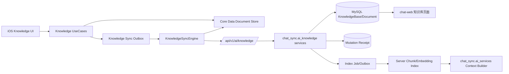

# KNOWLEDGE-SYNC-000001｜客户端知识库多设备同步与服务端知识库架构需求及详细设计工单

> 状态：Proposed，待产品与技术决策后实施  
> 创建日期：2026-08-26  
> 最近更新：2026-08-26  
> 本轮已确认：全链路异步且失败不阻断、启动后台自动对齐、知识列表卡片显示同步状态、数据冲突以服务端为准；服务端不新增 Django App，全部整合到现有 `chat_sync` App 下的 `ai_knowledge` 子领域。  
> 后端工程：`/Users/hua/Documents/project/Reference/SparkService`  
> iOS 参考工程：`/Users/hua/Documents/project/Reference/LookHealthClient/SparkClient`  
> 后续 Web 消费端：`/Users/hua/Documents/project/Reference/SparkService/chat-web`  
> 本工单性质：仅需求、架构和实施设计；当前未修改任何业务代码、数据库、配置或测试。

## 一、工单结论

SparkService 不新增独立 Django App。服务端知识库归入现有 `chat_sync` App：API、服务、检索与任务代码放在 `chat_sync/ai_knowledge/`，知识库数据模型文件放在现有 `chat_sync/ai_models/`；模型仍归属 Django app label `chat_sync`，数据库迁移继续进入 `chat_sync/migrations/`。iOS 保留 Core Data 本地优先体验，通过“本地事务 Outbox + 服务端幂等写入 + 乐观版本控制 + opaque cursor 增量拉取 + 删除墓碑”实现异步多设备同步。

推荐按以下边界实施：

1. 服务端同步的是“知识库容器元数据与知识文档正文”，不接收客户端 `KnowledgeChunkEntity.vectorData`。
2. 客户端 Chunk 和 Embedding 是可重建的本地派生数据；设备 B 拉到文档后，在本机重新切块、按当前模型重建向量。
3. 服务端后续为 `chat-web`/服务端 AI 对话建立自己的分块和向量索引，不能直接复用某台客户端生成的向量。
4. 每个客户端写操作同时具备稳定 `document_id`、稳定 `mutation_id` 和 `base_revision`，分别解决实体去重、请求重放和并发覆盖问题。
5. 服务端按账号隔离数据；`device_id` 只用于审计和诊断，不能作为知识归属或去重主键。
6. V1 先支持每个账号一个“默认个人知识库”，但服务端从第一版保留 `KnowledgeBase` 容器，避免后续 Web 多知识库选择、共享知识库和 Agent 绑定时再次迁移全部文档。
7. 所有知识同步均为后台异步操作；Push、Pull、重试、索引和本地向量重建失败都不得阻断应用启动、登录、页面进入、文档编辑、删除或其他业务流程。
8. 应用启动并完成账号恢复后，必须异步执行一次知识同步：重试未同步/失败 Outbox、增量 Pull 服务端数据并完成本地对齐；启动主流程不等待同步完成。
9. 数据冲突统一以服务端存储为准：客户端放弃冲突 mutation，应用服务端最新快照，不创建冲突副本，不弹出阻断式冲突处理流程。
10. `ai_knowledge` 是 `chat_sync` 内部知识业务子领域，不声明新的 `AppConfig`、不加入 `INSTALLED_APPS`、不拥有独立 migration graph；知识 API、同步服务、索引任务和检索端口放在该目录，持久化模型统一放入现有 `ai_models`。
11. 推荐公共 API 前缀为 `/api/v1/ai/knowledge/`，由总路由直接 include `chat_sync.ai_knowledge.urls`；不把知识库管理接口混入现有 `/api/v1/ai/chat/sync/*` 消息同步协议。

## 二、当前代码事实与缺口

### 2.1 SparkService 当前事实

| 模块 | 当前代码证据 | 当前状态 | 本工单结论 |
| --- | --- | --- | --- |
| 总路由 | `SparkService/urls.py` | 已有 `/api/v1/ai/` 与 `/api/v1/ai/chat/`，未注册知识库路由 | 目标新增 `/api/v1/ai/knowledge/`，include `chat_sync.ai_knowledge.urls` |
| 认证 | `accounts.auth.authentication.SparkJWTAuthentication`、`SparkService/settings.py` | DRF 默认要求登录 | 知识接口全部使用当前 JWT 与 `IsAuthenticated` |
| 统一响应 | `common/response.py` | `{code,msg,data}` | 知识接口不得创建第二套响应包装 |
| 统一异常 | `common/exception_handlers.py` | 保留 HTTP 状态并携带 `request_id` | 知识业务错误使用 `APIError`，不得吞成 HTTP 200 |
| 请求追踪 | `common/middleware/request_id_middleware.py` | 支持 `X-Request-ID` | Push/Pull、索引任务、对话检索需要串联同一 request ID |
| 数据库 | `SparkService/settings.py` | 默认 MySQL | 文档事实数据落 MySQL；不建议将高维向量 JSON 化后直接在 MySQL 全表扫描 |
| Django App | `SparkService/settings.py`、`chat_sync/apps.py` | `chat_sync` 已注册，且内部已有 AI 分层 | 不新增 App；新增 `chat_sync/ai_knowledge/` 子领域 |
| 同步参考 | `chat_sync/models.py`、`chat_sync/views.py` | 已有账号级 UUID 去重、事务写入、软删除和 cursor 分页 | 复用同步基础模式；知识模型进入 `ai_models`，API/服务进入 `ai_knowledge`，不继续膨胀 `chat_sync/views.py` |
| 知识对话入口 | `chat_sync/ai_services/context/reference_resolver.py` | `knowledge_chunk` 当前返回 `chat_knowledge_backend_unavailable` | 后续由知识检索端口补齐 |
| 会话偏好 | `chat_sync/ai_models/context.py` | 已有 `knowledge_bases` 列表字段 | 未来应保存服务端 `KnowledgeBase.id`，不能保存客户端临时名称 |
| AI 配置 | `ai_config/models.py` | 已有 `use_knowledge`、数量、相似度及知识工具枚举 | 目前只是配置/工具声明，不等于知识后端已实现 |

当前未发现：

- `chat_sync/ai_knowledge/` 子领域目录；
- `chat_sync/ai_models/knowledge.py` 知识模型文件；
- 服务端 `KnowledgeBase`、`KnowledgeDocument`、`KnowledgeChunk` 模型；
- 知识同步 Push/Pull API；
- 文档幂等写入记录；
- 服务端知识分块、Embedding 和检索实现；
- 后台知识管理 API；
- `chat-web` 可用的知识库列表和文档管理页面。

### 2.2 iOS 客户端当前事实

| 能力 | 当前代码 | 当前状态 | 改造含义 |
| --- | --- | --- | --- |
| 文档模型 | `Projects/Features/Knowledge/Domain/KnowledgeModels.swift` | `KnowledgeDocument` 已存在 | 保留现有 UUID 作为跨端 `document_id` |
| 文档持久化 | `Infrastructure/KnowledgeManagedObjects.swift`、Core Data model | `KnowledgeDocumentEntity` 已存在 | 增加远端版本、墓碑和同步状态字段，或拆到同步元数据实体 |
| 切块与向量 | `KnowledgeChunkEntity`、`CoreDataKnowledgeRepository.swift` | 本地约 480 字切块，向量保存为 Binary | Chunk/向量不上传；远端正文变更后本地重建 |
| CRUD | `KnowledgeRepository.swift`、`KnowledgeUseCases.swift` | 仅本地仓库 | 本地写入与 Outbox 入队必须处于同一 Core Data 事务 |
| UI | `KnowledgeLibraryViewModel.swift` | 列表、创建、保存、删除、搜索、重建索引 | 页面仍本地即时成功；列表卡片增加同步状态标识，失败只提示状态、不阻断操作 |
| 装配 | `Projects/App/Sources/App/Architecture/AssemblyProducts.swift` | 直接装配 `CoreDataKnowledgeRepository` | 目标增加 Sync Repository/API/Engine/Supervisor，不让 ViewModel 直接请求网络 |
| 生命周期 | `AppLifecycleCoordinator.swift`、`AccountSessionRuntime.swift` | 已有登录准备、前台同步入口、账号切换清理 | 将 KnowledgeSyncSupervisor 接入同一账号运行时门禁 |
| 可参考同步 | `Features/Chat/Infrastructure/ChatSyncEngine.swift` 等 | 已有 single-flight、Outbox、cursor、分页模式 | 复用模式与基础网络层，不与 Chat 共用表或 cursor |

当前客户端没有真正的“多个知识库容器”模型；用户界面实际创建的是一篇 `KnowledgeDocument`。本工单把术语冻结为：

- **知识库（KnowledgeBase）**：文档集合和未来对话选择单位；V1 每账号自动创建一个默认个人知识库。
- **知识文档（KnowledgeDocument）**：当前客户端创建、编辑、删除和同步的业务实体。
- **知识切块（KnowledgeChunk）**：由文档派生的检索单元，不是多设备同步事实。

### 2.3 chat-web 当前事实

`chat-web/app/(workspace)/knowledge/page.tsx` 目前仅是占位页面。Web 类型已经存在 `knowledge_bases` 和 `knowledgeCards`，但没有文档 CRUD、同步 API 消费或知识检索后端。后续 Web 应直接消费 SparkService 的服务端知识模型，不能读取 iOS Core Data，也不能另建一套 Web 私有知识库。

## 三、目标范围与非目标

### 3.1 P0/P1 必须实现

- 登录账号的默认个人知识库创建与查询；
- iOS 现有知识文档首次迁移上送；
- 创建、更新、删除异步同步；
- 同步失败不影响启动、登录、页面导航、文档 CRUD、搜索和其他业务流程；
- 应用启动后在账号运行时内异步执行失败重试、Push、Pull 和本地对齐；
- 知识列表每张文档卡片展示当前同步状态；
- 设备 A 写入后，设备 B 登录或回前台可增量拉取；
- 网络超时、重试、重复提交不产生重复文档；
- 多设备并发编辑有明确冲突，不静默覆盖；
- 删除跨设备传播，避免被旧设备“复活”；
- 游标分页、账号隔离、日志脱敏、配额和测试；
- 为后续服务端索引和对话检索保留稳定端口。

### 3.2 本工单暂不直接实现

- 共享知识库、家庭成员协作编辑；
- 文档级多人实时协同或 CRDT；
- 客户端向量上传；
- 服务端 RAG 引擎的最终供应商选型；
- Web 完整知识库 UI；
- 后台运营人员查看用户正文；
- 附件型知识文档的 OSS 上传、OCR 和正文抽取；
- 跨账号迁移、公开发布或知识市场。

## 四、推荐总体架构



### 4.1 边界划分

| 层 | 服务端职责 | 客户端职责 |
| --- | --- | --- |
| Presentation/API | `chat_sync.ai_knowledge.api` 负责鉴权、DTO 校验、HTTP/业务错误映射 | 页面状态、用户操作、同步状态展示 |
| Application | `chat_sync.ai_knowledge.services` 负责 Push/Pull、幂等、冲突、事务、索引任务派发 | UseCase、本地事务、Outbox 调度、single-flight |
| Domain/Persistence | `chat_sync.ai_models` 内的知识模型负责 Base/Document/Receipt/Index 生命周期、revision、墓碑与约束 | 本地领域模型、远端合并策略、服务端优先冲突收敛 |
| Infrastructure | `chat_sync.ai_knowledge.tasks/retrieval` 适配 MySQL、Celery 与向量索引 | Core Data、SparkNetwork、后台任务/前台恢复 |

依赖方向要求：`chat_sync.ai_services.context` 只能调用 `chat_sync.ai_knowledge.retrieval.KnowledgeRetrievalPort`，不能在 Context Builder 内直接查询知识表或向量供应商；`ai_knowledge` 不反向依赖具体 Chat Run、Web 页面或客户端实现。虽然同属一个 Django App，仍必须通过显式服务/端口保持子领域边界。

## 五、核心业务规则

### 5.1 账号、知识库与设备

1. 知识数据归属 `request.user`，服务端禁止信任 body 中的 `user_id`/`owner_account_id`。
2. 每个账号首次访问知识接口时幂等创建一个默认个人知识库，名称可本地化展示，但稳定 ID 由服务端 UUID 表示。
3. `device_id` 来自当前安装级稳定标识，仅记录创建/最近修改来源；同一用户换设备后仍访问同一数据。
4. 账号切换必须停止旧账号同步任务、切换 Core Data account scope、清空内存 cursor 和页面状态，再启动新账号同步。
5. 当前 `AccountDeviceSession` 注释体现“单用户单 ACTIVE 移动会话”方向。设备 B 登录是否使设备 A 立即失效需要产品确认；无论是否允许并发登录，已成功同步到服务器的数据都必须可被 B 拉取。

### 5.2 本地优先创建

```text
用户点击新建/保存
  → Core Data 同一事务写 KnowledgeDocumentEntity
  → 同一事务写 KnowledgeSyncOutboxEntity
  → UI 立即返回本地文档
  → Supervisor 防抖触发 Push
  → 服务端幂等落库并返回 revision/server_updated_at
  → 客户端 ACK 清理 Outbox、更新远端元数据
  → 再执行 Pull，收敛其他设备改动
```

禁止“先请求服务端成功再写本地”，否则离线不可用；也禁止只在内存中排队，否则 App 被杀后操作丢失。

### 5.3 重复同步防护

重复防护必须是多层的，不能只靠按钮防抖：

| 重复来源 | 防护键/规则 | 服务端行为 |
| --- | --- | --- |
| 用户连续点击创建 | UI 短时防抖 + 单次 UseCase | 仍以 UUID/幂等规则兜底 |
| 同一请求超时重试 | `(user_id, mutation_id)` 唯一 | 同 payload 返回原 ACK，标记 `replayed=true` |
| 同一文档被重复 create | `(user_id, document_id)` 唯一 | 同内容视为 no-op/replay；不同内容返回 409 |
| App 重启后 Outbox 重发 | mutation 保留原 UUID | 不生成第二条文档 |
| Push ACK 丢失后再次 Push | MutationReceipt | 返回原结果，不重复 revision++ |
| 设备 B Pull 多次 | 本地按 `document_id` upsert | 不 insert 第二条本地文档 |
| Realtime/前台/手动刷新同时触发 | SyncEngine single-flight | 复用正在执行的账号级任务 |

`content_hash` 只能用于判断同一文档是否 no-op，不能作为文档唯一键；用户允许创建两篇内容相同但 ID 不同的文档。

### 5.4 Outbox 压缩规则

为减少空白文档和自动保存产生的写放大，客户端 Push 前可在同一 `document_id` 内压缩待发操作：

| 原队列 | 压缩结果 |
| --- | --- |
| create → update → update，且从未 ACK | 一个 create，携带最新完整快照 |
| create → delete，且从未 ACK | 本地直接清除 create/delete Outbox，不访问服务端 |
| update → update | 一个 update，保留最早 `base_revision` 与最新快照；如期间已 ACK 则重新分段 |
| update → delete | 一个 delete，使用当前已知 `base_revision` |
| delete → retry | 原 mutation_id 重放，不生成新删除事件 |

压缩只能发生在尚未发送/未 ACK 的本地队列中；已经发出的 mutation 不得改 body 后复用原 mutation_id。

### 5.5 更新与冲突

1. 服务端 `revision` 从 1 开始，每次有效内容/元数据变更递增。
2. update/delete 必须携带客户端最后确认的 `base_revision`。
3. `base_revision == server.revision` 才可更新；否则返回 409 和安全的最新服务端快照。
4. 服务端时间只用于增量排序和展示，不用于决定谁覆盖谁；禁止仅靠客户端 `updated_at` 做 Last Write Wins。
5. 客户端收到 `knowledge_revision_conflict` 或 `knowledge_document_deleted` 后，以响应中的服务端最新快照为准，原子覆盖本地主文档。
6. 冲突 mutation 标记为 `resolvedByServer` 并从待重试队列移除；不得继续自动重试同一过期 mutation。
7. 不创建冲突副本，不要求用户手工合并，不弹阻断式弹窗；列表卡片可短暂显示“已使用云端版本”，随后进入已同步状态。
8. 如果应用服务端快照失败，本地保持 `failed`，留待下次启动/前台同步再次 Pull；该失败仍不得影响其他文档或应用流程。

本规则中的“服务端优先”是基于 `revision` 的权威快照收敛，不是按客户端或服务端时间戳做 Last Write Wins。

### 5.6 删除与防复活

1. 删除为软删除：`is_deleted=true`、`deleted_at`、`revision++`。
2. Pull 必须返回删除墓碑；设备 B 收到后删除本地 Chunk/向量并隐藏文档。
3. 旧设备以过期 revision 更新已删除文档时返回 `knowledge_document_deleted`，不得隐式复活。
4. 恢复必须是显式 restore 操作并携带最新 revision；V1 可不提供 UI，但契约应预留。
5. 建议墓碑至少保留 90 天；超过保留期的旧 cursor 需要返回 `knowledge_cursor_expired`，客户端执行受控全量重建。

### 5.7 Pull 与游标

推荐沿用项目 Chat Sync 的 opaque cursor 思路：游标编码 `(server_updated_at, document_id)`，客户端不得解析其内容。

```text
GET pull(cursor, limit)
  → user 范围过滤
  → server_updated_at > ts
     OR server_updated_at == ts AND document_id > tie_breaker
  → 按 server_updated_at, document_id 稳定排序
  → 返回 documents/tombstones + next_cursor + has_more
```

规则：

- 新设备 cursor 为空，从服务端拉取完整当前快照及有效墓碑；
- cursor 仅在本页全部成功落地 Core Data 后推进；
- 单次默认 100，最大 200；单轮最多 20 页，剩余下次继续；
- Push 成功后应继续 Pull，不能假设 ACK 已包含所有其他设备变化；
- Pull 合并远端数据时必须使用“remote apply”路径，禁止再次生成 Outbox 形成回声同步。

### 5.8 全异步与失败隔离

知识同步属于后台最终一致性能力，不是任何用户主流程的前置条件：

1. 创建、更新、删除先完成本地事务，网络同步随后异步执行。
2. 应用启动、登录成功、主页面展示和知识列表首屏均不得等待知识同步网络请求。
3. Push 失败后仍继续尝试 Pull；Pull 失败不影响已成功的 Push ACK；单条 mutation 失败不阻断同批其他 mutation。
4. 本地 Chunk 重建失败不回滚远端文档合并；Embedding 失败继续使用词法搜索。
5. 服务端索引失败不回滚文档同步，也不影响移动端读取正文。
6. 所有失败写入持久化状态和下次重试时间；不能只打印日志或只保存在内存。
7. 后台任务必须绑定 `accountID + sessionGeneration`；账号切换后旧 generation 的回调和写入一律丢弃。
8. 任何异步异常都在 KnowledgeSyncSupervisor/Engine 边界内捕获并转换为结果摘要，禁止冒泡导致 App 启动 Task 失败。

阶段之间采用“尽力继续”策略：

```text
retry pending/failed Outbox
  ├─ 成功或部分成功 → 记录 ACK
  └─ 失败 → 持久化失败，不抛出到启动主流程
                  ↓ 始终继续
incremental Pull
  ├─ 成功 → remote apply + cursor commit
  └─ 失败 → cursor 不推进，不影响已完成 Push
                  ↓ 始终继续
schedule local chunk/embedding rebuild
  ├─ 成功 → 更新本地索引状态
  └─ 失败 → 词法降级，下次后台重建
```

### 5.9 客户端同步状态模型

每篇知识文档必须有可供列表卡片消费的同步状态。推荐领域枚举：

| 状态 | 触发条件 | 卡片标识建议 | 是否阻断操作 | 后续动作 |
| --- | --- | --- | ---: | --- |
| `localOnly` | 旧数据/新建文档尚未形成有效同步 ACK | 灰色云朵或“仅本机” | 否 | 生成/等待 Outbox |
| `pending` | 已有待发送 mutation | 灰色上行箭头或“待同步” | 否 | 防抖或启动时 Push |
| `syncing` | 当前文档 mutation 正在发送，或正在应用远端版本 | 蓝色旋转/云同步 | 否 | 等待本轮结果 |
| `synced` | 无待发 mutation，已知 revision 与最近服务端快照一致 | 绿色云勾或“已同步” | 否 | 无 |
| `failedRetryable` | 网络、429、5xx、Token 暂时不可用 | 橙色感叹号或“同步失败” | 否 | 自动退避；允许点标识手动重试 |
| `failedPermanent` | payload 非法、超配额、幂等契约冲突 | 红色感叹号或“无法同步” | 否 | 展示简短原因；用户修正文档后生成新 mutation |
| `resolvedByServer` | revision/删除冲突，已决定服务端优先 | 短暂显示云端覆盖提示 | 否 | 应用远端成功后转 `synced` |

展示规则：

- 卡片右上角或副标题尾部固定预留同步标识位置，避免状态切换引发布局跳动；
- 标识至少具备图标、颜色和无障碍文本，不能只靠颜色表达；
- `failedRetryable` 点击后只触发该文档或账号级后台重试，不进入阻断页面；
- 正文编辑、打开详情、搜索、删除等操作在任何同步状态下都可继续；
- 列表状态由本地文档 + Outbox + 当前 Engine in-flight 状态投影，不能由 ViewModel 自己猜测；
- 不在卡片上展示 request ID、HTTP 错误、Token 状态或服务端内部错误文本。

## 六、设备 A 到设备 B 的完整业务流程

### 6.1 正常在线流程

```text
设备 A 创建 document_id=D、mutation_id=M1
  → 本地文档 + Outbox 原子提交
  → POST sync/push
  → 服务端校验 user、M1 幂等、D 唯一
  → 创建 revision=1
  → 返回 accepted + server_updated_at
  → A 更新 ACK，清除 M1

设备 B 登录/恢复账号运行时
  → KnowledgeSyncSupervisor.start
  → 先 Push B 本地待发 Outbox
  → GET sync/pull(cursor=nil 或旧 cursor)
  → 收到 D revision=1
  → Core Data 按 D upsert，不生成 Outbox
  → 重建本地 Chunk（vectorData=nil）
  → 后台生成 B 当前 Embedding 模型对应向量
  → UI 展示同一篇文档
```

### 6.2 A 请求超时但服务端已成功

```text
A Push M1 → 服务端已提交 → ACK 在网络中丢失
A 保留 M1 并重试
服务端命中 MutationReceipt(M1)
  → 校验 request_hash 相同
  → 返回第一次 ACK，replayed=true
  → 不新增文档、不增加 revision
```

### 6.3 A 离线创建后直接在 B 登录

服务端无法同步从未离开设备 A 的离线数据。B 只能拉到服务端已有数据。这是分布式系统边界，不可通过服务端去重解决。

建议：

- A 在线时创建后立即调度 Push；
- App 进后台时申请短时 flush；
- 用户主动退出/切换账号前显示“仍有 N 项未同步”，做一次限时 Push；
- 不承诺 App 被强杀或设备永久离线时数据已上云；
- 待决策是否阻止带未同步知识的账号退出，推荐不强阻止，但明确提示。

### 6.4 A/B 并发编辑

```text
A、B 均持有 revision=3
A 更新成功 → server revision=4
B 用 base_revision=3 更新
  → 服务端返回 409 + revision=4 快照
  → B 将 mutation 标记 resolvedByServer，不再重试
  → B 原子应用 server revision=4，覆盖本地主文档
  → 卡片短暂显示“已使用云端版本”后转为已同步
```

### 6.5 应用启动异步同步流程

知识同步接入现有应用启动/账号恢复流程，但不得成为启动门禁：

```text
App 启动
  → 网络路径首次评估
  → Session restore / 登录态恢复
  → AccountSessionRuntime.activateUser(accountID)
  → 本地账号数据与首页可以正常展示
  → KnowledgeSyncSupervisor.scheduleStartupSync(accountID, generation)
       └─ 立即返回，不阻塞启动主 Task
            → 扫描 pending + failedRetryable Outbox
            → 到期项按批次 Push
            → 无论 Push 成败都执行增量 Pull
            → 按服务端 revision/墓碑 remote apply
            → cursor 在每页事务成功后推进
            → 为正文变化文档调度本地 Chunk/Embedding 重建
            → 输出脱敏 SyncRunSummary 日志
```

启动同步规则：

1. 同一账号同一启动 generation 只创建一个 startup sync；重复生命周期回调复用 single-flight。
2. `scheduleStartupSync` 必须立即返回；启动、首页、知识列表不显示全屏等待态。
3. 扫描范围包括 `localOnly`、`pending`、到达 `nextAttemptAt` 的 `failedRetryable`；`failedPermanent` 不做无限重试。
4. Push 和 Pull 分阶段捕获错误；Push 全部失败仍执行 Pull，以便设备 B 获得服务端已有数据。
5. 每条 mutation 独立处理结果；某篇文档失败不影响同批其他文档。
6. Pull 某一页 Core Data 合并失败时不推进该页 cursor，但已完成页面保持提交；下一轮从旧 cursor 重拉并幂等 upsert。
7. App 进入后台可继续当前短任务或安全取消；取消不标记业务失败，Outbox/cursor 保持可恢复。
8. 账号切换、退出或服务端认证失效时取消旧账号任务；旧 generation 的迟到回调禁止写入新账号存储。
9. 启动无网时记录 `skippedOffline`，不报启动错误；网络恢复后重新调度。
10. 本轮结束只发布本地 SyncRunSummary/状态变化，不弹全局错误，不影响其他启动步骤。

## 七、服务端目标数据模型

以下为目标设计，不是当前已存在模型。

模型不创建新的 Django App，统一归属 `chat_sync`：

| 模型 | 目标 Python 位置 | Django app label | 建议数据库表 |
| --- | --- | --- | --- |
| `KnowledgeBase` | `chat_sync/ai_models/knowledge.py` | `chat_sync` | `chat_sync_ai_knowledge_base` |
| `KnowledgeDocument` | `chat_sync/ai_models/knowledge.py` | `chat_sync` | `chat_sync_ai_knowledge_document` |
| `KnowledgeMutationReceipt` | `chat_sync/ai_models/knowledge.py` | `chat_sync` | `chat_sync_ai_knowledge_mutation_receipt` |
| `KnowledgeIndexState` | `chat_sync/ai_models/knowledge.py` | `chat_sync` | `chat_sync_ai_knowledge_index_state` |
| `KnowledgeChunk` | `chat_sync/ai_models/knowledge.py` | `chat_sync` | `chat_sync_ai_knowledge_chunk` |

`chat_sync/ai_models/__init__.py` 负责导入并导出新增知识模型文件。现有 `chat_sync/models.py` 已经导入 `chat_sync.ai_models` 包，因此保持该文件现状，不追加 `ai_knowledge.models` 或知识模型导入。迁移文件只能生成在 `chat_sync/migrations/`，依赖现有最新 migration，不建立 `ai_knowledge/migrations/`。

### 7.1 KnowledgeBase

| 字段 | 类型 | 规则 |
| --- | --- | --- |
| `id` | UUID PK | 服务端生成；Web/客户端选择知识库的稳定 ID |
| `user` | FK User | 数据归属，级联或账号注销策略处理 |
| `name` | varchar(128) | 默认个人知识库名称；后续允许重命名 |
| `kind` | enum | V1=`personal`；预留 `shared/system/imported` |
| `is_default` | bool | V1 每账号恰好一个默认库 |
| `revision` | bigint | 元数据乐观锁版本 |
| `is_deleted` | bool | 软删除；默认库 V1 禁止删除 |
| `deleted_at` | datetime nullable | 删除时间 |
| `created_at` | datetime | 服务端创建时间 |
| `server_updated_at` | datetime indexed | 增量同步排序字段 |

约束建议：`UNIQUE(user,id)`；默认库唯一性需使用当前 MySQL 可执行的哨兵字段或服务层事务锁实现，不能只依赖应用先查后建。

### 7.2 KnowledgeDocument

| 字段 | 类型 | 必填 | 说明 |
| --- | --- | --- | --- |
| `id` | UUID PK | 是 | 使用客户端现有 UUID，跨设备稳定 |
| `user` | FK User | 是 | 服务端从 Token 注入 |
| `knowledge_base` | FK KnowledgeBase | 是 | V1 指向默认个人库 |
| `title` | varchar(255) | 是 | 服务端 trim；空标题使用统一默认值 |
| `content` | longtext | 是 | 完整正文，建议 V1 最大 1 MiB UTF-8，待确认 |
| `excerpt` | varchar/text | 是 | 推荐服务端由 content 生成，避免多端算法漂移 |
| `scope` | enum | 是 | `personal/agent_bound`，wire 建议 snake_case |
| `bound_model_id` | varchar(128) nullable | 否 | 必须是服务端稳定模型/Agent 标识，不能保存设备本地临时 ID |
| `source` | enum | 是 | `user/tool/import/web`，兼容客户端当前 `user/tool` |
| `revision` | bigint | 是 | 服务端事实版本，创建为 1 |
| `content_hash` | char(64) | 是 | 服务端按同步字段 canonical JSON 计算 SHA-256 |
| `origin_device_id_hash` | char(64) nullable | 否 | 仅审计，建议哈希后保存 |
| `last_device_id_hash` | char(64) nullable | 否 | 最近修改来源，仅诊断 |
| `is_deleted` | bool | 是 | 删除墓碑 |
| `deleted_at` | datetime nullable | 否 | 删除时间 |
| `client_created_at` | datetime nullable | 否 | 展示/迁移参考，不作为排序真相 |
| `client_updated_at` | datetime nullable | 否 | 诊断参考，不参与冲突裁决 |
| `created_at` | datetime | 是 | 服务端时间 |
| `server_updated_at` | datetime indexed | 是 | Pull cursor 使用 |

约束与索引：

- `UNIQUE(user,id)`；
- `INDEX(user,server_updated_at,id)`；
- `INDEX(user,knowledge_base,is_deleted,server_updated_at)`；
- 不建立 `(user,content_hash)` 唯一约束；
- 所有按 ID 查询仍必须同时过滤 `user`，防止 UUID 猜测越权。

### 7.3 KnowledgeMutationReceipt

| 字段 | 类型 | 说明 |
| --- | --- | --- |
| `id` | bigint PK | 内部主键 |
| `user` | FK User | 幂等作用域 |
| `mutation_id` | UUID | 客户端操作唯一 ID |
| `document_id` | UUID | 目标文档 |
| `operation` | enum | `create/update/delete/restore` |
| `request_hash` | char(64) | 校验同 key 是否同请求 |
| `result_revision` | bigint | 首次处理后的版本 |
| `response_snapshot` | JSON | 最小 ACK，不保存完整敏感正文 |
| `created_at` | datetime | 首次执行时间 |
| `expires_at` | datetime | 建议至少 30 天，待确认 |

唯一约束：`UNIQUE(user,mutation_id)`。相同 key、不同 request hash 返回 409 `knowledge_idempotency_conflict`。

### 7.4 KnowledgeIndexState（P2）

| 字段 | 类型 | 说明 |
| --- | --- | --- |
| `document` | OneToOne/FK | 对应文档 |
| `document_revision` | bigint | 索引基于哪一版正文 |
| `status` | enum | `pending/processing/ready/failed/stale` |
| `chunk_count` | int | 服务端切块数 |
| `embedding_provider` | varchar | 服务端供应商绑定 |
| `embedding_model` | varchar | 模型名 |
| `embedding_dimension` | int | 向量维度 |
| `embedding_signature` | varchar | provider/model/dim/算法版本签名 |
| `index_version` | bigint/string | 服务端索引版本 |
| `last_error_code` | varchar nullable | 脱敏错误码 |
| `indexed_at` | datetime nullable | 完成时间 |

索引失败不回滚已经成功的文档同步；文档仍可在多设备显示，服务端对话检索暂时不召回该文档。

### 7.5 KnowledgeChunk（P2 服务端派生模型）

| 字段 | 类型 | 说明 |
| --- | --- | --- |
| `id` | UUID/bigint | 服务端 chunk ID |
| `document` | FK | 所属文档 |
| `document_revision` | bigint | 防止旧任务覆盖新正文 |
| `sequence` | int | 顺序 |
| `content` | text | 切块正文 |
| `content_hash` | char(64) | 块内容哈希 |
| `token_count` | int | 上下文预算 |
| `metadata` | JSON | 标题、来源、页码等安全元数据 |
| `vector_ref` | varchar/adapter-owned | 指向专用向量存储；不要默认把向量塞 JSONField |

## 八、客户端目标数据模型

### 8.1 KnowledgeDocumentEntity 增量字段

| 字段 | 建议类型 | 用途 |
| --- | --- | --- |
| `knowledgeBaseID` | UUID nullable/required after migration | 服务端默认知识库 ID |
| `serverRevision` | Int64 | 最后 ACK/Pull 的服务端 revision；本地未同步旧数据为 0 |
| `serverUpdatedAt` | Date nullable | 远端活动时间，不覆盖本地 `updatedAt` 语义 |
| `isDeleted` | Bool | 本地墓碑/远端墓碑 |
| `deletedAt` | Date nullable | 删除时间 |
| `contentHash` | String | 本地 no-op/诊断 |
| `lastSyncStateRaw` | String | 列表卡片持久化投影；取值遵循 5.9，权威待发送状态仍在 Outbox |
| `lastSyncAttemptAt` | Date nullable | 最近一次尝试时间，用于状态说明与诊断 |
| `lastSyncSucceededAt` | Date nullable | 最近成功 ACK/Pull 对齐时间 |
| `lastSyncErrorCode` | String nullable | 脱敏稳定错误码；成功后清除 |

不要把 `mutationID` 直接放在文档唯一字段中，因为同一文档生命周期会产生多次 mutation。

### 8.2 KnowledgeSyncOutboxEntity

| 字段 | 类型 | 用途 |
| --- | --- | --- |
| `mutationID` | UUID PK | 重试期间保持不变 |
| `ownerAccountID` | Int64 indexed | 账号隔离 |
| `documentID` | UUID indexed | 操作对象 |
| `operationRaw` | String | create/update/delete/restore |
| `baseRevision` | Int64 | 乐观锁基线 |
| `payloadData` | Binary | 创建时冻结的 wire 快照；不得依赖之后变化的 ManagedObject |
| `requestHash` | String | 本地诊断并校验 mutation body 不变 |
| `stateRaw` | String | pending/sending/failedRetryable/failedPermanent/resolvedByServer |
| `attemptCount` | Int32 | 退避计算 |
| `nextAttemptAt` | Date nullable | 持久化重试时间 |
| `lastErrorCode` | String nullable | 不存正文/Token |
| `createdAt/updatedAt` | Date | 排序和诊断 |

### 8.3 KnowledgeSyncCursorEntity

建议沿用通用 cursor 表也可以，但 key 必须是知识专用且账号隔离，例如：

```text
knowledge.document.cursor.v1
```

字段至少包含 `ownerAccountID/key/value/updatedAt`。Cursor 只有在远端一页全部合并成功后才能提交。

### 8.4 Chunk/向量规则

- `KnowledgeChunkEntity` 继续作为本地派生缓存；
- Pull 到新的正文 revision 后，事务内删除旧 Chunk、按当前算法重建文本 Chunk，并把 `vectorData=nil`；
- Embedding 构建在文档合并事务之后异步执行；
- Embedding 失败不回滚远端文档；搜索回退现有词法逻辑；
- 客户端 `isEmbeddingIndexed/lastEmbeddingModelName` 只代表本机状态，不上传为服务端同步事实；
- 服务端与客户端允许使用不同切块长度、模型和向量维度。

## 九、建议 API 契约

以下路径和字段为本工单建议，实施前需冻结 Serializer 和跨端 fixture。API 实现位于 `chat_sync.ai_knowledge.api`，公开路由与代码目录解耦。

### 9.1 获取或初始化默认知识库

```http
GET /api/v1/ai/knowledge/default/
Authorization: Bearer <token>
```

成功：

```json
{
  "code": 0,
  "msg": "ok",
  "data": {
    "id": "uuid",
    "name": "个人知识库",
    "kind": "personal",
    "is_default": true,
    "revision": 1,
    "server_updated_at": "2026-08-26T10:00:00Z"
  }
}
```

该 GET 是否允许幂等创建默认库需要决策；推荐单独由登录 bootstrap 或 `get_or_create` 服务完成，HTTP 语义可接受但需测试并发创建。

### 9.2 批量 Push

```http
POST /api/v1/ai/knowledge/sync/push/
Content-Type: application/json
X-Request-ID: <uuid>
Authorization: Bearer <token>
```

```json
{
  "mutations": [
    {
      "mutation_id": "uuid",
      "document_id": "uuid",
      "operation": "create",
      "base_revision": 0,
      "knowledge_base_id": "uuid",
      "document": {
        "title": "检查报告解读",
        "content": "...",
        "scope": "personal",
        "bound_model_id": null,
        "source": "user",
        "client_created_at": "2026-08-26T10:00:00Z",
        "client_updated_at": "2026-08-26T10:00:00Z"
      },
      "client": {
        "platform": "ios",
        "version": "...",
        "device_id": "installation-id"
      }
    }
  ]
}
```

响应建议逐条 ACK，允许一个冲突不阻断同批其他文档：

```json
{
  "code": 0,
  "msg": "ok",
  "data": {
    "results": [
      {
        "mutation_id": "uuid",
        "document_id": "uuid",
        "status": "accepted",
        "replayed": false,
        "revision": 1,
        "server_updated_at": "2026-08-26T10:00:01Z",
        "content_hash": "sha256"
      }
    ]
  }
}
```

批次建议最多 50 条；每条 mutation 在独立原子事务/保存点中完成文档变更和 receipt 写入。服务端必须先锁定同一 `(user,document_id)` 行再比较 revision。

### 9.3 增量 Pull

```http
GET /api/v1/ai/knowledge/sync/pull/?cursor=<opaque>&limit=100
Authorization: Bearer <token>
```

```json
{
  "code": 0,
  "msg": "ok",
  "data": {
    "cursor": "opaque-v1-token",
    "has_more": false,
    "documents": [
      {
        "id": "uuid",
        "knowledge_base_id": "uuid",
        "title": "检查报告解读",
        "content": "...",
        "excerpt": "...",
        "scope": "personal",
        "bound_model_id": null,
        "source": "user",
        "revision": 4,
        "content_hash": "sha256",
        "is_deleted": false,
        "deleted_at": null,
        "created_at": "2026-08-26T10:00:00Z",
        "server_updated_at": "2026-08-26T10:05:00Z"
      }
    ]
  }
}
```

删除项可放在同一 `documents` 数组并携带 `is_deleted=true`，推荐保持单一 wire schema，避免客户端维护两种实体解码路径。

### 9.4 文档详情与 Web CRUD（P1/P2）

建议后续提供：

```text
GET    /api/v1/ai/knowledge/bases/
POST   /api/v1/ai/knowledge/bases/
GET    /api/v1/ai/knowledge/bases/{base_id}/documents/
GET    /api/v1/ai/knowledge/documents/{document_id}/
PATCH  /api/v1/ai/knowledge/documents/{document_id}/
DELETE /api/v1/ai/knowledge/documents/{document_id}/
POST   /api/v1/ai/knowledge/documents/{document_id}/restore/
POST   /api/v1/ai/knowledge/search/
```

移动端同步继续使用 Push/Pull；Web 在线 CRUD 可复用同一 `KnowledgeDomainService`，不能绕过 revision、权限、墓碑和索引任务规则。

## 十、错误模型

| 业务 code 建议 | HTTP | 场景 | 客户端处理 | 可重试 |
| --- | ---: | --- | --- | ---: |
| `knowledge_document_invalid` | 400 | 标题/正文/枚举非法 | 标记永久失败并提示用户 | 否 |
| `knowledge_payload_too_large` | 413 | 单文档或批次超限 | 提示缩减/拆分 | 否 |
| `knowledge_base_not_found` | 404 | 库不存在或无权访问 | 刷新默认库/停止写入 | 条件式 |
| `knowledge_document_not_found` | 404 | 更新目标不存在 | Pull 后重新判断 | 条件式 |
| `knowledge_document_deleted` | 409 | 旧设备更新墓碑 | 服务端优先：应用墓碑并移除过期 mutation | 否 |
| `knowledge_revision_conflict` | 409 | base revision 落后 | 以响应中的服务端快照覆盖本地，mutation 转 `resolvedByServer` | 否自动重试 |
| `knowledge_idempotency_conflict` | 409 | 同 mutation ID 不同 body | 永久失败并记录契约违规 | 否 |
| `knowledge_document_id_conflict` | 409 | 同 document ID 不同创建语义 | Pull/人工诊断 | 否 |
| `knowledge_cursor_invalid` | 400 | cursor 非法 | 不自动清库；提示/诊断 | 否 |
| `knowledge_cursor_expired` | 410 | 墓碑/变更历史已清理 | 执行受控 full resync | 是，换流程 |
| `knowledge_rate_limited` | 429 | 频率限制 | 尊重 `Retry-After` | 是 |
| `knowledge_index_unavailable` | 503 | 服务端检索不可用 | 文档同步仍成功；对话降级 | 是 |

所有错误继续使用 `{code,msg,data}` 包装；`data` 可含 `request_id/current_revision/current_document`，但日志和错误不得回传其他账号数据、Token、完整敏感正文或向量。

## 十一、客户端改造方向、核心代码与范围

### 11.1 Domain/Application

| 当前文件 | 改造方向 |
| --- | --- |
| `Features/Knowledge/Domain/KnowledgeModels.swift` | 增加远端 revision、墓碑、库 ID 的领域表达；本地索引状态与远端同步状态分离 |
| `Features/Knowledge/Domain/KnowledgeRepository.swift` | 保持文档业务仓库；新增 Outbox/remote merge 能力应通过独立协议或明确方法，不把 HTTP DTO 泄漏给 UI |
| `Features/Knowledge/Application/KnowledgeUseCases.swift` | create/update/delete 改为“本地事实 + Outbox 原子写”；新增手动刷新与服务端优先冲突收敛 UseCase |
| `BuildKnowledgeEmbeddingsUseCase.swift` | 远端正文落地后按需排队重建；避免同 revision 重复构建 |

### 11.2 Infrastructure

建议新增目标文件（名称可在实现时调整）：

```text
Projects/Features/Knowledge/Infrastructure/
├── KnowledgeSyncDTO.swift
├── KnowledgeSyncDTOMapper.swift
├── KnowledgeRemoteAPI.swift
├── KnowledgeSyncOutboxStore.swift
├── KnowledgeOutboxPipeline.swift
├── KnowledgeInboundPipeline.swift
├── KnowledgeMergePolicy.swift
├── KnowledgeSyncEngine.swift
└── KnowledgeSyncSupervisor.swift
```

核心职责：

- `CoreDataKnowledgeRepository`：本地 CRUD、remote apply、Outbox 原子事务、cursor 持久化；
- `KnowledgeRemoteAPI`：统一 SparkNetwork 请求，Push 标记 idempotent，serialKey 使用账号级 knowledge scope；
- `KnowledgeSyncEngine actor`：账号级 single-flight，Push/Pull 分阶段失败隔离，分页上限和取消；
- `KnowledgeMergePolicy`：revision、墓碑、pending local mutation、服务端优先覆盖；
- `KnowledgeSyncSupervisor`：创建后防抖 Push、启动异步同步、登录后首次同步、前台恢复、网络恢复、手动刷新；所有公开触发入口返回非阻断结果；
- `KnowledgeInboundPipeline`：remote apply 不产生 Outbox，提交成功后再推进 cursor；
- `KnowledgeSyncOutboxStore`：重试、压缩、ACK、永久错误、冲突状态。

### 11.3 Core Data schema

改造范围：

- `KnowledgeDocumentEntity` 增加同步元数据；
- 新增 `KnowledgeSyncOutboxEntity`；
- 新增或复用账号隔离的 cursor 实体；
- 为 `(ownerAccountID,id)`、Outbox `(ownerAccountID,state,nextAttemptAt)` 建索引；
- 设计轻量 migration，旧文档 `serverRevision=0` 并生成一次 create Outbox；
- 旧 Chunk 不迁移到服务端，保留本地或按正文重新构建。

### 11.4 Composition Root 与生命周期

| 当前文件 | 改造方向 |
| --- | --- |
| `Projects/App/Sources/App/Architecture/AssemblyProducts.swift` | 装配 KnowledgeRemoteAPI/SyncEngine/Supervisor |
| `AppLifecycleCoordinator.swift` | signed-in preparation 完成后调度非阻断 startup sync；前台/网络恢复再次调度，不 await 网络完成 |
| `AccountSessionRuntime.swift` | 账号切换前停止旧同步；切换后重置知识 cursor/内存任务并启动新账号同步 |
| `KnowledgeLibraryViewModel.swift` | 页面不直接发网络；刷新只调度同步 UseCase；列表卡片展示 localOnly/pending/syncing/synced/failed/resolvedByServer |

### 11.5 客户端触发策略

| 触发点 | 行为 |
| --- | --- |
| 创建/保存/删除 | 本地提交后 300–800ms 防抖 Push；具体值待压测 |
| 应用启动且账号恢复完成 | 非阻断调度：重试本地 pending/failed Outbox → 无论 Push 成败均 Pull 全量/增量 → 输出结果日志 |
| 登录成功 | 与启动入口共用 single-flight 调度；不得重复创建第二个同步任务 |
| 回前台 | 如果距离上次成功同步超过建议 30 秒或有 Outbox，则同步 |
| 网络恢复 | 有 Outbox 或 cursor 落后提示时同步；避免每次 path 抖动重复启动 |
| 手动下拉刷新 | Push → Pull，向用户返回最终成功/部分失败状态 |
| 退出/账号切换 | 可尝试限时 flush，但不得阻止退出；保留未同步状态，随后取消旧 generation 并切换账号 scope |
| App 后台 | 最佳努力 flush，不承诺强杀后完成 |

重试建议：1s、2s、4s、8s、16s，加入 0–30% jitter，单轮最多 5 次；启动只处理已经到期的重试项，不能长时间 sleep 阻塞启动 Task。401 走现有 Token refresh 单飞；409 直接按服务端快照收敛；429 尊重 `Retry-After`；普通 4xx 标记永久失败。所有结果更新卡片状态，但不影响任何其他业务流程。

### 11.6 知识列表卡片同步标识

建议改造 `KnowledgeLibraryView` 的文档卡片/行组件，在固定位置加入 `KnowledgeSyncBadge`：

```text
┌────────────────────────────────────────────┐
│ 检查报告解读                         ☁︎✓ 已同步 │
│ 血脂、血糖与肝功能结果摘要……                 │
│ 08-26 10:05                                │
└────────────────────────────────────────────┘
```

状态交互：

- `pending/localOnly`：显示“待同步/仅本机”；
- `syncing`：显示轻量进度动画，不禁用卡片；
- `synced`：显示云勾；
- `failedRetryable`：显示“同步失败”，点击标识调度后台重试，卡片主体仍正常打开；
- `failedPermanent`：显示“无法同步”，点击标识展示脱敏、可操作的简短原因；
- `resolvedByServer`：短暂显示“已使用云端版本”，随后刷新为已同步；
- VoiceOver 文案必须完整说明状态和可执行动作；Reduced Motion 下不用持续旋转动画。

列表首屏永远先读 Core Data；同步状态变化只局部刷新对应卡片，不触发整页 loading，不清空现有列表。

### 11.7 启动同步结果与日志

每轮同步形成一个不含正文的 `KnowledgeSyncRunSummary`，建议字段：

| 字段 | 说明 |
| --- | --- |
| `trigger` | startup/login/foreground/networkRecovered/manual/localMutation |
| `accountScopeHash` | 账号脱敏 hash，不记录 Token |
| `generation` | 当前账号运行时 generation |
| `startedAt/durationMs` | 起止与耗时 |
| `outboxScanned/pushAttempted/pushAccepted/pushReplayed` | Push 统计 |
| `pushFailedRetryable/pushFailedPermanent/conflictsResolvedByServer` | 失败与服务端优先收敛统计 |
| `pullPages/pulledDocuments/pulledTombstones` | Pull 统计 |
| `localApplied/cursorAdvanced` | 本地应用结果 |
| `embeddingRebuildScheduled` | 本地索引任务数 |
| `result` | success/partialFailure/failed/skippedOffline/cancelledAccountSwitch |
| `requestIDs` | 可选短列表，仅用于请求链路关联 |

日志示例只记录统计：

```text
知识同步启动 trigger=startup generation=12 pending=3 retryable=1
知识同步 Push 完成 accepted=2 replayed=1 retryable_failed=1 permanent_failed=0
知识同步 Pull 完成 pages=2 documents=18 tombstones=1 applied=19 cursor_advanced=true
知识同步结束 result=partialFailure duration_ms=842 pending_after=1
```

禁止记录标题、正文、Chunk、向量、完整请求/响应、Authorization、设备原始标识。即使结果为 `failed`，App 启动日志只报告知识同步子任务失败，不得将根启动流程标记为失败。

## 十二、服务端改造方向、核心代码与范围

### 12.1 模块决策：复用 `chat_sync`，新增 `ai_knowledge` 子领域

本工单明确禁止新增 Django App。实施时不得创建新的顶层 `knowledge/`、不得创建新的 `KnowledgeConfig`、不得向 `INSTALLED_APPS` 增加知识项。目标目录如下：

```text
chat_sync/
├── urls.py                           # 现有 Chat API，不塞入知识 View
├── ai_models/                        # 现有 AI 持久化模型包；在此增加知识模型文件
│   ├── __init__.py                   # 导入并导出新增知识模型
│   ├── context.py                    # 现有 Chat Context 模型
│   ├── event.py                      # 现有 Chat Event 模型
│   ├── run.py                        # 现有 Chat Run 模型
│   ├── tool.py                       # 现有 Chat Tool 模型
│   └── knowledge.py                  # 新增全部知识模型：Base/Document/Receipt/IndexState/Chunk
├── ai_api/                           # 现有对话 API，保持原职责
├── ai_services/                      # 现有对话编排；通过 Retrieval Port 使用知识
├── ai_tasks/                         # 现有对话任务，保持原职责
├── ai_knowledge/                     # 新增：同 App 内知识子领域
│   ├── __init__.py
│   ├── urls.py
│   ├── api/
│   │   ├── serializers.py
│   │   ├── views.py
│   │   └── payloads.py
│   ├── services/
│   │   ├── knowledge_base_service.py
│   │   ├── document_sync_service.py
│   │   ├── document_query_service.py
│   │   ├── idempotency_service.py
│   │   └── indexing_service.py
│   ├── retrieval/
│   │   ├── port.py
│   │   ├── service.py
│   │   └── vector_adapter.py
│   ├── tasks/
│   │   └── indexing_tasks.py
│   └── tests/
│       ├── test_models.py
│       ├── test_sync_api.py
│       ├── test_pull_api.py
│       ├── test_retrieval.py
│       └── test_chat_context_integration.py
└── migrations/                       # 继续使用 chat_sync migration graph
```

目录可以在实现阶段按文件规模小幅合并，但以下边界不能改变：

- 知识 API 不写进现有 `chat_sync/views.py`；
- 知识 Serializer 不写进现有 `chat_sync/serializers.py`；
- 知识模型只增加到现有 `chat_sync/ai_models/`，不得建立 `ai_knowledge/models/`；
- `chat_sync/models.py` 保持现状，不追加 `ai_knowledge.models` 或新增知识模型类名；
- Chat Context 不直接 ORM 查询知识模型；
- 索引供应商 SDK 只能出现在 `retrieval/vector_adapter.py` 或基础设施适配层；
- `ai_knowledge` 不直接依赖 `chat-web`、iOS DTO 或 Chat Run 的内部状态机。

### 12.2 Django 模型发现与迁移规则

现有 `chat_sync/models.py` 已经导入 `chat_sync.ai_models` 包。新增知识模型通过修改 `chat_sync/ai_models/__init__.py` 被包初始化过程加载，不需要也不允许继续修改外层 `chat_sync/models.py`：

```text
chat_sync.ai_models.knowledge.py 定义全部知识模型
    ↓
chat_sync.ai_models.__init__ 导入并导出知识模型
    ↓
现有 chat_sync.models 导入 chat_sync.ai_models 包（保持原代码）
    ↓
Django 加载模型，归属 app_label=chat_sync
    ↓
makemigrations chat_sync → chat_sync/migrations/00xx_*.py
```

实施约束：

1. 不建立 `chat_sync/ai_knowledge/models/`，所有 Django 知识模型进入 `chat_sync/ai_models/`。
2. 不建立 `chat_sync/ai_knowledge/migrations/`，避免一个 App 出现第二套错误迁移入口。
3. 不修改 `chat_sync/models.py`；模型发现只通过现有的 `chat_sync.ai_models` 包导入链完成。
4. 每个模型显式设置 `db_table=chat_sync_ai_knowledge_*`，方便数据库识别知识子领域。
5. migration 必须依赖实施时 `chat_sync` 最新迁移，文档不固定迁移序号。
6. 新模型上线采用“只新增表/索引”的向前兼容迁移，首版不改现有 ChatThread/ChatMessage 表。
7. `ChatThreadPreferences.knowledge_bases` 首版继续保留 JSON ID 列表，不立即增加 FK，避免知识迁移与对话偏好迁移形成强耦合；服务层负责校验这些 ID 都属于当前用户。

### 12.3 API 装配与公开路由

推荐由总路由直接装配：

```text
SparkService/urls.py
  path("api/v1/ai/knowledge/", include("chat_sync.ai_knowledge.urls"))
```

这样既复用 `chat_sync` Django App，又不把知识库资源误表达成 Chat 消息同步的子资源。现有 `/api/v1/ai/chat/`、`chat_sync.urls` 和移动端 Chat Push/Pull 契约保持不变。

| 层级 | 目标文件 | 职责 |
| --- | --- | --- |
| 总路由 | `SparkService/urls.py` | 只新增 `/api/v1/ai/knowledge/` include |
| 子路由 | `chat_sync/ai_knowledge/urls.py` | default、sync/push、sync/pull、bases、documents、search |
| DTO | `chat_sync/ai_knowledge/api/serializers.py` | 字段、批次大小、正文长度、枚举和 cursor 校验 |
| View | `chat_sync/ai_knowledge/api/views.py` | `IsAuthenticated`、调用 service、`success_response`、`APIError` 映射 |
| Service | `chat_sync/ai_knowledge/services/*` | 事务、幂等、revision、墓碑、账号隔离、索引派发 |

不得修改 `common.response` 的 `{code,msg,data}` 结构，也不得为知识 API 新建私有异常包装。所有响应继续由 Request ID 中间件返回 `X-Request-ID`。

### 12.4 核心服务规则

`KnowledgeBaseService`：

- 在事务内幂等创建/获取账号默认知识库；
- 并发请求只能产生一个默认库；
- 所有查询强制注入 `request.user`。

`DocumentSyncService`：

- 每条 mutation 使用保存点隔离，单条失败不回滚整批；
- 先按 `(user, mutation_id)` 查 receipt，再按 `(user, document_id)` 锁行；
- create 重放返回原 ACK，update/delete 必须比较 `base_revision`；
- revision 冲突返回服务端安全快照，客户端按已确认规则覆盖本地；
- 文档变更和 receipt 同一事务提交，索引任务只在 `transaction.on_commit` 后派发。

`DocumentQueryService`：

- 统一生成 API DTO，避免 Push ACK、Pull、Web CRUD 各自产生字段漂移；
- Pull 使用 `(server_updated_at, id)` 稳定排序并签名/编码 opaque cursor；
- 所有详情和列表都过滤当前用户，越权与不存在统一返回 404。

`IndexingService`：

- 文档同步完成即返回，不等待切块或 Embedding；
- 任务键为 `(user_id, document_id, revision, index_signature)`；
- 旧 revision 任务不得覆盖新 revision；失败只更新 `KnowledgeIndexState`。

### 12.5 与现有 `chat_sync.ai_services` 的整合

当前 `chat_sync/ai_services/context/reference_resolver.py` 对 `knowledge_chunk` 明确返回 `chat_knowledge_backend_unavailable`。目标整合路径为：

```text
reference_resolver / context_builder
  → KnowledgeRetrievalPort
  → ai_knowledge.retrieval.service
  → KnowledgeDocument + KnowledgeChunk + vector adapter
  → ResolvedSource
  → ChatTurnContextSnapshot.sources
```

整合规则：

1. `reference_resolver` 只传入当前 user、base/chunk/document ID、query 和检索参数。
2. Retrieval Service 必须重新校验账号归属、墓碑、索引状态和知识库选择权限。
3. 返回值转换为现有 `ResolvedSource`，保留 `source_id/type/title/version/content_hash/metadata` 契约。
4. `context_builder` 继续负责 token budget、Prompt 不可信资料标记和 Run 快照；知识子领域不复制这些规则。
5. 知识检索不可用时按对话降级策略处理，但不得影响知识文档同步和普通 Chat 同步。

### 12.6 Celery 与配置范围

| 文件 | 改造方向 |
| --- | --- |
| `SparkService/settings.py` | 不改 `INSTALLED_APPS`；只增加知识配额、索引开关、供应商绑定和 Celery route/beat（如确需） |
| `SparkService/celery.py` | 继续依赖已安装 App 的任务发现；确认 `ai_knowledge.tasks` 被显式导入或可发现 |
| `chat_sync/ai_knowledge/tasks/indexing_tasks.py` | 索引、删除向量、失败重试和 revision 防旧写 |
| 日志配置 | 增加 `chat_sync.ai_knowledge` logger 或继承 `chat_sync` logger，正文与向量禁止输出 |

建议任务名使用 `chat_sync.ai_knowledge.tasks.index_document`，队列建议 `chat.knowledge`。同步 API 不依赖 Celery 可用性：派发失败记录为索引待处理/失败，不回滚已提交文档。

### 12.7 后台管理边界

V1 不建议后台直接展示用户正文。若后续需要运维页面，应默认只显示：账号 ID、文档数量、总字节数、同步/索引状态、错误码、时间和脱敏设备来源。查看正文必须有单独 RBAC、审计原因和访问日志，不能因为 Django Admin 自动注册就默认开放。

## 十三、服务端向量、分块与 RAG 方案

### 13.1 为什么不上传客户端向量

- 客户端模型、维度和切块算法可能因设备配置不同；
- 向量缺少跨模型可比性；
- 客户端向量不可作为可信服务端索引输入；
- 上传体积大，重试成本高；
- 后续 chat-web 对话运行在服务端，需要统一、可版本化、可审计的索引。

### 13.2 推荐索引流水线

```text
KnowledgeDocument revision 提交
  → transaction.on_commit 发布 IndexRequested(document_id, revision)
  → Worker 读取当前文档
  → 若已删除：删除/失效对应向量
  → 若 revision 已落后：任务安全退出
  → 服务端标准化文本、分块
  → 批量 Embedding
  → 写专用向量存储
  → 原子切换 KnowledgeIndexState 到 ready
```

必须保证旧 revision 的慢任务不能覆盖新 revision。任务唯一键建议：

```text
SHA256(user_id + document_id + revision + embedding_signature + chunker_version)
```

### 13.3 向量存储选项

| 方案 | 优点 | 代价/风险 | 建议 |
| --- | --- | --- | --- |
| MySQL JSON/BLOB + 应用全扫 | 部署最少 | 大库检索慢、无原生高效 ANN、内存压力 | 仅极小规模 POC，不建议生产 |
| 独立 Qdrant/同类向量库 | 多租户过滤、持久化、扩展较清晰 | 新基础设施和运维成本 | 生产推荐候选 |
| FAISS 本地文件 | 单机性能好、实现直观 | 多 Worker 一致性、备份、扩容和租户隔离复杂 | 单机/开发可用，不作为默认多实例方案 |
| 复用 DeepTutor RAG 服务 | 已有多 Provider、版本化索引经验 | 需要稳定服务边界、账号鉴权和数据生命周期改造 | 可作为后续独立服务候选，不能直接共享其本地目录 |

推荐先冻结 `KnowledgeVectorIndexPort`，P0 同步不绑定供应商；P2 根据部署规模在 Qdrant 类服务与 DeepTutor 服务化之间决策。

### 13.4 分块建议参数

客户端当前按字符约 480 切块；服务端不应照搬字符数作为最终标准。建议 P2 使用 token 感知：

- 目标 400–700 tokens/chunk；
- overlap 60–100 tokens；
- 优先按 Markdown 标题、段落和句子边界切分；
- 单文档最大 chunk 数设上限，例如 2,000；
- 保存 `chunker_version`，参数变化触发新 index signature；
- 中文、英文和表格文档分别用离线样本评估召回率，不凭单一示例定值。

上述数值均为建议，需基于真实文档长度和模型上下文压测后冻结。

## 十四、后续 chat-web 与服务端对话接入

### 14.1 chat-web 知识库页面

后续 `chat-web/app/(workspace)/knowledge/page.tsx` 从占位升级时，应通过 `/api/v1/ai/knowledge/` 使用同一 KnowledgeBase/Document DTO：

- 列表、创建、编辑、删除都经过服务端 revision 规则；
- Web 不使用移动端 Push/Pull Outbox 作为主交互，但可以复用文档 DTO 和错误语义；
- Web 的 optimistic update 必须携带 revision/If-Match 或等价字段；
- `knowledge_bases` 偏好保存服务端 KnowledgeBase UUID；
- Web 操作后 iOS 通过 Pull 收敛，iOS 操作后 Web 刷新/实时提示收敛。

### 14.2 对话 Context Builder

目标改造：

1. `reference_resolver.py` 的 `knowledge_chunk` 分支调用 `KnowledgeRetrievalPort.resolve_chunk(user, chunk_id, revision)`；
2. 线程偏好选择知识库时，Context Builder 调用 `KnowledgeRetrievalPort.search(user, base_ids, query, top_k, threshold)`；
3. 检索结果写入 `ChatTurnContextSnapshot.sources`，冻结 `document_id/chunk_id/document_revision/content_hash/index_version`；
4. Prompt 中继续把知识正文标记为“不受信任参考资料”，防止 Prompt Injection；
5. 对话运行过程中知识文档更新，不改变已经创建 Run 的快照；下一次 Run 才使用新 revision；
6. 知识检索失败不能破坏基础对话，可返回降级警告或在用户明确强制使用知识库时失败，策略待确认。

### 14.3 引用与删除

- 对话引用应记录文档/Chunk 的版本快照，不只记录标题；
- 文档后续删除，不应篡改已完成对话当时的引用事实；
- 是否允许已删除正文继续用于历史对话回放需结合隐私删除策略决策；
- 新对话检索必须立即排除墓碑文档和 stale/failed index。

## 十五、安全、隐私与容量规则

### 15.1 安全

- 知识正文可能包含医疗健康敏感信息；日志禁止打印 `content`、Embedding、完整标题或请求 body；
- 仅记录 user_id、document_id 短 ID、revision、字节数、状态、耗时、request_id 和错误码；
- 所有查询按 `request.user` 过滤；不存在与无权限建议都返回同类 404，避免枚举；
- HTTPS、数据库备份加密、最小权限和删除审计必须纳入上线门禁；
- `bound_model_id` 必须验证当前账号可见/可用，不能直接信任任意字符串；
- Prompt 构建必须转义/包裹知识内容并标记 untrusted reference。

### 15.2 建议初始配额（均待决策）

| 项目 | 建议值 | 计算/原因 |
| --- | ---: | --- |
| 单文档正文 | 1 MiB UTF-8 | 避免请求、DB 和 Prompt 管线被超大文本拖垮 |
| 单账号文档数 | 5,000 | 支持个人长期积累，同时可控 |
| 单账号正文总量 | 100 MiB | 不包含服务端索引和备份膨胀 |
| Push 批次 | 50 mutations | 与客户端 Outbox 批处理量级一致 |
| Pull 页 | 默认 100，最大 200 | 与现有 Chat Sync 分页习惯接近 |
| 标题 | 255 Unicode 字符 | 对齐常见 DB/UI 限制 |
| 幂等记录 | 至少 30 天 | 覆盖长期离线重试，具体由存储成本决定 |
| 删除墓碑 | 至少 90 天 | 覆盖离线设备；过期 cursor 走 full resync |

容量估算必须同时计算：正文、MySQL 索引、历史版本（若启用）、Chunk 文本、Embedding 向量、向量库索引、备份与副本。以 1536 维 float32 为例，单向量原始数据约 `1536 × 4 = 6144 bytes`，尚未包含索引和元数据；100 万 Chunk 仅原始向量约 5.72 GiB，因此向量不能被当作可忽略字段。

## 十六、可观测性与运维

建议指标：

- `knowledge_sync_push_mutations_total{status}`；
- `knowledge_sync_idempotent_replay_total`；
- `knowledge_sync_conflict_total{operation}`；
- `knowledge_sync_pull_documents_total`；
- `knowledge_sync_lag_seconds`；
- `knowledge_outbox_pending_age_seconds`（客户端诊断）；
- `knowledge_index_jobs_total{status,provider}`；
- `knowledge_index_lag_seconds`；
- `knowledge_retrieval_latency_ms`；
- `knowledge_retrieval_empty_total`；
- `knowledge_cursor_expired_total`。

日志关联：客户端生成 `X-Request-ID` → SparkService 请求日志 → transaction/on_commit 索引任务携带 correlation ID → 对话 Run 的 context snapshot 记录 index/version，不记录正文。

告警建议：索引失败率、Outbox 最老年龄、冲突突增、cursor expired 突增、跨账号访问拒绝、向量维度不一致、任务积压。

## 十七、数据迁移与上线顺序

### P0：契约与表结构冻结

- 冻结术语：Base/Document/Chunk；
- 冻结模块归属：仅使用 `chat_sync` App；模型位于 `chat_sync/ai_models`，API/服务/检索/任务位于 `chat_sync/ai_knowledge`，不修改 `INSTALLED_APPS`；
- 冻结公开路由前缀 `/api/v1/ai/knowledge/` 及与 `/api/v1/ai/chat/` 的兼容边界；
- 冻结 DTO、业务码、revision、mutation id 和 cursor；
- 在 `chat_sync/ai_models` 内新增知识模型文件，在 `chat_sync/ai_knowledge` 内新增 API、服务、检索、任务与 contract fixtures；
- 默认知识库并发创建测试；
- 暂不开客户端同步开关。

### P1：iOS 单向上云与多设备 Pull

- Core Data 轻量迁移；
- 旧文档标记 `serverRevision=0`；
- 以稳定现有 UUID 创建 migration Outbox；
- 分批 Push，ACK 后再推进；
- 新设备 Pull、remote merge、本地切块重建；
- App 启动账号恢复后非阻断调度 Push/Pull/失败重试；
- 知识列表卡片接入同步状态标识；
- 每轮同步输出脱敏结果摘要日志；
- 功能开关按账号灰度。

### P1.5：更新、删除、服务端优先冲突收敛和恢复

- 完成 update/delete/墓碑；
- 409 冲突自动应用服务端快照并移除过期 mutation；
- cursor expired 全量重建；
- 网络/前后台/账号切换验收；
- 观察重复率和同步延迟。

### P2：服务端索引与检索端口

- 冻结 chunker/embedding signature；
- 索引任务幂等和 revision 防旧写；
- 接入向量存储；
- 实现 KnowledgeRetrievalPort；
- 替换 `chat_knowledge_backend_unavailable`。

### P3：chat-web 知识库与对话选择

- 知识库页面 CRUD；
- 线程偏好选择知识库；
- 检索引用、来源展示、删除语义；
- Web/iOS 跨端回归。

### P4：后台、共享与高级能力（另立工单）

- 后台只读运维指标；
- 共享库、成员权限；
- 附件/OCR/网页导入；
- 历史版本和恢复策略。

## 十八、测试策略

### 18.1 服务端单元/集成测试

- Django app registry 中只有现有 `chat_sync`，不存在单独 `ai_knowledge`/`knowledge` AppConfig；
- 知识模型均定义在 `chat_sync.ai_models.knowledge`，`chat_sync/models.py` 无知识相关改动；
- 知识模型的 `_meta.app_label` 为 `chat_sync`，表名符合 `chat_sync_ai_knowledge_*`；
- 知识 migration 只进入 `chat_sync` migration graph，现有 Chat 数据迁移回归通过；
- `/api/v1/ai/knowledge/` 路由可反解，现有 `/api/v1/ai/chat/` 路由无变化；
- 同 mutation 同 body 重放返回同 ACK；
- 同 mutation 不同 body 返回 409；
- 同 document UUID 重复 create 不产生两行；
- update/delete revision 正确递增；
- stale update、stale delete、更新已删除文档返回正确错误；
- 两个事务并发更新只有一个成功；
- 两个请求并发初始化默认知识库只产生一个；
- Pull 同时间戳 tie-breaker 不漏不重；
- cursor 仅返回当前 user；
- 墓碑可拉取且不能被旧更新复活；
- 批次单条冲突不污染其他条；
- 事务回滚不留下 receipt 或索引任务；
- on_commit 后索引任务只派发一次；
- 账号越权统一 404；
- 响应符合 `{code,msg,data}`，并携带 `X-Request-ID`。

### 18.2 iOS 测试

- 文档与 Outbox 同事务：任一失败全部回滚；
- create/update/delete 压缩规则；
- App 重启后重放原 mutation ID；
- ACK 丢失后重复 Push 不重复本地文档；
- Pull 重复页按 ID/revision upsert；
- remote apply 不生成 Outbox；
- cursor 在合并失败时不推进；
- 墓碑删除 Chunk/向量；
- 远端新正文仅重建一次对应 revision 的 Chunk；
- 409 不创建冲突副本，以服务端快照覆盖本地并转为已同步；
- 账号 A/B cursor、Outbox、文档隔离；
- 网络恢复、前后台多触发仍为 single-flight；
- 401 refresh 后最多重放一次；
- 登出时有未同步项仍不阻止退出，后续同账号登录继续重试；
- 启动同步立即返回，不延迟首页/知识列表首屏；
- Push 失败仍执行 Pull，Pull 失败不撤销已成功 Push；
- 列表卡片对七种同步状态的图标、文案、无障碍和点击重试正确；
- 同步日志只有计数、耗时、状态和 request ID，不包含正文。

### 18.3 端到端场景

1. A 创建 100 篇，模拟 ACK 丢失和随机重试，服务端恰好 100 篇。
2. B 空安装登录，分页拉到同样 100 篇，无重复，内容 hash 一致。
3. A/B 并发编辑同文档，只有一个 revision 成功，另一端自动应用服务端最新快照并结束过期 mutation，不进入人工冲突流程。
4. A 删除，离线 B 后续更新，服务端不复活；B 联网后应用墓碑。
5. iOS 创建、Web 修改、iOS Pull 收敛；Web 删除、iOS Pull 隐藏。
6. 服务端索引失败时，文档同步仍成功，基础对话仍可用且知识检索明确降级。

## 十九、验收标准

- [ ] SparkService 未新增 Django App；知识能力全部位于 `chat_sync/ai_knowledge` 子领域，且未塞入现有 `chat_sync/views.py`、`chat_sync/serializers.py`。
- [ ] 知识模型文件位于 `chat_sync/ai_models/`，归属 `chat_sync` app label；`chat_sync/models.py` 未追加知识导入。
- [ ] 迁移只位于 `chat_sync/migrations/`，不存在第二套 `ai_knowledge/migrations/`。
- [ ] `/api/v1/ai/knowledge/` 与现有 `/api/v1/ai/chat/` 契约互不破坏，并复用统一认证、响应和 Request ID。
- [ ] 每个账号有且仅有一个默认个人知识库。
- [ ] 客户端现有文档 UUID 被保留，不因迁移生成新业务 ID。
- [ ] 创建本地即时成功，离线操作可在 App 重启后继续同步。
- [ ] 所有同步、重试、Pull、本地索引重建和服务端索引操作均异步执行，任何失败不阻断启动、登录、页面或知识 CRUD。
- [ ] 应用启动完成账号恢复后自动调度一次后台同步，并处理未同步及可重试失败数据。
- [ ] 启动同步的 Push 与 Pull 分阶段失败隔离；Push 失败仍可 Pull，Pull 失败不回滚 Push。
- [ ] 每张知识列表卡片都有稳定、可访问的同步状态标识，失败状态不禁用卡片操作。
- [ ] 同一 mutation 重放不重复写入、不重复 revision++。
- [ ] 同一 document ID 在同一账号下只存在一个服务端实体。
- [ ] 设备 A 成功同步后，设备 B 登录/回前台能通过 Pull 获得文档。
- [ ] 远端 Pull 重复执行不在 Core Data 创建重复文档。
- [ ] stale update/delete 按已确认规则以服务端存储为准，客户端自动应用服务端快照且不重复重试过期 mutation。
- [ ] 删除以墓碑跨设备传播，旧设备不能复活。
- [ ] Chunk/向量不进入客户端同步 payload。
- [ ] 客户端收到远端正文后能重建本地 Chunk，Embedding 失败可词法降级。
- [ ] Cursor 分页在并发写入、同时间戳和重试下不漏不重。
- [ ] 账号切换停止旧任务，Outbox/cursor/文档严格隔离。
- [ ] 所有 API 复用 JWT、统一响应、业务错误和 request ID。
- [ ] 日志不包含知识正文、向量、Token 或完整敏感请求体。
- [ ] 每轮启动/前台/手动同步输出脱敏结果摘要，明确 success/partialFailure/failed/skipped/cancelled。
- [ ] 服务端文档同步与索引状态解耦，索引失败不回滚文档。
- [ ] `chat_sync.ai_services.context` 通过 `ai_knowledge` 的稳定 Retrieval Port 接入知识，不直接依赖知识 ORM 或向量实现。
- [ ] chat-web 后续使用同一服务端实体、revision 和权限规则。

## 二十、风险与待决策项

本轮已确认并冻结 D3、D14、D19；其他行仍为待决策。“建议方案”不代表其他选项已经确认。

| 编号 | 待决策项 | 选项 | 建议方案 | 原因/影响 |
| --- | --- | --- | --- | --- |
| D1 | 当前“新建知识库”是新建文档还是新建命名容器 | A 文档；B 容器 | V1 UI 仍新建文档，服务端自动默认容器 | 当前 iOS 只有 Document 模型；同时为 Web 预留 Base |
| D2 | 是否允许同账号多移动设备同时 ACTIVE | A 允许；B 新登录踢旧设备 | 由账号产品规则决定；知识同步不得依赖同时在线 | 当前设备会话注释偏单 ACTIVE；影响实时冲突和未同步数据 |
| D3（已确认） | 冲突策略 | 服务端存储为准 | 409 后应用服务端最新快照，不建冲突副本、不阻断流程 | 过期 mutation 转 `resolvedByServer` 并停止重试 |
| D4 | 空白新文档是否立即上云 | A 立即；B 首次有效内容后 | 建议 Outbox 防抖并压缩，短时空白可不上送 | 减少用户点“+”后退出造成的空文档 |
| D5 | 默认知识库何时创建 | A 注册时；B 登录 bootstrap；C 首次访问 GET | B/C 的幂等服务复用 | 避免为从不用知识库的账号预建数据 |
| D6 | 单文档正文上限 | 256 KiB/1 MiB/5 MiB | 初始 1 MiB | 需结合真实导入文档评估；超大文件应走附件抽取 |
| D7 | 墓碑保留期 | 30/90/180 天/永久 | 至少 90 天 | 离线设备防复活与存储成本权衡 |
| D8 | 幂等 receipt 保留期 | 7/30/90 天 | 至少 30 天 | 长期离线 Outbox 重放需求 |
| D9 | 是否保存文档历史版本 | A 不保存；B 最近 N 版；C 全量 | P0 不保存，后续另立工单 | 历史版本显著增加敏感数据和存储/删除复杂度 |
| D10 | 服务端向量方案 | Qdrant 类/FAISS/DeepTutor 服务化/MySQL POC | 先 Port，生产候选 Qdrant 或 DeepTutor 服务化 | P0 不应被供应商选型阻塞 |
| D11 | 服务端切块参数 | 字符切块/token 切块/结构化切块 | token + Markdown/段落边界 | 更适合中文长文与上下文预算 |
| D12 | 删除文档后历史对话引用 | A 保留不可检索快照；B 全部清除；C 仅保留元数据 | 需隐私策略决定，推荐历史引用保留最小快照且新 Run 禁用 | 涉及用户删除权与对话可解释性 |
| D13 | `agent_bound` 的 `bound_model_id` | 客户端字符串/服务端模型名/Agent UUID | 服务端稳定 Agent/模型 ID | 当前本地 ID 跨设备未确认稳定性 |
| D14（已确认） | 账号退出/启动时同步失败 | 不得阻断任何流程 | 保留 Outbox/失败状态，下次启动或网络恢复自动重试 | 状态由列表卡片和日志表达，不把同步作为退出/启动门禁 |
| D15 | Web 更新并发控制 | body `base_revision` / `If-Match` / 两者 | `If-Match` + DTO revision 统一校验 | 与在线 Web 语义更自然，但移动 Push 仍使用 base_revision |
| D16 | 是否需要服务端实时通知 | A 无，仅前台 Pull；B WebSocket hint；C Push 通知 | P1 先前台/手动 Pull，P2 再加 hint | 正确性由 cursor 保证，实时通道只是延迟优化 |
| D17 | 后台是否可查看用户正文 | A 默认不可；B 特权可查 | 默认不可，特权另立审计工单 | 健康知识可能高度敏感 |
| D18 | 默认配额与 Pro 差异 | 所有人一致/按权益分层 | 先统一安全上限，再由权益模块下发配额 | 避免知识模块自行复制会员规则 |
| D19（已确认） | 服务端模块归属 | 新 Django App / `chat_sync` 内部子领域 | 不新增 App；模型放 `chat_sync/ai_models`，API/服务/检索/任务放 `chat_sync/ai_knowledge` | 复用现有模型发现、AI 上下文、任务、认证与迁移图，同时保持业务目录隔离 |

## 二十一、实施前必须补充确认的代码事实

1. 当前客户端 `boundModelID` 是否在不同设备、不同 bootstrap 版本下稳定。
2. Core Data 当前是否有生产用户数据及 model version/migration 管理方式。
3. 客户端“自动保存”触发频率和是否会在每次输入字符时调用 update。
4. 账号登录策略最终是否允许 A/B 同时保持有效移动会话。
5. SparkService 生产 MySQL 版本、时区和 `server_updated_at` 微秒精度。
6. Celery/Redis 在生产是否为可靠必选组件，是否已有任务幂等基础设施。
7. 用户知识文档平均/95/99 分位字节数和文档数量。
8. 是否已有合规要求规定健康正文加密、备份保留和删除 SLA。
9. `chat-web` 的知识库选择是按整个库、单文档还是单次 Chunk 引用。
10. 后续对话知识检索运行在 SparkService worker、独立 DeepTutor 服务还是专门 RAG 服务。

## 二十二、本次工单边界确认

创建本工单时：

- 未创建新的 Django app 或 `chat_sync/ai_knowledge` 代码目录；
- 未修改 `SparkService/settings.py` 或 `SparkService/urls.py`；
- 未创建或执行数据库 migration；
- 未修改 iOS Core Data、Repository、UseCase、ViewModel 或同步逻辑；
- 未修改 `chat_sync` 业务代码、`chat-web`、后台管理或 DeepTutor；
- 未上传、迁移、删除或索引任何用户知识数据；
- 已按用户确认冻结“全异步失败不阻断、启动后台同步与失败重试、冲突服务端优先、列表卡片同步标识、服务端不新增 App、知识模型归入 `chat_sync/ai_models`、其他知识业务归入 `chat_sync/ai_knowledge`”；其余待决策项仍未决定。
