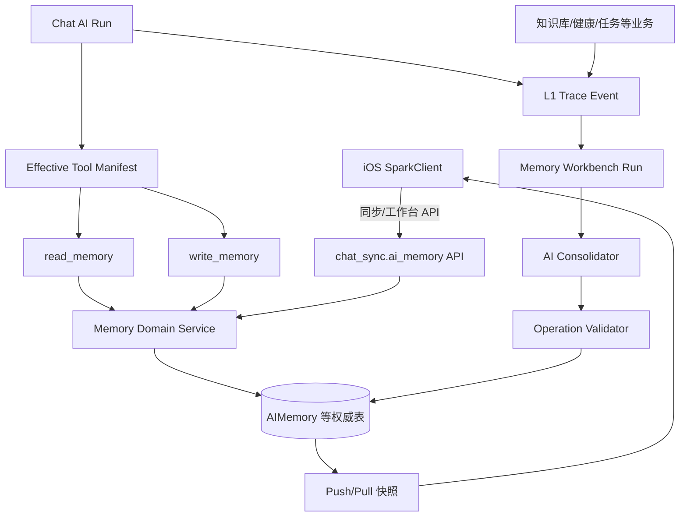

# SparkService 记忆系统与 AI 工具完整需求文档

> 文档状态：待评审
>
> 创建日期：2026-08-27
>
> 范围：SparkService `chat_sync` 服务端、iOS SparkClient、AI Agent 工具、Memory Workbench、跨设备同步。
>
> 约束：本文是目标设计，不代表代码已经实现；本次只创建/维护 Markdown 文档，不修改 Python、Swift、数据库迁移或配置。
>
> 上游模型文档：[`数据模型文档.md`](./数据模型文档.md)

## 1. 目标与结论

### 1.1 目标

建立一套服务端权威、客户端可离线、跨设备最终一致、可审计、可撤销、可被聊天 Agent 安全调用的完整记忆系统，并在业务原则上对齐 DeepTutor：

```text
聊天 Agent 的 Memory Tools
├── read_memory：按需读取长期记忆
└── write_memory：只保存用户明确表达的偏好

Memory Workbench
├── update：从新证据提炼稳定记忆
├── audit：根据证据纠正、删除错误或过期记忆
├── dedup：合并重复记忆
└── merge：整理分组、顺序、引用和结构
```

### 1.2 核心结论

1. 服务端数据库是记忆唯一权威源；客户端 Core Data 是账号隔离的本地镜像、离线 Outbox 和游标。
2. 客户端现有 `save_memory`、`retrieve_memory`、`update_memory` 升级并收敛为 `write_memory`、`read_memory`。不再允许模型通过“原文匹配”更新记忆。
3. `write_memory` 只写 `L3/preferences`，只处理用户明确表达的语言、格式、称呼、回答深度等偏好；不得推断健康事实、身份事实或长期画像。
4. `read_memory` 由服务端执行，只读取当前账号/成员有权访问且已确认、有效的 L3 记忆；不是每轮必调，也不是纯事实问题的固定前置步骤。
5. 其他长期记忆只能通过 Memory Workbench，从 L1 证据生成 L2，再由 L2 综合生成 L3。
6. 所有工作台任务、同步任务和索引任务异步执行；失败不阻断聊天、启动、登录、首页或知识库同步。
7. 多设备冲突以服务端快照为准；客户端不得生成冲突副本，也不得用新 UUID 重新上传被服务端覆盖的旧内容。
8. 记忆首期不使用向量作为主数据；结构化过滤、受控分组和 Token 预算足以支持 `read_memory`。后续向量只能作为服务端可删除、可重建的派生索引。

## 2. 当前代码事实与主要差距

### 2.1 iOS 当前事实

| 模块 | 当前代码事实 | 当前状态 | 目标变化 |
| --- | --- | --- | --- |
| 工具枚举 | `SparkToolName` 包含 `save_memory`、`retrieve_memory`、`update_memory` | 已实现，但协议过时 | 替换为 `read_memory`、`write_memory` |
| 工具 Schema | 保存只收 `content`；读取收 `keyword`；更新收原文和新文本 | 已实现，但不符合 DeepTutor | `read_memory` 无参数；`write_memory` 使用 `op/text/target_id/reason` |
| 工具执行 | `ToolHub` 在客户端直接执行三个记忆工具 | 已实现 | 服务端 AI Run 下由服务端 Registry 执行；客户端只消费结果与同步数据 |
| 记忆存储 | `MemoryRecordEntity` 仅有标题、正文、置顶、创建/更新时间 | 已实现，但仅本地 | 升级为服务端快照镜像、revision、墓碑、同步状态 |
| 记忆设置 | UserDefaults 保存 `isEnabled` 等设置 | 已实现，但不跨设备 | 服务端 `AIMemorySettings` 为权威，UserDefaults 只作启动缓存 |
| 自动读取 | 发送消息前按用户问题检索本地记忆并注入 Prompt | 已实现 | 服务端 `read_memory` 按需调用；停止客户端无条件预注入 |
| 去重/冲突 | 保存直接插入；更新通过标题或正文精确匹配 | 有明显风险 | 稳定 ID、`normalized_key`、`dedup_key`、revision、幂等回执 |

客户端证据：

- `SparkToolName`：`LookHealthClient/SparkClient/SparkClient/Projects/Core/AIRuntime/ToolHub/Models/ToolingModels.swift`
- 工具路由：`.../Core/AIRuntime/ToolHub/ToolHub+Routing.swift`
- 三个现有记忆执行器：`.../ToolHub/Executors/ToolHubSaveMemory.swift`、`ToolHubRetrieveMemory.swift`、`ToolHubUpdateMemory.swift`
- 本地存储：`.../Features/Memory/Infrastructure/CoreDataMemoryRepository.swift`
- 自动 Prompt 注入：`.../Features/Chat/Application/SendChatMessageUseCase.swift`
- 工具设置页：`.../Features/AISettings/Presentation/Preferences/AIToolSettingsView.swift`

### 2.2 SparkService 当前事实

| 模块 | 当前代码事实 | 当前状态 | 目标变化 |
| --- | --- | --- | --- |
| 工具 Registry | 注册 `ask_user`、知识库、成员、资料和部分客户端工具 | 已实现 | 增加 `read_memory`、`write_memory` 服务端工具 |
| ToolPolicy | 当前只允许 `risk=read_only`、`side_effect=none` | 阻塞写工具 | 扩展受控写入策略，但只开放明确列入白名单的记忆偏好写入 |
| Effective Manifest | 根据场景、模型、上下文、线程设置过滤工具 | 已实现 | 增加 `has_memory` 和 Memory Settings 挂载条件 |
| 工具执行 | 有 Schema 校验、超时、重试、结果预算和同 Run 去重 | 已实现 | 复用；为 `write_memory` 增加数据库级幂等和审计 |
| 上下文快照 | Run 冻结 `tool_manifest`、`sources`、Token 预算 | 已实现 | 在 `sources` 保存使用过的 memory 引用，不复制正文 |
| 记忆模型/API | 当前没有权威记忆模型与接口 | 未实现 | 新增 `ai_models/memory.py` 与 `ai_memory` 业务模块，不新增 Django app |
| 异步执行 | Chat Run、知识索引使用 Celery | 已实现基础设施 | Workbench Run 与记忆维护任务复用 Celery、状态持久化和事件重放思路 |

服务端证据：

- Registry：`chat_sync/ai_runtime/tools/registry.py`
- Policy：`chat_sync/ai_runtime/tools/policy.py`
- Manifest：`chat_sync/ai_services/effective_tool_manifest_service.py`
- Context：`chat_sync/ai_services/context/context_builder.py`
- Executor：`chat_sync/ai_runtime/tools/executor.py`
- Dispatcher：`chat_sync/ai_runtime/tools/dispatcher.py`
- Run 持久化：`chat_sync/ai_models/run.py`、`chat_sync/ai_models/tool.py`

### 2.3 DeepTutor 可复用原则与不照搬内容

| DeepTutor 设计 | SparkService 采用 | SparkService 不照搬 |
| --- | --- | --- |
| L1 Trace、L2 surface、L3 slots | 保留三层语义和证据升级路径 | 不使用用户目录和 Markdown 作为权威存储 |
| `write_memory` 仅保存显式偏好 | 完整保留 | 不扩大成健康/身份事实自动写入 |
| `read_memory` 读取 L3 四类记忆 | 保留四类槽位与按需调用 | 不返回无限文本；增加权限、Token 预算和成员作用域 |
| update/audit/dedup/merge | 保留工作台模式 | 使用数据库事务、Run/Event、ChangeSet，而非文件覆盖 |
| AI 生成操作、代码校验并应用 | 完整保留 | AI 不直接写数据库、不决定权限、不生成任意引用 |
| 断线后运行继续，事件可重放 | 完整保留 | 复用 SparkService Celery/HTTP/SSE 或轮询体系 |

## 3. 目标架构



### 3.1 服务端目录建议

不新增 Django app，继续集成在 `chat_sync`：

```text
chat_sync/
├── ai_models/
│   └── memory.py                    # 所有记忆模型集中在一个文件
├── ai_memory/
│   ├── __init__.py
│   ├── urls.py
│   ├── errors.py
│   ├── api/
│   │   ├── serializers.py
│   │   └── views.py
│   ├── services/
│   │   ├── memory_query_service.py
│   │   ├── memory_command_service.py
│   │   ├── memory_sync_service.py
│   │   ├── memory_context_service.py
│   │   ├── memory_trace_service.py
│   │   ├── memory_run_service.py
│   │   ├── memory_operation_service.py
│   │   └── memory_consolidator.py
│   └── tests/
├── ai_runtime/tools/adapters/
│   ├── read_memory.py
│   └── write_memory.py
└── ai_tasks/
    └── memory_tasks.py
```

模型仍由现有 Django 模型发现入口导入；不在 `chat_sync/models.py` 内直接堆放模型类定义。

### 3.2 分层职责

| 层 | 职责 | 禁止事项 |
| --- | --- | --- |
| API/View | 鉴权、Serializer、响应包裹、request ID | 不直接拼 SQL，不复制领域状态机 |
| Domain Service | 权限、状态迁移、revision、去重、服务端胜出规则 | 不信任客户端 `user_id/scope_key/hash` |
| Tool Adapter | 定义 Schema，将 Run 上下文交给领域服务 | 不绕过领域服务写模型 |
| Consolidator | 调用模型生成受限 operations | 不直接保存模型输出 |
| Operation Validator | 校验引用、目标 ID、长度、冲突和批次原子性 | 不接受未知 operation/section/ref |
| Sync Service | mutation 幂等、ACK、快照、Pull 游标 | 不使用客户端时间决定胜负 |
| Client Repository | 本地镜像、Outbox、Cursor、页面状态 | 不成为业务权威源 |

## 4. 记忆定义、分层和业务规则

### 4.1 什么可以成为记忆

| 类型 | 示例 | 进入方式 | 是否需确认 |
| --- | --- | --- | --- |
| 显式回答偏好 | 中文、简洁、先结论后解释 | `write_memory` 或手工编辑 | 用户原话可直接确认 |
| 稳定个人事实 | 长期所在城市、职业背景 | Workbench update | 默认需证据；敏感事实需确认 |
| 成员事实 | 某成员饮食偏好 | Workbench update/业务事实 | 健康/身份类需确认 |
| 近期目标 | 近期准备复查、执行训练计划 | Workbench update，带到期时间 | 按来源决定 |
| 知识范围 | 对某主题熟悉/陌生 | L2 多次证据后汇总到 L3 scope | 不允许单轮下结论 |
| 长期画像 | 反复出现的表达或交互规律 | 多 surface 综合 | 必须有多证据或多 surface |

以下内容不得直接成为长期记忆：

- 完整聊天全文；
- 单轮寒暄、情绪或随口表述；
- 模型没有证据的猜测；
- 医疗诊断结论或风险判断；
- API Key、Token、密码、验证码、证件号等凭证；
- 知识库原文件或工具完整敏感返回；
- 已拒绝、已删除、已过期或未确认的敏感候选。

### 4.2 三层语义

| 层 | SparkService 表达 | 输入 | 输出/消费者 |
| --- | --- | --- | --- |
| L1 | `AIMemoryTraceEvent` + 原业务实体引用 | chat、knowledge、health、task、手工操作 | Workbench update/audit |
| L2 | `AIMemory(layer=L2, document_key=surface)` | 单 surface 的 L1 证据 | L3 update、工作台 |
| L3 | `AIMemory(layer=L3, document_key=slot)` | 多个 L2 或显式偏好 | `read_memory`、管理页、跨端同步 |

L3 固定四个 slot：

| slot | 内容 | 自动更新规则 |
| --- | --- | --- |
| `recent` | 最近 1～4 周的重要目标、阶段和变化 | 可由 Workbench update/audit |
| `profile` | 稳定用户画像、背景和长期模式 | 至少两条独立证据；敏感内容确认后生效 |
| `scope` | 用户知识/能力范围与熟悉度 | 不允许由单轮对话生成绝对判断 |
| `preferences` | 用户明确表达的语言、格式、称呼、回答方式 | 只允许 `write_memory` 或用户手工操作；禁止自动推断 |

### 4.3 有效记忆条件

```text
is_deleted = false
AND status = active
AND confirmation_status IN (not_required, confirmed)
AND (expires_at IS NULL OR expires_at > server_now)
AND user_id = authenticated_user
AND scope 在当前 Run 允许范围内
```

成员级记忆必须同时满足当前 `member_id` 与成员权限校验。列表页能看见不等于允许进入模型上下文；`read_memory` 必须再次执行权限过滤。

### 4.4 显式偏好判定

`write_memory` 允许的典型语义：

- “以后请用中文回答。”
- “回答尽量简短。”
- “称呼我为小华。”
- “解释报告时先给结论，再给依据。”

禁止写入：

- “你应该喜欢简洁回答。”——模型推测；
- “你可能有高血压。”——医疗判断；
- “今天心情不好。”——短期状态；
- “帮我记住验证码 123456。”——凭证；
- “张三对青霉素过敏。”——健康事实，必须走证据和确认流程。

## 5. 数据模型定稿与调整说明

详细字段见《数据模型文档》。本需求冻结以下模型集合，统一放入 `chat_sync/ai_models/memory.py`：

| 模型 | 必要性 | 核心职责 |
| --- | --- | --- |
| `AIMemorySettings` | 必须 | 跨设备记忆总开关、工具写入、跨会话读取、召回数量、自动整理设置 |
| `AIMemory` | 必须 | L2/L3 权威条目、作用域、revision、墓碑、确认、去重 |
| `AIMemoryEvidence` | 必须 | 条目到 L1/原业务实体的最小证据引用 |
| `AIMemoryTraceEvent` | 必须 | L1 追加式事件，支撑增量提炼和审计 |
| `AIMemoryDocumentState` | 必须 | 每个 L2/L3 文档的 revision、处理游标、运行锁 |
| `AIMemoryMutationReceipt` | 必须 | 客户端 Push 和工具写入幂等回放 |
| `AIMemoryRun` | Workbench 必须 | update/audit/dedup/merge 持久化运行 |
| `AIMemoryRunEvent` | Workbench 必须 | 进度事件、断线重放、结果日志 |
| `AIMemoryChangeSet` | Workbench 必须 | 原子变更和撤销 |
| `AIMemoryIndexState` | 后续可选 | 语义索引状态；不是主数据，不同步客户端 |

### 5.1 对原数据模型的修正

| 原设计问题 | 修正 |
| --- | --- |
| 把账号/成员统一描述为 UUID | 当前工程账号和成员均为整数；线程为 UUID |
| `scope_key` 写入 `account:<user_id>` | 改为 `account`，账号始终由 `user_id` 隔离，避免重复和泄漏 |
| 同时存在 `subject_type/subject_id` 与 member/agent/thread 字段 | 删除重复 subject 字段，避免出现两个事实来源不一致 |
| 没有 L2/L3 字段 | 增加 `layer/document_key/section_key`，明确 DeepTutor 语义映射 |
| 客户端设置仅 UserDefaults | 增加服务端 `AIMemorySettings` 和本地镜像 |
| 只有 Evidence，没有增量 Trace/处理游标 | 增加 `AIMemoryTraceEvent` 和 `AIMemoryDocumentState` |
| 没有 Workbench Run/事件/撤销 | 增加 Run、RunEvent、ChangeSet |
| 更新通过原文匹配 | 改为稳定 `target_id`、revision 和服务端去重键 |

### 5.2 数据唯一性

有效槽位身份：

```text
user_id + scope_key + layer + document_key + memory_type + normalized_key
```

由服务端计算 `dedup_key`。有效条目保留 dedup key；删除/替代条目可将 dedup key 置空，以支持 MySQL 保留历史和墓碑。

### 5.3 向量设计

首期不为普通 `preferences/profile/scope/recent` 建向量，理由：

1. L3 记录数量应受限，结构化查询成本低；
2. 四个 slot 可直接按优先级与 Token 预算裁剪；
3. 向量增加删除、模型版本、隐私和重建复杂度；
4. 记忆是权威事实，不应由相似度替代作用域和确认条件。

后续只有当单账号有效自由文本记忆显著增长、结构化召回效果不足时，才增加 `AIMemoryIndexState`。Embedding 不同步客户端，删除墓碑必须先从查询层排除，再异步清理向量。

## 6. AI 工具协议

### 6.1 工具名称迁移

| 当前客户端工具 | 目标工具 | 处理 |
| --- | --- | --- |
| `save_memory` | `write_memory` | 替换，不保留长期双写 |
| `retrieve_memory` | `read_memory` | 替换；目标工具无参数 |
| `update_memory` | 合并到 `write_memory(op=edit)` | 删除独立工具 |

发布期可在客户端解析层短暂识别旧名称并标记 Deprecated，但服务端新 Manifest 只发布新名称；不得让模型同时看到新旧工具。

### 6.2 `read_memory`

目标：读取当前 Run 可见的 L3 长期记忆，供模型调整语气、深度、示例和上下文。

OpenAI-compatible Schema：

```json
{
  "type": "function",
  "function": {
    "name": "read_memory",
    "description": "读取用户长期记忆，包括近期情况、稳定画像、知识范围和明确偏好。仅在个性化回答确有帮助时调用；纯事实问题或无关问题不要调用。",
    "parameters": {
      "type": "object",
      "properties": {},
      "additionalProperties": false
    }
  }
}
```

工具不接收 `keyword/user_id/member_id/limit`：

- `user_id` 来自认证和 `ToolExecutionContext`；
- `member_id` 来自当前 Chat Thread/Run；
- limit、Token 预算和 slot 选择由服务端策略决定；
- 模型不能扩大作用域或读取其他成员。

服务端输出建议：

```text
# Recent
- [m_xxx r3] 用户近期在准备复查。

# Profile
- [m_xxx r2] 用户偏好先看结论。

# Scope
- [m_xxx r1] 用户熟悉基础营养概念。

# Preferences
- [m_xxx r4] 回答默认使用中文。
```

约束：

- 最多返回 `min(settings.max_recall_count, 20)` 条；
- 单条正文最多 240 字；
- 默认结果预算 1,600 tokens，硬上限 2,000 tokens；
- 优先级建议：`preferences > current member profile > recent > scope > account profile`；
- 同一 normalized key 只返回最高 revision；
- 返回前再次排除删除、过期、未确认、无权限条目；
- ToolResult metadata 只记录 ID、revision、slot、数量、截断标志，不记录敏感正文到普通日志。

### 6.3 `write_memory`

目标：保存或编辑用户明确表达的长期偏好，仅写 `L3/preferences`。

Schema：

```json
{
  "type": "function",
  "function": {
    "name": "write_memory",
    "description": "仅当用户明确表达长期回答偏好时保存或编辑记忆。不得推测，不得保存医疗判断、身份推断、短期情绪或凭证。",
    "parameters": {
      "type": "object",
      "properties": {
        "op": {
          "type": "string",
          "enum": ["add", "edit"]
        },
        "text": {
          "type": "string",
          "minLength": 1,
          "maxLength": 240
        },
        "target_id": {
          "type": "string",
          "maxLength": 64
        },
        "reason": {
          "type": "string",
          "maxLength": 160
        }
      },
      "required": ["op", "text"],
      "additionalProperties": false
    }
  }
}
```

参数规则：

| 参数 | add | edit | 规则 |
| --- | --- | --- | --- |
| `op` | 必填 | 必填 | 只允许 `add/edit` |
| `text` | 必填 | 必填 | trim 后 1～240 字；保留用户原意 |
| `target_id` | 禁止/忽略 | 必填 | 只能指向当前用户有效的 `L3/preferences` 条目 |
| `reason` | 可选 | 可选 | 仅工作台审计显示，不进入模型长期上下文 |

执行规则：

1. 检查 `AIMemorySettings.is_enabled=true` 且 `allow_tool_write=true`。
2. 校验当前工具确实来自本 Run 的冻结 Manifest。
3. 根据 `ChatToolCall.execution_key` 或稳定 tool call ID 生成服务端 mutation 幂等键。
4. 写入一条 `AIMemoryTraceEvent(surface=chat,event_type=preference_stated)`。
5. `add` 先按规范化文本和 dedup key 查重；重复时成功返回原条目，不新增。
6. `edit` 锁定目标条目；目标不存在、已删除、非 preferences 或不属于当前用户时拒绝。
7. 在同一数据库事务中更新 `AIMemory`、Evidence、DocumentState revision、MutationReceipt 和 ChangeSet。
8. 返回稳定机器结果，不把数据库异常或敏感内容原样返回模型。

成功结果建议：

```json
{
  "ok": true,
  "action": "added | edited | duplicate",
  "entry_id": "uuid",
  "revision": 3,
  "deduplicated": false
}
```

### 6.4 工具挂载规则

```text
Memory 总开关关闭
  → read_memory、write_memory 均不挂载

Memory 开启 + allow_tool_write=true
  → write_memory 默认挂载

Memory 开启 + allow_cross_thread_recall=true + 存在可见有效 L3
  → read_memory 条件挂载
```

模型、功能开关、场景和线程白名单仍需通过现有 Effective Tool Manifest。目标逻辑：

```text
场景候选 + Memory 自动挂载候选
    → Registry 存在
    → 模型支持 tools
    → CHAT_AI_AGENTIC_TOOLS_ENABLED
    → Memory Settings
    → 当前账号/成员存在可见数据
    → ToolPolicy
    → 冻结到 ChatTurnContextSnapshot.tool_manifest
```

### 6.5 ToolPolicy 必要调整

当前 `ToolPolicy.validate()` 只允许只读、无副作用工具，无法合法注册 `write_memory`。建议扩展为受控枚举：

| 工具 | target | execution_mode | risk | side_effect | timeout | max_attempts |
| --- | --- | --- | --- | --- | --- | --- |
| `read_memory` | server | immediate | personal_data_read | none | 5s | 1 |
| `write_memory` | server | immediate | personal_data_write | memory_write | 8s | 1 |

安全边界：只允许 Registry 明确登记的副作用组合；不能把 Policy 放宽为任意字符串，也不能因此允许其他写工具绕过用户确认、权限或幂等规则。

### 6.6 工具调用失败语义

工具失败只影响当前工具结果，不回滚用户消息、不阻断 Run 的可恢复路径：

| 错误码 | 含义 | retryable | 模型行为 |
| --- | --- | --- | --- |
| `memory_disabled` | 用户关闭记忆 | 否 | 正常回答，不再尝试 |
| `memory_write_not_allowed` | 禁止工具写入 | 否 | 正常回答，不声称已保存 |
| `memory_invalid_preference` | 不是可保存偏好或内容不合法 | 否 | 不写入；必要时告知用户 |
| `memory_target_not_found` | edit 目标不存在 | 否 | 不自动 add，避免重复 |
| `memory_target_conflict` | 目标已变化 | 否 | 以服务端为准，可重新读取后再决定 |
| `memory_duplicate` | 已存在等价偏好 | 否 | 视为成功，不重复调用 |
| `memory_unavailable` | 临时存储错误 | 是 | 继续回答，日志记录 request ID |

## 7. Memory Workbench

### 7.1 产品职责

Memory Workbench 是记忆管理和 AI 整理入口，不是聊天页的一部分。它提供：

- L2/L3 文档概览、条目数量、待处理证据数量；
- 手工创建、编辑、删除、确认、拒绝、置顶；
- update/audit/dedup/merge 异步运行；
- 运行进度、失败原因、取消、断线重连；
- 预览 operations 后应用；
- 最近一次变更撤销；
- Trace/Evidence 的受权限浏览；
- 同步状态和最后同步结果。

### 7.2 四种模式

| mode | 输入 | AI 负责 | 程序负责 | 允许目标 |
| --- | --- | --- | --- | --- |
| `update` | L1 新 Trace 或 L2 新 revision | 提炼稳定事实，生成 add/edit | 引用白名单、长度、重复、冲突、事务 | L2；L3 recent/profile/scope |
| `audit` | 现有条目及其证据 | 判断错误、过期、证据不足 | 验证引用和操作目标，禁止越权 | L2；L3 recent/profile/scope |
| `dedup` | 同一文档的有效条目 | 识别语义重复与合并文本 | 保留稳定 ID、合并证据、处理 revision | L2/L3，包括 preferences |
| `merge` | 同一文档的分组、排序、引用 | 可选生成整理建议 | 确定性整理 section/order/footnote | L2/L3，包括 preferences |

禁止规则：

- `L3/preferences` 不允许 `update` 和自动 `audit`；
- AI 无证据时必须返回空 operations；
- 一条自动生成事实至少有一个当前 chunk 允许的 ref；
- L3 profile/scope 建议至少引用两个 L2 surface，或显式标记为单 surface 限定判断；
- 事实正文不超过 240 字；
- 禁止“完全掌握、一定、总是、从不”等无证据绝对化表达；
- AI 输出只能是受限 JSON operations，不能是 SQL、模型对象或任意字段更新。

### 7.3 Operation 协议

```json
{
  "operations": [
    {
      "op": "add",
      "section_key": "answer_style",
      "normalized_key": "answer.language",
      "memory_type": "preference",
      "text": "回答默认使用中文。",
      "refs": ["trace_uuid"]
    },
    {
      "op": "edit",
      "target_id": "memory_uuid",
      "expected_revision": 2,
      "text": "更新后的内容。",
      "refs": ["trace_uuid"]
    },
    {
      "op": "delete",
      "target_id": "memory_uuid",
      "expected_revision": 3,
      "reason_code": "unsupported_by_evidence"
    }
  ]
}
```

批次规则：

- 默认整批原子应用；任一操作校验失败则整批不落库；
- 预览与应用之间通过 `base_document_revision` 防止并发覆盖；
- 删除使用墓碑；
- edit/delete 目标必须属于本用户、本 layer/document；
- refs 只能来自本次 Run 冻结的允许集合；
- apply 成功后写 ChangeSet，并增加文档 revision；
- 同一文档只允许一个变更型 Run；不同文档可以并行。

### 7.4 Run 状态机

```text
queued → running → preview_ready → applying → completed
   │         │            │            │
   └─────────┴────────────┴────────────┼→ failed
                                      └→ cancelled
```

建议状态：`queued/running/preview_ready/applying/completed/failed/cancelled`。运行失败不改变已存在记忆；只有 `applying` 事务成功后才产生新 revision。

### 7.5 异步与事件重放

- Run 创建后立即返回 `202` 和 `run_id`；
- Celery 执行，不依赖客户端保持连接；
- `AIMemoryRunEvent.sequence` 单调递增；
- 客户端通过 `GET events?since=N` 轮询或 SSE 重放；
- 断线后从最后 sequence 恢复；
- 取消只设置 `cancel_requested_at`，worker 在阶段边界检查；
- 已进入数据库事务的短暂 apply 阶段不强制中断；事务结束后返回最终状态。

## 8. 服务端 API 设计

统一前缀：`/api/v1/ai/memory/`。全部需要登录；响应继续使用项目统一包裹：

```json
{
  "code": 0,
  "msg": "ok",
  "data": {}
}
```

错误必须保留 HTTP 状态、稳定业务 code 和 `data.request_id`。

### 8.1 概览与设置

| Method | Path | 用途 |
| --- | --- | --- |
| GET | `/overview/` | L2/L3 文档状态、条目数、backlog、最近 Run、同步摘要 |
| GET | `/settings/` | 获取权威记忆设置 |
| PATCH | `/settings/` | 通过 `If-Match` revision 修改设置 |

设置 PATCH 示例：

```json
{
  "is_enabled": true,
  "allow_tool_write": true,
  "allow_cross_thread_recall": true,
  "max_recall_count": 5,
  "auto_consolidation_enabled": false
}
```

### 8.2 条目管理

| Method | Path | 用途 |
| --- | --- | --- |
| GET | `/entries/` | 按 layer、document_key、scope、status、cursor 查询 |
| POST | `/entries/` | 用户手工创建；支持 `Idempotency-Key` |
| GET | `/entries/{memory_id}/` | 条目详情与最小证据 |
| PATCH | `/entries/{memory_id}/` | 手工编辑、确认、拒绝、置顶；要求 revision |
| DELETE | `/entries/{memory_id}/` | 逻辑删除；要求 revision |

服务端只允许用户手工直接创建 `L3/preferences` 或明确产品开放的候选；其他 L2/L3 由 Workbench 生成，避免客户端绕过证据规则。

### 8.3 跨端同步

| Method | Path | 用途 |
| --- | --- | --- |
| POST | `/sync/push/` | 批量幂等提交客户端 mutation |
| GET | `/sync/pull/?cursor=&limit=` | 增量拉取完整快照和墓碑 |

Push 请求：

```json
{
  "schema_version": 1,
  "mutations": [
    {
      "mutation_id": "uuid",
      "operation": "create",
      "memory_id": "uuid",
      "base_revision": null,
      "memory": {
        "scope": "account",
        "layer": "L3",
        "document_key": "preferences",
        "section_key": "answer_style",
        "memory_type": "preference",
        "normalized_key": "answer.language",
        "title": "回答语言",
        "content": "回答默认使用中文。",
        "structured_value": {"language": "zh-CN"},
        "source": "user",
        "sensitivity": "normal",
        "is_pinned": false
      }
    }
  ]
}
```

Push ACK：

```json
{
  "results": [
    {
      "mutation_id": "uuid",
      "memory_id": "uuid",
      "status": "accepted | replayed | conflict | error",
      "replayed": false,
      "snapshot": {},
      "resolution": "server_wins",
      "reason_code": null
    }
  ]
}
```

同批单条冲突或非法 mutation 不阻断其他 mutation；每条都有独立 ACK。单条内部必须事务化。

Pull：

```json
{
  "items": [
    {"...": "完整 MemorySnapshot，包括墓碑"}
  ],
  "next_cursor": "opaque",
  "has_more": false,
  "server_time": "ISO-8601"
}
```

建议默认 `limit=100`，允许范围 `1..200`。游标编码 `(server_updated_at, id)`，客户端必须视为不透明字符串。

### 8.4 Workbench API

| Method | Path | 用途 |
| --- | --- | --- |
| POST | `/runs/start/` | 启动 update/audit/dedup/merge |
| GET | `/runs/{run_id}/` | 获取运行快照 |
| GET | `/runs/{run_id}/events/?since=N` | 获取/重放事件 |
| POST | `/runs/{run_id}/apply/` | 应用 preview operations |
| POST | `/runs/{run_id}/cancel/` | 请求取消 |
| POST | `/changes/{change_set_id}/undo/` | 撤销最近变更；需 revision 校验 |

启动请求：

```json
{
  "layer": "L2",
  "document_key": "chat",
  "mode": "update",
  "language": "zh-CN",
  "budget": 40,
  "iterations": null,
  "llm_selection": null,
  "preview_only": true
}
```

约束建议：

- `budget` 表示本次最多生成/检查的 operations 数，默认 40，范围 1～100；
- `iterations` 只用于 dedup，默认 1，最大 3；
- 同用户同 layer/document 同时只能有一个非终态 Run，冲突返回 HTTP 409；
- `preferences + update/audit` 返回 HTTP 405；
- apply 必须携带启动时冻结的 `base_document_revision`。

### 8.5 Trace/Evidence API

| Method | Path | 用途 |
| --- | --- | --- |
| GET | `/traces/` | 按 surface、日期、cursor 查看最小事件 |
| GET | `/entries/{memory_id}/evidence/` | 查看条目证据引用 |

默认不返回完整聊天正文。用户请求查看证据时，通过原业务 API 和权限重新获取；不可把敏感原文复制到通用记忆响应。

### 8.6 业务错误码

| msg/code 标识 | HTTP | 含义 |
| --- | --- | --- |
| `memory_not_found` | 404 | 当前账号不可见或不存在，统一语义避免枚举他人数据 |
| `memory_revision_required` | 428 | 更新/删除缺少 revision |
| `memory_revision_conflict` | 409 | 服务端版本更高，返回权威快照 |
| `memory_mutation_reused` | 409 | 相同 mutation_id 携带不同 request hash |
| `memory_duplicate_key` | 409 或单条 conflict ACK | 业务键冲突，返回权威条目 |
| `memory_tombstoned` | 409 | 目标已删除，服务端墓碑优先 |
| `memory_scope_forbidden` | 403 | 无成员/会话权限 |
| `memory_payload_invalid` | 400 | 字段、枚举、长度或组合非法 |
| `memory_run_busy` | 409 | 同文档已有活动运行 |
| `memory_run_not_applicable` | 405 | preferences 不允许 update/audit |
| `memory_run_failed` | 200 Run 状态/任务终态 | 异步任务失败，不影响其他业务 |

最终数字业务码应在实现前登记到项目统一错误码表；本文冻结稳定字符串标识，不擅自占用数字段。

## 9. 同步业务规则

### 9.1 总原则

- 所有同步异步执行，失败不阻断任何前台流程；
- 应用启动、登录恢复、网络恢复、前台恢复、用户手工重试均可触发；
- 知识库同步和记忆同步使用独立 single-flight、Outbox、Cursor 和日志；互不阻断；
- 服务端快照是冲突最终结果；
- Cursor 只有整页快照全部落地成功后才能推进；
- Push 成功 ACK 必须先应用权威 snapshot，再完成 Outbox；
- 删除是墓碑，不用物理删除代替同步删除。

### 9.2 推荐启动对齐顺序

```text
账号会话恢复完成
  → 启动 MemorySyncCoordinator（不 await 页面启动）
  → 获取账号级 single-flight
  → 将崩溃遗留 sending 恢复为 pending
  → Pull 全部分页并事务落地
  → 丢弃/解决被更高服务端 revision 覆盖的 Outbox
  → Push 剩余 pending/retryable Outbox
  → 应用逐条 ACK 权威快照
  → 再 Pull 一次，收敛服务端去重/工具写入/工作台产生的变化
  → 记录结果并释放 single-flight
```

先 Pull 的原因：用户已确定“冲突以服务端为准”，设备离线期间可能已有其他设备更新或删除。先拿权威版本可以减少无效 Push。新建且服务端不存在的本地记录不会因 Pull 被删除，仍保留 Outbox 等待 Push。

### 9.3 设备 A 创建、设备 B 拉取

```text
设备 A 创建显式偏好
  → 本地 MemoryEntity=pending + Outbox
  → Push mutation_id=M1
  → 服务端事务创建 + Receipt(M1) + revision=1
  → A 应用 ACK，显示 synced

设备 B 登录/启动
  → Pull cursor
  → 收到 MemorySnapshot revision=1
  → 按 memory_id upsert，不创建 Outbox
  → 整页提交后推进 cursor
  → 列表显示 synced
```

### 9.4 防止重复同步的四层机制

| 层 | 机制 | 解决问题 |
| --- | --- | --- |
| 客户端队列 | 每次逻辑变更稳定 `mutation_id`；重试复用 | 网络超时、重启重复发送 |
| 服务端回执 | `UNIQUE(user_id, mutation_id)` + request hash | 同 mutation 重放不重复执行 |
| 业务实体 | 稳定 `memory_id` + revision | 多端针对同一实体更新 |
| 语义槽位 | 服务端 `dedup_key` + 规范化文本重复检测 | 不同 UUID 创建等价偏好 |

现有 `ChatToolCall` 的同 Run 参数去重只能减少模型重复调用，不能替代数据库幂等回执，因为 worker 重启、Run 恢复和跨请求重放仍可能再次执行。

### 9.5 冲突矩阵

| 本地状态 | 服务端状态 | 结果 |
| --- | --- | --- |
| pending update，服务端 revision 相同 | 有效 | 正常更新，revision+1 |
| pending update，服务端 revision 更高 | 有效 | 服务端快照覆盖；Outbox discarded；本地 `resolved_by_server` |
| pending update，服务端已删除 | 墓碑 | 墓碑覆盖，停止重试 |
| pending create，服务端同 ID 已存在 | 有效 | request 等价则回放/接受服务端快照；不等价则 conflict |
| pending create，不同 ID 但 dedup key 相同 | 有效 | 返回现有权威条目；本地 ID 映射/替换，不创建副本 |
| 本地 synced，Pull 收到更高 revision | 有效/墓碑 | 直接应用 |
| Pull 收到 revision ≤ 本地 last_synced_revision | 任意 | 幂等忽略，但仍可记录 cursor 进度 |

### 9.6 重试计算

建议指数退避并加 0～25% jitter：

```text
delay = min(15分钟, 2^attempt × 5秒) + jitter
```

建议序列约为：5s、10s、20s、40s、80s、160s、320s、640s、900s。401 先走现有 Token refresh 单飞；刷新明确失效后停止同步并等待重新登录。400/403/409 中不可自动修复的错误标为 permanent/resolved，不无限重试。

### 9.7 客户端同步状态展示

列表卡片显示：

| sync_state | 标识 | 用户操作 |
| --- | --- | --- |
| `pending/syncing/local_only` | 同步中 | 无需阻断编辑，可查看状态 |
| `synced` | 已同步 | 默认弱化显示 |
| `failed_retryable` | 同步失败，可重试 | 提供“重试” |
| `failed_permanent` | 需要处理 | 展示稳定说明，不显示服务端原始异常 |
| `resolved_by_server` | 已按云端版本恢复 | 一次性提示，确认后转 synced |
| 墓碑 | 不显示普通卡片 | 管理页可在短期“最近删除”查看 |

## 10. 客户端改造方案

### 10.1 工具层

需要调整：

1. `SparkToolName` 删除/废弃三个旧记忆工具，新增 `readMemory = "read_memory"`、`writeMemory = "write_memory"`。
2. `ToolHub+Schema`、`AIToolSettingsView.ChatToolSchemaCatalog` 使用第 6 章 Schema。
3. 删除 `ToolHubRetrieveMemory` 的 keyword 参数和本地检索执行路径。
4. 删除 `ToolHubUpdateMemory` 的原文匹配更新路径。
5. 服务端 AI Run 模式下，记忆工具不作为客户端 capability 上报，也不进入 `WAITING_FOR_CLIENT_TOOL`；它们是 `target=server`。
6. 如果保留纯本地模型模式，必须显式定义为离线降级能力，不能与云端工具同名同时提供；建议首期不支持离线模型写长期记忆。

### 10.2 领域模型和 Core Data

当前 `MemoryRecord` 应升级为 `MemoryEntry`，至少包含：

```text
id, accountID, scope, memberID, threadID,
layer, documentKey, sectionKey, memoryType, normalizedKey,
title, content, structuredValue, isPinned, sortOrder,
source, confirmationStatus, sensitivity, status, expiresAt,
revision, isDeleted, deletedAt, serverUpdatedAt,
lastSyncedRevision, syncState, lastSyncErrorCode
```

新增：

- `MemorySyncOutboxEntity`
- `MemorySyncCursorEntity`
- `MemorySettingsEntity`

旧 `MemoryRecordEntity` 不直接自动上传。用户已要求直接适配最新模型；若不做旧数据迁移，数据库迁移只创建新结构并清除旧工具自动注入入口。是否保留旧记忆供本机只读查看列入待确认项。

### 10.3 Repository/Application

建议职责：

```text
MemoryRepository
├── observeEntries(filter)
├── applyServerSnapshots(items)
├── enqueueMutation(command)
├── markMutationResult(ack)
├── loadSettings/applySettingsSnapshot
└── load/saveCursor

MemoryRemoteDataSource
├── pushMutations
├── pullChanges
├── getOverview
├── list/update/deleteEntry
└── start/get/cancel/applyWorkbenchRun

MemorySyncCoordinator
├── startForAccount
├── syncNow
├── handleNetworkRecovery
├── handleForeground
└── cancelForAccount
```

页面/ViewModel 不直接操作 Core Data 或 HTTP。

### 10.4 删除客户端自动 Prompt 注入

当前 `SendChatMessageUseCase.systemPromptWithRelevantMemory()` 在请求发送前检索本地记忆并拼入 system prompt。目标模式下应停用，原因：

- 会绕过服务端权限、确认状态和墓碑；
- 多设备本地数据可能过期；
- 与 `read_memory` 重复，增加 Token 和行为不确定性；
- 服务端无法在 Context Snapshot 中准确审计实际使用的记忆。

目标由服务端 `read_memory` ToolResult 进入 Agent transcript，并把 memory ID/revision 写入 Context Snapshot source refs。

### 10.5 设置页和工作台 UI

设置页需要区分：

- 记忆总开关；
- 允许 AI 保存明确偏好；
- 允许跨会话读取；
- 最大召回条数；
- 自动整理开关；
- 进入 Memory Workbench；
- 最近同步结果。

工具详情页应显示：

- `read_memory`：服务端执行、条件挂载、只读、个性化用途；
- `write_memory`：服务端执行、自动挂载、受控个人数据写入；
- 禁止继续展示旧三个工具为可用工具。

## 11. 服务端改造方案

### 11.1 模型与迁移

- 在 `chat_sync/ai_models/memory.py` 集中定义第 5 章模型；
- 在 `chat_sync/ai_models/__init__.py` 导出；
- 保持现有 Django 模型发现方式；
- 增加唯一约束、Pull 索引、Run/Event 索引；
- 所有账号查询必须先过滤 `user=request.user`；
- 成员作用域必须调用现有 Member 权限服务，不能只判断 `member_id` 存在。

### 11.2 API 与领域服务

- 新建 `chat_sync/ai_memory/` 普通 Python 包，不新增 Django app；
- 总路由挂载 `path('api/v1/ai/memory/', include('chat_sync.ai_memory.urls'))`；
- Serializer 只做形状校验；scope、dedup、revision、权限由领域服务负责；
- Push/Pull 复用知识库同步的游标和 receipt 思路，但模型、错误码、Cursor 独立；
- 写接口统一支持 request ID，日志只记录 ID、状态、数量、耗时和稳定错误码。

### 11.3 Registry 与 Manifest

- `SparkServerToolName` 增加 `READ_MEMORY`、`WRITE_MEMORY`；
- `build_server_tool_registry()` 注册两个 adapter；
- `public_projector` 是否向普通工具目录公开 `write_memory` 需产品确认；即使公开也不能投影正文；
- Effective Manifest 增加 `MemoryMountFlags` 或等价查询结果；
- `write_memory` 属于自动候选，不受普通线程工具开关误关闭，但受 Memory Settings 和服务端总开关；
- `read_memory` 只有存在可见有效 L3 时才加入候选；
- Manifest Hash 和 Context Snapshot 继续冻结本 Run 工具版本。

### 11.4 Context Snapshot

`ChatTurnContextSnapshot.sources` 对每条实际进入模型的记忆只保存：

```json
{
  "source_id": "memory_uuid",
  "type": "memory",
  "version": "revision",
  "content_hash": "hash",
  "metadata": {
    "layer": "L3",
    "document_key": "preferences",
    "scope_key": "account",
    "trimmed": false
  }
}
```

不复制正文，保证用户删除记忆后不会在历史上下文快照中保留第二份敏感全文。

### 11.5 Trace 产生时机

首期建议只接入高价值、低噪声事件：

| 事件 | surface | 产生时机 |
| --- | --- | --- |
| `preference_stated` | chat | `write_memory` 校验通过前后同事务关联 |
| `chat_completed` | chat | Chat Run 成功终态，引用 user/assistant message IDs，不复制全文 |
| `knowledge_used` | knowledge | `search_knowledge_bag` 真正返回引用并被 Run 消费 |
| `memory_confirmed/rejected/deleted` | manual | 用户在工作台操作 |

健康和任务业务事件后续单独接入；未完成敏感信息确认规则前，不自动提炼健康 L2/L3。

### 11.6 异步任务

建议 Celery 任务：

- `run_memory_workbench(run_id)`
- `expire_memories()`
- `purge_memory_receipts()`
- `purge_memory_changesets()`
- `repair_stale_memory_runs()`
- 可选 `index_memory_entry(memory_id, revision)`

任务失败通过 Run/同步状态记录，不抛到用户主业务流程。定时任务需有单次扫描上限和游标，避免全表锁。

## 12. 安全、隐私与审计

1. `user_id` 永远来自认证，客户端 payload 中出现同名字段应拒绝或忽略。
2. 成员记忆必须执行成员绑定和权限校验；不能只按当前账号查询所有 member memory。
3. `write_memory` 不允许健康、身份或凭证类内容；敏感候选必须经 Workbench 确认。
4. Trace/Evidence 默认存引用和 Hash，不复制完整聊天、工具结果或健康报告。
5. 日志禁止记录 memory content、structured_value、工具完整参数、模型完整输出和证据原文。
6. API 错误对“无权限”和“不存在”统一返回不可枚举语义。
7. 用户关闭记忆后立即停止工具挂载和上下文读取；是否同时删除数据必须由独立“关闭”和“清空记忆”操作区分。
8. “清空记忆”应产生墓碑并异步传播，不应直接物理删除而导致离线设备复活旧数据。
9. ChangeSet 的 before snapshot 可能包含敏感内容，必须限期保存、限制访问并纳入清理任务。
10. 后台管理端若后续增加入口，必须复用同一领域服务和审计，不允许直接改表形成第二套规则。

## 13. 性能、预算与容量建议

| 项目 | 建议值 | 说明 |
| --- | --- | --- |
| 单条记忆正文 | ≤240 字 | 对齐 DeepTutor，减少无边界长文本 |
| `read_memory` 默认条数 | 5 | 与当前客户端默认一致 |
| `read_memory` 最大条数 | 20 | 仍受 Token 预算裁剪 |
| `read_memory` 默认预算 | 1,600 tokens | 约 6,400 字符硬截断前预算 |
| Push batch | 50 | 单条独立 ACK，控制事务和响应体 |
| Pull 默认/最大 | 100/200 | 兼顾启动耗时和分页数量 |
| Workbench budget | 默认 40，最大 100 operations | 防止一次模型输出过大 |
| dedup iterations | 默认 1，最大 3 | 避免模型循环不可控 |
| 同文档活动 Run | 1 | 防止并发覆盖 |
| 工具执行尝试 | 1 | 写工具由数据库幂等保护，不在执行器内部盲重试 |
| 墓碑保留 | 待确认，建议 ≥最长支持离线周期 | 例如 180 天，但需产品/隐私确认 |
| mutation receipt | 建议 30～90 天 | 覆盖移动端重试窗口，最终期限待确认 |
| ChangeSet 撤销窗口 | 建议 7 天 | 敏感快照不长期保存 |

## 14. 分阶段实施

### P0：协议和模型冻结

- 评审本文件和《数据模型文档》；
- 确认主键、scope、L2 surface、L3 slot；
- 冻结两个工具 Schema、API path、错误标识、同步 fixture；
- 决定旧客户端本地记忆处理策略。

### P1：服务端权威存储与同步

- 新增 memory.py 模型和迁移；
- 实现 Settings、Entry、Push/Pull；
- 完成服务端胜出、receipt、墓碑和账号/成员隔离测试；
- 暂不接 AI 工具和 Workbench。

### P2：iOS 最新数据模型与启动同步

- 新 Core Data 模型、Repository、Outbox、Cursor；
- 启动/登录/网络恢复异步同步；
- 列表同步标识；
- 设置同步；
- 失败不阻断启动。

### P3：`read_memory` / `write_memory`

- 服务端 Registry、Policy、Manifest、Adapter；
- iOS 工具目录替换旧名称和参数；
- 停止客户端自动 Prompt 注入；
- 记录 Context Snapshot memory refs；
- 完成模型重复调用、Run 恢复和并发幂等测试。

### P4：Memory Workbench

- Trace、DocumentState、Run、RunEvent、ChangeSet；
- update/audit/dedup/merge；
- 预览、应用、取消、重放、撤销；
- iOS 工作台页面和运行状态。

### P5：自动整理与更多 surface

- 在用户开启自动整理后异步触发；
- 接入 knowledge、health、task 等来源；
- 健康/身份候选确认流程；
- 根据真实容量评估是否增加向量索引。

## 15. 测试与验收矩阵

### 15.1 工具验收

1. 无记忆时 Manifest 不包含 `read_memory`，但满足设置时包含 `write_memory`。
2. 有有效 L3 时挂载 `read_memory`；只有候选、删除或过期条目时不挂载。
3. `read_memory` 不接受模型传入账号、成员或 limit。
4. 纯事实问题不强制调用；调用失败仍可完成普通回答。
5. `write_memory(add)` 相同文本重复调用只产生一个有效条目。
6. `write_memory(edit)` 缺少 target_id、越权目标、删除目标均拒绝。
7. 非显式偏好、健康判断、凭证不能写入。
8. 工具正文不进入普通日志和公共工具事件投影。

### 15.2 同步验收

1. 设备 A 创建后，设备 B 启动可拉取相同 memory ID/revision。
2. 同 mutation 重放返回同一 ACK，不新增记录。
3. 同 mutation ID 不同 payload 返回复用错误，不执行。
4. A/B 同时修改时最终都收敛到服务端快照。
5. 删除墓碑能到达长期离线设备，且旧 Outbox 不会复活记录。
6. Cursor 只在整页 Core Data 事务成功后推进。
7. 应用崩溃遗留 sending 状态能恢复为 pending。
8. 知识库同步失败不阻断记忆同步，反之亦然。
9. 未登录、401、刷新失败、网络中断、429、5xx 均有稳定恢复路径。

### 15.3 Workbench 验收

1. update 没有稳定事实时允许空 operations 成功结束。
2. 模型伪造 ref、越权 target、超长文本时整批拒绝。
3. 同文档并发启动第二个 Run 返回 409。
4. 预览后文档 revision 变化，apply 返回冲突且不覆盖。
5. 客户端断线后 Run 继续，重新连接可从 sequence 重放。
6. 取消不会产生半批数据。
7. undo 只能作用于仍匹配目标 revision 的最近 ChangeSet。
8. preferences 的 update/audit 被禁止，dedup/merge 可执行。

### 15.4 安全验收

1. 账号 A 无法通过 ID、Cursor、target_id 或 ref 访问账号 B 数据。
2. 无成员权限时不能读取、创建或同步该成员记忆。
3. API、Celery、工具、同步日志均不输出正文和 structured_value。
4. 用户关闭记忆后新 Run 不挂载工具、不读取 L3。
5. 清空记忆后模型立即不可读取，派生索引清理失败也不影响删除语义。

## 16. 待确认项与推荐答案

| 编号 | 问题 | 为什么必须确认 | 推荐方案 |
| --- | --- | --- | --- |
| Q1 | 旧版客户端本地 `MemoryRecordEntity` 是否保留 | 影响 Core Data 迁移、用户数据预期和去重 | 不自动上传；可只读展示一个版本后清理，或明确直接舍弃 |
| Q2 | 首期是否开放 member 作用域手工创建 | 涉及成员权限和健康敏感内容 | 首期只开放 account preferences；member 先只支持受控候选和确认 |
| Q3 | `agent` 作用域用什么稳定实体 | 当前未发现稳定 Agent 模型 | 首期关闭，待 Agent 模型冻结后再启用 |
| Q4 | 自动整理默认是否开启 | 会产生模型调用成本和隐私预期 | 默认关闭，由用户主动开启；手工作台始终可用 |
| Q5 | 工作台首期放 iOS、Web 还是两端 | 影响 API 事件形式与 UI 排期 | 先实现通用 HTTP + events since；iOS 先轮询，后续可升级 SSE |
| Q6 | 删除墓碑保留多久 | 影响长期离线设备能否正确忘记 | 至少覆盖最长支持离线周期，建议先按 180 天评审 |
| Q7 | receipt 保留多久 | 影响重复提交保护和存储成本 | 30～90 天；移动端不得在此窗口后重放旧 mutation |
| Q8 | `read_memory` 是否向模型暴露 entry ID/revision | edit 需要稳定 target_id，但也会增加模型可见元数据 | 暴露短 ID/UUID 与 revision，不暴露内部用户或设备信息 |
| Q9 | 是否允许用户在工作台直接编辑 profile/scope/recent | 影响证据一致性 | 允许，但标记 `source=user`、写 ChangeSet；无需 AI 证据但保留审计 |
| Q10 | 是否首期接健康 L1 | 健康信息敏感、误记风险高 | 首期不自动提炼；先完成确认、权限和删除链路 |
| Q11 | `write_memory` 是否需要额外弹窗确认 | DeepTutor 不要求，频繁确认会破坏体验 | 明确偏好直接保存；首次开启工具写入时做总授权，工作台可撤销 |
| Q12 | 关闭记忆是否同时删除数据 | 这是完全不同的隐私语义 | 分成“关闭记忆”和“清空全部记忆”两个操作 |
| Q13 | `merge` 是否调用 LLM | 影响成本和可重复性 | 首期使用确定性分组/排序/脚注整理；只有语义合并交给 dedup |
| Q14 | 是否现在引入向量 | 影响模型、索引、删除和运维复杂度 | 首期不引入；用指标证明结构化召回不足后再做 ADR |

## 17. 完成定义

只有同时满足以下条件，记忆系统才能标记为“完善并对齐 DeepTutor”：

- 服务端权威模型、设置、Push/Pull、墓碑和幂等已上线；
- iOS 使用最新模型、独立 Outbox/Cursor，并在启动异步对齐；
- 旧三个记忆工具不再出现在模型 Manifest；
- `read_memory`、`write_memory` 参数、挂载、权限和审计全部通过测试；
- 客户端不再从本地数据库绕过服务端自动注入记忆；
- Workbench 四种模式有持久化 Run、事件重放、预览应用、取消和撤销；
- L1→L2→L3 有真实证据链，preferences 不被自动推断；
- 设备 A/B 创建、更新、删除、冲突、离线恢复最终一致；
- 关闭/清空、账号切换、成员权限和日志脱敏均有可验证行为；
- 文档中 Q1～Q14 已决策并回填，不再保留会改变协议的未确认项。

