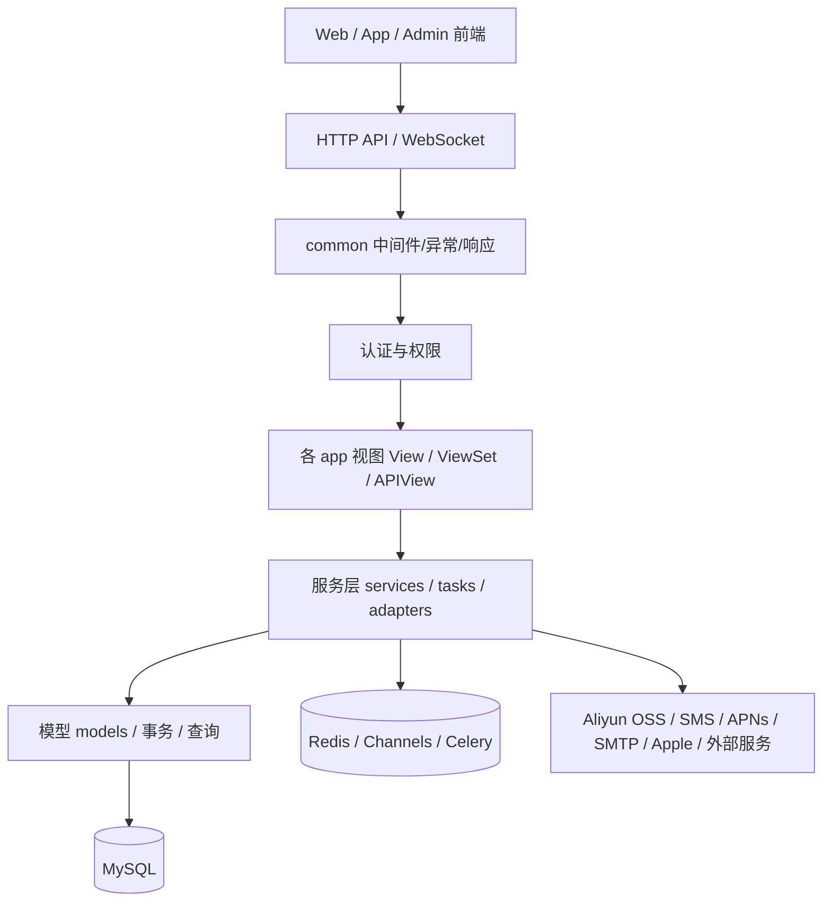
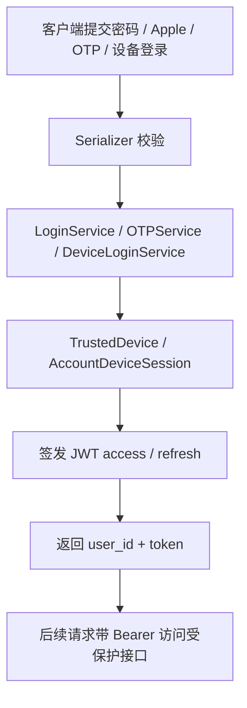

# SparkService 项目汇总

## 1. 文档定位

- 这是 `SparkService` 仓库的总领文档，用来回答“这个项目有哪些真实模块、怎么启动、数据怎么流、哪些地方已经实现、哪些地方还缺口”。
- 事实来源优先级来自代码和配置：`SparkService/settings.py`、`SparkService/urls.py`、`SparkService/asgi.py`、各 app 的 `urls.py` / `views.py` / `models.py` / `tests*.py`，以及现有专项文档。
- 本文只记录能从当前仓库验证到的内容；对未完全确认的部分会明确标成“当前缺口”或“推断”。
- 专项文档导航：
  - `总领文档/医院智能体与医生工作台/医院智能体与医生工作台统一方案.md`
  - `总领文档/医院智能体与医生工作台/服务端数据模型与接口契约.md`
  - `总领文档/医院智能体与医生工作台/医生工作台 Plain Text UI 原型.md`
  - `总领文档/医院智能体与医生工作台/医院后台管理模块 Plain Text UI 原型.md`
  - `总领文档/服务端 AI 对话/服务端 AI 对话需求.md`
  - `总领文档/服务端 AI 对话/AI 对话 Web App 实现工单.md`
  - `总领文档/服务端 AI 对话/AI 对话 Web App Plain Text UI 设计.md`
  - `总领文档/服务端 AI 对话/AI 对话 Web App 源码迁移清单.md`
  - `accounts/账户需求文档.md`
  - `ai_config/AI配置常规变更需求文档.md`
  - `backoffice/docs/BACKOFFICE_WEB_SETUP.md`
  - `backoffice/docs/VBEN_ADMIN_PLAN.md`
  - `LOGGING.md`
  - `需求文档/` 下的账号、通知、医疗档案、Web 前端、安全等工单文档

## 2. 项目概览

### 2.1 项目定位

`SparkService` 是一个围绕健康管理、医疗档案、营养记录、通知投递、AI 配置、聊天同步和后台运营管理构建的多端服务仓库。

从代码看，它至少包含三类面向用户的入口：

- 移动端 / 客户端 API：`accounts`、`medical`、`nutrition`、`file_manager`、`notification_center`、`ai_config`、`content`、`chat_sync`、`task_system`。
- 后台管理 API：`backoffice` 的 `/api/admin/v1/*`。
- Web 前端：`open-web` 面向公开内容与分享页，`backoffice-web` 面向管理端，`chat-web` 面向登录态 AI 对话工作区。

`当前实现`：独立 `chat-web` 已存在，采用 Next.js/React，已有登录门禁、App Shell、可折叠会话侧栏、Thread/Message 同步、流式 Block、Composer、右侧活动面板以及单元/视觉测试。医院医生工作台仍是目标设计，计划直接改造这套对话框架。

### 2.2 当前架构形态

当前实现更接近“模块化单体 + REST/WS + 异步任务”的形态，而不是微服务。

判断依据：

- 只有一个 Django 项目根配置 `SparkService/settings.py`、`SparkService/urls.py`。
- 业务按 app 拆分，但共享同一个数据库、认证、日志、Celery、Channels 和配置系统。
- 同一个进程族中同时存在 HTTP、WebSocket 和 Celery 任务入口。
- 前端是两个独立 Vue 3 应用，但都依赖同一套后端服务。

### 2.3 架构原则

- 依赖方向：前端 -> API/WS -> app service -> model/infrastructure -> MySQL/Redis/文件系统/外部服务。
- 单一事实源：账号会话、医疗数据、通知投递、文件关系、AI 配置都由后端模型和服务层统一管理。
- 对话演进边界：`chat_sync` 已同时承载原同步协议与 P1–P5 服务端 AI Run/Provider/统一上下文/Agentic 工具/持久 Interaction 首版；Web 与移动客户端继续共享 Thread/Message/Block，`sync` 负责离线与多端合并，P5 的真实 iOS Executor 接入和生产灰度仍待完成。
- 平台边界：OSS、短信、APNs、SMTP、Redis、Celery、Channels 作为基础设施适配层存在，不直接侵入业务视图。
- 安全边界：JWT、OTP、设备会话、管理员权限、公开分享票据、OSS STS 和内容可信域名都有独立约束。

## 3. 项目目录结构

```text
SparkService/
├── SparkService/
├── accounts/
├── ai_config/
├── app_version/
├── backoffice/
├── backoffice-web/
├── chat-web/
├── chat_sync/
├── common/
├── content/
├── file_manager/
├── medical/
├── notification_center/
├── nutrition/
├── open-web/
├── task_system/
├── zdk_migration/
├── 需求文档/
├── 总领文档/
├── scripts/
├── run/
└── 历史存档/
```

### 3.1 目录职责边界

| 目录 | 职责 | 不应承担的职责 |
| --- | --- | --- |
| `SparkService/` | Django 项目配置、总路由、ASGI/WSGI、Celery 入口 | 业务模型和页面实现 |
| `common/` | 通用异常、响应、日志、请求上下文、中间件 | 领域业务规则 |
| `accounts/` | 登录、设备、会话、OTP、账号身份、注销 | 医疗、营养、内容业务 |
| `medical/` | 成员、病例、档案、处方、用药、归档、共享 | 通知底层协议、前端页面 |
| `nutrition/` | 摄入、消耗、目标、菜谱、搜索、Apple Health 导入 | 医疗档案主流程 |
| `notification_center/` | 通知场景、模板、投递、收据、抑制、审计 | 账号登录本身 |
| `file_manager/` | 文件登记、业务关联、下载 URL、OSS STS | 具体医疗或内容业务逻辑 |
| `ai_config/` | AI 场景绑定、Provider、模型目录、试用配置 | 具体 AI 业务调用编排 |
| `chat_sync/` | 聊天线程、消息、块级同步、WebSocket 推送 | 医疗/通知/账号主模型 |
| `task_system/` | 任务、子任务、执行、通知、AI 候选分析 | 通知底层投递和账号认证 |
| `content/` | 文章、标签、分类、公开阅读、后台编辑 | 医疗数据模型 |
| `backoffice/` | 管理端 API、RBAC、审计、统计、运营、任务监控 | 客户端登录 API |
| `backoffice-web/` | 后台管理 Vue 前端 | 公开内容页 |
| `chat-web/` | 登录态 Next.js AI 对话工作区、会话侧栏、流式消息、Composer 和上下文面板 | 平台后台管理；医院医生权限尚未实现 |
| `open-web/` | 公开内容与分享 Vue 前端 | 管理端能力 |
| `zdk_migration/` | 历史数据迁移脚本 | 在线业务请求 |
| `需求文档/` | 需求和工单沉淀 | 运行时代码 |
| `总领文档/` | 总领与专项文档 | 业务代码 |

## 4. 应用分层与依赖方向



- 允许的依赖：`views -> services -> models/infrastructure`，以及 `tasks -> services`。
- 不推荐的依赖：业务视图直接调用外部 SDK，或让前端绕过服务层直连数据语义。
- 共享层只提供横切能力，不持有业务状态。

## 5. 应用启动与全局生命周期

### 5.1 启动链路

```text
manage.py / ASGI / WSGI / Celery
  -> `SparkService/settings.py` 读取 `.env`
  -> 安装 app、middleware、DRF、Channels、Celery、CORS、日志
  -> `SparkService/urls.py` 分发 HTTP 路由
  -> `SparkService/asgi.py` 分发 HTTP + WebSocket
  -> 各 app 视图/服务执行业务
  -> 事务、日志、外部服务、缓存/队列、响应返回
```

### 5.2 关键代码

- 入口：`manage.py`
- Django 配置：`SparkService/settings.py`
- 总路由：`SparkService/urls.py`
- ASGI/WebSocket：`SparkService/asgi.py`
- WSGI：`SparkService/wsgi.py`
- Celery：`SparkService/celery.py`
- 请求链路中间件：`common/middleware/request_id_middleware.py`、`common/middleware/request_logging_middleware.py`
- 管理端前端路由：`backoffice-web/src/router/index.ts`
- 登录态对话入口：`chat-web/app/(workspace)/home/[[...threadId]]/page.tsx`、`chat-web/components/chat/home/ChatWorkspace.tsx`
- 公开端前端路由：`open-web/src/app/router.ts`

### 5.3 启动设计要求

- 配置必须由环境变量驱动，`.env` 只是本地/开发注入方式。
- 登录、通知、归档、同步等流程要保持幂等，尤其是 Celery 和 WebSocket 回调。
- 失败时要保留可重试或可追踪的状态，不能只在 UI 层吞掉错误。

## 6. 核心模块地图

| 模块 | 职责 | 关键目录 / 文件 | 上游 / 下游 | 当前实现 / 当前缺口 |
| --- | --- | --- | --- | --- |
| 基础工程与运行环境 | Django 配置、DRF、Channels、Celery、日志、CORS、JWT、静态/媒体、请求 ID | `SparkService/settings.py`、`SparkService/asgi.py`、`SparkService/celery.py`、`common/*`、`LOGGING.md` | 上游：所有 app；下游：MySQL、Redis、文件系统 | `当前实现`：已完成统一配置和日志链路。`当前缺口`：前端和部分 app 的统一观测标准还未完全收敛。 |
| 账号与认证 | 密码登录、Apple 登录、设备登录、OTP、设备登记、会话刷新、注销、身份绑定/变更、停用 | `accounts/auth/*`、`accounts/device/*`、`accounts/otp/*`、`accounts/identity/*`、`accounts/deactivation/*`、`accounts/services/*`、`accounts/models.py` | 上游：客户端/管理端；下游：JWT、外部短信/邮件/Apple、设备会话模型 | `当前实现`：支持多登录方式、设备会话和 OTP。`当前缺口`：复杂账号场景仍依赖较多服务间协作，需持续补齐回归测试。 |
| 医疗档案 | 成员、病例、症状、就诊、手术、随访、体检、检验、处方、用药计划、药箱、成员共享、档案归档 | `medical/models.py`、`medical/views.py`、`medical/urls.py`、`medical/exam_archive_views.py`、`medical/services/*` | 上游：客户端、后台；下游：MySQL、文件附件、通知、任务 | `当前实现`：资源 CRUD、工作流保存、共享/归档/提醒链路齐全。`当前缺口`：模块大且服务众多，横向一致性要靠测试和文档维护。 |
| 通知中心 | 通知场景、模板、意图、渠道投递、收据、抑制、审计、短信/邮件/APNs 适配 | `notification_center/models.py`、`notification_center/services.py`、`notification_center/tasks.py`、`notification_center/business_scenes.py`、`notification_center/urls.py` | 上游：账号、AI、医疗、后台；下游：短信、邮件、APNs、Celery、Redis | `当前实现`：已形成中心化通知枢纽和异步任务。`当前缺口`：跨渠道失败重试、日志和收据修复仍是重点演进面。 |
| 营养管理 | 摄入、消耗、目标、食物、菜谱、收藏、搜索、Apple Health 导入、看板 | `nutrition/models.py`、`nutrition/views.py`、`nutrition/services/*`、`nutrition/tests/*` | 上游：客户端；下游：MySQL、预置数据 | `当前实现`：看板、目标计算、导入、历史查询、搜索已具备。`当前缺口`：与医疗档案的边界需要继续保持清晰。 |
| 文件与 OSS | 文件登记、业务关联、下载 URL、STS 临时凭证、OCR STS | `file_manager/models.py`、`file_manager/views.py`、`file_manager/oss_sts_views.py`、`file_manager/business_access.py`、`file_manager/business_relations.py` | 上游：医疗/内容/后台；下游：Aliyun OSS、STS | `当前实现`：已支持上传凭证与业务绑定。`当前缺口`：可信域名、业务关系和清理策略需要继续围绕安全性维护。 |
| AI 配置与试用 | 场景模型绑定、Provider Key、模型目录、Bootstrap、试用申请、连接测试 | `ai_config/models.py`、`ai_config/views.py`、`ai_config/services.py`、`ai_config/defaults.py` | 上游：客户端和后台；下游：AI Provider、试用审核流程 | `当前实现`：能提供 bootstrap、试用状态和连接测试。`当前缺口`：模型/场景配置变更要保持数据库迁移和前后端同步。 |
| 聊天同步 | 线程、消息、块级消息、推拉同步、头信息、WebSocket 推送 | `chat_sync/models.py`、`chat_sync/views.py`、`chat_sync/routing.py`、`chat_sync/auth.py`、`chat_sync/signals.py` | 上游：客户端和后台；下游：Channels、JWT、消息表 | `当前实现`：HTTP 同步与 WebSocket 通道并存，块级消息有回归测试。`当前缺口`：同步协议复杂，需持续防止 cursor/块更新漂移。 |
| 服务端 AI 对话 | AI Run、粘性/一次性上下文、Capability Router、AgenticChatPipeline、模型网关、流式事件、动态工具与客户端桥接 | `chat_sync/ai_*`、`chat_sync/ai_models/*`、`chat_sync/ai_runtime/*`、`chat_sync/ai_services/*`、`chat_sync/ai_tasks/*`、`ai_config/*`、`medical/services/*`、`file_manager/*`；详见 `总领文档/服务端 AI 对话/服务端 AI 对话需求.md` | 上游：Web/iOS；下游：Celery、Redis、Channels、模型 Provider、业务工具/MCP | `当前实现`：P0–P5 首版与 P6 首个垂直切片（`chat@v1` Manifest、能力发现、延迟工具目录/精确加载/撤销、Run hash 冻结）已落地。`当前缺口`：iOS 原生 Executor 全链路、P3/P4/P5 完整出口验收，以及 P6 深度 Capability/MCP/外部 Provider 与 P7 生产治理。 |
| 任务系统 | 任务、子任务、执行、通知、AI 候选分析、同步接口 | `task_system/models.py`、`task_system/views.py`、`task_system/ai_tools.py`、`task_system/notification_tasks.py`、`task_system/urls.py` | 上游：客户端/AI/后台；下游：通知、医疗、任务数据表 | `当前实现`：任务 CRUD、同步、完成/取消、通知查询接口已存在。`当前缺口`：`task_system/tasks.py` 当前未见独立任务定义，异步侧还不够成型。 |
| 内容与公开分享 | 文章、分类、标签、版本、发布、预览、公开阅读、分享链接、统计 | `content/models.py`、`content/views.py`、`content/admin_urls.py`、`content/urls.py` | 上游：后台编辑器和公开端；下游：MySQL、缓存、附件 | `当前实现`：后台编辑与公开阅读两套入口都已存在。`当前缺口`：公开缓存和内容运营规则还需要持续固化。 |
| 后台管理与运营 | 管理登录、用户、设备、注销、通知、AI、RBAC、审计、内容、医疗数据、聊天、任务监控 | `backoffice/views.py`、`backoffice/urls.py`、`backoffice/medical_data_views.py`、`backoffice/conversation_views.py`、`backoffice/rbac.py`、`backoffice/docs/*` | 上游：管理员前端；下游：各业务 app、Celery、Redis、数据库 | `当前实现`：后台 API 范围很广，前端也已接入关键页面。`当前缺口`：权限粒度和运营视图仍需持续整合。 |
| 版本检查 | 版本配置、检查记录、更新动作 | `app_version/models.py`、`app_version/views.py`、`app_version/urls.py` | 上游：客户端；下游：版本表、检查日志 | `当前实现`：基础版本检查与动作回传已存在。`当前缺口`：独立测试和产品规则文档较少。 |

### 6.1 账号与认证的关键边界

- 当前实现：以 `PasswordLoginView`、`AppleLoginView`、`DeviceLoginView`、`TokenRefreshView`、`DeviceRegisterView`、OTP 请求/验证和账号身份管理串起完整登录链路。
- 关键状态：`TrustedDevice`、`AccountDeviceSession`、`SocialIdentity`、`EmailOTP`、`PhoneOTP`、`AccountDeactivation`、`AccountIdentityVerificationTicket`。
- 失败和恢复：登录失败、token 失效、设备会话被替换、OTP 过期/频控、账号停用都已在服务层显式处理。

### 6.2 医疗档案的关键边界

- 当前实现：`medical/views.py` 里同时存在资源 CRUD、工作流保存、分享票据、公开分享和归档档案分析。
- 关键状态：`MedicalBaseModel` 的 `is_deleted` / `is_archived`，以及成员绑定 `UserMemberBinding`。
- 失败和恢复：成员权限不足、归档对象不存在、附件绑定失败、工作流保存失败都应回滚或返回可识别错误。

### 6.3 通知中心的关键边界

- 当前实现：通知中心把场景、模板、意图、投递、收据、抑制和审计统一到一个中枢，并通过 Celery 周期任务补偿。
- 关键状态：`NotificationIntent`、`NotificationMessage`、`ChannelDelivery`、`DeliveryAttempt`、`NotificationOutbox`、`NotificationSuppression`。
- 失败和恢复：短信/邮件/APNs 失败后必须保留任务和投递记录，以便重试、补偿和排障。

### 6.4 聊天同步与服务端 AI 对话的边界

- `当前实现`：`chat_sync` 持久化 Thread、Message、MessageBlock，并提供游标 Push/Pull；同时已新增 ChatRun/Event/Outbox、Celery 执行、OpenAI-compatible Provider、流式 Block 投影和 Run WebSocket。旧 iOS 本地编排仍未完全迁出。
- `当前实现`：账号服务已提供手机号 OTP、Apple ID、Token 刷新、当前会话和退出接口；Chat Web 应复用 `User/SocialIdentity/AccountDeviceSession`，不新建私有用户体系。
- `建议演进`：Chat Web 首期支持 `+86` 手机验证码和 Apple ID 登录；Apple Web 需额外完成 Service ID、HTTPS Return URL、`state/nonce` 和 audience 配置。
- `当前实现`：ChatRun、RunEvent、Outbox、ToolCall/PendingInteraction/Usage/Checkpoint 模型、纯文本生成、P4 服务端只读 Agentic 和 P5 Interaction pause/resume 首版已存在；Web/iOS 全量切换、P4/P5 完整验收以及 iOS 原生执行仍按后续阶段推进。
- `建议演进`：Thread 保存 Capability、工具开关、知识库/子代理、Persona、模型和语言等粘性配置；附件、聊天/书页/笔记/题库引用随单轮快照固化。
- `建议演进`：工具按“用户开启 + 上下文匹配 + Capability 所有 + Provider 能力 + 权限”动态组合；MCP/外部 App 使用 `load_tools` 渐进装载。
- `落地规格`：专项文档附录 A 已明确 MySQL 单活 Run 锁、REST/WS 契约、Event Envelope、Celery 租约、ContextBuilder 算法、Agent Loop 默认上限、`ask_user`/Client Tool Schema、Outbox 一致性与 BE-CHAT-01–10 工单。
- `迁移规格`：专项文档附录 B 已将 AI 代码划分为 Spark 直接复用、DeepTutor 原文件迁移、方法级部分迁移、仅参考重写和不迁移，并给出 `chat_sync/ai_*` 目标目录及方法映射。
- `阶段计划`：专项文档附录 C 将第一阶段服务端建设拆为 P0–P7，逐阶段列出实现模块、阶段目标、不做范围、出口验收、首次实现归属和可并行工作。
- `建议演进`：新增独立 `chat-web/`，不修改 `open-web` 的公开站职责；完整工单见 `总领文档/服务端 AI 对话/AI 对话 Web App 实现工单.md`。
- `参考实现`：`DeepTutor-main/deeptutor/services/session/turn_runtime.py`、`services/session/context_builder.py`、`agents/chat/agentic_pipeline.py`、`agents/_shared/tool_composition.py`、`runtime/registry/deferred_tools.py`、`services/llm/*`、`core/agentic/tool_dispatch.py`。
- 禁止边界：不能长期维持“Web 服务端生成、iOS 本地生成”两套编排核心；不能把 Provider API Key 继续下发给普通客户端。

### 6.5 医院智能体与医生工作台（目标设计，尚未实现）

- 主体方案：`总领文档/医院智能体与医生工作台/医院智能体与医生工作台统一方案.md`。
- 数据契约：`总领文档/医院智能体与医生工作台/服务端数据模型与接口契约.md`。
- 工作台原型：`总领文档/医院智能体与医生工作台/医生工作台 Plain Text UI 原型.md`。
- 平台后台原型：`总领文档/医院智能体与医生工作台/医院后台管理模块 Plain Text UI 原型.md`。
- 复用边界：继续使用 `accounts.User`、medical 成员、ChatThread/Message/Block、AI Run、AI 配置、知识库、记忆和统一审计；不复制这些模型。
- 患者身份：登录 User 负责认证，当前选中 medical member 就是患者；继续使用 ChatThread.member_id，不新增 Patient 模型。
- 目标增量：医院、科室、医院职工身份、医生档案、医生智能体发布档案、会话医院归属和消息发言归属。
- 服务端边界：目标新增独立 Django App `hospital_care` 统一拥有上述新增实体、患者端医院 API 和医生工作台 API；通过外键/服务复用现有 App，不把医院模型散入 `chat_sync`、`medical` 或 `accounts`。
- 当前缺口：`hospital_care` 尚未创建，上述医院领域尚无代码实现；现有后台会话仅供 SuperAdmin 查看，不等同于医生工作台；挂号也尚未接 HIS。

## 7. 关键业务流程

### 7.1 登录与会话签发



- 触发入口：`accounts/auth/views.py`、`accounts/otp/views.py`、`accounts/device/views.py`。
- 前置检查：鉴权方式、设备会话、bundle/device 维度、OTP 冷却和过期校验。
- 成功状态：用户拿到统一格式 token，并进入后续受保护 API。
- 失败和恢复：token 无效、账号停用、设备会话被替换时返回 401，客户端应清理本地态并重新登录。

### 7.2 医疗档案工作流与归档分析

```text
成员页面 / 后台保存
  -> 权限校验
  -> 组合创建或工作流保存
  -> 病例 / 体检 / 处方 / 用药 / 附件写入
  -> 归档状态同步
  -> 生成成员数据快照与导出结果
```

- 触发入口：`medical/urls.py` 里的 `workflows/*`、`combined-create/`、`members/<id>/exam-archive/*`。
- 参与模块：成员绑定、分享票据、医疗档案模型、归档服务、附件绑定、成员完整数据接口。
- 失败和恢复：权限不足、报告不存在、异常项列表不合法、附件绑定失败都应以事务边界收敛。

### 7.3 通知投递与补偿

```text
业务服务创建通知意图
  -> 生成消息/模板/收件人
  -> 写入 Outbox
  -> Celery relay
  -> 渠道投递（SMS / Email / APNs）
  -> 收据回写 / 查询补偿
  -> 审计与抑制更新
```

- 触发入口：`notification_center/services.py`、`notification_center/tasks.py`、`notification_center/urls.py`、`backoffice/urls.py`。
- 成功状态：消息、渠道投递和收据记录都可追踪。
- 失败和恢复：渠道失败不应直接丢消息，应该保留 outbox/attempt/receipt 供补偿任务修正。

### 7.4 服务端 AI 对话 Run（P1–P5 首版与 P6 chat@v1 垂直切片已落地，P6+ 演进）

```text
Web/iOS 提交用户消息与幂等键
  -> JWT、Thread、成员、附件与健康资源权限校验
  -> 事务创建用户消息、助手占位消息与 ChatRun
  -> Celery Worker 领取 Run
  -> ContextResolver 合并粘性配置、本轮引用、历史和成员权限
  -> Capability Router 选择 Prompt、结果 Schema 和动态工具集
  -> AgenticChatPipeline: 模型 -> 工具 -> 观察 -> 继续/最终回答
  -> ask_user 暂停等待用户，或等待客户端 HealthKit/定位/授权结果
  -> Provider 和工具事件按 sequence 持久化为 RunEvent/MessageBlock
  -> 固化 Usage 与终态
  -> Channels 实时推送 + chat_sync 多端拉取
```

- 失败和恢复：入队失败保留 queued；Provider 按错误分类有限重试；WebSocket 断线不终止 Run；Worker 租约超时由恢复任务收敛。
- 并发和幂等：`user_id + idempotency_key` 唯一；默认一个 Thread 同时一个活动 Run；Run Event 使用严格递增 sequence。

## 8. 数据、状态与持久化

### 8.1 状态分类

| 状态类型 | 示例 | 主要承载位置 |
| --- | --- | --- |
| 瞬时 UI 状态 | 表单 loading、筛选条件、分页游标 | 前端 Vue store / component state |
| 会话状态 | JWT access / refresh、设备会话、管理员登录态 | `accounts`、`backoffice`、前端 local storage / cookie |
| 领域状态 | 成员、病例、营养目标、通知意图、任务状态 | 各 app 的 `models.py` |
| 运行时状态 | Request ID、当前请求日志上下文、WebSocket 连接 | `common/middleware/*`、`chat_sync` |
| AI Run 状态 | queued、running、waiting_for_user_input、waiting_for_client_tool、completed、failed、cancelled、interrupted | 已有 `ChatRun`、`ChatRunEvent`、`ChatToolCall`、`ChatPendingInteraction`；P2 实际使用纯文本相关子集 |
| AI 上下文状态 | Thread 粘性配置、Turn 一次性引用、延迟工具加载集 | 已建 `ChatThreadPreferences`、`ChatTurnContextSnapshot`、`ChatDeferredToolState`；P3 Context 构建与 P6 延迟工具 API 已接入，外部 Provider 语义待补齐 |
| 持久化状态 | MySQL 表、软删除/归档标记、版本记录 | Django ORM 模型 |
| 文件和缓存状态 | 媒体文件、OSS 对象、公开缓存、STS 凭证 | `MEDIA_ROOT`、Aliyun OSS、`file_manager`、`content` |
| 账号/设备级状态 | TrustedDevice、AccountDeviceSession、OTPs、注销流程 | `accounts/models.py` |
| 账号敏感数据 | 密码哈希、refresh token、Apple identity token、短信/邮件验证码、API key | 认证和配置模型、环境变量、外部服务 |

### 8.2 持久化边界

- MySQL 是主业务数据库；仓库里有 `db.sqlite3`，但配置默认指向 MySQL 后端。
- Redis 承担 Celery broker/result backend 和 Channels 层。
- `media/` 和 `staticfiles/` 是本地文件系统持久化位置。
- `file_manager` 负责 OSS STS 和文件登记，`content` 负责公开文章资源，`medical` 负责业务附件和档案引用。

## 9. 关键技术标准

### 9.1 并发与线程安全

- 账号登录、设备会话、归档、通知投递和医疗工作流都依赖事务边界，`transaction.atomic()` 是常见做法。
- WebSocket 与 Celery 都属于异步路径，必须保证幂等和可重放。
- 内容同步、聊天同步、通知补偿都需要稳定的 cursor / 状态机 / 版本号设计。
- 服务端 AI Run 不能依赖单进程内 Task 作为唯一运行事实；应使用数据库状态、租约、幂等键和 Celery Worker，Redis/Channels 只承担分发与实时通知。

### 9.2 错误与恢复

- 统一异常处理通过 `common.exception_handlers.api_exception_handler`。
- 业务层常用 `APIError` 返回结构化错误码。
- OTP、通知、分享、归档和任务同步都需要失败后可重试或可清理，而不是一次性吞掉。

### 9.3 安全

- 认证基线是 JWT，默认 DRF 认证类为 `accounts.auth.authentication.SparkJWTAuthentication`。
- 公开内容、分享链接、OSS STS、Apple 登录、短信、邮件都属于高敏感边界，必须保持 allowlist / token / 时效控制。
- 管理端接口要和普通客户端接口隔离，权限边界落在 `backoffice` 的 `AdminOnlyPermission` 和 RBAC。
- AI Provider Key 必须在服务端使用；`ai_config` Bootstrap 当前仍返回 endpoint/API Key，迁移到服务端推理后必须移除。模型工具不得绕过成员、医疗资源和文件业务权限。

### 9.4 可观测性

- `RequestIdMiddleware` 给请求链路加 request_id。
- `RequestLoggingMiddleware`、`LOGGING.md`、多个 logger 文件把业务、访问、API IO、Celery、通知日志分开。
- `common` 和 `notification_center` 已经体现出按场景分日志文件的治理思路。
- 服务端 AI 对话应统一记录 `request_id/run_id/thread_id/provider/model/stage`，并监控排队时间、首 Token、总耗时、失败率、取消率、工具耗时、Token 与费用。

### 9.5 性能与资源

- `content` 和 `open-web` 有公开缓存和文章阅读时长统计。
- `notification_center` 的 outbox / receipt / poll 任务体现了批量补偿与异步收敛。
- `backoffice-web` 和 `open-web` 都是按需路由加载的 Vue 应用，前端资源分离。

## 10. 测试策略

### 10.1 现有测试

现有测试覆盖面已经不是空白，主要分布在这些模块：

- `accounts/tests_*.py`：身份绑定、设备会话、OTP、Apple 登录、自动试用等。
- `medical/tests*.py`：医疗创建、成员完整数据、共享、处方批量保存、归档、权限、用药提醒等。
- `nutrition/tests/test_apis.py`、`nutrition/tests/test_module.py`：看板、目标、餐食、搜索、Apple Health 导入、缓存。
- `notification_center/tests*.py`：通知中心服务、业务场景、会员试用回退、用户列表。
- `backoffice/tests*.py`：权限、排序、医疗数据、会话等后台能力。
- `chat_sync/tests/`：同步协议、P0 契约、P1 Run API/Service、P2 Provider/runtime/日志脱敏、P3 ContextBuilder 测试。
- `content/tests.py`：内容服务和公开 API。
- `file_manager/tests.py`：OSS STS 接口。
- `ai_config/tests.py`：bootstrap 和多智能体相关能力。

### 10.2 当前测试缺口

- 未发现 `task_system` 的独立测试文件。
- 未发现 `app_version` 的独立测试文件。
- 未发现前端仓库 `open-web` / `backoffice-web` 的自动化测试目录。
- `common` 的测试目前主要集中在异常处理，横切能力仍可继续补。
- 服务端 AI Run、Provider 流式运行时、事件契约、日志脱敏和 P3 ContextBuilder 已有测试；P4 纯函数/协议有少量基础覆盖，仍缺 P3 完整预算/摘要/资源鉴权矩阵、P4 Agentic 故障/并发/投影契约矩阵以及 P5 客户端桥接测试。

### 10.3 建议补充测试

- 登录、设备会话替换、OTP 频控和 refresh 失效的端到端回归。
- 医疗工作流的事务回滚、附件绑定和成员权限测试。
- 通知 outbox / receipt 补偿的失败恢复测试。
- 内容公开缓存、版本检查、任务系统和后台权限的接口测试。

## 11. 现有专项文档与总览关系

- `总领文档/服务端 AI 对话/服务端 AI 对话需求.md`：AI Run、上下文、Capability、AgenticChatPipeline、Provider、流式、工具与客户端桥接的目标架构，附录 A 为实施规格，附录 B 为 DeepTutor 代码复用/迁移级别、目标目录和方法映射。
- `总领文档/服务端 AI 对话/AI 对话 Web App 实现工单.md`：独立 Chat Web 工程、DeepTutor 样式对齐、页面状态、接口、任务拆分和验收标准。
- `总领文档/服务端 AI 对话/AI 对话 Web App Plain Text UI 设计.md`：最右全局导航，以及对话、知识库、医疗、饮食、运动、记忆、设置的 Plain Text 页面草图与响应式规则。
- `总领文档/服务端 AI 对话/AI 对话 Web App 源码迁移清单.md`：DeepTutor Web 的 Apache-2.0 边界、“直接复用/原文件迁移/部分迁移/仅参考重写/不可迁移”五级文件清单，以及符合 SparkService 架构的 `chat-web/` 目录树。
- `LOGGING.md`：日志目录、文件和 API IO 规范。
- `accounts/账户需求文档.md`：账号、设备、会话、注销等工单级需求。
- `ai_config/AI配置常规变更需求文档.md`：AI 设置与试用相关变更记录。
- `backoffice/docs/BACKOFFICE_WEB_SETUP.md`：后台前端启动和接口映射。
- `backoffice/docs/VBEN_ADMIN_PLAN.md`：后台前端实施计划和阶段划分。
- `需求文档/通知中心/`：通知中心重构、短信限制、回执修复等专项。
- `需求文档/医疗档案/`：医疗档案归档工单。
- `需求文档/Web前端/`：公开端前端需求。
- `需求文档/安全/`：加密通讯需求。

建议阅读顺序：

1. `SparkService/settings.py` 和 `SparkService/urls.py`
2. `accounts/账户需求文档.md`
3. `ai_config/AI配置常规变更需求文档.md`
4. `总领文档/聊天同步/聊天同步需求.md`
5. `总领文档/服务端 AI 对话/服务端 AI 对话需求.md`
6. `总领文档/服务端 AI 对话/AI 对话 Web App 实现工单.md`
7. `backoffice/docs/*`
8. `需求文档/通知中心/*`
9. `需求文档/医疗档案/*`

## 12. 实现顺序与演进建议

### 第一阶段：基础闭环

- 统一账号、通知、归档、文件和后台的错误码与请求日志格式。
- 补齐 `task_system`、`app_version` 和公共层的基础接口测试。
- 收敛前后端的环境变量、API 基址和运行说明。
- 为服务端 AI 对话确定 Run/Event/Block/ToolCall 跨端契约，补纯文本 Run、取消、事件回放和 Provider Key 服务端收口。
- 继续验收现有独立 `chat-web` 的手机号 OTP、Apple ID、Token 刷新/退出、App Shell、会话侧栏、消息/Composer、协议与部署；医院医生工作台在此框架上增量改造，不另建平行聊天前端。

### 第二阶段：核心业务

- 继续强化账号会话、设备替换、OTP 和注销流程的幂等性。
- 把医疗档案、通知中心、文件绑定这三条主线的事务边界做得更明确。
- 将 AI 配置和试用的变更通过迁移和文档同步稳定下来。
- 接入上下文预算、成员权限、附件和健康资源引用；以服务端生成消息作为多端事实源。

### 第三阶段：扩展能力

- 整理内容后台与公开阅读的缓存、预览、回收站和分享链路。
- 统一聊天同步协议、任务候选分析和后台运营看板的状态表达。
- 继续完善 WebSocket 与异步任务的可观测性。
- 建设服务端工具 Registry/Dispatcher，再实现 HealthKit、定位、授权等客户端工具的持久化暂停与恢复。

### 第四阶段：质量完善

- 为关键路径补端到端测试和回归数据。
- 形成“日志 -> 任务 -> 审计 -> 复盘”的运维闭环。
- 将专项文档和真实实现保持持续对齐，减少文档漂移。

### 12.1 演进边界

| 建议 | 收益 | 代价 | 触发条件 |
| --- | --- | --- | --- |
| 统一横切能力 | 降低各 app 重复实现的成本 | 需要跨模块协作 | 日志、异常、响应格式再次分叉时 |
| 强化事务和幂等 | 降低登录、通知、归档和同步的线上故障 | 代码改动面较广 | 出现重复提交、补偿失败或数据漂移时 |
| 增加接口测试 | 提高回归可信度 | 需要测试数据和维护成本 | 关键链路持续变更时 |
| 收敛后台运营视图 | 更容易发现系统状态问题 | 前后端都要调整 | 管理端能力继续扩大时 |
| 将 AI 编排统一到服务端 Run | Web/iOS 行为、计费、工具和安全边界一致 | 需要迁移 iOS 本地编排并建设可靠 Worker | Web Chat 与多端共用同一会话时 |

## 13. 架构验收清单

- [x] 入口和依赖装配清晰，`manage.py` / ASGI / WSGI / Celery 都能定位到。
- [x] 核心状态有唯一来源，账号、医疗、通知、文件、内容、任务都落在各自模型和服务层。
- [x] 模块边界和数据归属清楚，`common` 只承担横切能力。
- [x] 错误、取消、重试和清理在账号、通知、归档和同步链路中都有体现。
- [x] 关键流程有测试覆盖，至少在 accounts、medical、nutrition、notification_center、backoffice、chat_sync、content、file_manager、ai_config 上已能找到测试。
- [x] 前端与后端边界分明，`open-web` 和 `backoffice-web` 分别承担公开端和管理端。
- [x] 文档和目录已经建立，后续可以在 `总领文档/` 下继续补专项分析。
- [x] 服务端 AI 对话 P0–P5 服务端首版代码已落地，仍需按专项文档完成 P3–P5 阶段出口、故障和跨端验收。
- [ ] 服务端 AI 对话 P6 的深度 Capability/MCP/外部 Provider/结构 Block 与 P7 生产治理仍需实现和验收；P6 首个垂直切片已进入代码。
- [x] 独立 `chat-web` 工程已创建，并已具备登录态、App Shell、会话侧栏、Thread/Message 同步、流式消息和测试基础。
- [ ] `chat-web` 仍需完成完整协议、生产部署与出口验收；医院医生工作台的医院身份、患者会话列表、医生回复和会话控制尚未实现。
