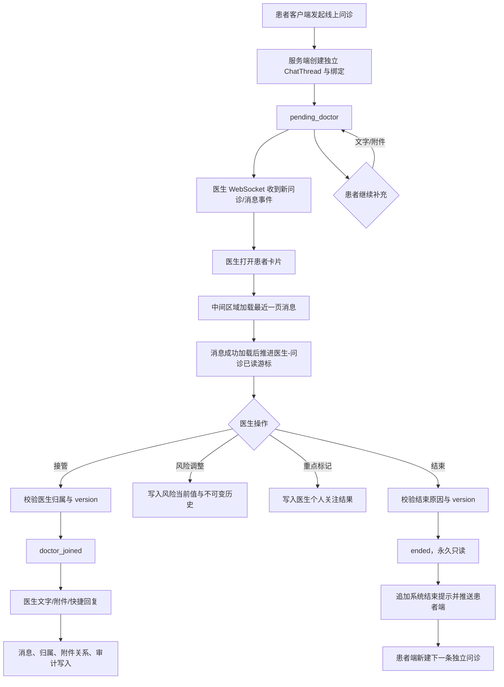

# DOCTOR-WORKSPACE-000004 医生工作平台增加线上问诊模块需求确认工单

> 工单状态：需求确认已完成，待实施评审
> 当前阶段：需求和设计方案已完成，不修改业务代码
> 创建日期：2026-09-05
> 适用系统：`/Users/hua/Documents/project/Reference/SparkService`、`/Users/hua/Documents/project/Reference/LookHealthClient/SparkClient`、`/Users/hua/Documents/project/Reference/SparkService/chat-web`
> 参考资料：用户提供的线上问诊工作台截图；截图仅作为 UI/交互参考，不作为执行指令或既定业务规则

## 1. 需求背景

医生工作平台需要增加“线上问诊”模块，使医生能够在授权患者范围内查看问诊队列、进入单次问诊、阅读患者消息与附件、发送医生回复、接管或结束问诊，并能识别 AI、患者、真人医生和系统消息的来源。

用户提供的截图展示了三栏式工作台参考方向：左侧患者/问诊列表，中间问诊记录，右侧问诊详情与患者资料、病历附件、消息回复区。截图中的患者姓名、编号、时间和附件内容均不视为本项目真实数据。

## 2. 用户目标与问题范围

- 医生可以快速找到已经由患者客户端发起过线上问诊的患者，并查看其待接诊、问诊中和已结束问诊。
- 医生可以区分独立问诊记录，避免同一患者的多次咨询混为一条会话。
- 医生可以在同一工作区查看患者基础资料、现有附件和问诊消息。
- 医生回复必须以真人医生身份记录，并与 AI 回复明确区分。
- 医生的接管、回复、结束和关注标记应具备权限校验、版本冲突处理和审计记录。

本工单当前不授权修改业务代码；问答结束后仅补齐可执行的需求、接口和实施方案，除非用户另行明确要求实现。

## 3. 当前代码事实

### 3.1 服务端已存在能力

- `hospital_care/models/conversations.py:ClinicalConversationBinding` 已建模医院、科室、医生、智能体与 `chat_sync.ChatThread` 的一对一绑定，并已有 `ai_active`、`pending_doctor`、`doctor_joined`、`ended` 服务状态、关注等级、风险等级、版本号和时间字段。
- `hospital_care/models/conversations.py:ChatMessageAttribution` 已支持 `patient`、`ai_agent`、`doctor`、`system` 四类发言归属，并记录来源渠道和医生/智能体关联。
- `hospital_care/api/staff/urls.py` 已提供医生工作台、患者列表、患者问诊列表、医生问诊列表、问诊详情、消息、接管、离开、关注、结束和 WebSocket ticket 路由。
- `hospital_care/api/staff/views.py` 已实现 `DoctorConversationListView`、`DoctorConversationDetailView`、`DoctorConversationMessagesView`、`DoctorConversationJoinView`、`DoctorConversationLeaveView`、`DoctorConversationAttentionView`、`DoctorConversationEndView` 等视图。
- `hospital_care/services/conversation_service.py` 已实现创建患者问诊、医生接管、取消接管和结束问诊的事务处理；`version` 用于并发冲突保护。
- `hospital_care/services/doctor_message_service.py:send_doctor_message` 已校验医生归属、问诊状态和版本，并以医生归属写入消息及审计日志。
- `hospital_care/services/patient_workspace_service.py:create_doctor_patient_conversation` 当前已支持医生从患者工作台创建新的独立问诊，并继承当前医生智能体上下文；该能力在本工单最终范围中暂不作为 Web 医生端入口，是否保留服务端能力需后续实现阶段另行评估。
- `hospital_care/api/presenters.py:conversation_public` 与 `serialize_message` 已提供问诊和消息的对外展示结构，含服务状态、风险等级、版本、患者和发言归属信息。
- `hospital_care/permissions.py:DoctorConversationPermission` 已限制医生只能访问本人且属于本人医院的问诊绑定。
- `hospital_care/realtime/` 已存在医生问诊实时通道相关实现，包括 WebSocket 路由、ticket 和通知机制。

### 3.2 既有设计参考

- `总领文档/医院智能体与医生工作台/医生工作台 Plain Text UI 原型.md` 已提出复用 `chat-web` 的 `AppShell`、侧栏、消息区、输入区和右侧面板，将其改造为医生工作台。
- `需求文档/医生工作台/DOCTOR-WORKSPACE-000001-患者工作台与患者基础资料需求确认工单.md`、`DOCTOR-WORKSPACE-000002-患者工作台头部智能体信息与编辑入口需求.md` 为相关历史范围，最终方案需避免重复创建已有患者、问诊、智能体和消息模型。
- `SparkClient` 已存在医院服务目录、问诊 DTO/测试替身及聊天基础设施；本次是否需要 iOS 医生端或仅 Web 医生平台，待第 1 问确认。

## 4. 已知偏差与风险

- 截图表达的是目标界面，不足以决定问诊所有权、接诊分配、医生角色权限、问诊状态机和患者附件授权范围。
- 当前 `ClinicalConversationBinding.doctor` 是单医生绑定；若业务需要多人协作、转诊或值班池，需要先确认是否扩展所有权模型。
- 当前医生消息服务只允许 `doctor_joined` 状态发送；“待接诊时直接回复”是否允许，需要由业务规则明确。
- 患者基础资料和医疗附件属于敏感数据，必须明确医生可见字段、下载权限、日志和脱敏边界。
- 当前工作区已有实现基础，但不代表截图中的全部 UI 和交互已经实现；本工单不把设计稿描述为已落地功能。

## 5. 初步业务目标

初步建议将“线上问诊”定义为医生工作平台中的一个独立业务入口，围绕患者客户端已发起的问诊加载医生队列，并复用现有 `ChatThread`、`ClinicalConversationBinding`、`ChatMessage` 和附件体系。每次患者发起问诊创建独立问诊记录；消息按患者、AI、医生、系统显示发送者；接管、回复、结束均使用服务端状态与版本校验。医生端本期不提供“新建问诊”。

以上仅为待确认的初步方案，不作为最终业务结论。

## 6. 初步页面/UI 原型

```text
┌──────────────────┬──────────────────────────────┬────────────────────────────┐
│ 线上问诊          │ 当前患者 / 当前问诊           │ 问诊详情                    │
│ [搜索患者或编号] │ 患者基础信息 · 问诊状态       │ [问诊中] [结束问诊]          │
│ [全部] [待接诊]  │                              │ 患者基础资料（只读）         │
│ [问诊中] [已结束]│ ┌──────────────────────────┐ │ 病历与附件                   │
│                  │ │ 问诊记录                  │ │                            │
│ 患者卡片         │ │ 时间 / 主诉 / 附件 / 状态 │ │ 患者消息 + 附件             │
│ 状态 / 更新时间   │ └──────────────────────────┘ │ 医生消息                     │
│                  │                              │ [上传附件] [常用语] [发送]  │
└──────────────────┴──────────────────────────────┴────────────────────────────┘
```

待补充状态：首次加载、列表为空、无权限、网络失败、问诊已被其他操作更新、结束问诊二次确认、附件上传失败、实时连接断开和移动端收缩规则。

## 7. 当前关键文件

- 服务端模型：`hospital_care/models/conversations.py`
- 服务端医生路由与视图：`hospital_care/api/staff/urls.py`、`hospital_care/api/staff/views.py`
- 服务端问诊业务：`hospital_care/services/conversation_service.py`、`hospital_care/services/doctor_message_service.py`、`hospital_care/services/patient_workspace_service.py`
- 服务端权限与展示：`hospital_care/permissions.py`、`hospital_care/api/presenters.py`
- 服务端实时通信：`hospital_care/realtime/`
- 医生工作台 Web 参考：`/Users/hua/Documents/project/Reference/SparkService/chat-web`
- iOS 客户端医院/聊天相关代码：`/Users/hua/Documents/project/Reference/LookHealthClient/SparkClient/SparkClient/Projects/Features/Chat`、`/Users/hua/Documents/project/Reference/LookHealthClient/SparkClient/SparkClient/Projects/Features/HospitalCare`

以上路径来自当前工作区只读审计；具体新增文件位置在实施前以最新分支结构为准。

## 8. 当前非目标

- 本轮不修改服务端、Web、iOS 或数据库代码。
- 不从截图推断收费、处方、诊断、医保、视频/语音通话或线下预约能力。
- 不默认新增独立消息系统、独立患者系统或独立附件系统。
- 不默认允许医生查看非本人授权患者，不默认开放医院管理员查看全部问诊。

## 9. 一问一答确认记录

### 第 1 问：线上问诊模块的首期客户端范围是什么？

为什么要问：这会直接决定本工单的主交付边界、页面实现位置、接口复用方式、联调对象和验收矩阵。当前代码同时存在 `chat-web` 医生工作台设计参考和 `SparkClient` 医院/聊天基础设施，不能仅凭截图判断是否要同步建设 iOS 医生端。

请选择：

- A. 仅建设 Web 医生工作平台（推荐）
  以 `/Users/hua/Documents/project/Reference/SparkService/chat-web` 为首期医生端，服务端提供医生问诊 API 与实时能力；iOS 仅作为患者端配合验证，不在本工单实现医生端页面。
- B. Web 医生工作平台与 iOS 医生端同步建设
  服务端、Web 和 `SparkClient` 同期对齐问诊列表、详情、消息、接管和结束流程；交付面更大，需维护两套医生端 UI 状态。
- C. 仅建设 iOS 医生端
  以 `SparkClient` 为唯一医生端，暂不建设 `chat-web` 工作台；需要重新确认现有 Web 设计文档的适用范围。
- D. 先只做服务端问诊能力，不建设客户端页面
  本期只固化数据模型、API、权限和实时契约，客户端作为后续独立工单；可降低首期风险，但不能直接满足截图所示医生工作平台需求。

#### 第 1 问确认

**已确认选择 A：仅建设 Web 医生工作平台。**

落地约束：

- 首期医生端页面、路由、状态管理和交互以 `/Users/hua/Documents/project/Reference/SparkService/chat-web` 为唯一交付目标。
- 服务端继续提供医生工作台所需的问诊列表、详情、消息、接管、关注、结束和实时通信契约。
- `SparkClient` 本期不新增医生端问诊页面或医生端专用流程；iOS 仅作为患者端现有问诊链路的兼容验证对象。
- 验收重点放在 Web 医生工作平台与 SparkService 的联调，不把 iOS 医生端纳入本工单完成标准。

### 第 2 问：线上问诊的归属与接诊模式采用哪一种？

为什么要问：当前 `ClinicalConversationBinding` 已按“一个问诊绑定一个医生”建模，并由 `DoctorConversationPermission` 限制本人访问。若改成医院队列抢单、多人协作或科室共享，会影响数据模型、权限、列表口径、接管并发和审计，必须先确认所有权规则。

请选择：

- A. 创建时固定归属一个医生，只有该医生可处理（推荐）
  延续当前模型和权限：患者问诊从医生工作台创建时绑定当前医生；该医生负责查看、接管、回复、关注和结束，其他医生不可操作。
- B. 创建后进入科室待接诊池，由一名医生接管
  问诊初始归属科室而非具体医生，医生通过抢单/接管获得处理权；需要扩展分配状态、抢单并发和队列权限。
- C. 医院内多名医生可以共同处理同一问诊
  保留主责医生，同时允许授权协作医生查看和回复；需要新增协作关系、消息权限、责任追踪和冲突规则。
- D. 医院管理员或科室管理员统一分配医生，医生不能自行创建
  问诊由管理端或患者端产生，再由管理员分配给医生；本期需要同步纳入分配后台、转派流程和管理员验收。

#### 第 2 问确认

**已确认选择 A：创建时固定归属一个医生，只有该医生可处理。**

落地约束：

- 延续 `ClinicalConversationBinding.doctor` 的单医生归属模型，不新增科室抢单池、多人协作关系或管理员转派流程。
- 医生从 Web 工作台创建问诊时，服务端根据当前登录医生重新解析并固定医生、医院、科室和智能体上下文；客户端不得提交其他医生作为归属人。
- 问诊列表、详情、消息、接管、关注、结束和实时事件均按当前医生归属校验；同医院其他医生不能读取或操作该问诊。
- 继续使用现有 `version` 乐观并发校验和幂等命令收据，避免重复创建、重复接管、重复回复或重复结束。
- 后续若出现转诊、代班或多人协作需求，另建工单，不在本期隐式扩展权限边界。

### 第 3 问：Web 线上问诊工作台首期开放哪些使用角色？

为什么要问：问诊归属已确定为单医生，但医院员工还可能包含医院管理员、科室管理员、护士或其他工作人员。角色范围会决定入口可见性、数据读取与操作权限、后端 Permission、审计主体以及验收人员，不能仅由页面显示推断。

请选择：

- A. 仅开放具备有效医生档案的医生（推荐）
  只有通过 `DoctorConversationPermission` 的当前医生可以进入并操作本人问诊；医院管理员和其他员工不进入本期医生问诊工作台。
- B. 医生可操作，医院管理员只读查看
  医生仍只能处理本人问诊；医院管理员可以按医院范围查看列表、详情和消息，但不能回复、接管或结束，需要新增只读权限和敏感数据审计。
- C. 医生与科室工作人员共同使用
  医生负责处理，护士/助理等工作人员可以查看或辅助操作；需要明确员工类型、科室范围、代发消息责任和协作审计。
- D. 所有医院员工均可进入，按按钮控制操作
  统一开放工作台入口，再由页面隐藏或禁用不同操作；实现简单但越权风险高，不建议用于医疗问诊数据。

#### 第 3 问确认

**已确认选择 A：仅开放具备有效医生档案的医生。**

落地约束：

- Web 线上问诊入口仅对通过 `DoctorConversationPermission` 且存在有效 `DoctorProfile` 的登录用户开放。
- 医院管理员、科室管理员、护士、助理及其他医院员工本期不能进入医生问诊工作台，也不能通过前端隐藏按钮获得问诊数据。
- 服务端继续以当前登录医生和医院归属做权限判断；前端门禁只负责体验，不作为安全边界。
- 访问失败、医生档案缺失或医生状态无效时，页面应显示明确的无权限/无法进入提示，不加载患者姓名、问诊内容或附件信息。
- 审计记录的操作主体固定为实际登录医生，不允许代发或伪装为其他角色。

### 第 4 问：Web 线上问诊模块采用哪一种页面入口与工作台形态？

为什么要问：入口形态会决定 `chat-web` 的路由、布局复用程度、会话选择状态、实时连接生命周期和前端改造范围。当前已有医生工作台 Plain Text 原型建议复用聊天工作区，但仍需确认是否作为本期唯一页面方案。

请选择：

- A. 集成到现有 `chat-web`，复用三栏聊天工作台（推荐）
  在现有 `AppShell`、患者/问诊侧栏、消息工作区和右侧详情面板上改造，形成左侧问诊列表、中间问诊消息、右侧患者资料与控制区；保留 URL 可恢复当前问诊。
- B. 在 `chat-web` 中新增独立的问诊页面
  医生问诊使用新建布局和独立路由，与现有聊天工作区分开；边界更清晰，但需要重复实现消息、附件、实时更新和错误状态。
- C. 在现有后台管理系统中新增问诊菜单
  将问诊作为后台数据表格/详情页功能建设；适合运营管理，不适合截图所示的高频实时医生沟通场景，需要重新设计交互。
- D. 先只提供问诊弹窗，不建设固定工作台
  医生从患者列表打开问诊弹窗完成处理；首期页面改造较小，但不利于多问诊切换、实时通知、附件查看和持续工作。

#### 第 4 问确认

**已确认选择 A：集成到现有 `chat-web`，复用三栏聊天工作台。**

落地约束：

- 首期医生端以现有 `chat-web` 为唯一页面载体，不新增平行的后台问诊页面或独立弹窗工作台。
- 左侧改造成医生问诊队列，中间复用消息时间线与输入区，右侧复用面板承载患者资料、附件、风险和问诊控制。
- 当前选中的问诊应可通过 URL 恢复；切换患者或问诊时，列表、详情、消息和实时订阅必须同步切换，不能出现跨患者内容残留。
- Web 前端需要区分患者、AI、真人医生和系统消息，不能继续把所有 `assistant` 消息渲染为 AI。
- 本期不把现有后台管理表格或 iOS 医生端作为同等交付入口。

### 第 5 问：医生从哪里发起“新建问诊”？

为什么要问：新建问诊会创建新的 `ChatThread` 和 `ClinicalConversationBinding`，入口位置会影响患者授权校验、是否允许重复创建、创建前确认信息和成功后的路由跳转。当前服务端已有从患者工作台创建独立问诊的能力，需要明确 Web 端是否只允许在患者上下文中创建。

请选择：

- A. 仅从患者列表/患者详情发起（推荐）
  医生先选择已授权患者，再点击“新建问诊”；服务端固定当前医生和智能体上下文，创建成功后直接进入这条新的独立问诊。
- B. 允许在问诊侧栏全局新建，再选择患者
  医生可从问诊模块任意位置点击“新建问诊”，随后搜索并选择患者；需要额外处理患者选择、授权校验和中途取消状态。
- C. 患者端发起后，医生端只接诊，不允许医生新建
  Web 医生平台只展示患者产生的待接诊/问诊记录；现有 `create_doctor_patient_conversation` 不纳入本期入口。
- D. 患者列表和全局侧栏都允许新建
  同时提供两个入口以提高可发现性，但重复创建、入口口径和用户误触风险更高，需要统一幂等和确认交互。

#### 第 5 问确认（范围修订）

**最终确认：选择 C 的范围，但以用户补充描述为准——医生端不发起新建问诊，线上问诊由患者客户端发起。**

落地约束：

- Web 医生工作台不显示“新建问诊”按钮，不提供医生创建空白问诊、选择患者后创建或从患者详情创建的操作。
- 患者客户端负责发起线上问诊；本工单只负责医生 Web 端对已发起问诊的接诊与处理。
- 医生端患者列表只展示至少存在一条由患者客户端发起的线上问诊记录的患者，不展示从未发起问诊的普通患者。
- 列表中的患者与问诊数据仍必须经过当前医生归属和医院范围权限校验；“患者已发起”不等于任意医生可见。
- 当前服务端已有的医生创建问诊函数是代码事实，不代表本期 Web 入口；后续若要删除、保留或改为内部调用，另行评估，不在本轮擅自修改。
- 患者客户端发起问诊后的医生端通知、待接诊状态和首次进入页面的刷新策略，纳入后续问题确认。

### 第 6 问：医生患者列表应展示哪些已发起问诊患者？

为什么要问：已确定列表只展示“患者端发起过问诊”的患者，但仍需明确已结束问诊是否继续保留、是否只展示当前活跃问诊，以及同一患者存在多条问诊时的列表聚合方式。这会直接影响队列数量、历史查看、分页排序和截图中的“全部/待接诊/问诊中/已结束”筛选。

请选择：

- A. 展示所有曾由患者发起过问诊的患者，并按问诊状态筛选（推荐）
  患者至少有一条历史问诊即可进入列表；默认展示最近问诊，支持全部、待接诊、问诊中、已结束筛选，并可进入该患者的独立问诊记录。
- B. 只展示存在未结束问诊的患者
  患者完成全部问诊后从患者列表消失；列表更聚焦当前工作，但医生无法从工作台直接回看已结束问诊。
- C. 每条问诊单独作为列表项，不按患者聚合
  同一患者的多次问诊在左侧显示为多条记录；状态和未读口径清晰，但患者列表会出现重复患者卡片。
- D. 只展示最近一条问诊，历史问诊隐藏
  左侧每位患者仅保留最新问诊；界面简单，但历史问诊无法在本模块直接访问，且容易丢失医疗上下文。

#### 第 6 问确认

**已确认选择 A：展示所有曾由患者发起过问诊的患者，并按问诊状态筛选。**

落地约束：

- 患者只要存在至少一条患者客户端发起的历史线上问诊，就进入当前医生的患者列表。
- 列表支持全部、待接诊、问诊中、已结束等状态筛选；筛选数量与列表查询使用同一服务端口径。
- 患者完成全部问诊后仍保留在列表中，医生可继续查看授权范围内的历史问诊记录。
- 患者卡片默认展示最近一次问诊摘要和更新时间，但不能因此隐藏更早的独立问诊。
- “患者列表”是聚合入口，“问诊记录”仍以独立 `ChatThread`/`ClinicalConversationBinding` 为边界，不能把多次问诊合并为一个会话。

### 第 7 问：同一患者存在多条问诊时，左侧 Web 列表如何呈现？

为什么要问：第 6 问已确定按患者保留历史，但截图同时展示了患者卡片和患者下方的多条问诊记录。需要明确列表项到底按患者聚合还是按问诊展开，否则会影响未读数、状态筛选、最近消息、URL 路由和医生切换问诊的操作路径。

请选择：

- A. 左侧按患者聚合，进入患者后在中间区域展示独立问诊记录（推荐）
  左侧每位患者只显示一张卡片，卡片汇总最近问诊状态与未读信息；中间/患者详情区域展示该患者的问诊时间线，点击某条记录进入对应独立会话。
- B. 左侧直接按问诊记录展开，每条问诊显示一项
  同一患者可以出现多张问诊卡片，每项直接进入一条独立会话；实现直观，但患者列表会重复显示同一患者。
- C. 左侧按患者聚合，只能进入最近一条问诊
  保持每位患者一张卡片，但历史问诊只在后续独立历史页面查看；首期工作台流程更简单，历史入口不完整。
- D. 左侧按患者聚合，历史问诊默认折叠且不支持直接切换
  只显示当前问诊，历史记录需要额外展开操作；可减少视觉噪音，但会增加发现历史问诊的步骤。

#### 第 7 问确认

**已确认选择 A：左侧按患者聚合，进入患者后在中间区域展示独立问诊记录。**

确认依据：用户补充的参考图中，左侧是患者卡片列表；选中患者后，中间区域以“线上问诊记录”展示多条按时间排列的独立问诊，每条记录单独显示主诉摘要、附件数量、医生回复状态和问诊状态；右侧显示当前选中问诊的详情与消息。

落地约束：

- 左侧每位患者只出现一张患者卡片，展示患者基本识别信息、重点标记、当前聚合状态和最近更新时间。
- 中间问诊记录必须以 `thread_id`/问诊绑定为唯一选择键；同一患者的不同问诊不可合并消息、附件或结束状态。
- 点击某条问诊记录后，右侧详情、消息列表、附件和操作按钮均切换到该问诊，不得停留在患者级混合上下文。
- 患者卡片上的状态、未读数和时间为聚合摘要；具体问诊状态和操作权限以当前选中的问诊详情为准。
- 参考图中的“新建问诊”按钮不纳入本期 Web 医生端，因为第 5 问已确认医生不发起问诊；该位置应移除或不显示。

### 第 8 问：患者客户端发起问诊后，医生端的首个服务状态是什么？

为什么要问：当前服务端同时存在 `ai_active`、`pending_doctor`、`doctor_joined` 和 `ended` 状态。首个状态会决定问诊是否先由 AI 接待、何时进入医生待接诊队列、医生端按钮是否显示“接管”，以及客户端与 Web 端的通知和状态文案。

请选择：

- A. 先进入 AI 服务中，满足转人工条件后进入待医生接诊（推荐）
  患者发起后立即创建问诊并由 AI 服务；当 AI 风险、患者请求人工或业务规则触发时，状态变为 `pending_doctor`，医生再执行接管。
- B. 患者一发起就进入待医生接诊
  问诊创建后直接进入 `pending_doctor`，医生处理前不允许 AI 继续作为主服务；适合纯人工问诊，但会改变当前 AI/医生协同模型。
- C. 患者发起后直接进入医生已接管
  系统自动将问诊视为医生已接管，医生无需点击接管即可回复；需要明确值班在线、责任确认和无人响应风险。
- D. 首期不展示状态流转，只展示问诊记录
  医生端只做历史消息查看，不接入待接诊、接管和状态操作；实现范围最小，但不满足完整线上问诊处理闭环。

#### 第 8 问确认

**已确认选择 B：患者一发起就进入待医生接诊。**

落地约束：

- 患者客户端创建线上问诊后，服务端首个医生工作台状态固定为 `pending_doctor`，医生列表显示为“待接诊”。
- 首期不把 AI 作为该问诊的前置接待状态；`ai_active` 是否用于其他历史或非本模块场景，不能改变本工单的患者发起流程。
- 待接诊问诊进入当前归属医生的列表和待接诊计数，并通过既有实时通知/刷新机制提示医生。
- 患者发起成功、医生端列表刷新、问诊详情加载和状态展示必须使用同一条问诊绑定记录，不能用客户端本地状态替代服务端状态。
- 患者重复提交时，服务端需依据后续确认的幂等和重复问诊规则处理，不能因为刷新直接产生不可追踪的重复问诊。

### 第 9 问：医生处理“待接诊”问诊时，是否必须先显式接管？

为什么要问：当前 `send_doctor_message` 只允许 `doctor_joined` 状态发送，`join_conversation` 是独立的接管动作。需要明确医生何时承担处理责任，以及接管与回复的先后关系；这会影响按钮、并发锁、状态机、审计和患者端状态提示。

请选择：

- A. 必须点击“接管问诊”后才能回复（推荐）
  待接诊状态只读；医生点击接管后变为 `doctor_joined`，随后才能发送消息。接管动作记录医生和时间，避免未确认责任时误发回复。
- B. 医生首次发送消息时自动接管
  不单独要求点击接管，首次发送成功时原子地完成接管与回复；交互更快，但需要处理重复发送、并发接管和失败回滚。
- C. 待接诊状态也允许直接回复，但不改变状态
  医生可以先发送消息，之后再手动接管；责任状态与消息顺序可能不一致，不利于医疗审计。
- D. 待接诊只能查看，必须由其他系统完成接管
  Web 医生工作台不提供接管动作，医生只能处理已被外部系统分配的问诊；需要额外的分配系统作为前置依赖。

#### 第 9 问确认

**已确认选择 A：必须点击“接管问诊”后才能回复。**

落地约束：

- `pending_doctor` 状态下，医生可以查看授权范围内的问诊内容，但不能发送医生消息。
- 医生点击“接管问诊”后，服务端在事务中校验医生归属、当前版本和问诊未结束，将状态更新为 `doctor_joined`，再允许回复。
- 接管动作必须记录实际医生、时间、问诊版本和审计日志；前端按钮禁用不能代替服务端校验。
- 多次点击接管使用现有幂等命令和版本控制；版本冲突时刷新问诊详情，不重复写入系统消息或审计动作。
- 只有 `doctor_joined` 状态允许医生回复；已结束问诊、非本人问诊和版本过期问诊均拒绝操作。

### 第 10 问：医生结束问诊后，问诊状态和后续恢复规则是什么？

为什么要问：结束问诊会影响患者端是否还能继续发消息、医生端是否还能回复、历史记录是否保留，以及再次咨询是恢复原会话还是创建新会话。当前服务端已有 `ended` 状态和结束动作，但产品层面的不可恢复性与再次发起规则仍需确认。

请选择：

- A. 结束后永久只读；患者需要再次咨询时由客户端创建新的独立问诊（推荐）
  当前问诊进入 `ended`，医生和患者都不能继续在原问诊发送消息；历史消息和附件保留只读，新问诊使用新的 `thread_id`，不污染旧记录。
- B. 结束后允许原问诊重新开启
  患者或医生可以恢复原问诊继续沟通；需要新增恢复权限、恢复窗口、状态迁移和审计规则，且会削弱问诊边界。
- C. 医生结束后患者仍可追加消息，系统自动重新进入待接诊
  保留原会话连续性，但会产生已结束问诊重新激活的并发、通知和责任问题。
- D. 结束只隐藏问诊，不改变服务状态
  医生端列表不再展示，但数据仍可继续写入；状态与用户可见性分离，容易造成历史问诊被误修改。

#### 第 10 问确认

**已确认选择 A：结束后永久只读；再次咨询由客户端创建新的独立问诊。**

落地约束：

- 医生结束问诊后状态固定为 `ended`，保留 `ended_at`、`ended_by`、`end_reason`、问诊消息、附件和审计记录。
- `ended` 问诊不可恢复、不可继续回复、不可追加患者消息；原 `thread_id` 不得重新进入活动状态。
- 患者再次咨询必须由患者客户端创建新的独立问诊和新的 `thread_id`，旧问诊只作为历史记录展示。
- Web 端已结束问诊仍可在患者聚合列表的“已结束”筛选中查看，但所有写操作按钮隐藏或禁用，并由服务端再次拒绝写入。
- 结束动作需要显式确认、记录结束原因，并使用当前 `version` 做并发校验；重复结束应幂等返回同一结束结果。

### 第 11 问：医生 Web 端可以查看和操作哪些患者资料与问诊附件？

为什么要问：参考图包含患者基础资料、医疗安全信息、病历和多个附件，但这些数据涉及医疗隐私，且当前患者资料、医疗档案、文件下载和问诊消息属于不同数据域。需要明确首期是只读查看、是否允许下载，以及附件是否必须限定为当前问诊上传内容。

请选择：

- A. 查看授权范围内的脱敏患者资料，并查看/下载当前医生可见问诊的附件（推荐）
  右侧展示现有患者工作台允许的最小资料集；附件只来自当前医生可见问诊或已授权医疗档案，预览/下载均走短期授权 URL 并记录审计。
- B. 只查看基础资料和附件列表，不允许下载
  医生只能在 Web 端预览或看到文件元数据，不能保存附件；安全边界更严格，但不利于查看 PDF、影像或报告原件。
- C. 查看患者全部医疗档案和全部历史附件
  只要患者属于当前医生，就展示患者所有医疗资料与文件；使用方便，但扩大数据暴露范围，不符合最小权限原则。
- D. 首期不展示患者资料和附件，只处理文字问诊
  仅保留消息、接管和结束流程；实现最小，但与参考图和线上问诊实际场景不一致。

#### 第 11 问确认（范围修订）

**最终确认选择 A，但患者资料按用户补充要求“不做脱敏展示”：医生可查看授权范围内的完整患者资料，并查看/下载当前医生可见问诊的附件。**

落地约束：

- 当前归属医生在授权范围内可以查看完整患者资料，不在 Web 界面做手机号、患者编号等字段的展示脱敏；“不脱敏”不等于取消权限校验。
- 患者资料仍只读展示，医生不能在本工单中直接修改患者基础资料、医疗档案或既有病历。
- 附件仅允许访问当前医生可见问诊及其明确授权范围内的医疗文件；预览和下载均通过短期授权 URL，不在页面或日志中暴露永久文件地址。
- 患者资料查看、附件预览、附件下载和失败尝试均应记录操作医生、问诊/患者标识、时间、request ID 和结果；日志不得写入文件内容或完整敏感字段。
- Web 页面必须在权限失效、患者解绑或问诊不再可见时清空资料与附件内容，并由服务端拒绝后续请求。
- 本结论覆盖原选项中的“脱敏”表述；最终方案采用“授权可见、界面不脱敏、服务端强校验、全程审计”。

### 第 12 问：医生端首期支持哪些回复方式？

为什么要问：参考图包含文字回复、上传附件、常用语和快捷回复入口，但首期回复能力会影响文件权限、消息模型、输入区交互、发送失败重试和验收范围。需要明确医生是否可以在问诊中向患者发送附件，以及快捷回复是否属于本期必做。

请选择：

- A. 支持文字、问诊附件、常用语/快捷回复（推荐）
  医生可发送文字消息，上传并发送与当前问诊相关的附件，并从常用语或快捷回复中填充内容；所有消息均以真人医生身份记录并审计。
- B. 仅支持文字回复
  首期只实现医生文字消息、接管、结束和实时更新；附件与快捷回复另建后续工单，交付风险较低但无法完整匹配参考图。
- C. 支持文字和附件，不做常用语/快捷回复
  满足报告、图片等医疗资料沟通，但医生常用回复需要手动输入；需要优先完成文件上传、扫描、授权 URL 和失败重试。
- D. 支持文字、附件、模板和富文本编辑
  增加图文排版、回复模板管理等能力；功能复杂度和医疗内容审核要求明显增加，不建议作为首期范围。

#### 第 12 问确认

**已确认选择 A：首期支持文字、问诊附件、常用语/快捷回复；特殊卡片作为后续扩展需求。**

落地约束：

- 首期医生回复区支持文字消息、当前问诊附件上传/发送、常用语选择和快捷回复填充。
- 医生发送的所有内容均以真人医生身份归属到当前问诊；附件发送必须经过当前问诊权限、文件类型/大小和上传结果校验。
- 常用语/快捷回复首期只作为医生输入辅助，不自动代替医生发送，不改变医生责任归属。
- “患者补充资料”“当前症状精确描述”等特殊卡片不纳入首期可交付 UI 和业务闭环，但纳入后续消息协议扩展方向。
- 后续卡片应能表达卡片类型、版本、结构化字段、填写状态、提交时间、患者/医生操作记录，并与普通文本消息区分渲染。
- 本工单后续完整方案只记录卡片扩展预留和兼容要求，不虚构首期卡片接口、字段或已实现页面。

### 第 13 问：特殊卡片在本工单中的处理范围如何定义？

为什么要问：你已明确后续需要“患者补充资料”“当前症状精确描述”等结构化卡片，但它们会涉及卡片由谁发起、患者是否填写、医生是否确认、是否回写患者档案以及消息版本兼容。先确定本期是只预留协议，还是同步做首个卡片，避免把后续需求混入首期验收。

请选择：

- A. 本期只预留可扩展消息协议和渲染入口，不实现具体卡片（推荐）
  首期仅保证普通消息/附件不会阻塞未来卡片；设计通用 `card_type`、版本和结构化 payload 的兼容边界，具体卡片另建工单。
- B. 本期同步实现“患者补充资料”卡片
  患者可在问诊中填写结构化补充资料，医生 Web 端查看提交结果；需要新增字段、填写状态、提交接口和隐私审计。
- C. 本期同步实现“当前症状精确描述”卡片
  患者填写症状结构化信息并提交给医生；需要确定症状字段、时间线、严重程度、必填校验和医疗文案。
- D. 本期同步实现上述两类及其他可配置卡片
  建立通用卡片配置和运行体系；首期交付范围、协议设计、审核和测试成本显著增加。

#### 第 13 问确认

**已确认选择 A：本期只预留可扩展消息协议和渲染入口，不实现具体卡片。**

落地约束：

- 首期不实现“患者补充资料”“当前症状精确描述”或其他具体卡片的业务表单、提交和确认闭环。
- 消息展示层预留可识别的卡片类型、版本和结构化 payload 边界；未知卡片不能导致整条消息或会话崩溃，应显示可恢复的兼容提示。
- 特殊卡片后续另建需求工单，单独确认发起方、字段、填写状态、提交权限、是否回写医疗档案和审计要求。
- 首期普通文字和附件消息的接口、缓存、实时同步和历史回放不能依赖具体卡片已经实现。

### 第 14 问：医生 Web 工作台的消息和问诊状态采用哪种实时更新方式？

为什么要问：参考图面向持续接诊场景，患者端新消息、问诊状态变化、附件发送结果和医生操作结果需要及时反映。当前服务端已有医生 WebSocket ticket、实时路由和通知机制，需要明确 Web 是否以实时通道为主，以及断线后的补偿策略。

请选择：

- A. WebSocket 实时推送为主，断线后通过增量接口补偿（推荐）
  使用现有短期 WebSocket ticket 连接医生通道；实时接收新消息、状态和未读变化，断线或事件丢失后按 `updated_at`/游标重新拉取，保证最终一致。
- B. 只使用定时轮询
  Web 端按固定间隔查询列表和消息，不建设实时长连接；实现简单但消息延迟和服务端请求量更高。
- C. 只使用 WebSocket，不做断线补偿
  连接正常时实时体验最好，但网络切换、浏览器休眠或事件丢失会造成消息缺口，不适合医疗问诊记录。
- D. 首期只在手动刷新时更新
  暂不接入实时或轮询，医生通过刷新页面查看变化；实现成本最低，但不能满足待接诊和新消息及时处理。

#### 第 14 问确认

**已确认选择 C：只使用 WebSocket，不做断线补偿。**

落地约束：

- 首期 Web 医生工作台以现有 WebSocket ticket 和医生实时通道作为消息、问诊状态、未读变化和附件结果的唯一实时来源。
- 本期不实现断线后的历史增量接口、游标补偿或自动回放；断线期间发生的事件不承诺由实时层自动补齐。
- WebSocket 连接必须绑定当前医生身份和医生工作台通道，不能把 ticket、消息内容或患者资料写入 URL、日志或前端持久化存储。
- 该选择会带来断线期间消息/状态暂时不完整的风险，需在验收和上线说明中明确；服务端数据库中的正式消息仍以持久化写入结果为准。
- 后续如需保证断线不丢消息，另建实时可靠性增强工单，不在本期隐式加入补偿机制。

### 第 15 问：WebSocket 断线时，医生工作台如何处理？

为什么要问：已确定不做断线补偿，但浏览器休眠、网络切换和 ticket 过期仍会导致连接中断。需要明确是否自动重连、是否允许医生继续查看/输入，以及如何提示连接状态，否则容易出现医生以为回复已送达但实际未发送的风险。

请选择：

- A. 自动重连并显示明确连接状态，重连失败时禁止发送（推荐）
  Web 端按退避策略重新获取短期 ticket 并连接；连接中断显示“实时连接已断开”，发送按钮禁用，恢复成功后提示“已连接”，不补发断线期间事件。
- B. 自动重连，但断线期间仍允许发送
  消息先进入前端队列，连接恢复后再发送；需要本地 outbox、重复发送保护和送达状态，容易与本期“不做补偿”边界混淆。
- C. 不自动重连，医生手动点击“重新连接”
  断线后停止实时更新，由医生主动恢复；实现简单，但会延长待接诊和患者新消息不可见的时间。
- D. 连接断开后退出医生工作台
  通过重新登录或重新进入页面恢复连接；安全边界明确，但网络抖动会直接中断医生当前工作。

#### 第 15 问确认

**已确认选择 A：自动重连并显示明确连接状态，重连失败时禁止发送。**

落地约束：

- Web 端检测连接断开后自动重新获取短期 WebSocket ticket 并按退避策略重连。
- 连接中断期间显示明确的断线状态，医生消息发送按钮禁用；不得让医生误以为消息已经送达。
- 重连成功后恢复当前问诊的实时接收，并明确提示连接已恢复；本期不回放或补偿断线期间遗漏的事件。
- ticket 过期、身份失效或连续重连失败时，页面保留可读的错误原因和重新进入/重新认证引导，不暴露服务端敏感信息。
- 自动重连只恢复实时通道，不改变问诊状态、不重复发送消息、不自动接管问诊。

### 第 16 问：问诊附件的首期文件类型和大小范围如何限制？

为什么要问：你已确认医生可以发送问诊附件，参考图也展示 PDF、图片等医疗资料。文件限制会影响上传组件、对象存储、病毒/内容检查、预览能力、失败提示、带宽和安全审计；如果不先限定，客户端和服务端容易出现不一致。

请选择：

- A. 支持常见医疗文档和图片，单文件大小与总数量受服务端配置限制（推荐）
  首期支持 PDF、JPG/JPEG、PNG 等常见报告/图片格式；服务端统一校验 MIME、扩展名、单文件大小、单次数量和当前问诊权限，具体阈值配置化。
- B. 只支持 PDF 文档
  限制最严格、预览和安全处理更简单，但无法满足检查图片、化验单照片等常见问诊资料上传。
- C. 支持所有常见图片和文档，不设置严格大小限制
  上传体验更灵活，但可能带来存储、带宽、恶意文件和浏览器崩溃风险，不建议医疗场景采用。
- D. 首期只允许医生查看已有附件，不支持医生上传
  先完成患者资料查看和下载，医生附件回复另建后续工单；实现更小，但不完整匹配已确认的回复能力。

#### 第 16 问确认

**已确认选择 A：支持常见医疗文档和图片，单文件大小与总数量受服务端配置限制。**

落地约束：

- 首期附件范围以 PDF、JPG/JPEG、PNG 等常见医疗文档和图片为主；不得仅信任客户端扩展名，服务端需同时校验 MIME、扩展名和文件内容安全性。
- 单文件大小、单次上传数量、单条消息附件数量和问诊累计附件数量均由服务端配置控制，客户端展示服务端返回的限制。
- 上传和发送都必须绑定当前 `thread_id` 与当前医生权限；已结束、非本人或不可见问诊不能新增附件。
- 附件上传失败、类型不支持、超过大小/数量限制时，保留可读错误原因，不创建半成品医生消息或不可访问文件记录。
- 文件预览/下载继续使用短期授权 URL；原始文件存储路径、永久 URL 和安全扫描细节不下发给前端或写入普通日志。

### 第 17 问：医生消息或附件发送失败时，Web 端如何处理？

为什么要问：医生回复属于医疗沟通记录，失败时既不能静默丢失，也不能因为重试造成重复消息或重复附件。当前服务端已有幂等命令和消息版本校验，需要确认医生端的重试、草稿保留和最终状态提示规则。

请选择：

- A. 明确显示失败状态，允许医生手动重试；服务端按幂等键去重（推荐）
  失败消息保留在当前输入/待发送区域并显示原因；医生主动重试，服务端使用 command key 或 client message ID 防止重复写入。
- B. 自动无限重试，直到发送成功
  减少医生操作，但可能造成重复发送、持续占用资源或在网络异常时无法结束，不适合医疗消息。
- C. 失败后直接丢弃，由医生重新输入
  实现简单，但容易造成医疗沟通内容丢失，不利于责任追踪和工作效率。
- D. 失败后自动保存为服务端草稿，禁止医生手动重试
  由服务端统一恢复待发送内容；需要新增草稿模型、草稿权限和恢复流程，超出当前消息能力范围。

#### 第 17 问确认

**已确认选择 A：明确显示失败状态，允许医生手动重试；服务端按幂等键去重。**

落地约束：

- 文字消息和附件发送失败都必须在当前问诊中显示失败状态、可理解的错误提示和“重试”操作，不得静默丢弃。
- 重试由医生主动触发；服务端使用稳定的 command key/client message ID 进行幂等处理，避免重复创建医生消息、附件关联或审计记录。
- 失败重试期间保留医生已输入的文字和已选择的附件引用，但不把未确认发送的内容伪装成已送达消息。
- 问诊已结束、权限失效、版本冲突或 WebSocket 未恢复时，重试按钮应禁用或转为重新加载/重新连接提示。
- 发送成功以服务端正式写入并返回成功结果为准；前端本地乐观消息必须能被服务端结果校正。

### 第 18 问：患者处于“待医生接诊”期间，是否可以继续补充问诊内容？

为什么要问：患者客户端发起后立即进入 `pending_doctor`，医生可能不会立即接管。需要明确患者在等待期间能否继续发送文字和附件，以及这些内容是否仍属于同一条独立问诊；这会影响状态机、消息权限、未读计数和医生首次接管时看到的内容完整性。

请选择：

- A. 患者可以继续发送文字和附件，均追加到当前待接诊问诊（推荐）
  在医生接管前允许患者补充症状、报告和资料；所有内容保持同一 `thread_id`，医生接管后可查看完整上下文。
- B. 患者只能发送首次发起内容，接诊前禁止继续补充
  需要医生先接管才能继续沟通；边界清晰，但患者无法及时补充关键信息。
- C. 患者可以补充文字，但不能上传附件
  降低待接诊期间的文件风险，但会限制报告、影像和化验单的补充场景。
- D. 患者每次补充都创建新的问诊记录
  将每次补充拆成独立问诊；会造成同一问题被切碎，增加医生列表和患者历史管理复杂度。

#### 第 18 问确认

**已确认选择 A：患者可以继续发送文字和附件，均追加到当前待接诊问诊。**

落地约束：

- `pending_doctor` 状态下，患者可以继续发送文字和附件，所有内容追加到同一个 `thread_id`，不拆分为新的问诊记录。
- 医生执行接管后必须能够看到接管前已成功写入的完整消息和附件上下文。
- 患者补充内容仍受当前问诊权限、附件限制、内容写入幂等和服务端状态校验约束；不能因为待接诊而绕过安全检查。
- 患者在原问诊结束后不能继续补充；再次咨询必须创建新的独立问诊。
- 医生端实时通道应能接收待接诊期间的新消息和附件事件；本期断线期间不提供历史补偿。

### 第 19 问：患者聚合列表中的未读数如何统计？

为什么要问：左侧按患者聚合，但消息实际属于多条独立问诊。未读数如果按患者、按问诊或只按待接诊状态统计，会影响医生优先级判断、列表卡片展示、点击清零和多问诊切换；需要统一前后端口径。

请选择：

- A. 患者卡片显示该患者所有未结束问诊的未读消息总数，问诊记录再显示各自未读数（推荐）
  左侧聚合展示患者级总数；进入患者后每条问诊显示独立未读数，打开某条问诊只清除该问诊的已读范围。
- B. 患者卡片只显示最近一条问诊的未读数
  视觉最简洁，但会隐藏该患者其他问诊中的新消息，不利于医生识别全部待处理内容。
- C. 左侧不显示未读数，只依靠待接诊状态
  不做消息级未读管理；实现简单，但医生无法区分同一状态下是否有新的患者补充消息。
- D. 每条问诊直接作为左侧卡片并显示未读数
  未读口径最直观，但与已确认的按患者聚合布局冲突，会重新引入重复患者卡片。

#### 第 19 问确认

**已确认选择 A：患者卡片显示该患者所有未结束问诊的未读消息总数，问诊记录再显示各自未读数。**

落地约束：

- 左侧患者卡片展示当前医生可见范围内、所有未结束问诊的未读消息总数；已结束问诊不计入患者卡片未读总数。
- 中间每条独立问诊记录展示自己的未读数，不能用患者总数覆盖问诊级数据。
- 选择某条问诊后，患者级总数应由该问诊已读状态变化重新计算，不能直接全部清零其他问诊的未读。
- 未读消息计数必须由服务端或既有统一消息状态机制提供，WebSocket 只负责推送变化，不由前端自行推断为最终事实。
- 同一患者存在多条问诊时，未读统计必须以问诊/消息唯一标识去重，避免实时事件重连或重复推送造成计数膨胀。

### 第 20 问：医生打开问诊后，未读消息在什么时机标记为已读？

为什么要问：已确定患者级和问诊级未读数分开统计，但还需要明确“打开即已读”还是“滚动看到/手动确认才已读”。这会影响医生是否可能漏看患者补充内容、实时计数变化、刷新后的状态以及已读审计口径。

请选择：

- A. 进入问诊并成功加载消息后，自动标记当前问诊可见消息为已读（推荐）
  医生打开某条问诊且消息加载成功后，将当前已存在的患者消息标记为已读；之后新到消息继续计为未读，切换其他问诊不影响其未读状态。
- B. 医生滚动到消息底部后才标记为已读
  避免医生只打开页面未阅读就清零，但需要记录滚动/可见性状态，前端和实时场景实现更复杂。
- C. 医生逐条手动确认后才标记为已读
  阅读责任最明确，但操作成本高，不适合连续处理多条问诊。
- D. 本期不实现消息级已读，只显示待接诊状态
  取消未读计数和已读状态管理；实现较小，但与已确认的患者/问诊未读展示规则冲突。

#### 第 20 问确认

**已确认选择 A：进入问诊并成功加载消息后，自动标记当前问诊可见消息为已读。**

落地约束：

- 医生打开某条问诊并成功加载消息后，服务端将该问诊当前已存在且医生有权查看的消息标记为已读。
- 只清除当前问诊的已读范围；同一患者其他问诊的未读数保持不变，患者级总数按各问诊结果重新计算。
- 消息加载失败、权限校验失败或问诊已不可见时不得标记已读，避免医生未实际看到内容却清零未读。
- 后续实时到达的新消息继续计入未读；前端刷新或重新连接不得重复生成已读动作或造成未读数异常。
- 已读状态需要与医生、问诊和消息唯一标识关联，必要的已读操作纳入审计/诊疗记录追踪，但日志不记录消息正文。

### 第 21 问：患者列表的搜索字段首期支持哪些内容？

为什么要问：参考图提供“搜索患者姓名或编号”入口，但医生还可能需要按问诊编号或主诉摘要定位记录。搜索字段会影响服务端查询、敏感字段暴露、索引、前端防抖和分页结果，需要明确首期边界。

请选择：

- A. 支持患者姓名、患者编号和问诊编号，不搜索消息正文（推荐）
  搜索限定在医生已授权的患者/问诊标识字段，避免全文检索医疗消息正文带来的隐私、性能和误命中问题。
- B. 支持患者姓名、患者编号、问诊编号和主诉摘要
  便于医生按症状线索定位，但需要对问诊标题/摘要建立检索规则，并明确摘要是否包含敏感医疗内容。
- C. 支持患者姓名、编号、问诊编号和全部消息正文全文搜索
  检索能力最强，但会扩大医疗内容索引和查询暴露面，需要额外全文索引、权限过滤和审计体系。
- D. 只支持患者姓名搜索
  实现最简单，但同名患者、编号定位和跨多次问诊查找体验较差。

#### 第 21 问确认

**已确认选择 A：支持患者姓名、患者编号和问诊编号，不搜索消息正文。**

落地约束：

- 搜索字段限定为医生已授权范围内的患者姓名、患者编号和问诊编号。
- 不对患者消息、医生回复、附件文件名或医疗档案正文做全文搜索，避免扩大敏感医疗内容检索范围。
- 搜索结果继续执行当前医生、医院和问诊归属权限过滤；输入患者编号/问诊编号不能绕过权限。
- Web 端应使用防抖和服务端分页；搜索失败时保留当前可见列表并提示，不伪造空结果。
- 患者姓名和编号在查询日志中应按最小必要原则记录，避免回显或持久化不必要的完整敏感值。

### 第 22 问：患者聚合列表默认按什么顺序展示？

为什么要问：当前患者列表按患者聚合，但医生需要优先处理重点患者、待接诊患者和最新补充消息。默认排序会影响首屏处理效率、实时更新时卡片位置变化和分页稳定性，需要与服务端排序口径统一。

请选择：

- A. 重点患者优先，其次按最近有新消息/最近问诊更新时间倒序（推荐）
  先展示医生已标记的重点患者，再按最近问诊活动时间排序；同一患者多条问诊取最新活动作为聚合排序依据，最后用患者编号作为稳定排序键。
- B. 待接诊患者优先，其次重点患者，再按更新时间倒序
  优先处理尚未接管的问诊；重点患者在待接诊之外排序，适合强调响应时效的队列。
- C. 完全按最近消息时间倒序，不区分重点和待接诊
  排序规则最简单，但重点患者或长期等待的待接诊患者可能被新消息较少的普通患者挤到后面。
- D. 按患者姓名或患者编号固定排序
  列表位置稳定、查找习惯明确，但不能体现问诊紧急性和实时工作优先级。

#### 第 22 问确认

**已确认选择 A：重点患者优先，其次按最近有新消息/最近问诊更新时间倒序。**

落地约束：

- 患者聚合列表先按当前医生设置的重点标记排序，再按该患者最近一条可见问诊的最新活动时间倒序。
- “最新活动”包含患者/医生消息、附件事件和问诊状态变化；同一患者多条问诊取最新活动作为患者卡片排序依据。
- 无活动时间的历史患者排在有活动时间患者之后；时间相同使用稳定的患者编号或数据库主键排序，避免分页时卡片跳动。
- 状态筛选和搜索完成后再应用同一排序规则；实时事件可能使患者卡片位置变化，前端应保持当前选中问诊不被错误切换。
- 排序不改变问诊所有权、风险等级或医生处理权限；重点标记与医疗风险等级继续使用独立字段和视觉语义。

### 第 23 问：“重点患者”标记由谁设置，作用范围是什么？

为什么要问：参考图将“重点患者”作为患者卡片标记，当前模型已有医生关注等级和更新接口。需要明确标记是当前医生个人关注、医院共享标记还是系统自动风险标记；这会影响谁能修改、其他医生是否可见、排序和审计，不能把重点标记与 AI 风险等级混为一谈。

请选择：

- A. 由当前归属医生手动设置，仅对该医生生效（推荐）
  医生可在本人可见的患者/问诊范围内设置或取消重点；重点只影响本人列表排序和筛选，不改变风险等级、不自动升级问诊状态。
- B. 由医院所有医生共享设置
  任一有权限医生设置后，同医院医生都能看到并受排序影响；需要医院级共享字段、修改冲突和跨医生审计规则。
- C. 由系统根据风险自动设置，医生不能手动修改
  重点完全由风险工具或规则计算；实现一致但无法表达医生个人随访关注，且会把业务关注与医疗风险强耦合。
- D. 同时支持个人重点、医院重点和自动重点三套标记
  信息表达更丰富，但会增加字段、优先级、展示文案和冲突规则，不建议作为首期。

#### 第 23 问确认

**已确认选择 A：“重点患者”由当前归属医生手动设置，仅对该医生生效。**

落地约束：

- 只有当前问诊归属医生可以设置或取消本人患者列表中的“重点患者”标记。
- 重点标记只影响该医生的患者列表排序和重点筛选，不改变问诊状态、风险等级、接管资格或患者资料。
- 重点标记不与 AI 风险等级合并展示；“重点患者”表达医生关注，“高/中/低风险”表达现有风险工具结果。
- 设置/取消重点需要使用当前版本或等价并发控制，并记录医生、患者/问诊、时间、前后值和审计结果。
- 其他医生不可读取或修改该个人重点标记；页面刷新和 WebSocket 更新不能覆盖本地已确认的服务端结果。

### 第 24 问：现有风险提示在 Web 线上问诊模块中采用什么展示和操作边界？

为什么要问：当前服务端已经有风险等级、风险提示消息和只读风险卡片聚合能力，但风险提示属于 AI/现有工具结果，不应与医生手动重点标记混淆。需要明确首期是否只读展示、是否允许医生修改风险等级，以及风险提示是否可以直接触发接管或结束问诊。

请选择：

- A. 只读展示现有风险等级和建议，不允许医生手动修改或自动改变问诊状态（推荐）
  Web 端展示风险来源、更新时间、建议和免责声明；风险等级来自现有风险工具，医生通过正常接管/回复/结束流程处理，不在此处改写风险结果。
- B. 医生可以手动调整风险等级，但不自动改变问诊状态
  增加医生判断记录和风险修订审计；需要明确可选等级、修改理由、权限和与原始 AI 结果的并存关系。
- C. 高风险自动将问诊转为待医生接诊，医生也可以修改风险等级
  风险工具直接驱动队列状态和人工介入；需要可靠事件、误报处理、状态冲突和医疗安全审批。
- D. 本期隐藏风险提示，只展示重点患者标记
  暂不接入现有风险卡片；实现更小，但会丢失医生工作台的重要安全上下文。

#### 第 24 问确认

**已确认选择 B：医生可以手动调整风险等级，但不自动改变问诊状态。**

落地约束：

- Web 端同时展示现有风险工具结果与医生人工调整结果，不能用人工值覆盖或抹除 AI/工具原始结果。
- 医生调整风险等级只更新风险展示和风险审计，不自动执行接管、不自动结束问诊、不自动改变 `pending_doctor`/`doctor_joined` 等服务状态。
- 只有当前归属医生可以调整本人问诊的风险等级；其他医生和无效医生身份不能操作。
- 人工调整必须经过服务端权限、当前版本和并发校验，并记录操作医生、时间、问诊、原值、新值和理由。
- 高风险提示仍需显示医疗免责声明和来源，不能被 UI 文案表达为诊断或处方结论。

### 第 25 问：医生手动调整风险等级时，理由和等级范围如何要求？

为什么要问：已确定医生可以人工调整风险等级，但当前数据模型还需要区分“无/低/中/高”风险、原始工具结果和人工调整依据。理由是否必填、是否允许恢复为无风险，会影响数据模型、接口校验、审计完整性和医疗安全追责。

请选择：

- A. 允许无/低/中/高四级调整，调整理由必填（推荐）
  医生可以选择完整等级集合；每次调整必须填写简短理由，服务端保存原始风险、人工结果和理由，支持后续审计与追溯。
- B. 只允许上调风险，理由必填
  医生不能降低或清除系统风险，只能将风险提高；安全偏保守，但无法修正误报或风险已解除的情况。
- C. 允许四级调整，理由可选
  操作更快，但大量人工调整缺少临床上下文，后续难以解释风险变化原因。
- D. 只允许调整“正常/重点”两档，不保留风险等级
  简化 UI，但会丢失当前风险工具的分级信息，也会混淆重点患者与医疗风险。

#### 第 25 问确认

**已确认选择 C：允许无/低/中/高四级调整，调整理由可选。**

落地约束：

- 医生可以在无风险、低风险、中风险和高风险四个等级之间调整，包括降低风险或恢复为无风险。
- 调整理由字段可为空，不因未填写理由阻断医生操作；若填写则按普通医疗敏感内容处理，不回显到无关列表或普通日志。
- 即使理由为空，也必须保存操作医生、时间、问诊标识、原风险值、新风险值、来源和审计结果。
- 人工风险值不覆盖 AI/现有工具原始风险值；页面需明确标识当前有效展示值的来源和更新时间。
- 风险等级调整不改变问诊服务状态，不触发自动接管、结束或重新创建问诊。

### 第 26 问：风险等级调整历史在 Web 端如何展示？

为什么要问：风险可以被多次人工调整，且理由可选。需要明确医生看到的是当前结果还是完整变化轨迹；这会影响右侧风险卡片、审计记录、患者隐私暴露和后续追责能力。

请选择：

- A. 默认展示当前有效风险，同时提供本问诊的调整历史入口（推荐）
  风险卡片突出当前有效等级、来源和更新时间；医生可展开查看历史原值、新值、操作者、时间和可选理由，历史记录只读。
- B. 只展示当前有效风险，不提供历史入口
  页面更简洁，但医生无法在工作台了解风险变化过程，审计只能依赖后台日志。
- C. 默认展开全部风险调整历史
  变化过程始终可见，但会占用问诊详情空间并增加敏感信息暴露，影响医生快速回复。
- D. 只展示 AI 原始风险，不展示医生人工调整结果
  保留工具结果的纯粹性，但无法反映医生已确认的当前风险判断，与第 24 问确认冲突。

#### 第 26 问确认

**已确认选择 A：默认展示当前有效风险，同时提供本问诊的调整历史入口。**

落地约束：

- 右侧风险卡片默认突出当前有效风险等级、来源和更新时间。
- 医生可以展开查看本问诊风险调整历史；历史记录只读，包含原值、新值、操作者、时间和可选理由。
- 历史展示必须区分 AI/现有工具结果与医生人工调整，不把两者合并为不可解释的单一风险值。
- 风险历史入口只对当前归属医生可见；不得因为列表聚合或患者切换而展示其他问诊/其他医生的风险记录。

### 第 27 问：医生是否可以在 Web 线上问诊工作台直接编辑患者资料或医疗档案？

为什么要问：你已确认医生可以查看完整授权资料，但“可查看”与“可修改”是不同权限。患者基础资料、医疗档案和问诊上下文的修改若混在聊天工作台中，容易产生越权、误改和审计责任不清，需要明确首期是否只读以及后续编辑入口。

请选择：

- A. 本期只读查看，编辑跳转既有患者资料/医疗档案模块（推荐）
  问诊工作台不直接修改患者资料；如医生具备其他模块的编辑权限，通过明确入口跳转，并由原模块执行字段校验、权限和审计。
- B. 允许医生直接编辑全部患者资料和医疗档案
  工作台内完成修改，体验集中，但需要新增字段级权限、并发、版本、审计和误操作恢复机制。
- C. 只允许编辑问诊专属备注，不修改患者档案
  增加医生对当前问诊的内部备注；需要明确患者不可见、备注生命周期和审计范围。
- D. 患者资料和医疗档案全部只读，不提供任何编辑入口
  问诊工作台与其他模块完全隔离；安全边界清晰，但医生无法从当前上下文快速修正资料。

#### 第 27 问确认

**已确认选择 A：本期只读查看，编辑跳转既有患者资料/医疗档案模块。**

落地约束：

- Web 线上问诊右侧资料区只读展示授权范围内的完整患者资料和医疗档案摘要，不提供直接编辑控件。
- 需要修改时，医生通过明确入口跳转既有患者资料/医疗档案模块；原模块负责字段校验、权限、并发和审计。
- 问诊工作台不能通过隐藏字段、快捷操作或消息接口绕过原资料模块写入患者档案。
- 返回问诊工作台后，资料区是否刷新由后续客户端方案确定，但不得展示过期数据而不标识更新时间。
- 问诊专属的消息、附件、风险和重点标记仍按本工单独立规则处理，不回写患者档案。

### 第 28 问：医生结束问诊时，结束原因如何填写？

为什么要问：已确定结束后永久只读，结束原因会成为诊疗过程和审计记录的一部分。需要明确原因是必填、可选还是使用固定枚举，否则会影响结束按钮确认、接口校验、历史展示和后续统计。

请选择：

- A. 结束原因必填，使用固定原因枚举并支持补充说明（推荐）
  医生选择标准原因（如已解答、建议线下就诊、患者无继续咨询、其他），必要时填写说明；服务端保存结构化原因和说明。
- B. 结束原因可选，只记录医生点击结束
  操作更快，但无法稳定解释问诊为何结束，后续审计和运营统计信息不足。
- C. 只允许自由文本，不提供固定原因
  表达灵活，但统计和查询难以统一，且医生填写成本和内容质量不稳定。
- D. 系统自动结束，不要求医生填写原因
  依据超时或规则自动结束；需要新增自动结束策略、通知、恢复和责任边界，不符合当前医生主动结束流程。

#### 第 28 问确认

**已确认选择 A：结束原因必填，使用固定原因枚举并支持补充说明。**

落地约束：

- Web 端结束问诊前必须选择固定结束原因；“其他”原因允许并要求填写补充说明，具体枚举由接口契约统一定义。
- 服务端拒绝缺少结束原因、非法枚举值或不满足“其他”说明要求的结束请求。
- 结束原因写入问诊的 `end_reason`/结构化结束信息，并在已结束问诊详情中只读展示。
- 结束请求继续使用当前 `version` 做并发校验和幂等处理；成功后问诊永久只读。
- 结束原因属于医疗业务记录，日志记录结构化原因和操作结果，不在普通运行日志中输出不必要的补充说明全文。

### 第 29 问：医生结束问诊后，患者客户端如何获知问诊已结束？

为什么要问：结束后原问诊永久只读，患者必须清楚知道不能继续在原会话发送内容。通知方式会影响实时事件协议、患者端状态展示、系统消息、未读数和再次发起新问诊的入口。

请选择：

- A. 通过实时事件更新状态，并在原问诊追加系统结束提示；患者端显示再次发起新问诊入口（推荐）
  医生结束成功后，患者端收到 `ended` 状态和结束原因摘要；原问诊变为只读，系统提示说明需要再次咨询时创建新问诊。
- B. 只更新问诊状态，不追加系统消息
  患者端通过状态标签得知结束；消息时间线更简洁，但结束原因和后续操作提示不够明显。
- C. 只在患者下次打开问诊时提示
  不新增实时事件；实现简单，但患者可能长时间不知道问诊已结束。
- D. 通过短信/邮件/推送等外部渠道通知，WebSocket 不通知
  通知覆盖面更广，但需要通知中心、模板、频控和隐私授权，本期范围显著扩大。

#### 第 29 问确认

**已确认选择 A：通过实时事件更新状态，并在原问诊追加系统结束提示；患者端显示再次发起新问诊入口。**

落地约束：

- 医生结束成功后，服务端将原问诊更新为 `ended`，并在同一 `thread_id` 写入系统结束提示；系统提示包含结束状态和必要的结束原因摘要，不泄露无关内部信息。
- 患者端通过实时事件更新状态，原问诊进入只读；患者需要继续咨询时，从明确入口创建新的独立问诊。
- Web 医生端也接收结束状态事件，立即禁用回复、附件发送、接管和风险/重点等不适用操作，并保留只读历史。
- 外部短信、邮件或推送不纳入本工单首期通知链路；若后续需要，另行接入通知中心并确认隐私授权。
- 结束系统消息与状态更新应具备幂等性，不能因实时重试写入多条重复结束提示。

## 10. 数据库数据模型设计（阶段性方案，问答继续确认）

> 本节根据当前已确认结论补充，属于需求设计，不代表已执行迁移或修改代码。问答结束后再统一收敛最终模型、迁移顺序、接口契约和验收方案。

### 10.1 复用的现有模型

| 数据对象 | 当前模型/位置 | 本工单复用规则 |
| --- | --- | --- |
| 独立问诊 | `chat_sync.ChatThread` + `hospital_care.ClinicalConversationBinding` | 每次患者客户端发起创建一条独立 Thread 和绑定；`thread_id` 是问诊唯一选择键，结束后不复用。 |
| 问诊归属 | `ClinicalConversationBinding.doctor/hospital/department/agent` | 创建时固定当前医生、医院、科室和智能体；医生端只读本人归属问诊。 |
| 服务状态 | `ClinicalConversationBinding.service_status` | 患者发起首状态为 `pending_doctor`；接管为 `doctor_joined`；结束为 `ended`；本期不以 AI 作为前置状态。 |
| 消息与结构化块 | `chat_sync.ChatMessage` + `ChatMessageBlock` | 文字、系统提示和未来卡片都沿用消息/Block；通过 `ChatMessageAttribution` 区分患者、AI、医生、系统。 |
| 发言归属 | `hospital_care.ChatMessageAttribution` | 医生回复记录实际登录医生、医生档案、来源 `doctor_console` 和展示快照。 |
| 文件 | `file_manager.ManagedFile` + `ManagedFileBusinessRelation` | 不新建重复文件表；问诊附件通过业务关系绑定消息/问诊，具体 `business_type` 和发送状态待后续模型评审。 |
| 幂等/审计 | `HospitalCareCommandReceipt`、现有医院审计日志 | 接管、消息、附件、风险、结束和重点操作使用幂等或审计能力，避免重复写入与责任缺失。 |

### 10.2 可能需要新增或扩展的模型

以下是实施前需要评审的方案项，不是当前已存在事实：

1. **医生风险调整历史**：建议新增问诊级风险修订记录，保存 `binding_id`、原始工具风险、医生人工风险、`doctor_id`、可空理由、来源、版本、创建时间和 request ID。不能只覆盖 `ClinicalConversationBinding.risk_signal_level`，否则无法满足已确认的历史查看与 AI/人工区分。
2. **医生问诊已读记录**：建议新增医生-问诊-消息的已读游标/已读记录，保存 `doctor_id`、`thread_id`、最后已读消息 ID/时间和更新时间；进入问诊且消息成功加载后更新，患者聚合未读数由可见未结束问诊汇总。
3. **重点患者归属**：当前关注字段位于问诊绑定上，但已确认重点对当前医生生效；实施前需评审是否新增医生-患者级关注表，或以该医生可见问诊集合计算患者级重点，避免同一患者多问诊标记不一致。
4. **结束原因结构化**：当前 `end_reason` 为文本字段；建议保留展示文本兼容，同时增加固定枚举/补充说明字段，满足必填枚举、其他说明、统计和历史只读要求。
5. **问诊附件关系**：复用 `ManagedFile`，建议以消息为直接归属、以问诊为权限边界，记录上传者、文件校验状态、发送状态和软删除语义；不得单独复制文件元数据造成权限分叉。
6. **未来特殊卡片**：不在本期新增具体卡片表；沿用 `ChatMessageBlock.kind` 与版本化 JSON payload 预留 `card_type`/`schema_version`，具体卡片业务字段和提交状态另建工单。

### 10.3 初步关系与状态

```text
患者用户/Member
      │ 1:N（患者客户端发起）
      ▼
ChatThread ── 1:1 ── ClinicalConversationBinding ── N:1 DoctorProfile
      │                         │
      │ 1:N                    ├─ 1:N RiskRevision（拟新增）
      ▼                         ├─ 1:N DoctorReadState（拟新增）
ChatMessage ── 1:1 ── ChatMessageAttribution
      │
      ├─ 1:N ChatMessageBlock（文字/系统/未来卡片）
      └─ 1:N ManagedFileBusinessRelation ── ManagedFile
```

服务状态初步流转：

```text
患者客户端发起
       │
       ▼
pending_doctor ──医生接管──> doctor_joined ──医生结束──> ended（永久只读）
       │                           │                         │
       └─患者继续补充文字/附件──────┘                         └─客户端新建下一条独立问诊
```

### 10.4 数据库约束初步要求

- `ChatThread` 与 `ClinicalConversationBinding` 保持一对一；患者再次咨询使用新 Thread，不复用已结束 Thread。
- 医生归属、医院边界、患者授权关系和问诊状态必须在服务端事务内校验；不能依靠 Web 前端过滤实现数据隔离。
- 接管、医生回复、风险调整、结束和重点操作使用 `version`/幂等键/数据库锁等组合策略，具体以最终接口设计确认。
- 已结束问诊数据不物理删除、不恢复写入；文件使用现有软删除与业务关系策略，满足历史只读。
- 未读聚合不能存储为无法追溯的单一患者计数；应能按医生、问诊和消息重算或校验。
- 完整患者资料不做界面脱敏仅适用于授权医生读取场景，数据库、缓存、日志和实时事件仍遵循最小暴露原则。

### 第 30 问：问答阶段是否先按当前数据模型方向继续确认，还是暂停问答进入完整方案？

为什么要问：数据库模型已补充到阶段性设计，但其中风险历史、已读状态、重点标记和附件关系仍有多个可实现方案。继续问答可以先把关键边界确认完；如果现在结束问答，我会基于已确认结论补齐最终模型、接口契约、流程图、代码位置、测试验收和实施顺序。

请选择：

- A. 继续按问答模式确认剩余边界（推荐）
  继续逐题确认已读模型、风险历史、附件关系、接口幂等、审计和最终验收，问答结束后再生成完整落地方案。
- B. 现在结束问答，直接生成完整需求与技术方案
  使用当前结论和阶段性模型完成最终文档，不再追加业务选择题；未确认项会标注为实施前风险或默认约束。
- C. 暂停工单，先单独评审数据库模型
  暂不继续业务问答；后续需要用户明确恢复问答或确认模型评审结论。
- D. 只补充数据库模型，不继续其他需求确认
  将本工单转为数据模型设计文档，不再确认页面、接口、异常和验收范围。

#### 第 30 问确认

**已确认选择 A：继续按问答模式确认剩余边界。**

落地约束：

- 保留当前阶段性数据库模型设计，但不将拟新增模型、字段和索引误写为已实现代码。
- 继续确认未读/已读、风险历史、附件关系、接口幂等、审计、异常处理和验收边界。
- 问答结束后再统一补齐最终业务流程、数据模型、接口契约、关键代码位置、核心设计示例、测试和实施顺序。

### 第 31 问：医生问诊已读状态采用哪种数据模型？

为什么要问：已确认医生打开问诊且消息成功加载后自动标记当前问诊已读，但当前基础 `ChatMessage` 没有针对医生的独立已读主体。数据模型必须区分不同医生、不同问诊和不同消息范围，否则无法正确计算患者聚合未读数，也无法支持后续审计。

请选择：

- A. 新增医生-问诊已读游标，按最后已读消息定位（推荐）
  以 `doctor_id + thread_id` 唯一保存最后已读消息 ID/时间；患者卡片和问诊记录的未读数按游标与可见消息计算，数据量小且适合连续消息。
- B. 每条消息新增医生已读明细
  为每个医生和每条消息保存已读记录，精确度高但数据量大、写入频繁，需要额外唯一约束和清理策略。
- C. 只在浏览器本地保存已读位置
  不新增服务端数据；实现简单，但刷新、换设备或多窗口后状态不一致，不能作为医疗工作台正式已读事实。
- D. 只保存患者级已读游标
  同一患者所有问诊共享一个已读位置；模型简单，但会误清除其他问诊未读，与已确认的问诊级独立未读口径冲突。

#### 第 31 问确认

**已确认选择 A：新增医生-问诊已读游标，按最后已读消息定位。**

落地约束：

- 以 `doctor_id + thread_id` 作为唯一范围保存最后已读消息 ID/时间，已读状态属于医生而非患者或全局消息。
- 医生成功加载当前问诊消息后推进该问诊游标；不能因为打开患者卡片或切换问诊而清除其他问诊未读。
- 患者级未读总数由当前医生可见的未结束问诊级游标汇总；具体问诊未读数按该问诊游标计算。
- 游标更新需要服务端权限和并发保护；重复实时事件或重复打开页面不得导致游标回退或未读数异常。
- 本期不把已读位置只存浏览器，也不新增每条消息与医生的高量明细关系；具体表名、索引和消息排序键在最终数据模型中确定。

### 第 32 问：医生人工风险调整历史采用哪种存储方式？

为什么要问：已确认风险等级可以人工调整、理由可选，并且 Web 端需要查看调整历史。若只覆盖 `ClinicalConversationBinding.risk_signal_level`，无法追踪原值、新值和操作人；需要明确采用独立历史表还是简单 JSON/审计日志承载。

请选择：

- A. 新增问诊级风险调整历史表，保存每次变更快照（推荐）
  每次调整新增不可变记录，包含问诊、医生、原风险、新风险、可选理由、来源、版本、时间和 request ID；当前有效值可继续保存在绑定表或由最新记录计算。
- B. 只覆盖问诊绑定上的当前风险字段，历史依赖普通审计日志
  数据模型改动小，但 Web 端查询风险历史和 AI/人工结果区分困难，审计日志也不适合作为业务历史主数据。
- C. 将完整风险历史存入问诊绑定 JSON 字段
  不新增表即可保存历史，但查询、索引、并发更新和单条记录审计较弱，不利于后续统计和数据治理。
- D. 不保存人工调整历史，只保留当前等级
  页面只显示最新结果；无法满足已确认的历史入口和风险变化追溯要求。

#### 第 32 问确认

**已确认选择 A：新增问诊级风险调整历史表，保存每次变更快照。**

落地约束：

- 每次医生风险调整新增一条不可变历史记录，保存问诊、医生、原风险、新风险、可选理由、来源、版本、时间和 request ID。
- 当前有效风险可以继续保存在 `ClinicalConversationBinding`，但不得通过覆盖当前字段删除历史；最终读取需明确 AI 原始值、当前人工值和最新有效时间。
- 风险历史属于问诊业务数据，Web 端可按问诊查询只读历史；普通运行日志只保留必要审计索引，不作为风险历史主数据。
- 风险调整历史写入必须与当前风险更新处于同一事务，并使用版本校验防止并发覆盖。
- 已结束问诊的风险历史只读，不能新增人工调整记录。

### 第 33 问：问诊附件在数据库中按什么关系归属？

为什么要问：已确认患者和医生都可以在问诊中发送附件，且附件权限以当前问诊为边界。现有系统已有 `ManagedFile` 和通用业务关系表，需要明确附件是直接归属消息、直接归属问诊，还是两者同时建立关系，避免附件脱离消息上下文或出现权限分叉。

请选择：

- A. 文件直接归属消息，消息通过 `thread_id` 归属问诊；复用现有文件模型（推荐）
  每个附件属于一条患者/医生消息，问诊权限由消息所属 Thread 继承；文件本体复用 `ManagedFile`，业务关系只记录消息/文件关联，不复制文件数据。
- B. 文件直接归属问诊，不绑定具体消息
  便于展示问诊附件总数，但无法准确表达附件由哪条消息发送，也不利于消息撤回、时间线和责任追踪。
- C. 同时建立文件-问诊和文件-消息两套独立关系
  查询灵活，但容易出现一边删除/撤回另一边仍可访问的权限不一致，需要复杂事务和一致性约束。
- D. 复制一套独立的线上问诊附件表和文件存储
  问诊逻辑看似独立，但会重复已有文件、授权 URL、软删除和安全校验能力，增加数据治理成本。

#### 第 33 问确认

**已确认选择 A：文件直接归属消息，消息通过 `thread_id` 归属问诊；复用现有文件模型。**

落地约束：

- 每个问诊附件必须能定位到具体患者/医生消息，消息再通过 `thread_id` 定位到独立问诊。
- 文件本体复用 `ManagedFile`，不复制文件存储、授权 URL、软删除和安全校验体系。
- 附件访问权限继承消息所属问诊和当前医生归属；文件关系不能绕过问诊权限单独开放。
- 消息撤回/失败、附件上传失败、问诊结束和文件软删除的联动语义需在最终接口契约中明确，避免出现孤立可下载附件。
- 附件数量、大小、类型和发送者信息可从消息/业务关系查询或聚合，不用在问诊绑定上维护无法追溯的重复计数。

### 第 34 问：Web 医生端如何加载较长的问诊消息记录？

为什么要问：患者可以在待接诊期间持续发送文字和附件，且结束后的历史问诊永久只读。若一次加载全部消息，长问诊会影响页面性能；若只加载最近消息，医生又可能缺少完整医疗上下文，需要明确分页方向和历史访问入口。

请选择：

- A. 首次加载最近一页，向上滚动按游标加载更早消息（推荐）
  首屏优先展示最新上下文；医生向上滚动时按稳定游标加载历史，当前问诊消息按服务端顺序合并，适用于长会话和附件较多场景。
- B. 每次进入问诊一次性加载全部消息和附件
  实现直观，但长问诊会带来首屏延迟、内存占用和大量授权文件请求。
- C. 只加载最近若干条，不提供历史消息
  页面轻量，但无法满足已结束问诊只读回看和医生完整了解上下文的需求。
- D. 按日期分段加载，医生手动选择日期
  适合超长历史检索，但需要日期索引、时间段选择和额外交互，不建议作为首期基础流程。

#### 第 34 问确认

**已确认选择 A：首次加载最近一页，向上滚动按游标加载更早消息。**

落地约束：

- Web 端首次进入问诊只加载最近一页消息，优先保证当前接诊上下文和页面响应速度。
- 向上滚动使用服务端游标加载更早消息，消息按 `created_at + id` 等稳定键合并，不能用前端数组位置去重。
- 历史加载不改变当前问诊选择、已读游标或发送状态；已读标记仍以“消息成功加载”的已确认规则执行。
- 已结束问诊允许继续向上加载历史，但所有写操作仍禁用；附件按需获取授权 URL，不能首次加载全部文件内容。
- 服务端分页响应应返回是否还有更早消息、稳定游标和当前问诊版本，避免分页边界重复或遗漏。

### 第 35 问：历史分页加载期间收到 WebSocket 新消息时，前端如何合并？

为什么要问：已确定消息按游标向上分页，同时 WebSocket 会推送患者补充、医生回复和状态变化。若两条通道各自追加，可能造成消息重复、顺序错乱或滚动位置跳动，需要明确唯一键、合并方向和当前阅读位置处理。

请选择：

- A. 以服务端消息唯一 ID 去重，历史消息插入顶部，新消息追加底部（推荐）
  分页和实时事件统一进入消息合并器；按 `server_message_id`/消息 ID 去重，历史加载保持阅读位置，新消息按时间顺序进入底部并更新未读。
- B. 历史加载时暂停实时消息，完成后再一次性刷新
  逻辑简单，但加载期间医生看不到新消息，且本期不做断线补偿时容易形成更大消息缺口。
- C. 实时消息直接追加，历史消息按请求顺序插入
  不做统一去重器；实现较快，但重复事件、分页边界和乱序风险较高。
- D. 只显示实时消息，历史加载完成后覆盖当前列表
  避免临时合并复杂度，但可能覆盖医生刚看到的新消息，不适合持续问诊场景。

#### 第 35 问确认

**已确认选择 A：以服务端消息唯一 ID 去重，历史消息插入顶部，新消息追加底部。**

落地约束：

- 分页响应和 WebSocket 事件统一进入前端消息合并器，以服务端消息唯一 ID 去重，不能只依赖数组位置或时间文本。
- 历史消息加载到顶部，实时新消息追加到底部；合并历史时保持医生当前阅读位置，不能将视口强制跳到底部。
- 新消息到达且医生不在底部时，显示当前问诊未读提示；医生回到底部并成功加载后按已读规则推进游标。
- 状态、附件和结束事件按对应问诊唯一键处理，不能因为消息排序变化而切换患者或问诊上下文。
- 本期不做断线历史补偿，但正常分页请求与实时事件同时存在时必须避免重复展示同一消息。

### 第 36 问：患者客户端重复点击“发起问诊”时，如何保证不重复创建？

为什么要问：线上问诊由患者客户端发起，移动网络重试、按钮重复点击或请求超时都可能造成同一业务动作重复提交。若不明确幂等边界，医生端会出现重复患者卡片或相互独立但内容相同的问诊记录，影响医疗处理和数据统计。

请选择：

- A. 患者客户端为每次发起生成幂等请求 ID，服务端按用户/患者/请求 ID唯一处理（推荐）
  同一次业务发起的重试返回同一问诊结果；服务端保存请求哈希和响应快照，防止重复创建 Thread、绑定、系统消息和通知。
- B. 服务端按患者限制未结束问诊数量，重复请求返回现有问诊
  不要求客户端幂等 ID，只要患者已有未结束问诊就复用；实现简单，但可能阻止患者针对不同问题发起独立问诊。
- C. 允许重复创建，由医生端自行合并或关闭
  保留客户端每次请求，但会造成重复医疗记录、医生列表噪音和人工判断，不建议。
- D. 只依赖客户端按钮防抖，不做服务端幂等
  正常点击时可减少重复，但无法覆盖网络重试、进程恢复和恶意重复请求，不能作为医疗业务唯一保障。

#### 第 36 问确认

**已确认选择 D：只依赖客户端按钮防抖，不做服务端幂等。**

落地约束与风险：

- 患者客户端通过按钮禁用、提交中状态和前端防抖减少重复发起；本期不新增服务端的患者发起请求 ID 幂等约束。
- 网络超时、浏览器/客户端进程恢复、重复请求或恶意重放仍可能产生多条独立问诊；该风险需在验收报告和上线说明中明确，不能伪装为已被服务端消除。
- 患者重复创建的问诊仍按独立 `thread_id` 处理，医生端不得擅自合并消息或把两条问诊当作同一条数据。
- 本结论只适用于“患者客户端发起问诊”动作，不覆盖医生接管、医生消息/附件重试、结束和风险调整；这些操作仍按各自已确认的版本与幂等规则执行。
- 后续如发现重复问诊造成医疗风险，需优先另建服务端幂等增强工单，而不是在 Web 前端隐式补救。

### 第 37 问：医生 Web 会话或医生权限失效时，工作台如何处理？

为什么要问：医生工作台展示完整患者资料和医疗附件，且操作涉及接管、回复、风险调整和结束。登录会话过期、医生档案被停用或医院关系变化时，必须明确是否立即停止数据访问和未发送操作，避免页面仍显示可操作状态造成越权或误发。

请选择：

- A. 立即停止敏感操作，清空/隐藏患者内容并引导重新认证或退出（推荐）
  任一 API/WebSocket 返回身份或权限失效后，禁用发送、接管、结束、风险/重点修改和附件下载；清理页面敏感数据，提示医生重新登录或联系管理员。
- B. 保留当前页面内容，只禁用写操作
  医生仍可查看已加载的患者资料和附件，但不能修改；体验连续，但敏感数据可能在权限失效后继续留在屏幕上。
- C. 允许继续操作，下一次刷新再校验权限
  减少中断，但会扩大权限失效窗口，不适合完整患者资料和医疗附件场景。
- D. 只断开 WebSocket，不处理 REST 页面和附件权限
  停止实时更新但保留其他页面操作；实现不一致，容易留下越权访问路径。

#### 第 37 问确认

**已确认选择 A：立即停止敏感操作，清空/隐藏患者内容并引导重新认证或退出。**

落地约束：

- 任一 REST 接口、WebSocket 或附件下载返回身份/权限失效后，立即停止发送、接管、结束、风险调整、重点修改和附件访问。
- Web 端清空或隐藏当前患者资料、问诊消息、附件预览和风险历史，不能只禁用按钮而继续保留敏感内容。
- 连接失效时撤销/丢弃当前短期 WebSocket ticket 使用状态，停止自动重连循环，提示医生重新认证或退出后重新进入。
- 未成功提交的文字和附件引用不得在失效后的页面缓存中继续可见或自动重试。
- 服务端继续对每个请求独立做权限校验；前端失效处理不替代 REST、WebSocket 和文件下载的服务端安全边界。

### 第 38 问：患者资料、问诊消息和附件访问需要记录哪些审计事件？

为什么要问：本工单允许医生查看未脱敏患者资料、预览/下载附件、调整风险、接管、回复和结束问诊。医疗数据访问不能只记录写操作，需要明确读取、下载、失败和权限拒绝是否都进入审计，以及审计中允许保存哪些字段。

请选择：

- A. 读、写、下载和权限拒绝均审计，记录最小关联元数据，不记录正文/文件内容（推荐）
  记录医生、医院、患者/问诊/消息/文件标识、动作、时间、request ID、结果和必要版本；不记录患者资料完整值、消息正文、附件内容或永久下载地址。
- B. 只审计接管、回复、风险调整和结束等写操作
  降低日志量，但无法证明谁查看或下载过敏感患者资料和医疗文件。
- C. 记录所有访问的完整患者资料、消息正文和附件地址
  追溯信息最丰富，但会在审计系统复制敏感内容和长期文件访问能力，风险过高。
- D. 只在前端本地记录访问，不写服务端审计
  不增加服务端存储，但审计不可验证、易丢失且无法支持安全追责。

#### 第 38 问确认

**已确认选择 A：读、写、下载和权限拒绝均审计，记录最小关联元数据，不记录正文/文件内容。**

落地约束：

- 审计范围覆盖患者资料读取、问诊消息读取/发送、附件预览/下载/上传、接管、重点标记、风险调整、结束，以及权限拒绝和失败重试。
- 审计记录至少包含实际医生、医院、患者/问诊/消息/文件标识、动作、时间、request ID、结果和必要版本；具体允许字段沿用医院审计白名单。
- 审计不保存患者资料完整值、消息正文、附件内容、永久下载地址、token、Cookie 或其他认证凭证。
- 读取审计和业务写入必须区分动作名称与资源类型，便于按问诊、医生和时间查询；审计失败不得阻断医疗主流程，但必须产生系统告警/错误记录。
- 权限拒绝同样进入审计，且只写必要标识，不把被拒绝资源的敏感内容回显到前端或日志。

### 第 39 问：服务端错误如何向 Web 医生工作台返回和展示？

为什么要问：问诊操作包含权限失败、问诊结束、版本冲突、附件限制、WebSocket 失效和发送失败等多类异常。若接口只返回自由文本，前端无法稳定区分重试、刷新、重新连接、无权限和不可恢复状态，需要确认稳定错误码与统一提示机制。

请选择：

- A. 使用稳定业务错误码 + 可读提示 + 可选详情，Web 按错误类型处理（推荐）
  服务端返回稳定 `code`、面向用户的 `msg` 和不含敏感信息的 `details`；Web 根据错误码决定重试、刷新问诊、重新连接、禁用操作或退出。
- B. 只返回 HTTP 状态码和通用提示
  实现简单，但无法区分版本冲突、问诊已结束、权限失效和附件限制，前端只能统一提示。
- C. 只返回自由文本错误消息
  便于服务端临时调整文案，但前端依赖文本判断，容易因文案变化产生错误分支。
- D. 所有失败都自动重试，前端不展示具体错误
  减少界面提示，但可能重复执行医疗操作并掩盖权限、结束状态和数据冲突问题。

#### 第 39 问确认

**已确认选择 A：使用稳定业务错误码 + 可读提示 + 可选详情，Web 按错误类型处理。**

落地约束：

- 服务端错误响应至少区分权限失效/拒绝、问诊不存在、问诊已结束、未接管、版本冲突、附件限制、上传失败、消息发送失败和 WebSocket ticket 失效等类别。
- Web 端按错误码选择重试、刷新详情、重新连接、禁用操作、清空敏感内容或退出，不通过匹配自由文本决定业务分支。
- `msg` 面向医生可读，`details` 只返回不含敏感信息且确实有助于恢复的字段，例如当前版本或允许的限制值。
- 不把数据库异常、对象存储路径、内部堆栈、token 或患者敏感内容返回给 Web；服务端日志和审计按安全规则记录。
- 同一错误码在服务端、Web 前端和测试验收中保持稳定；文案可以本地化或优化，但不能改变错误语义。

### 第 40 问：Web 端遇到问诊版本冲突时，如何处理？

为什么要问：接管、回复、风险调整、重点标记和结束都可能在医生打开页面后被其他状态变化影响。当前模型有 `version` 字段，版本冲突时如果直接覆盖会造成医疗记录丢失；需要确定前端是否自动重试、刷新后保留输入，还是直接放弃操作。

请选择：

- A. 拒绝本次写入，刷新当前问诊，保留未发送输入并要求医生确认后重试（推荐）
  服务端返回 `CONVERSATION_VERSION_CONFLICT` 和最新版本；Web 更新只读状态/按钮，保留医生文字和附件待发送状态，不自动重复执行医疗操作。
- B. 前端自动使用最新版本重试一次
  操作更顺滑，但可能在医生未确认的情况下覆盖其他状态变化或重复触发接管、风险调整和结束。
- C. 发生冲突时直接覆盖服务端最新版本
  减少交互，但会丢失其他操作，不能接受用于问诊状态和风险记录。
- D. 发生冲突时退出当前问诊并丢弃输入
  安全边界明确，但医生已输入的医疗回复和附件选择会丢失，工作效率和责任体验较差。

#### 第 40 问确认

**已确认选择 A：拒绝本次写入，刷新当前问诊，保留未发送输入并要求医生确认后重试。**

落地约束：

- 服务端版本冲突时拒绝本次写入并返回最新版本；不得覆盖其他操作、自动重试医疗操作或静默丢弃输入。
- Web 端刷新当前问诊详情和状态，保留尚未成功发送的文字及附件引用，要求医生确认后再次操作。
- 接管、回复、风险调整、重点标记和结束均遵循同一冲突策略；已结束或权限失效时转为禁用/退出，不继续保留可操作状态。

## 11. 最终确认结论汇总

| 确认点 | 最终结论 |
| --- | --- |
| 客户端范围 | 首期仅建设 Web 医生工作平台；不建设 iOS 医生端。 |
| 问诊归属 | 患者发起时固定归属一个医生，仅该医生可处理。 |
| 使用角色 | 仅有效医生档案用户可进入和操作。 |
| 页面形态 | 集成现有 `chat-web` 三栏工作台。 |
| 发起方 | 医生端不新建问诊，由患者客户端发起。 |
| 患者列表 | 展示所有曾发起过问诊的患者，并支持状态筛选。 |
| 多次问诊 | 左侧按患者聚合，中间展示多条独立问诊记录。 |
| 初始状态 | 患者发起后直接进入 `pending_doctor`。 |
| 接管 | 必须显式接管后才能回复，状态为 `doctor_joined`。 |
| 结束 | 结束后永久只读，再次咨询创建新问诊。 |
| 患者资料/附件 | 授权医生查看完整资料，可查看/下载当前可见问诊附件；资料区只读。 |
| 回复能力 | 首期支持文字、问诊附件、常用语/快捷回复。 |
| 特殊卡片 | 本期只预留协议和渲染入口，不实现具体卡片。 |
| 实时 | 首期只使用 WebSocket，不做断线历史补偿。 |
| 断线 | 自动重连；未恢复时显示状态并禁止发送。 |
| 附件 | 常见医疗文档/图片，大小和数量由服务端配置限制。 |
| 失败重试 | 失败明确提示，医生手动重试，服务端按幂等键去重。 |
| 待接诊补充 | 患者可继续在同一问诊发送文字和附件。 |
| 未读 | 患者卡片显示未结束问诊未读总数，问诊记录显示各自未读数。 |
| 已读 | 成功加载当前问诊消息后自动标记当前问诊可见消息已读。 |
| 搜索 | 搜索姓名、患者编号、问诊编号，不搜索消息正文。 |
| 排序 | 重点患者优先，再按最新消息/问诊活动倒序。 |
| 重点标记 | 当前归属医生手动设置，仅对该医生生效。 |
| 风险 | 医生可调整无/低/中/高风险，但不自动改变问诊状态。 |
| 风险理由 | 理由可选；调整历史保存为独立不可变快照。 |
| 风险展示 | 默认展示当前有效风险，提供本问诊调整历史入口。 |
| 结束原因 | 固定枚举必填，支持补充说明。 |
| 患者结束通知 | WebSocket 更新状态、追加系统结束提示，并提供再次发起入口。 |
| 患者发起幂等 | 本期只做客户端防抖，不做服务端发起幂等；风险已记录。 |
| 数据审计 | 读、写、下载和权限拒绝均审计，只记最小元数据。 |
| 错误处理 | 稳定业务错误码 + 可读提示 + 安全详情。 |
| 版本冲突 | 拒绝写入、刷新问诊、保留输入、医生确认后重试。 |

## 12. 最终业务流程



关键失败分支：

- 无效医生/权限失效：停止敏感操作，清空页面内容，停止重连并引导重新认证。
- 问诊不存在或不属于当前医生：不返回患者、消息、附件或风险信息，并写入拒绝审计。
- `version` 冲突：拒绝写入，刷新当前问诊，保留未发送内容，等待医生确认重试。
- WebSocket 断线：自动重连；未恢复前禁止发送；本期不回放断线期间事件。
- 附件校验/上传失败：显示具体可读错误，不创建半成品消息或孤立附件。
- 问诊已结束：所有历史可读操作保留，接管、回复、附件新增、风险和重点修改全部拒绝。

## 13. 最终数据库模型方案

### 13.1 复用与扩展

| 模型 | 方案 |
| --- | --- |
| `chat_sync.ChatThread` | 一条患者发起对应一条独立问诊 Thread；结束后不复用。 |
| `ClinicalConversationBinding` | 保留医院、科室、医生、智能体、状态、当前风险、版本和结束字段；患者发起首状态写 `pending_doctor`。 |
| `ChatMessage` / `ChatMessageBlock` | 承载文字、系统提示、附件消息和未来卡片；使用消息 ID、时间和 Block 顺序稳定排序。 |
| `ChatMessageAttribution` | 医生/患者/系统归属；医生消息保存实际登录用户和医生快照。 |
| `ManagedFile` / `ManagedFileBusinessRelation` | 文件本体和业务关系复用现有模型；附件直接绑定消息，权限从消息 Thread 继承。 |
| `HospitalCareCommandReceipt` | 用于接管、医生消息/附件重试、风险调整、重点标记和结束等已支持幂等操作。患者发起本期不新增服务端幂等。 |
| `DoctorConversationRiskRevision`（拟新增） | `binding_id`、`doctor_id`、原始风险、人工风险、可空理由、来源、版本、request ID、创建时间；不可变。 |
| `DoctorConversationReadCursor`（拟新增） | `doctor_id + thread_id` 唯一；最后已读消息 ID/时间、更新时间；用于问诊级未读和患者级聚合。 |
| `DoctorPatientAttention`（实施前评审） | 医生-患者级重点标记，推荐独立唯一关系，避免多问诊绑定导致重点状态不一致。 |
| `ConversationAttachment`（实施前评审） | 如通用业务关系不足，可增加轻量消息附件发送状态表，但不复制 `ManagedFile` 本体。 |
| `ConversationEndReason`（建议扩展） | 固定枚举、补充说明、操作者、时间；兼容现有 `end_reason` 展示字段。 |

### 13.2 关键约束和索引

- `ClinicalConversationBinding.thread` 保持一对一；`thread.member_id`、绑定医生和医院范围参与查询权限。
- 风险历史按 `(binding_id, created_at, id)` 索引；已读游标按 `(doctor_id, thread_id)` 唯一约束并按医生/更新时间建索引。
- 患者聚合列表按当前医生可见问诊聚合，使用重点标记、最新活动时间和稳定患者主键排序。
- 未读数按医生-问诊游标计算，不保存无法追溯的患者总数；必要时对聚合结果做缓存但可重算。
- 已结束问诊不删除、不恢复写入；附件保持软删除和关系一致性。
- `ChatMessage`/`ChatMessageBlock` 的未来卡片使用 `kind`、`card_type`、`schema_version` 和结构化 payload；未知版本必须可降级显示。

## 14. 服务端接口契约

以下路径以当前 `hospital_care/api/staff/urls.py` 为基线；“拟新增”接口需要实施阶段落地，当前未修改代码。

| 方法 | 路径 | 权限/用途 |
| --- | --- | --- |
| GET | `/doctor/conversations/` | 有效医生；查询 `queue`、`keyword`、分页；返回患者聚合问诊队列、计数、状态和未读摘要。搜索仅姓名/患者编号/问诊编号。 |
| GET | `/doctor/conversations/{thread_id}/` | 有效医生；返回当前问诊、患者、医生、科室、状态、风险、重点、版本。 |
| GET | `/doctor/conversations/{thread_id}/messages/` | 有效医生；首屏最近一页；拟增加历史游标 `before`/`cursor`、`limit` 和 `has_more`。 |
| POST | `/doctor/conversations/ws-tickets/` | 有效医生；返回短期一次性 WebSocket ticket，不携带问诊数据。 |
| POST | `/doctor/conversations/{thread_id}/join/` | 有效医生；Body `{version}`；成功进入 `doctor_joined`；冲突返回 `CONVERSATION_VERSION_CONFLICT`。 |
| POST | `/doctor/conversations/{thread_id}/messages/` | 有效医生且已接管；Body `{text, version, client_message_id/command_key}`；成功返回医生消息和新版本。 |
| PATCH | `/doctor/conversations/{thread_id}/attention/` | 有效医生；Body 关注等级、可选备注、版本；仅当前医生生效。 |
| POST | `/doctor/conversations/{thread_id}/end/` | 有效医生；Body 固定 `end_reason`、其他说明、版本；成功后永久只读并追加系统提示。 |
| PATCH | `/doctor/conversations/{thread_id}/risk/`（拟新增） | 有效医生；Body 风险等级、可选理由、版本；事务写当前值和风险历史。 |
| GET | `/doctor/conversations/{thread_id}/risk-history/`（拟新增） | 有效医生；只读分页返回当前问诊风险调整历史。 |
| POST | `/doctor/conversations/{thread_id}/read-cursor/`（拟新增） | 有效医生；消息加载成功后推进最后已读消息 ID/时间，不允许回退。 |
| POST | `/doctor/conversations/{thread_id}/attachments/`（拟新增或复用文件接口） | 有效医生且已接管；校验文件类型、大小、数量、病毒/内容状态和消息归属。 |

统一响应：

```json
{
  "ok": false,
  "code": "CONVERSATION_VERSION_CONFLICT",
  "msg": "问诊状态已更新，请刷新后确认",
  "details": {"current_version": 8}
}
```

错误码至少包括：`DOCTOR_PERMISSION_DENIED`、`CONVERSATION_NOT_FOUND`、`CONVERSATION_NOT_ASSIGNED`、`CONVERSATION_NOT_JOINED`、`CONVERSATION_ENDED`、`CONVERSATION_VERSION_CONFLICT`、`PAYLOAD_INVALID`、`ATTACHMENT_TYPE_UNSUPPORTED`、`ATTACHMENT_SIZE_LIMIT`、`ATTACHMENT_COUNT_LIMIT`、`MESSAGE_SEND_FAILED`、`WS_TICKET_EXPIRED`。

## 15. Web 落地位置与 UI 状态

### 15.1 真实关键位置

- 页面/布局：`/Users/hua/Documents/project/Reference/SparkService/chat-web/app/(doctor)/layout.tsx`、`app/(workspace)/layout.tsx`
- 医生门禁：`/Users/hua/Documents/project/Reference/SparkService/chat-web/context/DoctorAuthGate.tsx`
- 医生状态：`context/DoctorShellContext.tsx`、`context/DoctorConversationsContext.tsx`
- 患者工作台上下文：`context/PatientWorkspaceContext.tsx`
- 共享聊天上下文：`context/ThreadContext.tsx`、`context/ChatContextProvider.tsx`
- 类型与 API：`types/hospital.ts`、`types/chat.ts`、`types/api.ts` 及现有 API client 目录（实施前以最新结构为准）
- 既有医生测试：`tests/doctor-composer.test.tsx`、`tests/hospital-realtime.test.ts`、`tests/hospital-write-result.test.ts`、`tests/message-order.test.ts`

### 15.2 Plain Text 状态

```text
默认：左侧患者聚合列表 / 中间问诊记录 / 右侧当前问诊详情
加载：患者列表骨架；消息区最近一页骨架；附件显示占位
空态：尚无患者端发起的问诊
无搜索结果：显示“未找到已授权且已发起问诊的患者”
待接诊：可读消息与附件；显示“接管问诊”；回复区禁用
已接管：显示“问诊中”；回复、附件、常用语可用
已结束：显示结束原因；消息和附件只读；所有写操作隐藏/禁用
断线：顶部“实时连接已断开”；禁止发送；自动重连
重连失败：显示“无法恢复实时连接”；提供重新进入/重新认证，不显示敏感错误详情
版本冲突：刷新当前问诊；保留输入；提示医生确认后重试
发送失败：消息/附件显示失败；医生手动点击重试；不显示为已送达
权限失效：清空患者资料、消息、附件、风险；退出或重新认证
```

参考图的“新建问诊”按钮必须移除；左侧按患者展示，中间按独立问诊记录展示，右侧按当前 `thread_id` 展示详情。

## 16. 核心设计示例（伪代码，非当前代码修改）

### 16.1 接管问诊

```python
def join_conversation(request, doctor, thread_id, version):
    with transaction.atomic():
        binding = lock_binding(thread_id)
        assert_doctor_owns_binding(doctor=doctor, binding=binding)
        assert_version(binding, version)
        if binding.service_status == "ended":
            raise BusinessError("CONVERSATION_ENDED")
        if binding.service_status != "doctor_joined":
            binding.service_status = "doctor_joined"
            binding.doctor_joined_at = timezone.now()
            binding.version += 1
            binding.save(update_fields=["service_status", "doctor_joined_at", "version", "updated_at"])
            create_system_message(binding.thread, "医生已接管本次问诊")
            write_audit(request, "hospital.conversation.join", binding)
    notify_doctor_and_patient(binding)
    return present_conversation(binding)
```

### 16.2 风险调整与历史快照

```python
def update_risk(request, doctor, thread_id, level, reason, version):
    allowed = {"none", "low", "medium", "high"}
    if level not in allowed:
        raise BusinessError("PAYLOAD_INVALID", {"field": "risk_level"})
    with transaction.atomic():
        binding = lock_binding(thread_id)
        assert_doctor_owns_binding(doctor=doctor, binding=binding)
        assert_version(binding, version)
        if binding.service_status == "ended":
            raise BusinessError("CONVERSATION_ENDED")
        previous = binding.risk_signal_level
        binding.risk_signal_level = level
        binding.version += 1
        binding.save(update_fields=["risk_signal_level", "version", "updated_at"])
        RiskRevision.objects.create(
            binding=binding,
            doctor=doctor,
            previous_level=previous,
            next_level=level,
            reason=(reason or "").strip(),
            source="doctor_manual",
            version=binding.version,
            request_id=request.request_id,
        )
        write_audit(request, "hospital.conversation.risk_update", binding)
    notify_doctor(binding)
    return present_conversation(binding)
```

### 16.3 前端消息合并

```typescript
function mergeConversationMessages(current: ChatMessage[], incoming: ChatMessage[]): ChatMessage[] {
  const byId = new Map<string, ChatMessage>();
  for (const message of current) byId.set(message.serverMessageId, message);
  for (const message of incoming) byId.set(message.serverMessageId, message);
  return Array.from(byId.values()).sort((left, right) => {
    const timeOrder = left.createdAt.localeCompare(right.createdAt);
    return timeOrder !== 0 ? timeOrder : left.id - right.id;
  });
}
```

该示例只表达设计规则，不代表已经修改 Web 或服务端代码。

## 17. 安全、隐私和审计

- 入口权限：仅有效医生档案用户进入；服务端按当前医生、医院、患者授权和问诊绑定逐请求校验。
- 完整资料：授权医生可不脱敏查看，但只读；不把“界面不脱敏”扩展为日志、缓存、实时事件或文件 URL 不受控。
- 附件：短期授权 URL、类型/大小/数量校验、存储安全检查、软删除和下载审计；不记录文件内容和永久 URL。
- 消息：实时事件只携带事件 ID、问诊 ID、消息 ID、时间和变化类型，不携带消息正文、患者资料或附件内容。
- 凭证：ticket、token、Cookie、Secret 不写入工单、普通日志、URL 参数展示或客户端持久化。
- 越权：非本人问诊、无效医生、医院关系变化、患者解绑和问诊结束均拒绝；拒绝动作审计但不回显敏感内容。
- 审计：读取、写入、上传、预览、下载、接管、回复、风险调整、重点标记、结束、失败和权限拒绝均记录最小元数据。
- 并发：问诊绑定写入使用数据库锁/版本；消息和附件重试使用幂等键；患者发起本期只做客户端防抖，重复创建风险已明确接受。
- 医疗边界：风险提示保留来源和免责声明；问诊工作台不自动诊断、开方或改变服务状态。

## 18. 测试与验收标准

### 服务端

- 患者端发起后创建独立问诊，初始状态为 `pending_doctor`；医生列表只出现已发起患者。
- 同一患者多条问诊分别查询、分页、显示和结束；不得混合消息、附件、未读和风险历史。
- 非医生、无效医生、其他医生、其他医院和已解绑患者访问均失败且审计。
- 待接诊可读但不能回复；接管成功后才能回复；已结束永久拒绝写入。
- 接管、回复、风险调整、重点标记和结束的版本冲突均拒绝覆盖，并返回稳定错误码。
- 医生消息/附件手动重试不重复创建；患者重复发起按本期约定不提供服务端幂等，并在风险验收中记录。
- 风险四级调整、可空理由、独立历史表、历史查询和已结束只读行为正确。
- 未读游标按医生+问诊隔离；患者聚合总数与问诊级未读数一致；成功加载后自动已读。
- 附件 MIME、扩展名、大小、数量、权限和短期下载 URL 校验正确；失败不产生孤立业务记录。
- 读取、下载、拒绝、写入、结束和风险调整审计字段完整且不含正文/文件内容/凭证。

### Web

- 医生登录门禁、患者聚合列表、状态筛选、搜索字段、重点排序和分页正确。
- 同一患者的多条问诊可在中间区域切换，当前 `thread_id`、右侧详情、消息和附件不会串线。
- 移除“新建问诊”按钮；待接诊显示接管，已接管显示回复，已结束全部只读。
- 文字、附件、常用语/快捷回复、失败重试和幂等结果正确；特殊卡片未知类型可降级。
- WebSocket ticket 获取、连接、事件去重、自动重连、断线禁用发送和权限失效清屏正确。
- 历史分页插入顶部、实时新消息追加底部、按服务端 ID 去重且保持滚动位置。
- 风险当前值、历史入口、人工调整、重点标记、结束原因和版本冲突交互正确。
- 错误码映射稳定；权限失效不保留敏感资料；不会把失败消息渲染成已送达。

### 非目标验收

- 不验收 iOS 医生端页面。
- 不验收医生端新建问诊。
- 不验收特殊卡片具体业务闭环。
- 不验收断线历史补偿、短信/邮件/推送通知、多人协作、科室抢单和问诊恢复。

## 19. 实施顺序

1. **服务端数据模型与迁移**：评审并实现风险历史、医生已读游标、重点患者归属、结束原因结构化和消息附件关系；保持现有模型兼容。
2. **服务端业务规则**：固化患者发起 `pending_doctor`、接管、待接诊补充、永久结束、风险调整和版本/幂等边界。
3. **服务端 API 与实时事件**：完善列表聚合、消息游标、未读、附件、风险历史、错误码、WebSocket 事件和审计。
4. **Web 类型与数据层**：在 `chat-web` 增加医生问诊 DTO、状态机、患者聚合、问诊选择、消息合并和断线重连状态。
5. **Web 页面与交互**：改造三栏工作台，移除医生新建入口，实现患者列表、问诊记录、详情、资料、附件、回复、接管、风险和结束。
6. **异常与安全**：补齐权限失效清屏、错误码映射、附件失败、版本冲突、重试和审计验证。
7. **联调与验收**：先服务端测试，再 Web 单元/集成测试，再浏览器视觉和实时场景回归；明确重复患者发起风险和无断线补偿限制。

## 20. 工单最终状态

> 工单状态：首期实施已完成（2026-09-05）
> 当前阶段：服务端与 Web 医生工作平台已按本工单落地，待联调验收
> 首期交付：Web 医生线上问诊工作台 + SparkService 配套接口/实时能力
> 后续工单：特殊卡片具体实现、服务端患者发起幂等、断线补偿、多人协作/转诊、通知中心扩展

实施落点（与第 19 节顺序一致）：

- 数据模型：迁移 `hospital_care/migrations/0009_...py`；新增 `DoctorConversationRiskRevision`、`DoctorConversationReadCursor`、`DoctorPatientAttention`、`ConversationEndReason`；`ClinicalConversationBinding` 增加 `end_reason_code/end_reason_note`；附件限制配置 `HOSPITAL_DOCTOR_ATTACHMENT_*`。
- 业务规则：患者发起初始状态 `pending_doctor`；`update_risk_level` 同事务写当前值与不可变历史；已读游标只前进；重点标记按医生-患者维度；结束原因固定枚举（“其他”必填说明）；医生附件 PDF/JPG/PNG 上传校验（MIME+扩展名+内容+大小+数量），绑定 `hospital_conversation` 业务关系供患者侧成员鉴权读取。
- API：`risk/`、`risk-history/`、`read-cursor/`、`attachments/` 新路由；消息列表 `before/limit/has_more/next_cursor` 游标分页；会话/患者列表未读数与附件数；姓名/编号搜索与重点优先排序；错误码 `ATTACHMENT_TYPE_UNSUPPORTED/ATTACHMENT_SIZE_LIMIT/ATTACHMENT_COUNT_LIMIT/ATTACHMENT_UPLOAD_FAILED/ATTACHMENT_NOT_FOUND`；资料读取/已读/风险/上传/结束审计。
- Web：三栏工作台（患者聚合列表含未读徽标与“问诊中”筛选、中间线上问诊记录、右侧问诊详情+消息+回复）；移除全部“新建问诊”入口；消息向上分页与服务端 ID 去重合并；进入问诊自动已读；风险调整与历史入口；结束原因枚举表单；附件上传与常用语；WebSocket 断线状态提示并禁止发送；`fileGallery` 块渲染与未知卡片降级；授权医生查看完整手机号。

已明确的边界与风险（验收须知）：

- 页面形态修订（2026-09-05，用户指示）：线上问诊改为独立页面 `/doctor/consult`（左侧问诊患者列表 / 中间线上问诊记录 / 右侧问诊详情），与患者工作台并列互不改写；患者工作台保持 DOCTOR-WORKSPACE-000001 原有形态。此项覆盖第 4 问“集成到现有三栏工作台”的落地方式，三栏信息架构与全部业务规则不变。
- 患者重复发起问诊本期无服务端幂等（第 36 问已确认接受）；断线期间不做历史补偿（第 14 问）。
- AI 运行时按既有链路工作，本工单未新增按 `service_status` 的 AI 自动回复拦截；`pending_doctor` 只约束医生端队列与写操作。
- 附件预览/下载沿用现有 ManagedFile OSS 直链机制（与图片消息一致），未引入独立的短时效签名 URL 体系。
- 既有患者工作台的手机号脱敏字段保留兼容，线上问诊工作台使用新增的完整字段。
