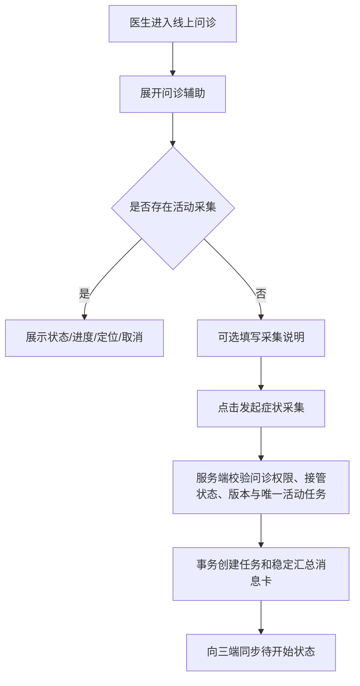
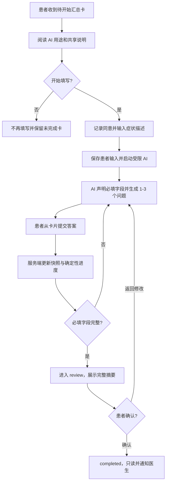

# DOCTOR-WORKSPACE-000005 线上问诊辅助与症状采集需求确认工单

> 工单状态：方案已确认，待实施
> 当前阶段：完整实施方案已形成，本工单未修改业务代码
> 适用系统：SparkService、chat-web、SparkClient（iOS 患者端）
> 关联工单：DOCTOR-WORKSPACE-000004、CHAT-000062

## 1. 需求背景

线上问诊已经支持医生接管会话、查看患者资料与附件、发送消息、结束问诊，以及查看 AI 摘要和风险提示。但医生在问诊过程中发现患者主诉不完整时，目前只能依赖普通文本反复追问，无法发起结构化的症状采集。

本需求拟在医生端“问诊详情”底部增加可折叠的“问诊辅助”区域。医生可从中发起“症状采集”，系统向当前问诊会话插入症状采集汇总卡片和后续问答卡片；患者先填写症状描述，再由 AI 继续补齐症状信息。AI 在本流程中只负责采集、补全、摘要与确认，不代替医生诊断。采集结束后，医生端在原问诊会话中查看结构化结果，用于辅助后续人工问诊。

用户提供的截图仅作为页面位置与视觉关系参考，不把截图中的文字或操作视为额外需求指令。

## 2. 用户目标与问题范围

### 2.1 医生目标

- 在当前线上问诊内快速发起一次结构化症状采集。
- 不离开问诊详情页即可看到采集状态与最终结果。
- 用患者已确认的症状摘要辅助后续人工问诊。

### 2.2 患者目标

- 在现有会话中收到清晰的症状采集入口。
- 先输入自己的症状描述，再通过 AI 生成的交互式问题卡补全信息。
- 每轮回答后看到已采集信息更新，最终确认完整症状结果。

### 2.3 AI 边界

- 只负责症状信息采集、缺失字段追问、内容归纳和用户确认。
- 不输出诊断结论、治疗方案或替代医生决策。
- 紧急风险仍沿用现有医疗风险提示能力，不在症状采集工具内重复建设诊断能力。

## 3. 当前代码事实

### 3.1 医生问诊页面

- `chat-web/components/doctor/ConsultDetailPanel.tsx` 是截图对应的问诊详情主体。
- 页面底部现有 `ConsultAssistSection`，标题为“AI 摘要与风险提示”，使用原生 `details/summary` 折叠结构。
- 消息区使用 `DoctorMessages variant="consult"`，输入区使用 `DoctorComposer`。
- 页面当前没有“问诊辅助”区域，也没有医生发起症状采集的按钮、表单或状态展示。

### 3.2 医生消息读取与渲染

- `hospital_care/api/staff/views.py::DoctorConversationMessagesView` 从 `ChatMessage` 读取会话消息并通过 `serialize_message` 返回。
- `hospital_care/api/presenters.py::serialize_message` 复用聊天同步层 `_to_payload`，因此已持久化的 canonical 消息块会随医生消息接口返回。
- `chat-web/lib/api/hospital-api.ts::getMessages` 会对服务端返回的 `blocks` 执行 `normalizeMessageBlocks`。
- `chat-web/components/doctor/DoctorMessages.tsx` 对医生、患者和 AI 消息复用 `ChatBlockRenderer`，理论上能够显示已注册的通用消息块。

### 3.3 已有症状采集通用能力

- `chat_sync/contracts/canonical.py` 已定义 `symptomCollectionCard` 和 `toolQuestionCards` canonical kind。
- `ai_config/models.py` 已登记 `collect_symptoms`，显示名为“症状采集”。
- `chat-web/components/chat/blocks/SymptomCollectionBlock.tsx` 已实现症状汇总、进度、问答记录和折叠展示。
- `chat-web/lib/chat/symptom-collection.ts` 已按 `collectionId` 聚合一张症状汇总卡与多轮问答卡。
- `chat-web/components/chat/blocks/registry.tsx` 已注册 `symptomCollectionCard` 和 `toolQuestionCards`。
- iOS 患者端已有 `collect_symptoms` 工具、症状汇总模型和问答卡片基础实现，可作为患者交互端复用基础。

### 3.4 当前缺失链路

- 没有“医生请求患者完成症状采集”的服务端业务对象或明确状态机。
- 没有医生端发起采集的 API、权限校验、幂等和并发控制。
- 没有定义医生发起后，如何可靠地唤起患者侧 AI 采集流程。
- 没有区分医生端只读结果、患者端可交互问题卡的渲染权限。
- 没有为医生工作台提供采集中、待患者填写、已完成、已取消、已失效等状态摘要。

## 4. 已知偏差与风险

- 仅向会话写入一张普通消息卡，不能保证患者端 AI 自动继续采集，也无法可靠处理重进应用、断网和多端同步。
- 若没有独立任务 ID 和状态约束，同一问诊可能并发出现多套问答，回答会被错误合并到其他症状汇总卡。
- 问答卡片如果在医生端也保持可点击，会产生越权代答和患者确认失真。
- AI 输出若未严格限制为采集用途，可能越界生成诊断或治疗建议。
- 直接复用聊天消息作为唯一状态源虽然展示简单，但难以实现幂等发起、任务恢复、取消和审计。

## 5. 初步业务目标

1. 医生端问诊详情新增“问诊辅助”折叠入口。
2. 首期辅助能力提供“症状采集”。
3. 医生发起后，患者会话先出现稳定的症状汇总卡，再进入 AI 补充问答。
4. 每轮患者回答更新同一份症状汇总，并保留可折叠问答记录。
5. 所有必填信息完成后，由患者确认最终症状摘要。
6. 医生端实时看到采集进度，完成后查看只读结果。
7. 整个流程支持刷新、重启、跨端同步、失败重试和审计。

## 6. 初步页面/UI 原型

### 6.1 医生端

```text
┌ 问诊详情                                      问诊中  结束问诊 ┐
│ ...患者资料 / 对话消息...                                      │
├ 医生回复输入区                                                   ┤
├ ▸ 问诊辅助                                      症状采集状态摘要 ┤
│   ┌ 症状采集                                                   ┐ │
│   │ 发起采集 / 查看进度 / 查看结果 / 取消（按最终权限决定）     │ │
│   └────────────────────────────────────────────────────────────┘ │
├ ▸ AI 摘要与风险提示                              未生成 / 风险等级 ┤
└─────────────────────────────────────────────────────────────────┘
```

### 6.2 患者端会话

```text
[症状信息汇总卡：待填写 / 采集中 / 待确认 / 已完成]
  ↓
[输入症状描述]
  ↓
[AI 问答卡：每卡 1～3 题]
  ↓ 患者提交
[答案摘要气泡] + [原位更新症状汇总卡]
  ↓
[最终确认]
  ↓
[已完成症状结果：只读，可展开查看完整信息]
```

## 7. 当前关键文件

- `chat-web/components/doctor/ConsultDetailPanel.tsx`
- `chat-web/components/doctor/DoctorMessages.tsx`
- `chat-web/components/doctor/DoctorComposer.tsx`
- `chat-web/context/DoctorConversationsContext.tsx`
- `chat-web/lib/api/hospital-api.ts`
- `chat-web/components/chat/blocks/SymptomCollectionBlock.tsx`
- `chat-web/lib/chat/symptom-collection.ts`
- `hospital_care/api/staff/views.py`
- `hospital_care/api/presenters.py`
- `hospital_care/services/doctor_message_service.py`
- `hospital_care/models/conversations.py`
- `chat_sync/contracts/canonical.py`
- `ai_config/models.py`
- `/Users/hua/Documents/project/Reference/LookHealthClient/SparkClient/SparkClient/Projects/Core/AIRuntime/ToolHub/Tools/ToolHubCollectSymptoms.swift`

## 8. 当前非目标

- AI 自动诊断、开药或生成治疗方案。
- 修改医生最终医疗判断。
- 首期扩展到视频问诊、电话问诊或院外第三方聊天渠道。
- 将症状采集结果直接写入正式电子病历；是否形成病历数据需另行确认。
- 重做现有 AI 摘要与风险提示模块。

## 9. 一问一答确认记录

### 第 1 问：谁可以发起症状采集，以及同一问诊允许几个进行中的采集任务？

为什么要问：这决定服务端任务所有权、权限校验、幂等键、并发状态机，也决定患者端收到多张采集卡时如何关联回答。若不先固定，同一会话可能出现重复采集、回答串单或医生与患者相互覆盖。

请选择：

- A. 仅当前接诊医生可发起，同一问诊同一时间只允许一个进行中的症状采集（推荐）
  患者负责回答与最终确认；医生可查看状态和结果。新一轮采集必须等待上一轮完成、取消或失效，链路最清晰，也最容易审计和恢复。
- B. 当前接诊医生与患者都可发起，但同一时间仍只允许一个进行中的采集
  灵活性更高，但需要处理双方同时点击的并发冲突，并在 UI 中明确发起方。
- C. 仅当前接诊医生可发起，并允许同一问诊并行存在多个进行中的采集
  可针对不同主诉分别采集，但患者容易混淆，任务与回答关联、通知和展示复杂度显著增加。
- D. 仅患者可自行发起，医生端“问诊辅助”只查看进度和结果
  服务端最少新增医生操作，但不符合医生主动要求患者补全症状的主要场景。

#### 第 1 问确认

**已确认选择 A：仅当前接诊医生可发起，同一问诊同一时间只允许一个进行中的症状采集。**

落地约束：

- 发起权限绑定当前问诊的接诊医生；其他医生、患者和 AI 均不能创建采集任务。
- 问诊必须处于医生已接管且未结束状态，才允许发起症状采集。
- 同一个 `thread_id` 同一时间最多存在一个未结束的症状采集任务。
- 服务端负责原子校验并发状态；重复点击或并发请求返回同一个活动任务，不能插入重复汇总卡。
- 患者只负责填写、继续问答、最终确认或按后续规则退出，不拥有创建权限。
- 医生可查看采集进度和结果；医生是否可以取消进行中的任务将在后续问题中确认。
- 上一任务完成、取消或失效后，医生才可新建下一次采集；每次采集使用独立 `collection_id`，历史结果保持只读。

### 第 2 问：医生发起症状采集时，需要提供什么初始信息？

为什么要问：这决定“问诊辅助”展开后的操作复杂度、创建 API 请求体，以及患者首次看到的是直接填写主诉、医生指定目标，还是预设问卷。它还决定 AI 后续追问应围绕患者自由描述，还是围绕医生预先设定的方向。

请选择：

- A. 医生一键发起，可选填写一句采集说明；患者先自由输入症状描述，再由 AI 动态追问（推荐）
  默认无需医生配置即可快速发起；医生可选填写“请重点补充头晕发作情况”等说明。AI 只围绕患者描述和医生说明采集，不输出诊断。
- B. 医生必须填写采集目标或首个问题，填写后才能发起
  采集方向更明确，但增加医生操作成本；空内容时无法发起。
- C. 医生必须从固定症状模板中选择后才能发起
  结构稳定，但需要维护模板库，且对复杂或非典型症状适配较差。
- D. 医生手动编辑全部问题和选项，AI 只负责汇总答案
  医生控制最强，但不再是 AI 辅助动态采集，配置成本最高。

#### 第 2 问确认

**已确认选择 A：医生一键发起，可选填写一句采集说明；患者先自由输入症状描述，再由 AI 动态追问。**

落地约束：

- “问诊辅助 > 症状采集”默认提供一键发起按钮，不要求医生配置模板或预先编辑问题。
- 医生可选填写一条采集说明，作为本次采集的目标提示；未填写时仍可正常发起。
- 采集说明仅用于约束 AI 的信息采集范围，并随采集任务持久化和审计；不能包含让 AI 诊断、开药或给出治疗方案的指令。
- 创建请求至少包含 `thread_id`、可选 `instruction`、客户端幂等键和当前问诊版本。
- 创建成功后先在会话中插入症状汇总卡和患者填写入口，不能直接由 AI 假定患者症状。
- 患者提交首段自由文本后，AI 根据患者描述、医生可选说明和当前采集快照动态生成后续问题。
- 后续问题继续遵循已有症状采集通用框架：动态字段、每卡 1～3 题、每题 2～8 个选项，支持单选、多选和“其他”短文本。

### 第 3 问：医生已接管问诊时，症状采集 AI 应以什么方式运行？

为什么要问：当前线上问诊在医生接管后，普通患者消息不会触发 AI 自动回复。如果直接恢复整个会话的 AI，可能与真人医生同时回答并越过“AI 只采集”的边界；如果没有独立运行链路，患者提交症状后又无法自动进入后续问答。

请选择：

- A. 为当前症状采集任务启用独立、受限的 AI 运行链路，不恢复普通会话 AI（推荐）
  只有属于活动 `collection_id` 的患者输入和问答提交会触发 `collect_symptoms`；AI 只能生成采集问题、更新摘要和请求确认。普通聊天仍只由医生回复。
- B. 发起采集后临时把整个问诊切回 AI 服务，采集完成再恢复医生接管
  可复用普通 AI 会话链路，但采集期间患者的其他消息也可能触发 AI 回复，容易与医生并发和越界。
- C. AI 只生成第一轮问题，后续由医生手动决定是否继续生成
  医生控制更强，但患者无法连续自主完成采集，医生操作负担较大。
- D. 不调用 AI，改用服务端固定规则问卷完成采集
  行为最可控，但无法根据患者自由描述动态追问，不符合本需求的 AI 辅助目标。

请选择 A、B、C 或 D。

#### 第 3 问确认

**已确认选择 A：为当前症状采集任务启用独立、受限的 AI 运行链路，不恢复普通会话 AI。**

落地约束：

- 症状采集运行态绑定 `collection_id`，与问诊会话的普通 AI 自动回复状态分离。
- 医生保持 `doctor_joined` 接管状态；发起和完成症状采集均不得把整个问诊切回 `ai_active`。
- 只有明确属于活动症状采集任务的患者输入、选项提交和最终确认事件，才能触发采集 AI。
- 患者在普通聊天输入框发送的其他消息继续作为问诊消息交给医生，不触发采集 AI。
- 采集 AI 的系统约束只允许调用 `collect_symptoms` 及现有医疗风险提示能力，不允许输出诊断、处方或治疗建议。
- 每次模型调用只接收本次采集所需的医生说明、患者症状输入、当前症状快照和已提交答案摘要，避免将普通问诊全部内容无边界注入。
- 模型调用失败时保留已采集数据和当前问题，患者可重试；失败不能改变医生接管状态。
- 采集完成后结束独立 AI 运行态，仅保留只读结果和审计记录，普通问诊继续由医生处理。

### 第 4 问：患者的症状输入应通过哪个入口提交？

为什么要问：医生接管期间，患者仍可能通过普通聊天向医生发送消息。如果系统把下一条普通消息自动识别为症状答案，就可能误消费患者发给医生的内容；入口设计必须让普通问诊消息与症状采集事件具有确定性的路由边界。

请选择：

- A. 只通过症状采集卡内的“填写症状”和问答提交入口触发采集 AI（推荐）
  汇总卡提供明确按钮或内嵌输入区；患者从卡片提交自由描述和后续答案。普通聊天输入框始终只发送给医生，事件通过 `collection_id` 精确关联。
- B. 发起采集后，患者下一条普通聊天文本自动作为症状描述
  操作步骤少，但患者若先回复医生其他问题，内容会被错误纳入症状采集。
- C. 发起采集后，把页面主输入框临时切换为“症状采集模式”
  输入区域更大，但会中断患者与医生的普通沟通，还需要明显的模式提示和退出机制。
- D. 点击卡片后跳转到独立症状采集页面完成
  交互边界最明确，但脱离当前问诊上下文，页面跳转和返回同步成本更高。

请选择 A、B、C 或 D。

#### 第 4 问确认

**已确认选择 A：只通过症状采集卡内的“填写症状”和问答提交入口触发采集 AI。**

落地约束：

- 患者端先展示一张绑定 `collection_id` 的症状汇总卡，卡内提供“填写症状”入口。
- 患者自由描述、每轮选择题、“其他”短文本和最终确认均通过卡片专用事件接口提交。
- 卡片事件必须携带 `collection_id`、当前任务版本、问题或交互 ID 以及客户端幂等键。
- 普通聊天输入框不切换模式，也不自动消费下一条消息；其消息始终进入医生问诊对话。
- 症状卡片输入与普通聊天可同时存在，患者不需要退出采集才能给医生发送普通消息。
- 采集卡失效、已取消或已完成后，所有可编辑入口变为只读；旧卡提交返回明确状态错误并刷新最新任务快照。
- 客户端必须在卡片上清楚标识“由 AI 辅助采集，仅用于补充问诊信息”，避免患者误认为在与医生实时对话。

### 第 5 问：症状采集进行期间，医生端应看到哪些内容？

为什么要问：这决定医生消息接口需要同步哪些中间态，也决定患者尚未最终确认的信息能否提前用于医生判断。若没有明确区分“患者已提交”与“AI 正在询问”，医生可能把未确认内容误认为最终病史。

请选择：

- A. 实时显示采集进度和患者已提交内容；未回答问题只显示数量，最终确认后标记为完整结果（推荐）
  医生可及时了解进展，但所有中间内容明确标注“采集中/未经最终确认”；问题卡在医生端只读，不显示可操作选项。
- B. 采集中只显示进度百分比，患者最终确认后才展示全部症状内容
  语义最稳妥，但医生无法在采集期间利用患者已提供的信息继续问诊。
- C. 实时显示汇总、全部问题、选项和患者答案，包括尚未回答的问题
  信息最完整，但医生页面噪声较大，且容易把 AI 待问内容误解为患者陈述。
- D. 医生端不显示任何过程，只在会话中收到一条“采集完成”文本通知
  实现简单，但无法发挥结构化卡片和进度辅助价值。

请选择 A、B、C 或 D。

#### 第 5 问确认

**已确认选择 A：实时显示采集进度和患者已提交内容；未回答问题只显示数量，最终确认后标记为完整结果。**

落地约束：

- 医生端实时接收任务状态、确定性进度、患者已提交字段和当前结果版本。
- 采集中内容必须显示“患者已提交、未经最终确认”，不能使用“完整病史”或“最终结论”等文案。
- 未回答问题仅向医生展示剩余题数或缺失字段数，不展开 AI 为患者准备的选项，避免信息噪声和误解。
- 医生端所有症状问题卡均为只读；不能代替患者选择、修改或最终确认。
- 患者每次提交后，服务端先更新任务快照和进度，再向医生端同步；医生刷新页面或重新登录后应恢复相同状态。
- 患者最终确认后，任务状态变为 `completed`，结果显示“患者已确认”，并固定最终确认时间和版本。
- 进度由服务端根据必填字段完成情况确定性计算，客户端只展示服务端结果，不自行猜测。

### 第 6 问：症状汇总卡与“问诊辅助”面板如何分工展示？

为什么要问：截图要求在页面底部增加“问诊辅助”，而症状结果又需要出现在问诊对话内。如果面板和消息区分别维护独立数据，容易出现进度不一致、刷新后丢卡或结果重复；需要确定唯一事实源和两个入口的职责。

请选择：

- A. 会话内保留一张稳定的症状汇总卡；“问诊辅助”负责发起、显示状态和定位该卡（推荐）
  发起时先插入汇总卡，后续原位更新；历史消息中永久保留。底部面板只显示当前任务摘要、操作按钮和“查看详情/定位卡片”，两处读取同一服务端任务快照。
- B. 症状内容只在“问诊辅助”面板展示，会话内只显示普通系统提示
  页面更简洁，但患者和医生无法在消息时间线中共同查看同一张症状卡。
- C. 症状内容只作为会话消息卡展示，“问诊辅助”仅保留一个发起按钮
  状态源简单，但医生需要滚动消息才能看到当前进度，底部辅助区域的信息价值较弱。
- D. 面板和会话分别保存一份症状结果，各自独立更新
  开发可局部推进，但会形成双状态源，存在不同步和重启后展示不一致风险。

请选择 A、B、C 或 D。

#### 第 6 问确认

**已确认选择 A：会话内保留一张稳定的症状汇总卡；“问诊辅助”负责发起、显示状态和定位该卡。**

落地约束：

- 医生发起成功后，服务端必须先创建任务并插入一张绑定 `collection_id` 的症状汇总消息卡，再允许后续患者填写和 AI 问答。
- 同一次采集在会话时间线中只保留一张汇总卡；进度、状态和症状字段通过任务版本原位更新，不能每轮新增一张汇总卡。
- 已回答的多轮问题记录归并到该汇总卡内并默认折叠；待回答问题仍以当前交互卡展示在患者端。
- “问诊辅助”面板读取同一任务快照，只显示发起入口、当前状态、进度、简要字段和“查看详情/定位卡片”。
- 面板不得复制保存另一份症状结果；页面刷新、重新登录和多端同步均以服务端任务及 canonical 消息块为准。
- 采集完成后，会话卡永久保留为只读历史记录；面板显示最近一次完成结果，并在满足并发规则时允许医生发起新一轮采集。
- 定位操作滚动到对应消息卡并提供短暂高亮，不新开页面，也不创建重复卡片。

### 第 7 问：未完成的症状采集允许谁主动结束？

为什么要问：同一问诊只能有一个活动采集。如果患者不愿继续、医生发现发起错误或问诊提前结束，却没有明确的取消规则，活动任务会长期占位并阻止新一轮采集；同时需要决定未完成数据是否保留供双方查看。

请选择：

- A. 医生可取消，患者可选择“不再填写”；两者都会结束任务并保留只读的未完成汇总（推荐）
  记录取消发起方、原因、时间和最后快照；取消后不再调用 AI，可重新发起新任务，历史卡明确标记“未完成/已结束”。
- B. 只有医生可以取消，患者只能继续填写或等待任务失效
  管理权集中，但患者无法明确拒绝继续采集，体验和自主性较弱。
- C. 只有患者可以结束，医生发起后不能撤回
  保障患者控制权，但医生误操作或需求变化时无法及时释放活动任务。
- D. 双方都不能主动结束，只能完成采集或随问诊结束自动关闭
  状态最少，但容易产生长期占位任务，也不利于处理误发起。

请选择 A、B、C 或 D。

#### 第 7 问确认

**已确认选择 A：医生可取消，患者可选择“不再填写”；两者都会结束任务并保留只读的未完成汇总。**

落地约束：

- 当前接诊医生可在“问诊辅助”中取消活动任务；患者可在症状卡内选择“不再填写”。
- 医生取消与患者退出都必须经过服务端状态迁移，记录操作者、结束原因、结束时间、最终版本和最后一次症状快照。
- 结束后的任务统一停止后续模型调用，撤销待回答交互，并将所有输入控件切换为只读。
- 会话中的症状汇总卡不删除，状态明确显示“未完成 · 医生已取消”或“未完成 · 患者已结束”。
- 已提交症状字段和已回答记录继续保留；未回答问题不再展示为可操作状态。
- 任务进入终态后立即释放当前问诊的活动任务唯一约束，医生可重新发起新的症状采集。
- 重复取消、过期卡提交和并发结束请求必须幂等返回同一终态，不能重复写入系统消息或产生多个结束版本。

### 第 8 问：医生结束问诊时，如果仍有症状采集正在进行，应如何处理？

为什么要问：结束问诊会关闭医生服务，而症状采集 AI 是依附于本次问诊的辅助流程。如果两者状态不联动，问诊结束后 AI 仍可能继续提问，或活动任务永久占位；如果强制阻止医生结束，又可能影响紧急结束和异常处理。

请选择：

- A. 结束问诊时自动终止活动采集，保留只读未完成汇总，并停止所有采集 AI（推荐）
  问诊结束与采集终止在同一服务端事务中完成；历史卡标记“问诊已结束，采集未完成”，患者不能继续提交。
- B. 有活动采集时禁止结束问诊，必须先完成或手动取消
  状态最严格，但会增加医生操作步骤，也可能阻塞需要立即结束的场景。
- C. 问诊结束后允许患者继续完成症状采集
  患者可补齐信息，但结果产生时已没有活动医生服务，通知、责任和用途边界不清晰。
- D. 医生每次结束问诊时选择“终止采集”或“允许继续”
  灵活但增加结束确认复杂度，并形成两套问诊结束后的任务语义。

请选择 A、B、C 或 D。

#### 第 8 问确认

**已确认选择 A：结束问诊时自动终止活动采集，保留只读未完成汇总，并停止所有采集 AI。**

落地约束：

- 服务端结束问诊事务必须锁定当前问诊及其活动症状采集任务。
- 若存在活动任务，先将其迁移为终态并记录原因 `consultation_ended`，再完成问诊结束状态更新。
- 待回答交互立即失效，采集 AI 停止运行，后续回调不得继续写入问题或覆盖终态快照。
- 会话中保留症状汇总卡和已提交内容，状态显示“未完成 · 问诊已结束”。
- 患者端所有采集输入入口切换为只读，提交旧问题时返回任务已结束并同步最新快照。
- 医生结束问诊不因采集任务存在而被阻塞，也不额外增加第二次确认步骤。
- 问诊结束和任务终止必须保证原子性；部分失败时整体回滚，避免问诊与采集状态不一致。

### 第 9 问：症状采集任务是否设置独立的无操作超时？

为什么要问：线上问诊可能是异步进行，患者可能数小时后继续填写。超时过短会让正常采集中断；完全没有超时则可能让遗忘的任务长期占用“仅一个活动采集”的名额，不过医生和患者已经具备主动结束入口。

请选择：

- A. 不设置独立超时；只在完成、主动结束或问诊结束时终止（推荐）
  最符合异步问诊，患者关闭页面或重启应用后仍可继续；长期未处理任务由医生在“问诊辅助”中查看并取消。
- B. 连续 24 小时无采集操作后自动失效
  可自动释放任务，但患者次日继续时需要医生重新发起，且需明确超时提醒。
- C. 连续 2 小时无采集操作后自动失效
  状态回收快，但不适合异步问诊，误失效概率较高。
- D. 患者离开会话页面或应用重启后立即失效
  实现边界简单，但无法支持断网、切后台和跨设备恢复，体验最差。

请选择 A、B、C 或 D。

#### 第 9 问确认

**已确认选择 A：不设置独立超时；只在完成、主动结束或问诊结束时终止。**

落地约束：

- 活动任务不因患者关闭页面、应用切后台、客户端重启、短期离线或跨设备登录而失效。
- 患者重新进入问诊时，从服务端恢复活动任务、症状快照、当前待回答交互和确定性进度。
- 医生重新进入工作台时，“问诊辅助”和会话汇总卡恢复同一任务状态。
- 服务端不得把客户端在线状态作为任务生命周期依据。
- 长期未处理任务继续占用当前问诊的唯一活动任务名额，直到医生取消、患者结束、患者完成或问诊结束。
- UI 应显示最后更新时间，便于医生判断是否需要取消长期停滞的采集。
- 后续若需要平台级自动清理，只能新增独立运营策略，不得在本期隐式加入客户端超时。

### 第 10 问：症状采集数据应以什么形式持久化？

为什么要问：历史问题已经证明，仅依赖客户端内存或消息块重建会导致应用重启后卡片消失；但直接写入正式病历或长期健康档案，又会把未经医生审核的患者自述升级为医疗记录。需要明确任务状态、消息展示与正式医疗数据之间的边界。

请选择：

- A. 新增服务端症状采集任务作为唯一事实源，同时投影 canonical 消息块；暂不写入正式病历（推荐）
  任务保存状态、版本、字段快照、回答记录和确认信息；消息块用于跨端展示。医生可查看结果，但其性质仍是“患者自述的问诊辅助信息”。
- B. 只保存 canonical 消息块，不新增独立任务模型
  改动较少，但幂等、并发、恢复、取消和状态查询都依赖扫描消息，稳定性较差。
- C. 完成后自动合并到患者长期健康档案
  后续复用方便，但患者本次自述会影响其他场景，需要额外的数据纠错、授权和版本治理。
- D. 完成后自动生成正式电子病历记录
  医疗价值最高，但需要医生审核签署、病历规范、修改留痕和更严格的合规设计，明显扩大本期范围。

请选择 A、B、C 或 D。

#### 第 10 问确认

**已确认选择 A：新增服务端症状采集任务作为唯一事实源，同时投影 canonical 消息块；暂不写入正式病历。**

落地约束：

- 新增服务端症状采集任务模型，至少关联问诊绑定、会话、发起医生和患者成员，并保存 `collection_id`、状态、版本和时间戳。
- 任务保存医生可选说明、动态必填字段声明、当前结构化症状快照、进度、当前待回答交互、最终确认信息和终止信息。
- 回答记录采用服务端持久化并具备稳定 ID、顺序、版本和幂等约束，不能只存在客户端或模型上下文中。
- `symptomCollectionCard` 与 `toolQuestionCards` 是任务状态的 canonical 展示投影；客户端重建 UI 时优先读取服务端任务和规范消息块，不能依赖内存缓存。
- 任务状态更新与消息块投影更新必须处于同一事务或可靠事件链路，失败可重试且不会生成重复卡。
- 完成结果明确标注为“患者自述、AI 辅助整理、患者已确认”，不自动进入正式病历或长期健康档案。
- 医生后续如需引用到病历，应由未来独立需求设计医生审核、签署和来源追踪，本期不隐式写入。

### 第 11 问：必填字段、进度和“允许最终确认”的条件由谁决定？

为什么要问：AI 适合根据不同症状动态生成采集维度，但如果进度也完全由模型自由描述，就可能出现进度倒退、必填项未完成却提前确认，或不同客户端显示不一致。需要把动态性与确定性校验分开。

请选择：

- A. AI 声明本次动态必填字段，服务端校验后确定性计算进度；全部必填完成才允许最终确认（推荐）
  兼顾不同症状的动态问法与稳定状态机；客户端只展示服务端进度和缺失字段，不自行计算。
- B. 使用一套固定的通用必填字段，所有症状都按同一问卷完成
  规则稳定，但会产生大量无关问题，也难覆盖不同症状的特异信息。
- C. AI 直接返回进度百分比和是否可以确认，服务端不复核
  实现简单，但模型输出可能不稳定，难以保证跨端一致和验收。
- D. 不设置必填条件，患者任何时候都可以确认完成
  流程最短，但可能生成明显不完整的采集结果，降低医生使用价值。

请选择 A、B、C 或 D。

#### 第 11 问确认

**已确认选择 A：AI 声明本次动态必填字段，服务端校验后确定性计算进度；全部必填完成才允许最终确认。**

落地约束：

- AI 每次创建或修订采集计划时返回结构化 `required_fields`、字段标签、字段类型和当前问题所补充的 `field_key`。
- 服务端使用允许的数据类型和字段数量上限校验模型声明，拒绝空键、重复键、不可展示结构和越界字段。
- 服务端根据当前快照中已完成的必填字段数量确定性计算 `progress`、`missing_fields` 和 `can_review`。
- 进度只能由服务端返回，Web 与 iOS 客户端不得根据问题轮数或模型文案自行推算。
- 必填字段未完成时，患者只能继续回答或结束采集；不能进入最终确认。
- 所有必填字段完成后进入 `review`，向患者展示完整症状摘要并允许确认或返回修改。
- 若模型后续修订必填字段，服务端必须递增版本并重新计算进度；已完成字段不得无理由丢失。
- 防止无进展和重复提问：连续生成相同缺失字段、相同问题或没有新增有效信息时，服务端停止自动循环并提供重试或结束入口。

### 第 12 问：患者最终确认后，症状结果是否允许修改？

为什么要问：最终确认是医生判断信息可靠性的关键标记。如果确认后仍能原位修改，医生先前看到或引用的内容会无声变化；完全锁定则需要明确纠错方式和历史版本关系。

请选择：

- A. 确认后任务与汇总卡只读；需要纠错时由医生重新发起一次采集（推荐）
  最终结果具有稳定版本和确认时间；新采集使用新的 `collection_id`，历史记录不覆盖，可追溯前后差异。
- B. 患者确认后仍可随时编辑原任务，医生端实时看到最新内容
  纠错方便，但已确认结果会被无声改变，审计和医生引用语义不稳定。
- C. 只有医生可以修改患者已确认的结果
  医生可快速纠正，但会改变“患者自述并确认”的事实，需要额外审核和署名机制。
- D. 医生和患者都可以修改，系统只保留最新版
  操作灵活，但来源、责任和历史版本不可追溯，不适合医疗问诊信息。

请选择 A、B、C 或 D。

#### 第 12 问确认

**已确认选择 A：患者确认后任务与汇总卡只读；需要纠错时由医生重新发起一次采集。**

落地约束：

- 患者最终确认后，任务状态进入不可逆的 `completed`，固定确认人、确认时间、最终快照哈希和版本。
- 医生端与患者端的汇总卡均切换为只读，不再显示修改、继续回答或重新确认入口。
- 服务端拒绝对已完成任务提交答案、更新字段、取消或覆盖快照；重复确认按幂等请求返回同一完成结果。
- 医生不能代改患者已确认内容，也不能把医生意见写回患者自述字段。
- 若信息有误，由当前接诊医生发起新的采集任务；新任务使用新的 `collection_id`，可选在内部记录 `supersedes_collection_id` 形成纠错链路。
- 原任务和原消息卡永久保留，不删除、不覆盖；新结果不会使历史记录消失。
- 医生页面对被后续采集替代的结果显示“已有更新版本”，并可定位最新结果，但仍允许查看历史内容。

### 第 13 问：症状采集 AI 可以读取哪些患者上下文？

为什么要问：读取完整问诊、健康档案或历史病历可能减少重复询问，但会扩大隐私使用范围，也可能把医生推测、旧病史或其他场景内容误当成本次患者自述。需要明确本次采集的数据边界和来源标识。

请选择：

- A. 只读取本次采集内患者主动提交的内容、医生可选说明和当前任务快照（推荐）
  每次从零采集，不自动读取普通问诊消息、历史采集、长期健康档案或病历；数据来源最清晰，避免模型混入未经本次确认的信息。
- B. 额外读取当前问诊的全部普通聊天消息
  可减少重复提问，但医生表述和患者闲聊可能被误并入症状摘要，需要复杂的来源区分。
- C. 额外读取患者长期健康档案和当前问诊消息
  信息更全面，但隐私范围明显扩大，还需处理历史信息过期、冲突和授权。
- D. 读取患者全部历史问诊、病历、健康档案和当前对话
  上下文最丰富，但最容易造成跨场景污染，合规、性能和可解释性成本最高。

请选择 A、B、C 或 D。

#### 第 13 问确认

**已确认选择 A：只读取本次采集内患者主动提交的内容、医生可选说明和当前任务快照。**

落地约束：

- 新任务从空症状快照开始，不自动继承上一轮症状采集结果。
- 模型输入仅包含本次医生说明、患者在卡片内提交的自由文本、已提交答案摘要、当前结构化快照和缺失字段。
- 普通问诊消息、医生回复、历史采集、长期健康档案、病历和其他会话不得默认加入模型上下文。
- 服务端为每段输入记录来源类型，至少区分 `doctor_instruction`、`patient_description`、`patient_answer` 和 `task_snapshot`。
- 医生说明只影响采集方向，不得作为患者症状事实写入最终摘要；只有患者提交或确认的内容可进入患者自述字段。
- 若后续需要引用健康档案或历史病历，必须另立需求并增加明确授权、来源展示和冲突处理。
- 发送给模型的上下文遵循最小必要原则，不包含与本次采集无关的患者身份和敏感资料。

### 第 14 问：医生端如何接收症状采集的进度与完成通知？

为什么要问：医生可能停留在当前问诊，也可能切换到其他患者。如果只更新当前页面，医生离开后会错过完成结果；如果每次患者回答都强提醒，又会造成大量干扰。需要确定实时更新、未读计数和通知粒度。

请选择：

- A. 复用现有会话实时同步；过程静默更新，完成或异常时生成一次未读提醒（推荐）
  当前页面实时更新汇总卡和辅助面板；医生不在该会话时，患者每轮回答不重复提醒，仅在采集完成、患者结束或任务异常时增加一次会话未读并显示状态摘要。
- B. 患者每提交一轮答案都增加医生未读提醒
  医生掌握最及时，但多轮采集会产生大量未读和列表抖动。
- C. 不产生任何未读或通知，医生打开会话时再查看
  干扰最少，但医生可能长期不知道患者已经完成采集。
- D. 完成后使用站外推送或短信通知医生
  到达率高，但扩大通知渠道、隐私内容和运维范围，不适合作为首期默认方案。

请选择 A、B、C 或 D。

#### 第 14 问确认

**已确认选择 A：复用现有会话实时同步；过程静默更新，完成或异常时生成一次未读提醒。**

落地约束：

- 症状任务、汇总卡和问答交互更新复用现有会话同步通道与增量拉取机制，不新增独立轮询体系。
- 医生停留在当前问诊时，进度和已提交内容实时原位更新，不为患者每轮回答生成新的未读提醒。
- 医生不在当前问诊时，中间进度保持静默同步；任务完成、患者主动结束、医生外终止原因或需人工处理的异常分别最多生成一次未读提醒。
- 提醒关联 `collection_id` 和对应汇总消息 ID，医生点击后直接进入问诊并定位卡片。
- 重连或增量拉取必须按任务版本去重，不能把同一终态事件重复计入未读。
- 医生标记会话已读后，历史终态事件不再次提醒；任务后续若无新版本则保持已读。
- 首期不发送短信、电话或站外推送，也不在提醒中暴露具体敏感症状内容。

### 第 15 问：AI 生成下一轮问题失败时，采集流程如何处理？

为什么要问：患者答案可能已经成功保存，但模型请求随后超时或失败。如果直接回滚答案会丢数据；如果自动无限重试会重复生成问题并增加成本。需要固定可恢复状态和重试责任。

请选择：

- A. 保留已提交数据，将任务标记为可重试；患者点击“继续生成”后从同一版本恢复（推荐）
  服务端保存答案后再异步调用模型；失败时不撤销答案、不创建重复问题。患者可重试，医生看到“采集暂时中断”，达到重试上限后仍可结束任务。
- B. 服务端自动持续重试，直到模型成功
  患者无需操作，但故障期间可能长时间占用资源，且重复回调和成本难控制。
- C. 模型失败后立即取消整个采集任务
  状态简单，但已采集信息无法继续补全，患者需要从头开始。
- D. 只有医生可以在工作台手动重试
  医生控制明确，但患者无法自主恢复，会增加医生值守负担。

请选择 A、B、C 或 D。

#### 第 15 问确认

**已确认选择 A：保留已提交数据，将任务标记为可重试；患者点击“继续生成”后从同一版本恢复。**

落地约束：

- 患者答案先以事务方式持久化并递增任务版本，再触发下一轮模型调用；模型失败不得回滚已提交答案。
- 失败时任务进入可恢复状态，保留症状快照、缺失字段、当前版本和失败阶段，不生成伪造的下一轮问题。
- 患者端汇总卡显示“生成暂时中断”，提供“继续生成”和“不再填写”；普通问诊输入仍可使用。
- “继续生成”携带原任务版本、失败调用 ID 和幂等键，从已保存快照继续，不能重复消费同一答案或生成重复问题卡。
- 服务端允许有限次数的基础网络重试；达到上限后等待患者显式继续，不进行无限后台调用。
- 医生端显示“采集暂时中断”，并按第 14 问规则生成一次异常未读提醒；医生仍可取消任务。
- 重试成功后清除异常状态并继续原任务；重试失败继续保留可重试状态，不自动创建新任务。

### 第 16 问：首期症状采集需要覆盖哪些客户端？

为什么要问：医生入口位于 Web 工作台，但患者可能从 iOS 客户端或 Web 聊天进入问诊。若只实现其中一端，同一问诊在另一端会看到不可操作卡片；服务端协议、验收矩阵和发布顺序必须提前固定。

请选择：

- A. 医生 Web 发起；患者 iOS 与 Web 均可完整填写，三端展示同一任务状态（推荐）
  服务端协议一次统一，患者换端后可继续；医生 Web 只读查看进度和结果。开发与测试范围最大，但跨端体验完整。
- B. 医生 Web 发起；首期仅患者 iOS 可填写，Web 患者端只读提示
  适合患者主要使用 App 的场景，但 Web 患者无法完成采集，需要明确引导打开 iOS。
- C. 医生 Web 发起；首期仅患者 Web 可填写，iOS 只读提示
  Web 联调集中，但移动端问诊主场景会缺失核心能力。
- D. 首期只实现医生 Web 发起和服务端任务，患者交互延后
  可先完成后台链路，但无法形成可验收的端到端症状采集流程。

请选择 A、B、C 或 D。

#### 第 16 问确认

**已确认选择 A：医生 Web 发起；患者 iOS 与 Web 均可完整填写，三端展示同一任务状态。**

落地约束：

- 医生端首期入口只位于 `chat-web` 线上问诊工作台，当前接诊医生可发起、取消、查看进度和结果。
- 患者 `chat-web` 与 iOS `SparkClient` 均需支持填写首段症状描述、回答动态问题、其他短文本、继续生成、结束采集、最终复核和确认。
- 三端使用同一 `collection_id`、状态枚举、版本、进度、必填字段和 canonical 消息块协议。
- 患者可在 Web 与 iOS 之间切换继续同一活动任务，已提交答案不得重复或丢失。
- 医生端只读渲染问题与结果，患者端根据服务端权限和任务状态决定是否显示交互控件，不能仅靠前端角色判断。
- 服务端、Web 患者端、Web 医生端和 iOS 必须纳入同一验收矩阵；任一端不支持活动卡片时不得宣告端到端完成。
- 其他客户端（HarmonyOS、Android 等）不在本期实现范围，但服务端协议保持平台无关。

### 第 17 问：患者开始 AI 症状采集前，如何完成知情提示与同意？

为什么要问：症状采集会把患者主动填写的信息交给 AI 整理并同步给接诊医生。需要让患者清楚知道 AI 的用途、信息去向和非诊断边界，同时避免重复弹窗破坏问诊流程。

请选择：

- A. 在症状汇总卡首屏展示简短说明，患者点击“开始填写”即视为本次明确同意（推荐）
  说明 AI 仅辅助采集、结果会提供给当前接诊医生、不能替代诊断；记录同意时间和版本，不新增独立弹窗。
- B. 点击“开始填写”后再弹出独立同意弹窗，确认后才能输入
  同意最醒目，但增加一步操作，Web 与 iOS 还需维护额外弹窗状态。
- C. 复用用户注册时的通用隐私协议，不在采集卡再次提示
  流程最短，但患者难以理解本次 AI 处理和医生共享的具体用途。
- D. 不要求任何提示或同意，医生发起后直接进入输入状态
  操作最少，但不利于医疗场景中的知情与数据用途透明。

请选择 A、B、C 或 D。

#### 第 17 问确认

**已确认选择 A：在症状汇总卡首屏展示简短说明，患者点击“开始填写”即视为本次明确同意。**

落地约束：

- 患者首次打开待开始卡片时展示简短说明：AI 仅辅助采集和整理症状、结果提供给当前接诊医生、不能替代医生诊断。
- “开始填写”按钮同时完成本次任务激活与明确同意；未点击前不调用模型、不开放问题提交。
- 服务端记录同意人、同意时间、说明文案版本、客户端类型和任务版本，作为任务审计字段。
- 患者拒绝时可选择“不再填写”，按第 7 问规则结束任务并保留只读未完成卡。
- Web 与 iOS 使用语义一致的说明和按钮，不得一端默认同意、另一端要求确认。
- 本期不新增全局授权弹窗，也不把注册时通用隐私协议视为本次采集的唯一同意依据。
- 说明区不得暗示 AI 会诊断疾病或提供治疗，持续不适和紧急情况仍提示及时就医。

### 第 18 问：医生端“问诊辅助”区域默认如何展开？

为什么要问：该区域位于问诊页面底部，若长期展开会挤压消息和输入空间；若始终折叠又可能让医生错过活动任务状态。需要确定默认状态、发起后的行为和重新进入页面时的表现。

请选择：

- A. 默认折叠；医生点击展开，发起后本次页面保持展开，重新进入时折叠但显示状态摘要（推荐）
  与截图底部辅助区域一致；折叠标题展示“未发起/待患者填写/采集中/待确认/已完成/异常”和进度，医生仍能快速感知状态。
- B. 只要存在活动任务就自动展开，完成后自动折叠
  进度更醒目，但医生每次切回会话都会被展开面板占用空间。
- C. 始终展开，不允许折叠
  操作直接，但明显压缩问诊消息区域，不适合长对话。
- D. 不在底部内联展开，点击后打开弹窗或抽屉
  主页面更简洁，但偏离截图中的内联区域，并增加额外层级。

请选择 A、B、C 或 D。

#### 第 18 问确认

**已确认选择 A：默认折叠；医生点击展开，发起后本次页面保持展开，重新进入时折叠但显示状态摘要。**

落地约束：

- “问诊辅助”以 `details/summary` 或等价可访问折叠组件实现，初次进入和重新进入问诊时默认折叠。
- 折叠标题始终显示症状采集状态；活动任务额外显示服务端进度，完成任务显示完成时间或“已完成”。
- 医生手动展开后，在当前页面生命周期内保持展开；成功发起任务后不自动折叠。
- 切换到其他问诊再返回时按默认折叠处理，不把展开状态作为服务端业务数据保存。
- 折叠区域内显示一键发起、可选说明、活动任务摘要、取消、查看详情和定位卡片等符合当前状态的操作。
- 异常状态在折叠标题提供非敏感提示，展开后显示重试由患者执行、医生可取消等处理说明。
- 键盘、屏幕阅读器和焦点状态必须可识别展开/收起，不仅依赖颜色或箭头方向表达状态。

### 第 19 问：症状采集任务和回答记录保存多久？

为什么要问：这些内容属于患者在问诊中提供的健康信息。永久保存会扩大隐私风险，过早删除又会破坏问诊追溯和历史卡片展示；应与现有会话生命周期形成明确关系。

请选择：

- A. 跟随所属问诊会话的现有保存与删除策略，删除会话时级联清理任务和消息投影（推荐）
  不另设独立永久保存或短期 TTL；任务、回答和卡片与问诊保持一致，审计字段按平台既有合规策略处理。
- B. 症状采集结果永久保存，即使问诊会话删除也保留
  便于长期追溯，但数据所有权和隐私风险最大，也与“暂不写入长期健康档案”冲突。
- C. 问诊结束 30 天后自动删除症状任务和回答
  数据最小化更强，但历史问诊中的卡片会变成缺失或不可查看，需要额外占位语义。
- D. 问诊结束后立即删除，只保留医生看到过的摘要文本
  隐私占用最小，但无法审计患者确认内容，也破坏跨端历史一致性。

请选择 A、B、C 或 D。

#### 第 19 问确认

**已确认选择 A：跟随所属问诊会话的现有保存与删除策略，删除会话时级联清理任务和消息投影。**

落地约束：

- 症状采集任务、回答记录、同意记录和 canonical 消息投影均从属于问诊会话生命周期。
- 本期不设置独立永久保留、30 天 TTL 或问诊结束即删除规则。
- 正常结束问诊只结束活动采集，不删除历史任务和已确认结果；医生和患者仍可按既有历史问诊权限查看。
- 当平台按现有规则删除或清理问诊会话时，级联清理症状任务、回答、待处理交互和展示投影，避免孤立健康数据。
- 审计日志是否脱敏保留遵循平台既有合规策略，不在业务表中额外复制患者症状全文。
- 数据导出、账号注销和隐私删除沿用现有会话数据出口与权限，不新增独立的症状数据出口。
- 缓存和搜索索引必须在源数据删除后同步失效，不能继续展示已删除任务摘要。

### 第 20 问：首期功能向哪些医生和问诊开放？

为什么要问：症状采集涉及模型调用和患者健康信息处理，需要明确准入条件，并保留模型异常时的快速停用能力。若按医生或医院逐个配置，会增加后台管理范围；若完全无开关，线上异常时无法及时止损。

请选择：

- A. 向所有具备有效资质且已接管的线上问诊医生开放，并提供服务端全局功能开关（推荐）
  无需新增医院或医生配置页面；关闭开关后禁止新建任务，已有任务按停用策略安全结束或只读，便于快速止损。
- B. 由每家医院管理员单独开启后，该院医生才可使用
  灰度能力更细，但需要新增医院级配置、后台页面和权限管理。
- C. 仅平台维护医生白名单开放
  适合小范围试点，但需要白名单运营流程，也会造成同院医生体验不一致。
- D. 对所有医院员工角色开放，不校验医生资质和接管关系
  覆盖最广，但不符合当前问诊所有权和医疗权限边界。

请选择 A、B、C 或 D。

#### 第 20 问选择记录（存在范围冲突，待第 21 问确认）

**用户选择 D：向所有医院员工角色开放，不校验医生资质和接管关系。**

冲突说明：

- 该选择与第 1 问“仅当前接诊医生可发起”直接冲突。
- 若按 D 的字面含义落地，护士、医院管理员及其他员工均可在未接管问诊时发起症状采集，第 1 问确认的所有权和权限约束将被覆盖。
- 为避免权限模型出现两套相反规则，第 20 问暂不进入最终结论，必须通过第 21 问明确覆盖范围。

### 第 21 问：第 20 问的 D 是否要覆盖第 1 问的“仅当前接诊医生可发起”？

为什么要问：这是服务端授权的核心边界。功能入口对所有员工可见，与所有员工都能操作，是两种完全不同的权限模型；若不明确，后端权限、审计责任和 UI 操作状态都无法实现。

请选择：

- A. 完全覆盖第 1 问：同院所有有效员工都可在任意该院问诊中发起和取消采集
  不校验医生资质或接管关系；需要把任务发起者从医生改为通用员工身份，并重写第 1 问所有权规则。
- B. 所有员工都能看到“问诊辅助”，但只有当前接诊医生可发起和取消
  入口可见范围扩大，操作权限仍遵循第 1 问；其他员工只读查看状态与结果。
- C. 所有员工都可查看结果，但只有当前接诊医生能看到并操作发起入口（推荐）
  保留第 1 问的医疗责任边界，同时允许院内协作人员查看患者已确认结果；服务端分别校验查看权和操作权。
- D. 撤回第 20 问的选择，改为第 20 问 A：仅有效资质且已接管的医生开放
  完全保持第 1 问结论，并增加服务端全局停用开关。

请选择 A、B、C 或 D。

#### 第 21 问确认

**已确认选择 B：所有员工都能看到“问诊辅助”，但只有当前接诊医生可发起和取消。**

范围修订结果：

- 第 20 问的 D 不覆盖第 1 问的任务所有权；第 1 问“仅当前接诊医生可发起”继续有效。
- “开放”拆分为展示权限和操作权限：员工可见辅助区域，当前接诊医生拥有任务写操作。
- 非当前接诊医生及其他员工看到只读状态，不显示可用的发起、取消或重试操作。
- 服务端不能只依赖前端隐藏按钮，发起与取消接口必须校验当前接诊医生身份和问诊状态。
- 任务审计的发起者和取消者仍使用医生身份；其他员工查看不会改变任务版本或状态。
- 第 20 问最终结论更新为：入口面向具备问诊页面访问权的医院员工显示，操作权仅授予当前接诊医生；是否扩大既有问诊访问权由第 22 问确认。

### 第 22 问：“所有员工可看到入口”是否扩大现有问诊访问权限？

为什么要问：当前问诊权限决定员工能否进入患者会话并读取健康信息。若为了显示“问诊辅助”而让全院员工访问全部问诊，会显著扩大患者数据可见范围；如果不扩大，则只有本来就能进入该问诊的员工看到入口。

请选择：

- A. 不扩大；仅已通过现有问诊权限校验的员工可看到入口（推荐）
  症状采集不改变会话数据权限。员工无法进入某个问诊时，也不能单独查看其症状任务或结果。
- B. 扩大为同院所有有效员工都能查看全部问诊及症状结果
  协作范围最大，但明显扩大患者隐私暴露，需要重做会话权限和访问审计。
- C. 仅额外开放给同院医生和护士，其他角色不可见
  需要新增护士等角色的问诊查看权限及角色矩阵，但比全员开放更可控。
- D. 仅额外开放给医院管理员，普通员工保持现状
  便于监管，但管理员将获得临床详情访问权，需要明确合规依据。

请选择 A、B、C 或 D。

#### 第 22 问确认

**已确认选择 A：不扩大现有问诊访问权限；仅已通过现有权限校验的员工可看到入口。**

落地约束：

- 症状采集功能不修改现有会话列表、详情和消息读取权限。
- 员工必须先通过现有 `DoctorConversationPermission` 或后续等价问诊权限，才能读取该问诊的辅助区域、任务状态和症状结果。
- 无权进入问诊的同院员工不能通过任务 ID、消息 ID 或新接口绕过会话权限读取症状数据。
- 在有权查看问诊的人员中，仅当前接诊医生拥有发起、填写医生说明和取消任务的写权限；其他人员只读。
- 患者端只允许问诊绑定的患者成员访问和操作自己的采集任务。
- 服务端所有任务读取、操作和事件接口都必须先校验所属问诊权限，再校验任务角色权限。
- 审计日志记录员工查看和操作主体，但本需求不新增全院问诊可见范围。

### 第 23 问：独立症状采集 AI 使用哪套模型与运行配置？

为什么要问：采集 AI 虽然不恢复普通会话 AI，但仍需要确定模型、供应商凭证、温度和工具白名单来源。复用当前医生智能体可保持医院配置一致；使用平台固定模型则更稳定，但会形成独立配置与成本归属。

请选择：

- A. 复用当前问诊绑定的医生智能体模型配置，但使用服务端固定的采集提示词和工具白名单（推荐）
  模型与供应商沿用当前问诊配置；运行时强制只开放 `collect_symptoms` 和医疗风险提示，不继承医生智能体的普通回答提示词与其他工具。
- B. 全平台统一使用一套固定症状采集模型，与医生智能体无关
  行为最一致，但需要新增全局模型配置、凭证、成本核算和故障切换。
- C. 每家医院单独配置症状采集模型
  医院控制更强，但需要新增后台配置、校验、发布和缺省回退机制。
- D. 由患者在客户端选择用于症状采集的模型
  灵活性高，但医疗问诊结果会因个人选择产生显著差异，也难以统一审计和保障工具能力。

请选择 A、B、C 或 D。

#### 第 23 问确认

**已确认选择 A：复用当前问诊绑定的医生智能体模型配置，但使用服务端固定的采集提示词和工具白名单。**

落地约束：

- 模型、供应商端点、凭证、采样参数和基础能力来源于当前问诊绑定的医生智能体运行配置。
- 症状采集运行时不直接复用医生智能体的普通系统提示词、人格回复规则或完整工具列表。
- 服务端注入固定的医疗症状采集系统提示词，明确仅采集、补全、摘要和请求患者确认，不进行诊断、处方或治疗建议。
- 工具白名单仅包含 `collect_symptoms` 与现有“医疗风险提示”；其他搜索、知识库、写入健康档案、预约或内容生成工具均不可调用。
- 发起任务前校验当前模型支持结构化工具调用；不支持时禁止创建并向医生显示明确原因，不能静默降级为自由文本问答。
- 运行记录保存模型配置版本和采集提示词版本，用于问题追溯，但不复制供应商密钥到任务数据。
- 模型配置在任务进行期间发生变化时，已开始任务继续使用创建时锁定的配置版本；新任务使用最新有效版本。

### 第 24 问：是否需要服务端全局功能开关，关闭时如何处理活动任务？

为什么要问：模型、提示词或跨端协议出现线上问题时，需要快速停止新增调用。如果直接删除入口或强制取消所有任务，可能丢失患者已提交信息；如果完全没有开关，则只能发版止损。

请选择：

- A. 提供全局开关；关闭后禁止新建并暂停后续 AI 调用，活动任务保留数据且可在重新开启后继续（推荐）
  医生和患者仍可查看只读状态，医生可取消；患者提交入口显示“服务暂不可用”。重新开启后从原版本继续，不自动重放失败调用。
- B. 提供全局开关；关闭后立即取消所有活动任务
  止损最彻底，但会中断正在填写的患者，且产生大量未完成记录。
- C. 不提供开关，问题只能通过发布新版本处理
  实现最少，但线上风险响应慢，无法立即停止模型调用。
- D. 仅提供客户端入口开关，不限制服务端接口
  UI 可快速隐藏，但旧客户端或直接请求仍可创建任务，不能形成可靠止损。

请选择 A、B、C 或 D。

#### 第 24 问确认

**已确认选择 C：不提供服务端全局功能开关，线上问题通过发布新版本处理。**

落地约束：

- 本期不新增服务端、医院级或医生级症状采集功能开关。
- 符合权限和问诊状态的客户端发布后直接显示入口，服务端接口按固定权限规则开放。
- 客户端不得实现仅隐藏 UI、但服务端仍视为停用的伪开关。
- 线上需要停止能力时，通过服务端版本回滚、修复发布或网关级应急措施处理，不在业务系统中维护运行时启停状态。
- 发布前必须验证数据库迁移可回滚或向前修复、旧客户端兼容、活动任务恢复和模型调用隔离，降低无开关带来的止损风险。
- 若未来需要灰度、医院级配置或紧急停用，应另立需求补充开关状态、活动任务处理和后台权限。

### 第 25 问：是否结束需求问答并补齐完整实施方案？

为什么要问：业务所有权、页面流程、AI 边界、任务状态、权限、持久化、跨端同步、异常恢复、隐私和发布范围已经确认。结束后将不再继续提问，而是在本工单中补齐最终流程、状态机、数据模型、API 契约、关键代码位置、测试矩阵、验收标准和实施顺序。

请选择：

- A. 结束问答，生成完整实施方案（推荐）
  采用前 24 问的最终结论，解决第 20～22 问的权限修订后输出可实施工单。
- B. 继续补充服务端 API 细节后再结束
  将继续逐项确认接口路径、请求字段和错误码。
- C. 继续补充 Web 与 iOS 视觉细节后再结束
  将继续逐项确认尺寸、文案、动画和无障碍表现。
- D. 暂停问答，保留当前需求确认中状态
  不生成最终实施方案，后续从第 25 问继续。

请选择 A、B、C 或 D。

#### 第 25 问确认

**已确认选择 A：结束问答，生成完整实施方案。**

落地约束：

- 后续方案以第 1～24 问的最终确认结论为准，不再保留相互冲突的实现规则。
- 第 20 问的 D 已由第 21、22 问收敛：有既有问诊查看权的员工可见入口和只读状态，只有当前接诊医生可发起与取消，不扩大问诊访问权限。
- 本工单进入“方案已确认，待实施”，后续代码实现如需改变业务边界，应回到工单追加范围修订记录。

## 10. 最终确认结论汇总

| 决策点 | 最终结论 | 实施影响 |
|---|---|---|
| 发起所有权 | 仅当前接诊医生可发起 | 服务端写接口必须校验 `doctor_joined` 和当前医生归属 |
| 活动任务数量 | 同一问诊同时最多一个 | 数据库约束 + 事务锁，重复请求返回同一活动任务 |
| 发起参数 | 一键发起，可选一句采集说明 | 不建设模板选择器或问题编辑器 |
| AI 运行方式 | 独立受限运行链路 | 不恢复普通会话 AI，不改变问诊接管状态 |
| 患者输入入口 | 仅从采集卡提交 | 普通聊天永远发给医生，不自动消费下一条消息 |
| 医生过程可见性 | 实时看进度与已提交内容 | 中间内容标记“未经最终确认”，问题卡只读 |
| 展示分工 | 会话稳定汇总卡 + 底部辅助入口 | 单一任务事实源；辅助面板只做操作、摘要和定位 |
| 主动结束 | 医生可取消，患者可结束 | 保留只读未完成快照，立即释放活动任务名额 |
| 问诊结束联动 | 自动终止活动采集 | 同一事务完成，停止 AI，保留历史卡 |
| 独立超时 | 不设置 | 关闭页面、重启、跨设备后继续同一任务 |
| 数据事实源 | 新增服务端任务与回答记录 | canonical 消息块是展示投影，不是唯一状态源 |
| 正式病历 | 暂不写入 | 结果标记为患者自述、AI 整理、患者确认 |
| 必填字段 | AI 动态声明，服务端校验 | 服务端确定性计算进度、缺失字段和确认资格 |
| 最终确认 | 必填完成后由患者确认 | 确认后任务和卡片不可修改 |
| 纠错 | 新建采集任务 | 旧任务保留，可用 `supersedes_collection_id` 关联 |
| AI 上下文 | 仅本次任务内容 | 不自动读取普通问诊、病历、健康档案或历史采集 |
| 医生通知 | 过程静默，终态或异常提醒一次 | 复用会话同步、未读和定位能力 |
| AI 失败 | 保留数据，患者点击继续生成 | 同版本恢复，不重复消费答案或重复生成卡 |
| 客户端范围 | 医生 Web、患者 Web、患者 iOS | 三端统一协议与验收矩阵 |
| 患者同意 | 卡片说明 + 点击开始填写 | 记录同意人、时间、文案版本和客户端 |
| 医生辅助区 | 默认折叠 | 本页发起后保持展开，重进折叠并显示状态摘要 |
| 保存期限 | 跟随问诊会话 | 会话清理时级联清理任务、答案和投影 |
| 员工可见性 | 不扩大既有问诊权限 | 有权查看问诊的员工可见只读状态，操作仍限当前医生 |
| 模型来源 | 复用当前医生智能体模型配置 | 固定采集提示词；只开放症状采集和风险提示工具 |
| 功能开关 | 不新增运行时开关 | 上线前强化兼容、迁移和版本回滚验证 |

## 11. 角色与权限矩阵

| 动作 | 当前接诊医生 | 其他有问诊查看权员工 | 当前患者 | 无问诊权限人员 |
|---|---:|---:|---:|---:|
| 查看问诊辅助入口 | 允许 | 允许 | 不适用 | 拒绝 |
| 发起症状采集 | 允许 | 拒绝 | 拒绝 | 拒绝 |
| 填写医生说明 | 允许 | 拒绝 | 拒绝 | 拒绝 |
| 查看进度与已提交摘要 | 允许 | 只读 | 允许 | 拒绝 |
| 回答症状问题 | 拒绝 | 拒绝 | 允许 | 拒绝 |
| 最终确认 | 拒绝 | 拒绝 | 允许 | 拒绝 |
| 取消活动任务 | 允许 | 拒绝 | 以“不再填写”结束 | 拒绝 |
| 查看历史结果 | 按问诊权限 | 按问诊权限只读 | 按本人问诊权限 | 拒绝 |

服务端必须先校验所属问诊访问权，再校验具体动作角色。前端隐藏按钮不能替代服务端授权。

## 12. 完整业务流程

### 12.1 医生发起



1. 医生进入已有问诊，页面按现有权限加载。
2. “问诊辅助”默认折叠，标题展示最近任务状态。
3. 当前接诊医生展开后可填写不超过 200 字的可选说明并发起。
4. 服务端锁定 `ClinicalConversationBinding`，确认状态为 `doctor_joined`、医生归属正确、问诊未结束且不存在活动任务。
5. 服务端在同一事务创建症状采集任务、初始事件和 `symptomCollectionCard` 投影。
6. 返回任务快照；重复幂等请求返回同一任务，不插入第二张汇总卡。

### 12.2 患者填写与 AI 追问



- 每张问题卡 1～3 题，每题 2～8 个中文选项。
- 支持单选、多选和“其他”短文本；短文本最多 200 字。
- 每次提交生成可读的患者答案摘要气泡，同时更新同一张汇总卡。
- 已回答轮次合并在汇总卡内并可折叠；当前待回答问题保持展开。
- 模型不得自行宣布完成；服务端仅在全部动态必填字段完成后允许 `review`。

### 12.3 失败、取消与恢复

- 模型失败：答案已经保存，任务进入 `generation_failed`，患者可“继续生成”或“不再填写”。
- 医生取消：终态 `cancelled_by_doctor`，保存最后快照和原因。
- 患者结束：终态 `cancelled_by_patient`，保存最后快照。
- 问诊结束：同一事务进入 `cancelled_by_consultation_end`。
- 页面刷新、应用重启、切换 Web/iOS：从服务端任务快照和 canonical 投影恢复，不创建新任务。
- 已完成结果纠错：医生发起新任务；旧结果不修改。

## 13. 状态机

### 13.1 建议状态枚举

```text
awaiting_patient_start  等待患者同意并填写首段描述
collecting             AI 追问与患者回答中
generation_failed      已保存数据，等待患者继续生成
review                 必填字段完整，等待患者最终确认
completed              患者已确认，终态
cancelled_by_doctor    医生取消，终态
cancelled_by_patient   患者结束，终态
cancelled_by_consultation_end  问诊结束联动终止，终态
```

活动状态：`awaiting_patient_start`、`collecting`、`generation_failed`、`review`。

### 13.2 合法迁移

| 当前状态 | 事件 | 下一状态 |
|---|---|---|
| 无任务 | 当前医生发起 | `awaiting_patient_start` |
| `awaiting_patient_start` | 患者开始并提交描述 | `collecting` |
| `awaiting_patient_start` | 医生取消/患者结束/问诊结束 | 对应取消终态 |
| `collecting` | 提交答案且仍有缺失字段 | `collecting` |
| `collecting` | 模型失败 | `generation_failed` |
| `generation_failed` | 继续生成成功 | `collecting` 或 `review` |
| `collecting` | 必填字段全部完成 | `review` |
| `review` | 返回修改 | `collecting` |
| `review` | 患者确认 | `completed` |
| 任一活动状态 | 医生取消/患者结束/问诊结束 | 对应取消终态 |

所有终态不可逆。旧版本请求返回版本冲突及最新快照，不能隐式覆盖。

## 14. 数据模型方案

### 14.1 `SymptomCollectionTask`

建议新增于 `hospital_care/models/symptom_collections.py`，并由 `hospital_care/models/__init__.py` 导出。

| 字段 | 类型 | 说明 |
|---|---|---|
| `id` | UUID PK | 内部任务 ID |
| `collection_id` | UUID unique | 跨端公开标识 |
| `binding` | FK `ClinicalConversationBinding` | 所属问诊 |
| `thread` | FK `ChatThread` | 冗余关联，便于同步与约束 |
| `member_id` | Integer | 患者成员快照 |
| `initiated_by_doctor` | FK `DoctorProfile` | 发起医生 |
| `instruction` | Text | 可选说明，最长 200 字 |
| `status` | CharField | 状态机枚举 |
| `required_fields` | JSONField | 模型声明且服务端校验后的字段定义 |
| `snapshot` | JSONField | 当前结构化症状快照 |
| `progress` | PositiveSmallInteger | 服务端计算，0～100 |
| `current_interaction_id` | UUID nullable | 当前待回答交互 |
| `summary_message` | FK `ChatMessage` | 稳定汇总消息 |
| `summary_block_id` | UUID | 稳定汇总 block ID |
| `model_config_version` | CharField | 创建时锁定的运行配置版本 |
| `prompt_version` | CharField | 固定采集提示词版本 |
| `consented_at` | DateTime nullable | 患者开始填写时间 |
| `consent_copy_version` | CharField | 同意文案版本 |
| `confirmed_at` | DateTime nullable | 最终确认时间 |
| `confirmed_snapshot_hash` | CharField | 最终快照哈希 |
| `ended_at` | DateTime nullable | 终止时间 |
| `ended_by_user` | FK User nullable | 取消主体 |
| `end_reason` | CharField | 终止原因 |
| `supersedes_collection` | self FK nullable | 纠错链路 |
| `version` | BigInteger | 乐观并发版本 |
| `created_at/updated_at` | DateTime | 审计时间 |

数据库约束：

- `collection_id` 唯一。
- `summary_block_id` 唯一，保证一任务一汇总卡。
- 活动任务唯一性必须由数据库支持。若当前数据库支持条件唯一索引，使用 `UniqueConstraint(binding, condition=status in ACTIVE)`；否则增加 `active_slot`，活动任务固定为 `1`、终态为 `NULL`，建立 `(binding, active_slot)` 唯一约束。
- `progress` 范围校验 0～100。
- `thread` 必须与 `binding.thread_id` 一致，由 service 层和模型校验共同保证。

### 14.2 `SymptomCollectionAnswer`

| 字段 | 说明 |
|---|---|
| `id` UUID | 回答 ID |
| `task` FK | 所属任务 |
| `interaction_id` | 所属问题轮次 |
| `question_id` | 问题稳定 ID |
| `field_key` | 对应症状字段 |
| `selected_option_ids` JSON | 选项 ID 数组 |
| `other_text` | 最多 200 字 |
| `answer_summary` | 展示用中文摘要 |
| `idempotency_key` | 患者提交幂等键 |
| `task_version` | 提交时任务版本 |
| `created_at` | 提交时间 |

唯一约束建议：`(task, idempotency_key)`；同一问题改答不覆盖旧行，而由新版本事件记录变更，当前有效答案在任务快照中体现。

### 14.3 `SymptomCollectionEvent`

保存非敏感状态审计：`started`、`consented`、`description_submitted`、`answers_submitted`、`generation_failed`、`review_ready`、`confirmed`、`cancelled`。事件负载只保存必要 ID、版本和状态变化，不重复记录完整症状正文。

## 15. Canonical 消息投影

### 15.1 `symptomCollectionCard`

汇总 block ID 从任务创建到终态保持不变，使用 `revision` 递增原位更新。

```json
{
  "collection_id": "uuid",
  "status": "collecting",
  "version": 6,
  "progress": 45,
  "required_fields": [{"key":"duration","label":"持续时间","required":true}],
  "missing_fields": ["duration"],
  "snapshot": {
    "primary_complaint": "头晕",
    "associated_symptoms": ["耳鸣"],
    "field_labels": {
      "primary_complaint": "主要不适",
      "associated_symptoms": "伴随症状"
    }
  },
  "patient_confirmed": false,
  "updated_at": "ISO-8601"
}
```

兼容要求：解码器必须允许历史 payload 缺少新增字段，并为 `collection_id`、`status`、数组和字典提供安全默认值，避免再次出现旧消息因必填键缺失而整块消失。

### 15.2 `toolQuestionCards`

- 每轮使用稳定 `interaction_id`、`collection_id`、问题 ID 和任务版本。
- 患者端 pending 状态可交互；医生端始终只读。
- 已提交轮次写入答案及中文摘要，并在汇总卡内合并折叠。
- 同一 `interaction_id` 仅展示最高 `revision`。

### 15.3 时间线顺序

1. 创建任务时先持久化汇总卡。
2. 患者开始后再插入首轮问题卡。
3. 每轮提交产生患者答案摘要气泡。
4. 后续问题卡按时间追加。
5. 汇总卡位置不移动，仅 revision 更新。

服务端事务必须保证汇总卡先于首轮问答卡可见，避免排序颠倒。

## 16. API 契约

API 继续放在 `hospital_care`，因为任务所有权来自线上问诊绑定，而不是通用聊天工具。

### 16.1 医生端

#### `GET /api/hospital/v1/doctor/conversations/{thread_id}/symptom-collections/`

返回最近任务、当前活动任务和历史简表。沿用现有问诊查看权限。

#### `POST /api/hospital/v1/doctor/conversations/{thread_id}/symptom-collections/`

```json
{
  "instruction": "请重点补充头晕发作情况",
  "conversation_version": 12
}
```

Header：`Idempotency-Key` 必填。成功返回任务完整快照；重复键同请求返回原结果，不同请求体返回幂等冲突。

#### `POST /api/hospital/v1/doctor/conversations/{thread_id}/symptom-collections/{collection_id}/cancel/`

```json
{"version": 6, "reason": "doctor_cancelled"}
```

仅当前接诊医生可调用。

### 16.2 患者端

#### `GET /api/hospital/v1/conversations/{thread_id}/symptom-collections/active/`

返回当前活动任务、可操作能力和当前待回答交互；无任务返回 `data: null`，不使用 404 表示正常空状态。

#### `POST .../{collection_id}/start/`

```json
{
  "description": "最近三小时一直头晕并伴有耳鸣",
  "consent_copy_version": "v1",
  "version": 1
}
```

记录同意、保存首段描述并排队启动受限 AI。

#### `POST .../{collection_id}/answers/`

```json
{
  "interaction_id": "uuid",
  "version": 4,
  "answers": [
    {"question_id":"q1","selected_option_ids":["o2"],"other_text":null}
  ]
}
```

Header：`Idempotency-Key` 必填。服务端校验题目属于当前 pending interaction，选项合法，“其他”最长 200 字。

#### `POST .../{collection_id}/retry-generation/`

仅 `generation_failed` 可调用，携带 `version` 和失败调用标识。

#### `POST .../{collection_id}/review/`

从 `review` 返回 `collecting`，可携带需要修改的字段键；不允许修改已完成任务。

#### `POST .../{collection_id}/confirm/`

仅服务端 `can_review=true` 且状态为 `review` 时成功。响应包含最终快照、确认时间和结果哈希。

#### `POST .../{collection_id}/stop/`

患者“不再填写”，进入 `cancelled_by_patient`。

### 16.3 建议错误码

| HTTP | code | 场景 |
|---:|---|---|
| 400 | `SYMPTOM_PAYLOAD_INVALID` | 字段、选项或文本不合法 |
| 403 | `SYMPTOM_FORBIDDEN` | 无问诊权限或无动作权限 |
| 404 | `SYMPTOM_COLLECTION_NOT_FOUND` | 任务不存在或不可见 |
| 409 | `SYMPTOM_COLLECTION_ACTIVE_EXISTS` | 已存在活动任务，响应携带活动任务摘要 |
| 409 | `SYMPTOM_COLLECTION_VERSION_CONFLICT` | 版本过期，响应携带最新版本 |
| 409 | `SYMPTOM_INTERACTION_STALE` | 旧问题已失效 |
| 409 | `SYMPTOM_COLLECTION_TERMINAL` | 对终态任务写入 |
| 422 | `SYMPTOM_REQUIRED_FIELDS_INCOMPLETE` | 未满足确认条件 |
| 422 | `SYMPTOM_MODEL_TOOL_UNSUPPORTED` | 当前模型不支持结构化工具 |
| 503 | `SYMPTOM_GENERATION_FAILED` | 模型失败，任务可重试 |

## 17. 服务端实现设计

建议新增：

```text
hospital_care/models/symptom_collections.py
hospital_care/services/symptom_collection_service.py
hospital_care/services/symptom_collection_projection.py
hospital_care/services/symptom_collection_runtime.py
hospital_care/selectors/symptom_collections.py
hospital_care/api/staff/symptom_collection_views.py
hospital_care/api/patient/symptom_collection_views.py
hospital_care/tests/test_symptom_collection_*.py
```

核心职责：

- Service：事务锁、状态迁移、幂等、版本、权限和问诊结束联动。
- Runtime：构造最小上下文，锁定问诊模型配置，运行固定 prompt 与工具白名单。
- Projection：将任务快照幂等投影到稳定 `ChatMessageBlock`，发布同步事件。
- Selector：按问诊权限读取活动任务与历史结果，不暴露供应商配置或内部错误正文。

问诊结束服务必须增加活动任务终止步骤，不能只在 API view 中拼接调用。

## 18. AI 运行设计

### 18.1 固定系统边界

```text
你是症状信息采集助手，只能收集、补全、整理并请求用户确认症状信息。
禁止诊断疾病、开具处方、推荐治疗或替代医生判断。
每轮生成 1 至 3 个必要问题，每题 2 至 8 个中文选项；允许单选、多选和其他短文本。
声明本次采集所需的动态必填字段，并使用稳定 field_key。
发现紧急风险时只调用医疗风险提示能力并提示及时就医，随后保持采集边界。
```

### 18.2 上下文白名单

- 医生本次可选说明。
- 患者卡片内首段描述。
- 本任务已提交答案摘要。
- 当前任务 snapshot、required fields、missing fields。
- 不注入普通问诊消息、历史病历、长期健康档案、其他任务或医生普通 prompt。

### 18.3 工具白名单

- `collect_symptoms`
- 现有“医疗风险提示”

任何其他工具调用由运行层拒绝并记录非敏感审计。

## 19. Web 医生端方案

### 19.1 `ConsultDetailPanel.tsx`

- 在 `DoctorComposer` 下方、现有 `ConsultAssistSection` 上方新增 `ConsultSymptomAssistSection`。
- 默认折叠；summary 显示“问诊辅助”、任务状态、进度和异常标识。
- 当前医生：无活动任务时显示可选说明和发起按钮；活动时显示取消、查看详情、定位卡片。
- 其他有查看权员工：只读显示状态和定位，不显示可用写操作。

### 19.2 消息聚合

当前 `DoctorMessages.tsx` 对 assistant blocks 逐块调用 `ChatBlockRenderer`，不能把跨消息的汇总卡和多轮问题聚合为一个症状单元。实施时应在医生消息展示模型中按 `collection_id` 建立 presentation unit：

- 汇总卡只渲染一次。
- 已回答问题并入汇总卡折叠区。
- 待回答问题医生端只显示数量和只读状态。
- 定位使用 `summary_message` 或 `summary_block_id`，不定位到任意一轮问题。

### 19.3 样式

- 延续现有浅色问诊页面，不重做全局主题。
- “问诊辅助”与“AI 摘要与风险提示”保持同级折叠结构。
- 症状卡使用淡紫状态背景、白色内容区、圆角选项胶囊和明确进度条。
- 所有状态同时有文字与图标，不只使用颜色。

## 20. Web 患者端方案

- 复用 `SymptomCollectionSummary`、`groupSymptomCollectionBlocks` 和 `ToolQuestionCardsBlock`。
- 新增医生发起任务的 `awaiting_patient_start` 卡片状态、知情说明和“开始填写”输入区。
- 提交操作改接服务端症状任务 API，不能仅更新前端 block 或依赖普通 AI run。
- 已回答轮次合并折叠；答案提交后显示蓝色患者答案摘要气泡。
- 模型运行中显示“正在整理下一步问题”，失败显示“继续生成”。
- 页面刷新后先从消息同步恢复展示，再用 active task 接口校正交互能力与最新版本。

## 21. iOS 患者端方案

关键现有文件：

- `Projects/Core/AIRuntime/ToolHub/Executors/ToolHubCollectSymptoms.swift`
- `Projects/Core/AIRuntime/ToolHub/Models/SymptomCollectionModels.swift`
- `Projects/Features/Chat/Domain/ChatMessage/BlockPayloads/ChatToolInteractionCards.swift`
- `Projects/Features/Chat/Presentation/ChatView/MessageCards/ToolInteraction/ChatToolInteractionMessageCards.swift`

改造要求：

- 症状任务从服务端恢复，不能把客户端内存视为事实源。
- payload 新字段使用向后兼容解码：历史数据缺少 `collectionID`、版本或状态时提供安全默认，不丢弃整个 block。
- 同一 `collectionID` 的汇总卡和已回答轮次合并，只有已回答内容折叠；当前 pending 卡保持可操作。
- “开始填写”、答案、重试、返回修改、确认、结束均调用任务 API并携带版本和幂等键。
- 普通聊天输入框不进入采集模式。
- 应用重启、切换设备和增量同步后恢复相同任务，不产生本地重复卡。

## 22. 同步、幂等与并发

- 创建、回答、确认、取消、重试均要求幂等键。
- 写操作对任务 `select_for_update`，同时校验 `version`。
- canonical block 使用稳定 ID + revision；同步层只接受更高 revision。
- 任务更新、投影更新和 outbox 事件写入同一事务；推送失败由 outbox 重试。
- 三端收到同版本事件时不重复渲染、不重复增加未读。
- 旧客户端无法识别新 kind 时仍应保留消息，不得 tombstone；升级后可重新解码显示。
- 医生过程更新不产生未读；完成、患者结束、异常各以 `(doctor, collection_id, event_type)` 去重一次。

## 23. 安全、隐私与审计

- 不在日志记录症状全文、医生说明全文、答案自由文本、模型 prompt 或供应商密钥。
- 日志只记录 request ID、thread ID、collection ID、actor ID、状态、版本、耗时和错误类别。
- 所有患者 API 校验任务所属 member；所有员工 API先校验问诊访问权。
- 患者确认结果带来源标签，不得显示为医生诊断。
- AI 风险提示与症状摘要分栏展示，不能把风险推测写成已确认症状。
- 审计覆盖创建、同意、回答、重试、review、确认、取消、问诊联动结束和权限拒绝。
- 遵循现有问诊删除和数据出口策略，不新增隐式长期副本。

## 24. 核心代码示例（实施参考，非当前已实现代码）

### 24.1 原子创建

```python
@transaction.atomic
def start_collection(*, doctor, thread_id, instruction, version, idempotency_key):
    binding = (
        ClinicalConversationBinding.objects.select_for_update()
        .select_related("thread", "doctor", "scenario_binding")
        .get(thread_id=thread_id)
    )
    assert_doctor_owns_binding(doctor=doctor, binding=binding)
    if binding.service_status != ClinicalConversationBinding.ServiceStatus.DOCTOR_JOINED:
        raise HospitalCareError("CONVERSATION_NOT_ASSIGNED")
    if binding.version != version:
        raise HospitalCareError("CONVERSATION_VERSION_CONFLICT")
    existing = SymptomCollectionTask.objects.filter(binding=binding, active_slot=1).first()
    if existing:
        return existing
    task = SymptomCollectionTask.objects.create(
        binding=binding,
        thread=binding.thread,
        member_id=binding.thread.member_id,
        initiated_by_doctor=doctor,
        instruction=instruction,
        status="awaiting_patient_start",
        active_slot=1,
    )
    project_summary_block(task)
    return task
```

实际实施需通过现有 `HospitalCareCommandReceipt` 或统一命令幂等服务校验同键不同请求体冲突。

### 24.2 确定性进度

```python
def calculate_progress(required_fields: list[dict], snapshot: dict) -> tuple[int, list[str]]:
    keys = [row["key"] for row in required_fields if row.get("required")]
    missing = [key for key in keys if not has_meaningful_value(snapshot.get(key))]
    completed = len(keys) - len(missing)
    progress = 100 if not keys else round(completed * 100 / len(keys))
    return progress, missing
```

模型返回的百分比不得写入任务。

### 24.3 Web 权限化操作

```tsx
<details className="consult-detail__assist">
  <summary>
    <span>问诊辅助</span>
    <span>{task ? `${statusLabel(task.status)} · ${task.progress}%` : "未发起"}</span>
  </summary>
  {canManage ? <SymptomCollectionControls task={task} /> : <SymptomCollectionReadOnly task={task} />}
</details>
```

`canManage` 仅控制展示；API 仍必须执行完整权限校验。

## 25. 测试方案

### 25.1 服务端单元与集成测试

- 当前接诊医生创建成功；其他医生、员工和患者创建返回 403。
- 同问诊并发创建只有一个活动任务和一张汇总卡。
- 同幂等键同请求返回相同结果；同键不同请求返回冲突。
- 汇总卡早于问题卡，block ID 稳定，revision 单调递增。
- 普通患者消息不触发采集 AI。
- 答案合法性、其他文本 200 字限制、旧 interaction 和版本冲突。
- 进度仅由服务端必填字段计算；未完成不能确认。
- 模型失败保存答案，重试不重复消费。
- 医生取消、患者结束和问诊结束形成正确终态。
- 完成后所有写接口拒绝，纠错新任务不覆盖旧任务。
- 会话删除按现有策略级联清理。
- 日志和审计不包含症状正文与密钥。

### 25.2 Web 测试

- 医生辅助区默认折叠、状态摘要、权限化按钮和定位卡片。
- 患者开始说明、输入、选择、其他文本、重试、review、确认和结束。
- 多轮已回答卡合并折叠，当前待回答卡不折叠。
- 刷新、断线重连、切换问诊和重复事件不丢卡、不重复卡。
- 历史缺字段 payload 可展示降级卡，不出现整块消失。
- 键盘操作、焦点、`aria-expanded`、状态文本与屏幕阅读器标签。

### 25.3 iOS 测试

- App 重启、重新进入、增量拉取和跨端继续。
- 旧 payload 缺少 `collectionID` 等字段时兼容解码。
- 回答合并折叠、汇总卡原位更新、普通输入框不被劫持。
- 幂等重试、版本冲突刷新、终态只读。

### 25.4 端到端场景

1. 医生 Web 发起 → 患者 iOS 完成 → 医生实时查看。
2. 医生 Web 发起 → 患者 Web 回答两轮 → iOS 继续确认。
3. 患者提交后模型失败 → 重启应用 → 继续生成成功。
4. 活动采集中医生结束问诊 → 三端同步只读未完成状态。
5. 完成后纠错 → 新任务产生，旧任务保留并标记更新版本。

## 26. 验收标准

- [ ] 问诊详情底部出现默认折叠的“问诊辅助”，位置在回复区之后、AI 摘要与风险提示之前。
- [ ] 只有当前接诊医生能发起和取消，其他有查看权员工只读，无权人员不可访问。
- [ ] 同问诊最多一个活动任务，并发点击不会产生重复任务或重复卡。
- [ ] 发起后先出现稳定症状汇总卡，后出现患者输入和问题卡。
- [ ] 患者普通聊天不会触发采集 AI。
- [ ] 患者 Web 与 iOS 均能完成全流程并跨端继续。
- [ ] 每轮提交更新同一张汇总卡，并生成真实答案摘要，不显示内部控制字段。
- [ ] 医生实时看到已提交内容、进度和剩余数量，但不能代答。
- [ ] 必填未完成不能确认；完成后 review 并由患者最终确认。
- [ ] 最终确认后只读，纠错创建新任务。
- [ ] 模型失败不丢答案，可继续生成且不重复问题。
- [ ] 刷新、重启、重新登录后卡片、状态和交互全部恢复。
- [ ] 问诊结束会原子终止活动采集，AI 不再继续调用。
- [ ] 医生过程更新不刷未读，完成/结束/异常只提醒一次。
- [ ] 不读取普通问诊、病历、长期健康档案和历史采集作为模型上下文。
- [ ] 所有日志与审计不泄露症状正文、自由文本和供应商凭证。

## 27. 实施顺序

1. 新增模型、迁移、状态枚举、约束和模型测试。
2. 实现任务 service、权限、幂等、版本和问诊结束联动。
3. 实现 canonical 投影和同步事件，补兼容解码测试。
4. 实现受限 AI runtime、固定 prompt、工具白名单和失败恢复。
5. 增加医生与患者 API、Serializer、错误码和接口测试。
6. 改造 Web 患者端活动卡、问答、聚合、重试和确认。
7. 增加 Web 医生“问诊辅助”、只读结果和跨消息聚合。
8. 改造 iOS 服务端任务恢复、兼容解码与折叠交互。
9. 完成三端 E2E、无障碍、日志脱敏和并发测试。
10. 在无运行时开关前提下执行迁移演练、旧客户端兼容验证和发布回滚演练。

## 28. 发布与回滚

由于已确认不建设运行时功能开关，发布必须采用兼容顺序：

1. 先发布服务端新增表和只读兼容能力，旧客户端不受影响。
2. 发布患者 Web/iOS，使其能识别卡片但服务端尚无医生发起流量。
3. 最后发布医生 Web 入口与创建 API。
4. 回滚医生 Web 可停止新入口，但服务端仍需兼容已创建任务。
5. 服务端回滚不得删除新表；优先向前修复。若必须回滚 runtime，活动任务保留为只读并停止新模型调用。
6. 数据迁移不可依赖删除历史消息，旧 payload 必须保持可解码。

## 29. 最终关键文件清单

### 服务端

- `hospital_care/models/conversations.py`
- `hospital_care/models/symptom_collections.py`（新增）
- `hospital_care/api/staff/urls.py`
- `hospital_care/api/staff/serializers.py`
- `hospital_care/api/staff/views.py`
- `hospital_care/api/patient/urls.py`
- `hospital_care/api/patient/serializers.py`
- `hospital_care/api/patient/views.py`
- `hospital_care/services/symptom_collection_service.py`（新增）
- `hospital_care/services/symptom_collection_projection.py`（新增）
- `hospital_care/services/symptom_collection_runtime.py`（新增）
- `hospital_care/services/conversation_service.py`
- `hospital_care/api/presenters.py`
- `chat_sync/contracts/canonical.py`
- `chat_sync/ai_services/pending_interaction_service.py`

### Web

- `chat-web/components/doctor/ConsultDetailPanel.tsx`
- `chat-web/components/doctor/DoctorMessages.tsx`
- `chat-web/context/DoctorConversationsContext.tsx`
- `chat-web/lib/api/hospital-api.ts`
- `chat-web/types/hospital.ts`
- `chat-web/components/chat/blocks/SymptomCollectionBlock.tsx`
- `chat-web/components/chat/turn/ToolPresentationSlot.tsx`
- `chat-web/lib/chat/symptom-collection.ts`
- 对应 CSS 与测试文件

### iOS

- `/Users/hua/Documents/project/Reference/LookHealthClient/SparkClient/SparkClient/Projects/Core/AIRuntime/ToolHub/Executors/ToolHubCollectSymptoms.swift`
- `/Users/hua/Documents/project/Reference/LookHealthClient/SparkClient/SparkClient/Projects/Core/AIRuntime/ToolHub/Models/SymptomCollectionModels.swift`
- `/Users/hua/Documents/project/Reference/LookHealthClient/SparkClient/SparkClient/Projects/Features/Chat/Domain/ChatMessage/BlockPayloads/ChatToolInteractionCards.swift`
- `/Users/hua/Documents/project/Reference/LookHealthClient/SparkClient/SparkClient/Projects/Features/Chat/Presentation/ChatView/MessageCards/ToolInteraction/ChatToolInteractionMessageCards.swift`
- 医院问诊 API、会话同步和消息聚合相关文件（实施前按符号再次定位）

## 30. 最终非目标

- AI 诊断、处方、治疗建议或替代医生决策。
- 医生手工编辑 AI 问题或患者已确认症状。
- 自动写入正式电子病历或长期健康档案。
- 自动读取患者历史病历、健康档案或普通问诊内容。
- 医院级配置、医生白名单、灰度开关或运行时停用开关。
- 扩大医院员工既有问诊访问权限。
- HarmonyOS、Android、视频问诊、电话问诊和第三方聊天渠道。
