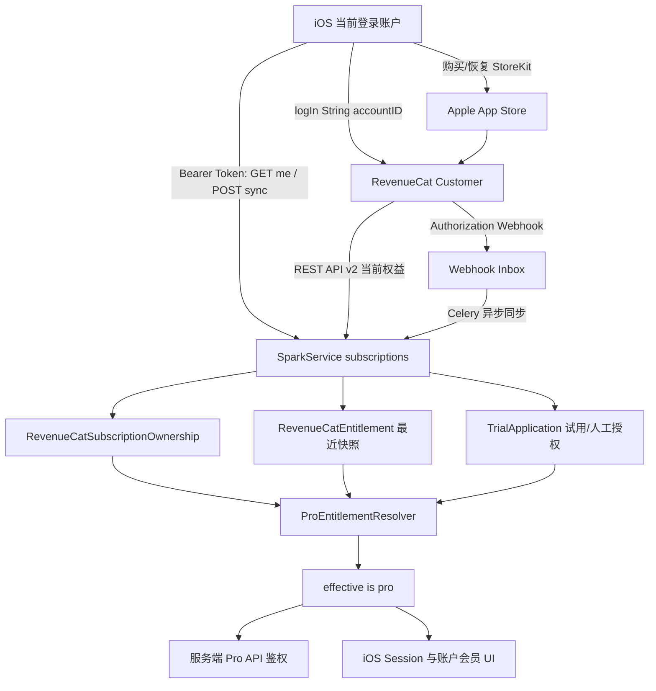
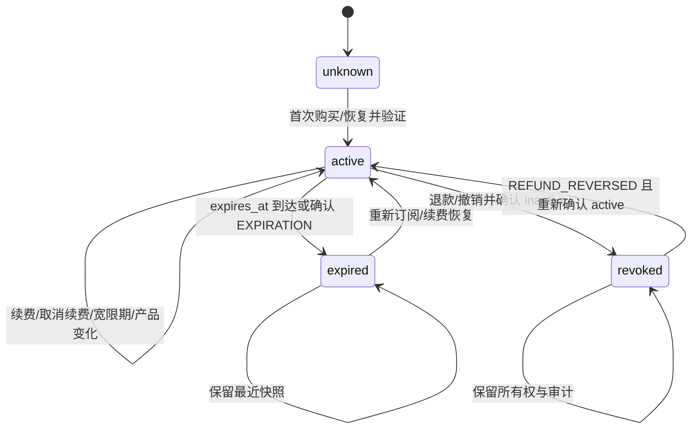

# SUBSCRIPTION-ACCOUNT-BINDING-000002 账户订阅归属、到期撤权与单设备绑定需求确认工单

> 工单状态：需求确认完成，待实施  
> 当前阶段：完整落地方案已定稿；本次仅修改需求文档，未修改业务代码  
> 创建日期：2026-09-23  
> 最后更新：2026-09-23  
> 适用系统：SparkService、LookHealthClient/SparkClient、RevenueCat、Apple App Store  
> 关联工单：`SUBSCRIPTION-REVENUECAT-000001`  
> 关联 RevenueCat Entitlement：`健康Pro`

## 1. 需求背景

当前项目已经建立 RevenueCat 用户身份、订阅快照、服务端 Pro 权限解析、iOS 购买/恢复和账户页订阅展示，但“Apple 购买凭证、RevenueCat Customer、SparkService 用户、当前设备安装”之间的所有权规则尚未完整收敛。

本工单进一步解决三个问题：

1. 将账户头部用户信息与 Pro 订阅状态合并成一个账户会员模块；
2. RevenueCat 订阅到期后，服务端撤销该来源的 Pro 权限，客户端同步显示“未订阅”；
3. 同一台设备切换不同 SparkService 账户时，订阅不得被旧客户端状态或同一 Apple 收据错误共享；购买、恢复和同步必须以当前已登录账户为上下文。

## 2. 用户目标与问题范围

### 2.1 页面目标

- 账户管理页头部不再把用户资料和 Pro 订阅拆成两个松散模块；
- 头部会员模块统一展示用户身份、Pro 状态、订阅产品、到期时间、续订状态和订阅操作入口；
- 未订阅、同步中、有效、已取消续费但尚未到期、已过期、恢复冲突等状态必须有明确文案；
- 到期后页面不能继续显示“已订阅”，也不能仅依赖旧 `UserSession.isPro` 或 RevenueCat SDK 缓存。

### 2.2 权限目标

- RevenueCat `健康Pro` entitlement 有效且未过期时，RevenueCat 来源可授予 Pro；
- entitlement 不再 active 或 `expires_at <= now` 时，RevenueCat 来源必须失效；
- RevenueCat 来源失效不能覆盖仍然有效的内部试用或后台人工授权；
- 最终 `effective_is_pro` 继续由 SparkService `ProEntitlementResolver` 统一计算；
- iOS `CustomerInfo` 只用于即时 UI 和购买反馈，服务端权限仍以服务端同步快照为准。

### 2.3 账户与设备目标

- 购买、恢复、订阅同步必须在 SparkService 登录与 RevenueCat `logIn(String(accountID))` 完成后执行；
- 客户端切换账户后必须清除前一个账户的订阅 UI、同步摘要和 Session Pro 快照；
- 当前设备安装已经登录哪个 SparkService 账户，订阅页面就只允许查询和操作该账户的 RevenueCat Customer；
- Apple 收据属于 Apple Account，不天然等于 SparkService 业务账户；是否允许恢复时转移归属，必须在本工单中明确。

## 3. 当前代码事实

### 3.1 SparkService

1. `subscriptions.models.RevenueCatCustomerIdentity` 当前是一对一 `user` 映射，`app_user_id` 唯一，默认使用 `String(user.id)`。
2. `subscriptions.models.RevenueCatEntitlement` 当前按 `user + entitlement_identifier + environment` 保存订阅快照，包含：
   - `status`；
   - `product_id`；
   - `expires_at`；
   - `will_renew`；
   - `original_transaction_id`。
3. 当前订阅模型没有保存 `device_id`，也没有“某个设备当前订阅绑定账户”的独立模型或唯一约束。
4. `RevenueCatSubscriptionSyncService.sync_user` 只从当前鉴权用户解析 `RevenueCatCustomerIdentity`，向 RevenueCat 查询 active entitlement，并更新该用户快照。
5. 查询不到 active entitlement 时，当前同步服务把对应快照更新为 `expired`，并将 `will_renew=false`。
6. `ProEntitlementResolver` 只把 `status=active` 且 `expires_at IS NULL OR expires_at > now` 的 RevenueCat 快照视为有效。
7. `ProEntitlementResolver` 仍会将 RevenueCat、内部试用和后台人工授权合并；因此 RevenueCat 到期不必然代表最终 `effective_is_pro=false`。
8. `AccountDeviceSession` 与 `TrustedDevice` 已记录 `bundle_id`、`device_id` 和当前用户；同一安装登录其他用户时，现有设备会话服务会撤销该安装的旧用户会话。

### 3.2 LookHealthClient/SparkClient

1. `RevenueCatClient.configure()` 当前未传入自定义 App User ID，SDK 会先产生匿名 RevenueCat Customer。
2. SparkService 登录或会话恢复后，客户端调用 `Purchases.shared.logIn(String(accountID))`。
3. 退出 SparkService 账号时，客户端当前调用 RevenueCat `logOut()`，随后 RevenueCat 会进入匿名身份。
4. `SubscriptionSyncCoordinator` 已保存最近一次服务端订阅摘要，并用服务端 `summary.isPro` 更新 `AppSessionStore`。
5. 账户页已增加 Pro 订阅区，当前到期时间优先读取服务端同步摘要 `expiresAt`，RevenueCat SDK `EntitlementInfo.expirationDate` 作为 UI 兜底。
6. 当前账户头部 `AccountProfileCard` 与 Pro 订阅区仍是两个独立模块，尚未合并。
7. 当前客户端没有明确的“设备订阅绑定账户”本地状态机，也没有在账户切换时校验 RevenueCat `appUserID` 是否与当前 SparkService `accountID` 完全一致后再允许恢复。

### 3.3 RevenueCat 与 Apple 官方行为

1. RevenueCat 官方建议使用自定义 App User ID 将订阅与应用账户关联；同一个 App User ID 可跨设备恢复其 RevenueCat 权益。
2. 从一个已识别 App User ID 切换到另一个已识别 App User ID 时，可以直接调用 `logIn(newAppUserID)`，不要求先 `logOut()`。
3. Apple 收据包含当前 Apple Account 在该 App 下的购买记录；同一 Apple Account 登录的其他设备可以恢复这些购买。
4. RevenueCat 在“当前 App User ID 恢复了属于另一个 App User ID 的 Apple 收据”时，行为由 Project Settings 的 Restore Behavior 决定：
   - `Transfer to new App User ID`：转给当前账户，并撤销旧账户；
   - `Transfer if there are no active subscriptions`：存在有效订阅时不转移；
   - `Keep with original App User ID`：始终保留原业务账户，其他账户恢复会报错；
   - `Share between App User IDs`：旧版共享行为，不适合严格账户隔离。
5. RevenueCat `EntitlementInfo.expirationDate` 是权益到期时间；关闭续费不等于立即失效，通常应在到期时间前继续保留权限。

官方参考：

- [RevenueCat：Identifying Customers](https://www.revenuecat.com/docs/customers/identifying-customers)
- [RevenueCat：Restore Behavior](https://www.revenuecat.com/docs/projects/restore-behavior)
- [RevenueCat：Restoring Purchases](https://www.revenuecat.com/docs/getting-started/restoring-purchases)
- [RevenueCat：CustomerInfo 与 Entitlement 状态](https://www.revenuecat.com/docs/customers/customer-info)
- [Apple：Restoring purchased products](https://developer.apple.com/documentation/storekit/restoring-purchased-products)

## 4. 已知偏差与风险

| 编号 | 偏差或风险 | 当前影响 | 本工单需要确认或处理 |
|---|---|---|---|
| R1 | Apple 收据属于 Apple Account，而不是 SparkService 账号 | 同一设备切换业务账号后恢复，可能触发订阅转移 | 明确恢复转移策略 |
| R2 | SDK 配置阶段会创建匿名 Customer | `logOut()` 后存在匿名身份，可能增加 alias/转移复杂度 | 确认账户切换实现 |
| R3 | 服务端订阅快照没有设备归属 | 无法从订阅表直接判断哪个设备正在操作哪个账户 | 确认是否复用设备会话或新增绑定表 |
| R4 | 客户端同时存在 Session、服务端摘要和 CustomerInfo | 切换账号时可能短暂显示上一账户 Pro | 定义清理顺序和一致性门禁 |
| R5 | `CANCELLATION` 不等于到期 | 关闭自动续费后过早撤权 | 保留到 `expires_at`，过期再撤权 |
| R6 | Webhook/对账可能延迟 | 到期后本地快照可能暂时仍是 active | 定义过期兜底和最大陈旧时间 |
| R7 | 内部试用/人工授权仍可能有效 | RevenueCat 到期后最终用户仍可能是 Pro | UI 必须区分“Apple 订阅已过期”和“最终 Pro 仍有效” |
| R8 | Restore Behavior 属于 RevenueCat 项目级配置 | 控制台设置与客户端代码不一致会造成错误转移 | 工单确认后同步配置并验收 |

## 5. 初步业务目标

### 5.1 账户头部会员模块

计划将以下信息合并为单一模块：

```text
┌────────────────────────────────────┐
│ [头像] 用户名 / 联系方式             │
│        Spark Account ID: 1056       │
│                                    │
│ 健康 Pro       已订阅 / 未订阅       │
│ 年度会员        到期：2026-09-26     │
│ 自动续费中 / 已取消，将于到期日失效   │
│                                    │
│ [管理订阅] [恢复购买] [刷新状态]      │
└────────────────────────────────────┘
```

状态至少覆盖：

- 未订阅；
- 身份绑定中；
- 同步中；
- 有效且自动续费；
- 已取消续费但仍在有效期；
- 已过期；
- 账单宽限期/状态待确认；
- 当前 Apple 收据属于其他 SparkService 账户；
- 同步失败，可重试。

### 5.2 到期撤权

初步规则：

```text
RevenueCat 来源有效 =
    entitlement.status == active
    AND (expires_at IS NULL OR expires_at > now)

effective_is_pro =
    RevenueCat 来源有效
    OR 内部试用有效
    OR 后台人工授权有效
```

到期处理目标：

1. Webhook 或定时对账将 RevenueCat 快照更新为 expired/revoked；
2. 即使 Webhook 延迟，Resolver 在 `expires_at <= now` 时也不能继续授予 RevenueCat Pro；
3. `GET /subscriptions/me` 和登录/会话刷新返回最新最终权限；
4. iOS 更新 `AppSessionStore`，账户会员模块显示 Apple 订阅已过期；
5. 如果内部试用或人工授权仍有效，最终用户仍可为 Pro，但 UI 必须显示真实有效来源。

### 5.3 账户切换与恢复

初步安全门禁：

```text
允许购买/恢复/同步 =
    SparkService 已登录
    AND RevenueCat identityState == bound
    AND Purchases.shared.appUserID == String(currentAccountID)
    AND 请求携带当前有效 AccountDeviceSession
```

账户切换时至少需要：

1. 立即冻结购买、恢复和同步按钮；
2. 清空旧账户 `latestSummary`、Paywall CustomerInfo 和旧 `isPro` UI；
3. 完成新账户 RevenueCat `logIn`；
4. 校验返回 CustomerInfo 与当前账户上下文；
5. 再调用 SparkService `/subscriptions/revenuecat/sync`；
6. 仅使用当前账户响应更新 Session 和页面。

## 6. 初步页面/UI 原型

### 6.1 有效订阅

```text
账户管理

┌────────────────────────────────────┐
│ 头像  小鲸用户                      │
│       手机号登录 · ID 1056          │
│                                    │
│ 👑 健康 Pro              已订阅      │
│ 年度会员                            │
│ 到期时间  2026年9月26日 10:09       │
│ 自动续费中                          │
│                                    │
│ [管理订阅]   [恢复购买]   [刷新]     │
└────────────────────────────────────┘
```

### 6.2 已取消续费但未到期

```text
👑 健康 Pro              有效至到期日
年度会员
将于 2026年9月26日失效
[管理订阅] [恢复购买]
```

### 6.3 已过期

```text
健康 Pro                  未订阅
上一订阅已于 2026年9月26日到期
[重新订阅] [恢复购买]
```

### 6.4 账户归属冲突

```text
无法恢复此订阅

此 Apple 订阅已关联到另一个 Look Health 账户。
请切换回原账户，或按最终确认的转移策略继续处理。

[知道了] [切换账户]
```

## 7. 当前关键文件

### SparkService

- `subscriptions/models.py`
  - `RevenueCatCustomerIdentity`
  - `RevenueCatCustomerAlias`
  - `RevenueCatEntitlement`
- `subscriptions/services/identity_service.py`
  - `RevenueCatIdentityService.ensure_identity`
- `subscriptions/services/subscription_sync_service.py`
  - `RevenueCatSubscriptionSyncService.sync_user`
- `subscriptions/services/pro_entitlement_resolver.py`
  - `ProEntitlementResolver.resolve`
- `accounts/models.py`
  - `TrustedDevice`
  - `AccountDeviceSession`
- `accounts/services/device_session_service.py`
  - `DeviceSessionService.activate_session_on_login`
  - `_revoke_same_installation_other_users`

### LookHealthClient/SparkClient

- `Projects/Core/Subscriptions/RevenueCat/RevenueCatClient.swift`
  - `configure()`
  - `identify(accountID:)`
  - `resetIdentity()`
- `Projects/Core/Subscriptions/Application/SubscriptionSyncCoordinator.swift`
  - RevenueCat 绑定状态、服务端同步和 `latestSummary`
- `Projects/Features/Settings/Subscription/RevenueCatSubscriptionSection.swift`
  - `RevenueCatSubscriptionViewModel`
- `Projects/Features/AccountManagement/Presentation/AccountManagementView.swift`
  - `AccountProfileCard`
  - `AccountProSubscriptionSection`
- `Projects/App/Sources/App/Architecture/AppLifecycleCoordinator.swift`
  - 登录、会话恢复、退出和 RevenueCat 身份切换
- `Projects/App/Sources/App/AppSessionStore.swift`
  - 当前 Session 与 `isPro` 快照

## 8. 当前非目标

- 不由客户端上传或决定可信 `isPro`、`expires_at`、`original_transaction_id`；
- 不直接修改 Apple 订阅、退款或取消状态；
- 不把 RevenueCat 订阅写入 `TrialApplication`；
- 不允许多个 SparkService 账户同时读取同一客户端内存中的 CustomerInfo；
- 本轮问答阶段不修改业务代码和 RevenueCat 控制台设置。

## 9. 一问一答确认记录

### 第 1 问：同一 Apple 订阅恢复到另一个 SparkService 账户时，订阅所有权如何处理

为什么要问：你已经确认“切换账户后订阅失效”，但“新账户点击恢复购买”仍有两种完全不同的业务含义：可以把订阅转移给当前账户，或者必须回到原购买账户。这个选择会决定 RevenueCat Project 的 Restore Behavior、服务端 `original_transaction_id` 唯一约束、冲突提示、客服流程和旧账户是否立即撤权。

请选择：

- A. 永久归属原购买 SparkService 账户；其他账户恢复时阻止并提示切换回原账户（推荐）  
  对应 RevenueCat `Keep with original App User ID`。最符合“一个订阅只属于一个业务账户”和防止同设备账号间抢占，但用户忘记原账户时需要账号找回或客服流程。

- B. 恢复时转移给当前登录账户，并立即撤销原账户权益  
  对应 RevenueCat 默认 `Transfer to new App User ID`。同一订阅始终只有一个账户有效，但任何能使用该 Apple Account 的人都可能把订阅转走，服务端必须处理 `TRANSFER` 双向同步。

- C. 有效订阅禁止转移；订阅过期后允许恢复历史购买关系到新账户  
  对应 `Transfer if there are no active subscriptions`。有效期内保护原账户，过期后允许新账户重新开始，但规则更难解释和测试。

- D. 同一 Apple 收据可同时让多个 SparkService 账户获得 Pro  
  类似旧版共享/alias 行为，不符合“一个设备只能绑定一个账户订阅”，也容易造成权益滥用。

请选择 A、B、C 或 D。

#### 第 1 问确认

**已确认选择 A：订阅永久归属原购买 SparkService 账户；其他账户恢复时阻止并提示切换回原账户。**

落地约束：

- RevenueCat Production Restore Behavior 配置为 `Keep with original App User ID`；Sandbox 是否同样配置将在后续环境问题中确认；
- Apple 订阅首次成功购买并同步后，以原始 SparkService `user`、RevenueCat `app_user_id` 和 `original_transaction_id` 建立不可由普通客户端恢复操作改写的所有权关系；
- 当前登录账户不是原订阅账户时，恢复购买不得授予当前账户 Pro，也不得撤销或迁移原账户订阅快照；
- iOS 必须把 RevenueCat 的“已属于其他 App User ID”错误映射为稳定业务提示，不能笼统显示“恢复失败”；
- 冲突提示提供“切换回原账户”入口；客户端不得展示原账户手机号、邮箱或其他敏感信息；
- 服务端对 `original_transaction_id` 建立跨用户唯一归属校验；同一交易归属另一个用户时返回稳定冲突码并记录审计事件；
- Webhook `TRANSFER` 若仍发生，不自动接受为合法业务转移；先冻结相关 RevenueCat 来源更新并进入异常审计/人工处理；
- 客服可协助用户找回原业务账户，但本阶段不提供后台直接转移 Apple 订阅所有权的能力；
- 该结论覆盖 RevenueCat 默认 `Transfer to new App User ID` 行为，控制台配置、客户端提示和服务端约束必须保持一致。

### 第 2 问：原购买账户是否允许在其他 Apple 设备上继续使用 Pro

为什么要问：“一个设备只能绑定一个账户订阅”可以理解为“同一设备同一时刻只认当前登录账户”，也可能理解为“订阅永久锁定购买设备”。主流账户型订阅通常归属于业务账户，并允许该账户跨设备使用；如果锁定设备，会与 Apple 恢复购买和 RevenueCat 自定义 App User ID 的跨设备能力冲突，也会影响换机体验。

请选择：

- A. 订阅归属 SparkService 账户，可在该账户登录的其他设备上同步 Pro；每台设备同一时刻只使用当前登录账户的订阅状态（推荐）  
  保持账户级权益和正常换机体验；设备只承担当前会话隔离，不成为订阅永久所有者。

- B. 订阅只在首次购买设备有效，换设备必须重新购买  
  设备约束最严格，但不符合 Apple 可恢复购买的正常用户预期，也可能引发重复购买争议。

- C. 同一订阅账户同时只允许一台设备使用 Pro，新设备登录后撤销旧设备会话  
  允许换机但禁止多设备并用，需要把订阅权限和现有单设备会话策略强绑定。

- D. 原账户可在固定数量设备上使用 Pro，例如最多 3 台  
  需要新增设备配额、解绑、可信设备管理和超限处理，复杂度较高。

请选择 A、B、C 或 D。

#### 第 2 问确认

**已确认选择 A：订阅归属 SparkService 账户，可由原账户跨设备同步 Pro；每台设备同一时刻只使用当前登录账户的订阅状态。**

落地约束：

- 订阅所有权是账户级，不是设备级；`RevenueCatCustomerIdentity`、`RevenueCatEntitlement` 和 `original_transaction_id` 继续归属 SparkService 用户；
- 原购买账户在新设备登录并完成 RevenueCat `logIn(String(accountID))` 后，可同步同一账户的有效 Pro，无需重新购买；
- 每台设备只能以当前有效 `AccountDeviceSession` 对应的用户查询、恢复、购买和同步订阅；旧账户留在内存或缓存中的 CustomerInfo、订阅摘要和 `isPro` 不得继续生效；
- 同一 SparkService 账户是否允许多设备同时登录仍遵循账户会话系统自身规则，不由订阅模块额外限制；订阅模块不得因为换机而撤销账户级权益；
- 服务端订阅接口以 JWT 中的当前 `request.user` 和有效设备会话为上下文，不接受客户端传入其他 `accountID` 或 RevenueCat `app_user_id`；
- Webhook、定时对账和服务端主动查询按账户同步，不按某一设备同步；设备离线不影响该账户订阅生命周期更新；
- UI 在设备切换账户后立即显示新账户状态；新账户未订阅时显示“未订阅”，即使当前 Apple Account 的收据属于旧账户也不得沿用旧账户 Pro；
- 该规则保留 Apple/RevenueCat 的正常换机与跨设备恢复体验，同时满足同一设备账户隔离。

### 第 3 问：服务端如何表达“当前设备只绑定当前登录账户的订阅上下文”

为什么要问：订阅已经确认是账户级权益，因此不应把订阅永久锁定到设备。但仍需防止同一设备切换账户后使用旧账户缓存或伪造其他账户同步请求。项目已经存在 `AccountDeviceSession` 和同安装切换用户时撤销旧会话的机制，需要确认是否复用它，还是增加新的设备订阅绑定表。

请选择：

- A. 复用现有 `AccountDeviceSession` 作为设备当前账户上下文，不新增永久设备订阅绑定表（推荐）  
  订阅所有权仍由账户和 `original_transaction_id` 保证；订阅 API 校验当前 JWT 的有效设备会话，客户端在会话切换时清空旧订阅状态。

- B. 新增 `RevenueCatDeviceBinding`，保存每个 `bundle_id + device_id` 当前绑定的账户，但仅作为可替换的运行态映射  
  审计更直观，但与 `AccountDeviceSession` 信息重复，需要处理两套状态一致性。

- C. 新增永久设备订阅绑定表，设备绑定后必须人工解绑才能换账户  
  隔离最严格，但与已确认的账户级跨设备权益冲突，也会显著增加换号和二手设备问题。

- D. 只在 iOS 本地记录当前账户，不做服务端设备会话校验  
  实现简单，但无法防止伪造请求、旧 Token 或客户端状态错误造成跨账户同步。

请选择 A、B、C 或 D。

#### 第 3 问确认

**已确认选择 A：复用现有 `AccountDeviceSession` 作为设备当前账户上下文，不新增永久设备订阅绑定表。**

落地约束：

- `AccountDeviceSession` 是设备当前登录账户的唯一服务端上下文；订阅模块不新增 `RevenueCatDeviceBinding` 或其他重复设备映射；
- `/subscriptions/me`、`/subscriptions/revenuecat/sync`、恢复购买后的同步请求都必须通过现有 JWT 与设备会话校验；
- 服务端从 `request.user` 解析 `RevenueCatCustomerIdentity`，请求体禁止提交或覆盖 `account_id`、`app_user_id`、`device_id` 和订阅所有者；
- 同一安装切换账户时，继续由 `DeviceSessionService._revoke_same_installation_other_users` 撤销旧用户设备会话和旧 Token；
- 被撤销设备会话发起的订阅读取或同步必须按现有鉴权规则失败，不能返回缓存的旧用户订阅摘要；
- iOS 仅把设备 ID 用于正常登录和设备会话，不把设备 ID 作为 RevenueCat App User ID，也不写入 Apple 订阅所有权；
- 客户端账户切换时主动清空 `SubscriptionSyncCoordinator.latestSummary`、Paywall offering、CustomerInfo 展示状态和旧 Session `isPro`；
- Webhook 与定时对账不依赖 `AccountDeviceSession`，仍按账户身份映射处理，以保证用户离线或换机时订阅状态可以更新；
- 后台排查可关联用户、RevenueCat identity 和最近设备会话，但不得把设备会话误当作订阅所有权记录。

### 第 4 问：同一设备从账户 A 切换到账户 B 时，RevenueCat 身份按什么顺序切换

为什么要问：当前客户端退出登录时调用 RevenueCat `logOut()`，这会生成新的匿名 App User ID；随后再登录账户 B 可能引入匿名 alias。RevenueCat 官方说明，从一个已识别 App User ID 切换到另一个已识别 App User ID 时可以直接调用 `logIn(newAppUserID)`，无需先 `logOut()`。需要区分“直接切换账户”和“彻底退出到未登录状态”。

请选择：

- A. 账户直接切换时清空本地订阅状态后调用 `logIn(B)`，不先 `logOut()`；只有真正退出到未登录状态时调用 `logOut()`，且匿名状态禁止购买和恢复（推荐）  
  避免切换过程产生多余匿名 alias，同时保留完全退出后的 RevenueCat 身份清理。

- B. 所有切换都先 `logOut()`，再调用 `logIn(B)`  
  流程直观，但每次切换都会创建匿名 ID，增加 alias、恢复归属和排查复杂度。

- C. 永远不调用 `logOut()`；退出 App 账户后仍保留上一 RevenueCat identity  
  可避免匿名 ID，但未登录期间容易错误读取上一账户 CustomerInfo，必须增加更强的 UI 和调用门禁。

- D. 每次切换都重新配置 RevenueCat SDK，并传入新账户 ID  
  RevenueCat SDK 通常按进程单例配置，不适合通过重复 configure 实现账户切换。

请选择 A、B、C 或 D。

#### 第 4 问确认

**已确认选择 A：账户直接切换时清空旧订阅状态后直接调用 `logIn(B)`，不先 `logOut()`；只有真正退出到未登录状态时才调用 `logOut()`。**

落地约束：

- “切换账户”和“退出登录”必须成为两个明确的客户端动作，不能共用同一 RevenueCat 身份清理流程；
- 账户 A → B 的切换开始时，立即将订阅协调器置为 `unbound/binding`，禁用购买、恢复和主动同步；
- 切换前清空账户 A 的 `latestSummary`、Paywall offering、本地 CustomerInfo 展示、同步错误和重试任务，避免旧状态闪现；
- SparkService 账户 B 登录成功后，直接调用 `Purchases.shared.logIn(String(accountBID))`，不先调用 RevenueCat `logOut()`；
- 必须等待 `logIn(B)` 成功，并校验 `Purchases.shared.appUserID == String(accountBID)` 后，才允许请求 B 的订阅摘要、打开 Paywall、购买或恢复；
- `logIn(B)` 失败时，B 仍可进入普通非 Pro 功能，但订阅相关操作保持禁用并提供重试；不得回退读取 A 的 CustomerInfo；
- 用户真正退出到未登录页面时调用 RevenueCat `logOut()`，随后清空所有订阅内存状态；匿名状态禁止购买、恢复和服务端订阅同步；
- 服务端仍依赖 JWT 与 `AccountDeviceSession` 隔离账户，客户端身份切换只是前置门禁，不替代服务端鉴权；
- 账户快速连续切换必须使用 generation/accountID 校验或取消旧 Task，A 的迟到响应不得覆盖 B 的 Session 和页面。

### 第 5 问：RevenueCat 订阅到达 `expires_at` 后，服务端何时撤销该来源的 Pro 权限

为什么要问：RevenueCat Webhook、主动同步或定时对账可能延迟。如果只等 Provider 明确返回 expired，已到期用户可能继续使用 Pro；如果完全由客户端时间判断，又不具备服务端可信性。需要确定服务端在已有可信 `expires_at` 基础上的硬截止规则。

请选择：

- A. 服务端以最后一次成功同步的 `expires_at` 为硬截止；到期即停止 RevenueCat 来源授权，并在后续 Webhook/同步中更新状态（推荐）  
  即使暂时无法访问 RevenueCat，也不会超过已知到期时间继续授权；内部试用或人工授权仍可独立维持最终 Pro。

- B. 到期后增加 24 小时本地宽限期，再撤销 RevenueCat 来源  
  可缓冲 Provider 延迟，但可能让实际已过期或退款用户继续使用付费能力。

- C. 只有 RevenueCat Webhook 或主动查询明确返回 expired 时才撤权  
  完全依赖 Provider 最新状态，但 Webhook/网络故障会导致过期权益长期残留。

- D. iOS 根据 `CustomerInfo.expirationDate` 本地撤权，服务端继续保持原状态  
  客户端显示会变化，但服务端 Pro API 仍可能继续放行，形成权限分裂。

请选择 A、B、C 或 D。

#### 第 5 问确认

**已确认选择 A：服务端以最后一次成功同步的可信 `expires_at` 为硬截止；到期即停止 RevenueCat 来源的 Pro 授权。**

落地约束：

- `ProEntitlementResolver` 每次解析都必须检查 `expires_at > timezone.now()`；即使数据库 `status` 尚为 `active`，超过到期时间也不得授予 RevenueCat Pro；
- `expires_at IS NULL` 只用于 RevenueCat 明确返回的永久 entitlement；普通月度/年度订阅缺少到期时间时不得自动按永久权益处理，应进入 `unknown`/同步异常；
- Webhook、购买后同步、恢复后同步和定时对账负责把快照状态最终更新为 `expired` 或 `revoked`，但撤权不依赖这些异步流程先完成；
- `CANCELLATION` 仅表示停止续费；只要 `expires_at` 尚未到达，RevenueCat 来源仍保持有效，UI 显示“已取消续费，将于到期日失效”；
- 当 `expires_at <= now`，`GET /subscriptions/me` 必须返回 RevenueCat source `active=false`，Apple 订阅状态显示“未订阅/已过期”；
- iOS 收到服务端摘要后立即更新 `AppSessionStore`；若 RevenueCat 是唯一有效来源，则 `UserSession.isPro` 变为 false，关闭后续服务端 Pro 功能入口；
- RevenueCat 暂时不可用时，服务端可以沿用最后成功快照，但绝不跨过已知 `expires_at`；
- 内部试用和后台人工授权继续独立判断，RevenueCat 到期不能删除或覆盖其他来源记录；
- 定时任务应优先扫描临近到期和已跨过到期时间但状态仍 active 的快照，修正状态并留下审计记录。

### 第 6 问：Apple 订阅已过期，但内部试用或人工授权仍有效时，账户头部如何显示

为什么要问：最终 Pro 权限由 RevenueCat、内部试用和人工授权合并。如果把“Apple 未订阅”等同于“用户不是 Pro”，会错误关闭仍有效的内部权益；如果只显示“Pro”，又会让用户误以为 Apple 订阅仍在续费。需要把最终会员状态与 Apple 订阅状态分开表达。

请选择：

- A. 同时显示两层状态：头部显示“Pro 有效（试用/人工授权）”，订阅明细显示“Apple 订阅已过期/未订阅”（推荐）  
  权限和付款事实都准确，用户能理解为什么仍可使用 Pro，也不会误认为 Apple 仍在扣费。

- B. Apple 订阅过期后统一显示“非 Pro”，忽略试用和人工授权  
  展示简单，但会与服务端实际 `effective_is_pro=true` 冲突，并错误限制其他合法来源。

- C. 只显示“Pro 有效”，不展示 Apple 订阅已过期  
  权限展示正确，但付款状态不透明，用户可能误解续费情况。

- D. Apple 到期时自动结束内部试用和人工授权  
  强制统一状态，但会破坏多来源权益隔离，也可能撤销后台明确授予的权限。

请选择 A、B、C 或 D。

#### 第 6 问确认

**已确认选择 A：账户头部显示最终 Pro 有效来源，Apple 订阅明细独立显示已过期或未订阅。**

落地约束：

- 账户会员模块必须区分 `effective_is_pro` 与 `revenuecat_active`，不得使用一个“已订阅”标签同时代表两者；
- RevenueCat 有效时，头部显示“健康 Pro”，来源可显示“Apple 订阅”，订阅明细展示产品、到期时间和续费状态；
- RevenueCat 已过期但内部试用有效时，头部显示“Pro 有效 · 内部试用”，Apple 明细显示“已过期/未订阅”和最后到期时间；
- RevenueCat 已过期但人工授权有效时，头部显示“Pro 有效 · 人工授权”，Apple 明细显示“已过期/未订阅”；
- 所有来源均无效时，头部显示“未开通 Pro”，Apple 明细显示“未订阅”；
- `GET /subscriptions/me` 必须继续返回分来源摘要，至少包含 RevenueCat、trial、manual 的 active、expiresAt 和必要明细；
- iOS 页面只根据服务端分来源摘要组合最终展示，RevenueCat `CustomerInfo` 只用于即时购买反馈和到期时间兜底；
- Apple 订阅过期不得删除内部试用/人工授权，内部来源到期也不得修改 RevenueCat 快照；
- 用户仍为 Pro 但 Apple 未订阅时，可以显示“订阅 Apple Pro”入口，但不能误导为续费当前内部授权；
- 服务端 Pro API 始终检查 `effective_is_pro`，Apple 订阅管理操作只针对 RevenueCat 来源。

### 第 7 问：合并后的账户头部会员模块如何承载订阅操作

为什么要问：用户信息、最终 Pro 状态、Apple 订阅状态、到期时间、续费状态、恢复购买和刷新状态都放在头部，信息可能过密。需要确定头部是“摘要入口”还是完整操作面板，这会影响页面层级、可读性和后续状态扩展。

请选择：

- A. 头部卡片显示用户与会员摘要，点击“管理 Pro”进入独立订阅详情页；恢复购买、刷新、管理 Apple 订阅集中在详情页（推荐）  
  头部保持清晰，详情页可以完整展示状态、来源、到期时间、错误和操作。

- B. 用户信息、订阅明细、恢复购买和刷新全部直接放在头部卡片内  
  操作一步可达，但卡片较高，状态增多后容易拥挤。

- C. 头部只显示用户信息和 Pro 徽标，订阅仍保留为下面独立模块  
  改动较小，但没有真正满足“用户信息与 Pro 订阅结合成一个模块”。

- D. 头部只展示状态，不提供恢复、刷新或管理入口  
  页面最简，但用户无法主动解决恢复和同步问题。

请选择 A、B、C 或 D。

#### 第 7 问确认

**已确认选择 A：账户头部卡片显示用户与会员摘要，通过“管理 Pro”进入独立订阅详情页。**

落地约束：

- 将现有 `AccountProfileCard` 与 Pro 摘要合并为一个账户会员头部卡片，不再在账户首页重复展示完整订阅操作区；
- 头部卡片至少展示头像/名称、登录方式或脱敏联系方式、Account ID、最终 Pro 状态、权益来源和“管理 Pro”入口；
- 已订阅时可在头部简要显示“健康 Pro · Apple 订阅”和到期日期；未订阅时显示“未开通 Pro”；内部试用/人工授权显示对应来源；
- 头部点击“管理 Pro”进入独立 `ProSubscriptionDetailView`（实施名称可按项目规范调整）；
- 订阅详情页集中展示 Apple 订阅状态、产品周期、开始/到期时间、是否自动续费、环境、最后同步时间和最终 Pro 来源；
- 打开 Paywall、恢复购买、刷新会员状态和跳转 Apple 订阅管理入口全部放在详情页；
- 详情页必须覆盖加载、空状态、同步中、失败可重试、归属冲突、已取消待到期、已过期和多来源 Pro 状态；
- 账户头部只使用服务端摘要驱动会员状态，不直接用 RevenueCat CustomerInfo 覆盖最终 Pro；
- 原独立 `AccountProSubscriptionSection` 在新详情页完成后移除，避免同一页面出现两个订阅入口；
- 页面返回账户首页时，头部自动反映 `AppSessionStore` 和最新订阅摘要，不要求用户重新进入账户页。

### 第 8 问：订阅已经过期时，服务端摘要是否继续返回最后一次 Apple 订阅明细

为什么要问：当前 `ProEntitlementResolver` 只查询有效 RevenueCat 快照；订阅过期后返回的 RevenueCat source 会丢失产品 ID 和到期时间。若详情页要显示“上一订阅已于某日到期”，服务端必须稳定返回最后一条快照，而不是只返回 active entitlement。

请选择：

- A. RevenueCat source 始终返回最近快照，包含 `status`、`active`、产品、到期时间、续费状态和最后同步时间；过期时 `active=false`（推荐）  
  客户端能准确展示历史到期信息，同时 `active` 与最终权限保持明确边界。

- B. 只返回当前有效订阅；过期后所有订阅明细置空  
  接口最简单，但详情页只能显示“未订阅”，无法解释上一订阅何时到期。

- C. 服务端只返回最终 `isPro`，过期明细完全从 RevenueCat SDK 获取  
  客户端依赖当前 Apple 设备和 SDK 缓存，跨设备、离线和账户冲突时可能与服务端不一致。

- D. 当前摘要只返回 active，另建历史订阅接口查询过期记录  
  职责清楚，但本需求只展示最近一次状态，新增接口和请求成本偏高。

请选择 A、B、C 或 D。

#### 第 8 问确认

**已确认选择 A：RevenueCat source 始终返回最近快照；订阅过期时 `active=false`，但保留产品、到期时间、续费状态和最后同步时间。**

落地约束：

- `ProEntitlementResolver` 需要分别查询“当前有效快照”和“最近 RevenueCat 快照”，不能再因 active 查询为空而把全部订阅明细置空；
- RevenueCat source 响应至少包含 `status`、`active`、`environment`、`entitlement`、`productId`、`startedAt`、`expiresAt`、`willRenew`、`periodType`、`store` 和 `lastSyncedAt`；
- `active` 只表示当前 RevenueCat 来源是否参与 Pro 授权；`status` 表示快照生命周期，二者不能互相替代；
- 当数据库状态仍为 active 但 `expires_at <= now` 时，响应必须即时计算 `active=false`，并允许后台任务随后把持久化状态修正为 expired；
- 过期快照继续返回最后产品和到期时间，用于详情页展示“上一订阅已于某日到期”；
- 返回历史明细不得包含 Secret、完整 Provider payload、Apple 收据、原始交易凭证或可被客户端用于冒认所有权的字段；
- `original_transaction_id` 只在服务端用于归属校验和审计，默认不返回 iOS；如需客服展示，只允许脱敏尾号；
- 客户端不再用“expiresAt 为空”推断未订阅；必须结合 `status`、`active` 和 `effectiveSource`；
- 服务端摘要为主，RevenueCat SDK `expirationDate` 仅作为当前设备购买完成后的临时展示兜底；同步完成后以服务端摘要覆盖；
- `lastSyncedAt` 必须随 source 返回，详情页可据此展示状态新鲜度和提供刷新入口。

### 第 9 问：永久订阅所有权在数据库中如何保存和约束

为什么要问：现有 `RevenueCatEntitlement.original_transaction_id` 只是普通索引字段，快照同步时可能为空或被覆盖，无法单独承担“永久归属原购买账户”的不可变约束。需要确定是新增独立所有权模型，还是直接在快照表增加唯一约束。

请选择：

- A. 新增独立 `RevenueCatSubscriptionOwnership`，以 `store + environment + original_transaction_id` 唯一绑定用户，首次绑定后普通同步不可改写（推荐）  
  所有权与可变权益快照分离，支持审计、冲突记录和订阅过期后继续保留归属。

- B. 直接把 `RevenueCatEntitlement.original_transaction_id` 改成唯一字段  
  改动较小，但快照行会随 entitlement/environment 更新，空值、历史订阅和未来多产品场景更难处理。

- C. 不在本地保存不可变所有权，只依赖 RevenueCat `Keep with original App User ID`  
  数据模型简单，但控制台误配置、Webhook 异常或历史 alias 冲突时服务端缺少第二道防线。

- D. 使用 `device_id` 作为订阅所有权唯一键  
  与已确认的账户级跨设备权益冲突，换机会丢失归属。

请选择 A、B、C 或 D。

#### 第 9 问确认

**已确认选择 A：新增独立 `RevenueCatSubscriptionOwnership`，通过 `store + environment + original_transaction_id` 唯一绑定原购买用户；首次绑定成功后，普通订阅同步不得改写所有者。**

落地约束：

- 新增 `RevenueCatSubscriptionOwnership`，将稳定的订阅所有权与会续费、到期、退款和变更产品的 `RevenueCatEntitlement` 快照分离；
- 数据库必须对 `store + environment + original_transaction_id` 建立唯一约束，确保同一 Apple 原始交易在同一环境只能归属一个 SparkService 用户；
- 所有权记录至少包含 `user`、`store`、`environment`、`original_transaction_id`、首次绑定产品、首次绑定时间、最近校验时间和审计时间；
- 首次购买或首次成功恢复时，在数据库事务中创建所有权；若记录已存在且属于当前用户，只更新最近校验时间，不改变所有者；
- 若记录已属于其他用户，购买后同步、恢复购买同步、Webhook 和定时对账都不得把所有权转移给当前用户，也不得授予当前用户 RevenueCat Pro；
- 订阅到期、取消续费、退款、产品升级降级和跨设备登录均不删除所有权记录；原用户以后重新订阅或恢复时继续沿用原归属；
- Production 与 Sandbox 所有权严格隔离，Sandbox 交易不得占用或覆盖 Production 所有权；
- `original_transaction_id` 缺失时不得创建所有权，应将同步结果标记为待确认/失败并保留可重试信息，不能退化为按产品 ID 或设备 ID 绑定；
- 普通同步服务无权转移所有权；若未来确有客服纠错需求，必须设计独立、显式、带原因和操作人审计的管理流程，本工单暂不提供转移能力；
- RevenueCat 控制台继续配置 `Keep with original App User ID`，本地不可变所有权作为服务端第二道防线，而不是替代 RevenueCat 的恢复策略；
- `RevenueCatEntitlement.original_transaction_id` 继续作为快照关联字段，但最终归属判断以 `RevenueCatSubscriptionOwnership` 为准。

### 第 10 问：其他账户恢复到已有归属的 Apple 订阅时，接口如何返回并引导用户

为什么要问：已确认订阅永久归属原购买账户。当账户 B 在同一 Apple ID 下点击恢复购买时，RevenueCat 或 StoreKit 可能仍返回交易信息，但服务端必须拒绝给 B 授权。需要统一错误码、隐私展示和客户端后续动作，避免误显示“恢复成功”或泄露原账户完整信息。

请选择：

- A. 同步接口返回专用归属冲突业务码和脱敏原账户提示；客户端保持 B 为非订阅状态，展示“该订阅已绑定其他账户，请切换回原账户”，并提供退出/切换账户入口（推荐）  
  结果明确，既不错误授权，也能帮助用户回到正确账户；服务端不返回原账户 ID、手机号或邮箱全文。

- B. 返回普通同步失败，不说明订阅已归属其他账户  
  隐私最保守，但用户会反复恢复和刷新，客服也难以定位。

- C. 客户端直接使用 RevenueCat `CustomerInfo` 临时给 B 开通 Pro，等待服务端后续纠正  
  会造成越权窗口，与服务端永久归属规则冲突。

- D. 自动把订阅从原账户转移到账户 B，并撤销原账户 Pro  
  与已确认的永久归属规则冲突，也可能导致账号盗用和跨设备权限异常。

请选择 A、B、C 或 D。

#### 第 10 问确认

**已确认选择 B：其他账户恢复到已有归属的 Apple 订阅时，客户端只收到普通同步失败，不说明订阅归属冲突，也不展示原账户提示。**

落地约束：

- 当前账户不得因 RevenueCat SDK 或 StoreKit 返回有效交易而临时获得 RevenueCat Pro；最终权限仍以服务端所有权校验结果为准；
- 同步接口对 iOS 返回统一的同步失败响应和通用文案，例如“会员状态同步失败，请稍后重试”，不得返回原用户 ID、Account ID、手机号、邮箱或其他可识别信息；
- iOS 保持当前账户同步前的服务端权限状态；若当前账户没有其他有效来源，则继续显示未开通 Pro；
- 客户端不得把该失败解释为“恢复成功”，不得关闭错误提示后直接更新 `AppSessionStore.isPro=true`；
- 服务端内部仍必须将失败分类为 `ownership_conflict`，记录当前用户、所有权记录、环境、Store、脱敏原始交易号、触发入口和时间，供后台审计与客服排查；
- API 对外可以使用统一业务错误结构，但内部日志、任务状态和后台管理必须能够区分网络错误、RevenueCat 上游错误、数据缺失与所有权冲突；
- Webhook 和定时对账遇到冲突时不得转移所有权，也不得覆盖原账户快照；事件应保留为已处理冲突或人工可查看状态；
- 当前账户已有内部试用或人工授权时，同步失败不得撤销这些独立来源；仅拒绝写入冲突的 RevenueCat 权益；
- 用户真正切换回原购买账户后，可以重新触发同步或恢复，由服务端按所有权一致路径正常更新权益；
- 本选择明确牺牲客户端可解释性以减少账户信息暴露，后续用户反馈只能通过通用重试提示和客服内部审计定位。

### 第 11 问：服务端识别为订阅所有权冲突后，自动重试策略如何处理

为什么要问：客户端按第 10 问只看到普通同步失败，但所有权冲突不是网络抖动，持续自动重试不会自行成功，还会增加 RevenueCat 请求、Celery 任务和日志噪声。需要区分用户看到的通用失败与服务端内部是否继续重试。

请选择：

- A. 服务端将 `ownership_conflict` 视为确定性、不可自动重试错误；停止本轮自动重试，但保留用户手动刷新、重新登录和切回原账户后重新同步的入口（推荐）  
  对用户仍显示普通失败，对内部则避免无意义重试；账户上下文改变后可以再次校验。

- B. 和网络错误一样执行立即有限重试、前台恢复重试和 Celery 自动重试  
  行为统一，但归属不变时每次都会失败，容易制造重复请求和告警噪声。

- C. 冲突后永久禁止该设备再次同步订阅  
  能阻止重复请求，但切换回原账户或归属数据修复后也无法恢复。

- D. 冲突后删除本地所有权记录，再自动重试绑定当前账户  
  实质上绕过永久归属规则，存在越权风险。

请选择 A、B、C 或 D。

#### 第 11 问确认

**已确认选择 A：`ownership_conflict` 属于确定性、不可自动重试错误；本轮停止自动重试，但保留手动刷新、重新登录和切换回原账户后的重新同步入口。**

落地约束：

- 服务端异常分类必须明确区分 `ownership_conflict` 与网络超时、RevenueCat 限流、上游 5xx 等可重试错误；
- `RevenueCatSubscriptionSyncService` 识别冲突后立即结束本轮流程，不进入指数退避、Celery `autoretry` 或定时失败重试集合；
- Webhook Inbox 遇到所有权冲突时应保存审计结果并终止自动重放，不得长期停留在普通 `FAILED` 状态反复消费；
- iOS 对外仍按照第 10 问显示普通同步失败，不向用户暴露内部 `ownership_conflict` 类型；
- App 前台恢复触发的自动同步应遵守冲突抑制状态，账户上下文未变化时不得每次前台恢复都重复请求；
- 用户主动点击“刷新会员状态”或“恢复购买”时允许重新发起一次校验，但结果仍冲突时再次停止本轮重试；
- 用户退出并登录其他账户、当前 RevenueCat `app_user_id` 改变或后台修复所有权数据后，应清除当前会话的冲突抑制状态，允许重新同步；
- 冲突抑制只针对特定 `current_user + environment + original_transaction_id` 组合，不能阻止该账户同步其他合法订阅；
- 后台管理允许查看冲突记录和触发一次重新校验，但仍不允许直接改写订阅所有权；
- 监控统计中应把冲突归入业务拒绝，而不是基础设施失败，避免触发无意义的上游故障告警。

### 第 12 问：原购买 SparkService 账户注销后，永久订阅所有权如何处理

为什么要问：`RevenueCatSubscriptionOwnership` 已确定首次绑定后不可由普通同步改写。如果所有权模型对用户使用 `CASCADE`，账户注销会连同归属记录一起删除，其他账户之后可能重新绑定仍有效的 Apple 订阅，绕过“永久归属原购买账户”。需要确认注销后的安全边界和恢复方式。

请选择：

- A. 注销后保留不可识别个人身份的所有权墓碑，原始交易仍不可自动绑定其他账户；用户若在账号恢复期内恢复原账户则重新关联，超过恢复期需通过客服人工核验处理（推荐）  
  能维持永久归属和防盗用，同时通过脱敏、最小保留字段满足账号注销后的数据最小化要求。

- B. 账户注销时级联删除所有权，之后任意账户可恢复并重新绑定该 Apple 订阅  
  实现简单，但注销账户可能被用来主动转移或洗订阅归属。

- C. 账户注销时自动将订阅归属转移到该设备下一次登录的账户  
  与账户级跨设备归属冲突，也无法证明下一账户是原购买者。

- D. 账户注销时由服务端取消用户的 Apple 订阅并删除所有权  
  服务端通常不能代替用户取消 App Store 订阅，而且删除归属仍可能造成恢复冲突。

请选择 A、B、C 或 D。

#### 第 12 问确认

**已确认选择 A：原购买账户注销后保留脱敏的订阅所有权墓碑，禁止其他账户自动绑定；恢复期内恢复原账户时可重新关联，超过恢复期必须经过客服人工核验。**

落地约束：

- `RevenueCatSubscriptionOwnership` 不得使用会随用户物理删除而级联删除所有权的单一 `CASCADE` 关系；账户注销流程必须先将归属记录转换为墓碑状态；
- 墓碑继续保留唯一键 `store + environment + original_transaction_id`，从数据库层阻止同一 Apple 原始交易被其他账户重新占用；
- 墓碑只保留防重复绑定和审计所需的最小字段，包括原始交易标识、Store、环境、脱敏/不可逆账户指纹、首次绑定时间、注销时间和状态；
- 墓碑不得保留手机号、邮箱、昵称、头像、访问令牌等非必要个人信息；管理后台不得通过墓碑直接还原已注销用户资料；
- 所有权模型的用户关联应允许 `SET_NULL` 或采用等价的归档引用设计，具体实现需兼容现有账号注销和恢复机制；
- 账号仍处于项目既有恢复期时，恢复同一账户应通过稳定的内部恢复标识重新关联墓碑，不得创建第二条所有权记录；
- 超过恢复期后，新注册账户即使使用相同手机号、邮箱或同一 Apple ID，也不得自动认定为原账户；
- 超过恢复期的处理只能进入客服人工核验流程，普通同步接口、Webhook、定时任务和客户端恢复购买均无权解除墓碑；
- 本工单不提供后台直接转移订阅所有权的功能；后续如增加人工核验，必须独立设计双重确认、操作原因和完整审计；
- Apple 订阅仍可能在 App Store 侧继续续费，账号注销页面应明确提示用户：注销 SparkService 账户不会自动取消 Apple 订阅，需要前往系统订阅管理中取消；
- 墓碑只阻止 RevenueCat 来源重新绑定，不影响新账户自己的内部试用或人工授权来源。

### 第 13 问：Apple 家庭共享产生的订阅权益是否允许绑定家庭成员自己的 SparkService 账户

为什么要问：当前目标是“一份 Apple 订阅永久归属原购买 SparkService 账户”。如果 App Store 产品启用了 Family Sharing，同一 Apple 家庭中的其他成员可能获得共享交易权益；若允许他们分别绑定自己的 SparkService 账户，就会从一份购买扩展为多个 Pro 账户，与当前单一所有权模型产生冲突。

请选择：

- A. 当前版本不支持 Apple 家庭共享扩展多个 SparkService Pro 账户；只有原购买并首次绑定的 SparkService 账户获得权益，其他家庭成员不因共享交易自动获得 Pro（推荐）  
  与永久单账户归属规则一致；Paywall 和订阅详情页不得宣传“家庭共享”。

- B. 允许 Apple 家庭成员各自绑定一个 SparkService 账户并共享 Pro  
  更符合 Apple 家庭共享预期，但需要新增购买者与家庭成员关系、席位撤销、离开家庭和共享停止等完整模型。

- C. 家庭共享只允许同一台设备上的多个 SparkService 账户使用  
  将 Apple 家庭关系错误绑定到设备，换机后规则失效。

- D. 由客户端根据 RevenueCat `CustomerInfo` 自行判断家庭共享，不经过服务端所有权校验  
  会绕过服务端权限边界，可能让多个账户获得不可审计的 Pro。

请选择 A、B、C 或 D。

#### 第 13 问确认

**已确认选择 A：当前版本不支持通过 Apple 家庭共享扩展多个 SparkService Pro 账户；一份订阅只授权原购买并首次绑定的 SparkService 账户。**

落地约束：

- 服务端所有权仍严格按照唯一 `store + environment + original_transaction_id` 绑定单一 SparkService 用户，不因家庭共享交易自动创建其他用户所有权；
- RevenueCat 返回的家庭共享来源信息不能绕过 `RevenueCatSubscriptionOwnership` 校验，也不能直接使其他账户获得 RevenueCat Pro；
- 原购买账户可跨自己的设备登录并同步 Pro，但 Apple 家庭中的其他成员登录自己的 SparkService 账户时保持未订阅；
- Paywall、Onboarding 订阅页、账户头部、订阅详情页和所有本地化文案中移除“开启家庭共享”“支持家庭共享”等承诺；
- RevenueCat Paywall 模板中的 `input_multiple_choice` 或其他家庭共享开关组件不得继续展示；
- App Store Connect 的产品 Family Sharing 配置应与产品策略保持一致；若当前已开启，应在上线前列为控制台核查项，但本工单不通过客户端开关模拟家庭共享；
- 客户端不得根据 `ownershipType`、本地 StoreKit 状态或 RevenueCat `CustomerInfo` 单独给家庭成员账户开通服务端 Pro；
- 家庭成员恢复购买导致所有权冲突时，沿用第 10、11 问规则：对外普通同步失败，内部记录冲突且不自动重试；
- 未来若要支持家庭共享，需要单独立项设计购买者、受益成员、人数限制、退出家庭、共享停止、退款和隐私处理，不在本工单范围内。

### 第 14 问：Apple 退款、撤销交易或 RevenueCat 明确标记权益失效时，是否在 `expires_at` 前立即撤销 Pro

为什么要问：第 5 问已确认 `expires_at` 是正常到期的硬截止，但退款或交易撤销可能发生在原到期日前。若仍仅按 `expires_at` 判断，用户退款后可能继续使用 Pro 到原到期日；若任何取消事件都立即撤权，又会错误处理只是关闭自动续费的 `CANCELLATION`。

请选择：

- A. 退款、撤销或 RevenueCat 当前权益明确 inactive/revoked 时立即撤销 RevenueCat Pro；普通取消续费仍保留到 `expires_at`（推荐）  
  区分付款资格失效和停止下期续费，符合订阅实际语义。

- B. 所有情况都只按 `expires_at` 撤权，包括退款和撤销  
  规则最简单，但退款后仍可能继续提供付费服务。

- C. 收到任何 `CANCELLATION`、退款或账单问题事件都立即撤权  
  会让只是关闭续费、仍在已付费周期内的用户提前失去权益。

- D. 退款和撤销只更新客户端显示，不影响服务端 Pro  
  会造成显示与真实服务端权限不一致。

请选择 A、B、C 或 D。

#### 第 14 问确认

**已确认选择 A：退款、交易撤销或 RevenueCat 当前权益明确为 inactive/revoked 时立即撤销 RevenueCat Pro；普通取消自动续费仍保留权益到可信 `expires_at`。**

落地约束：

- `CANCELLATION` 只表示不再自动续费，不得单凭该事件立即撤权；在当前已付费周期的 `expires_at` 前继续有效；
- `REFUND`、Apple 撤销交易、RevenueCat 当前查询明确无有效 entitlement 或快照状态为 revoked 时，应立即将 RevenueCat source 计算为 `active=false`；
- 退款/撤销是 `expires_at` 硬截止规则的提前失效条件，Resolver 必须同时满足“状态允许授权”和“尚未超过到期时间”；
- Webhook 仍只作为状态变化通知，收到退款、撤销等事件后应查询 RevenueCat 当前状态，再写入本地快照，避免乱序事件直接覆盖较新状态；
- 若 RevenueCat 当前状态查询失败，不得仅凭普通 `CANCELLATION` 撤权；退款/撤销事件可以进入高优先级重试，但必须保留事件审计；
- 一旦可信同步确认 revoked/inactive，购买完成时的本地 `CustomerInfo`、缓存状态和旧 `expires_at` 都不能继续授权服务端 Pro；
- RevenueCat 来源被撤销时，不得删除 `RevenueCatSubscriptionOwnership`，原交易所有权继续保留；
- RevenueCat 来源被撤销不影响仍有效的内部试用或人工授权，最终 `effective_is_pro` 继续由多来源 Resolver 计算；
- iOS 订阅详情应区分“已取消续费，将于某日到期”与“订阅已退款/已撤销，权益已停止”；
- 定时对账需包含本地仍 active 但 RevenueCat 已无有效 entitlement 的异常记录，修复漏失的退款或撤销通知。

### 第 15 问：Apple 扣款失败但仍处于 Billing Grace Period 时，是否继续保留 Pro

为什么要问：账单问题不一定代表权益立即失效。Apple 可能给用户一段付款宽限期，RevenueCat 在宽限期内仍可能把 entitlement 视为有效。如果收到 `BILLING_ISSUE` 就立即撤权，会提前中断用户权益；如果无限期保留，又可能在宽限期结束后继续越权。

请选择：

- A. RevenueCat 当前 entitlement 在宽限期内仍 active 且未超过其可信到期时间时继续保留 Pro；宽限结束变为 inactive 或到达 `expires_at` 后立即撤权（推荐）  
  服务端不自行猜测宽限期长度，以 RevenueCat 当前状态和到期时间为准。

- B. 收到 `BILLING_ISSUE` 立即撤销 Pro  
  控制严格，但可能早于 Apple/RevenueCat 实际权益结束时间。

- C. 账单问题发生后永久保留 Pro，直到用户主动退出登录  
  会造成宽限期结束后仍继续授权。

- D. 宽限期仅影响客户端页面，服务端仍按原始购买到期日处理  
  客户端与服务端可能出现不一致，也无法利用 RevenueCat 的当前权益判断。

请选择 A、B、C 或 D。

#### 第 15 问确认

**已确认选择 A：Billing Grace Period 内，只要 RevenueCat 当前 entitlement 仍为 active 且未超过可信 `expires_at`，就继续保留 RevenueCat Pro；变为 inactive 或到期后立即撤权。**

落地约束：

- `BILLING_ISSUE` 是触发高优先级状态同步的通知，不是单独的立即撤权指令；
- 服务端收到事件后查询 RevenueCat 当前 active entitlements，并用查询结果更新本地快照；
- Resolver 授权条件必须同时包含 entitlement 状态允许授权以及 `expires_at > now`，不能只依赖某一个 Webhook 事件类型；
- RevenueCat 在宽限期内仍返回 active 时，服务端继续授予 Pro，并在订阅摘要中保留账单异常/宽限状态供客户端提示；
- RevenueCat 返回 inactive、revoked，或可信 `expires_at` 已到达时，立即停止 RevenueCat 来源授权；
- 服务端不自行硬编码 Apple 宽限期天数，也不根据客户端系统时间推算宽限结束时间；
- iOS 可显示“付款方式存在问题，请更新付款信息”，但不得在服务端仍 active 时把页面显示成已过期；
- 宽限期内 `willRenew`、账单状态和到期时间应分别展示，不得将 `willRenew=false` 直接等同于当前无权益；
- RevenueCat 状态暂时不可查询时沿用最后成功快照，但绝不跨过已知 `expires_at`；
- 定时对账优先扫描处于 billing issue/grace 状态的记录，确保宽限结束后及时撤权。

### 第 16 问：Sandbox 订阅在哪些 SparkService 环境中可以授予 Pro

为什么要问：开发阶段需要用 StoreKit Sandbox 验证完整购买和到期流程，但 Sandbox 续费周期短、交易可重复重置。如果正式服务也接受 Sandbox entitlement，测试账号或误配置客户端可能获得正式 Pro；如果所有环境都拒绝，则 Xcode 联调无法验证端到端权限。

请选择：

- A. 环境严格对齐：本地/开发/测试服务允许 Sandbox 授予测试 Pro，正式生产服务只接受 Production；两套所有权和快照完全隔离（推荐）  
  既支持完整联调，又不让测试交易影响正式权限。

- B. 正式生产服务同时接受 Sandbox 和 Production entitlement  
  Xcode 测试方便，但测试交易会直接获得正式服务端资源权限。

- C. 所有服务环境都只接受 Production，Sandbox 永远不授予 Pro  
  安全边界最简单，但无法在发布前完成真实购买后的服务端联调。

- D. 由 iOS 自行决定 Sandbox 是否算 Pro，服务端不检查环境  
  客户端可篡改且会破坏服务端作为权限事实源的原则。

请选择 A、B、C 或 D。

#### 第 16 问确认

**已确认选择 A：订阅环境必须与 SparkService 部署环境严格对齐；本地、开发和测试服务可接受 Sandbox entitlement 授予测试 Pro，正式生产服务只接受 Production entitlement。**

落地约束：

- 服务端新增明确的订阅运行模式配置，不得通过客户端参数决定当前接受 Sandbox 还是 Production；
- 本地、开发和测试环境允许 Sandbox 快照参与该环境的 `effective_is_pro`，用于验证购买、恢复、续费、取消、过期和退款流程；
- 正式生产环境的 Resolver 只允许 `environment=PRODUCTION` 的 RevenueCat entitlement 参与授权，Sandbox 快照即使 active 也只能作为调试记录；
- `RevenueCatSubscriptionOwnership`、`RevenueCatEntitlement`、Webhook Inbox 和对账任务都必须保存并校验环境，Sandbox 与 Production 数据不得互相覆盖；
- 同一 `original_transaction_id` 在不同环境下按独立唯一键处理，但任何接口响应都只能使用当前部署环境允许的快照计算权限；
- iOS Debug/TestFlight/App Store 构建必须使用各自明确配置的 RevenueCat Public SDK Key，服务端 Secret Key、Project ID 和 Webhook Authorization 仅从对应部署环境变量读取；
- 正式环境收到 Sandbox Webhook 或同步结果时可以入库审计，但不得更新正式 Pro，也不得创建会占用 Production 所有权的记录；
- 开发环境返回的测试 Pro 必须有明确环境标识，管理后台应能区分测试订阅和正式订阅；
- 发布前验收必须分别覆盖 Sandbox 端到端流程和 Production 配置静态核查，不能用 Sandbox 成功代替正式配置检查；
- 此规则取代任何“临时让 Sandbox 影响正式 Pro”的调试开关；如确需生产排障，只能使用受控测试账号和独立运维方案，不放宽 Resolver。

### 第 17 问：新增永久所有权表上线时，现有 RevenueCat 订阅用户如何回填

为什么要问：当前已有 `RevenueCatEntitlement.original_transaction_id` 和用户快照，但尚无独立所有权表。如果迁移时直接把所有现存字段批量绑定，历史 alias、空交易号、重复数据或错误账户可能被固化为永久归属；如果完全不回填，老用户第一次同步时又可能被其他账户抢先绑定。

请选择：

- A. 分阶段安全回填：仅用已成功同步且交易号完整的可信快照建立所有权；重复、跨用户冲突和缺失交易号进入待核验队列，禁止自动改绑；随后由 RevenueCat 主动查询补齐（推荐）  
  能保护老用户，同时避免把脏数据直接固化为永久归属。

- B. 将所有现有 `RevenueCatEntitlement` 直接批量写入所有权表，冲突时以最新更新时间为准  
  上线快，但可能把错误 alias 或后同步账户固定为所有者。

- C. 不迁移历史数据，所有用户下一次同步时按先到先得创建所有权  
  实现简单，但老订阅可能被其他账户先恢复并占用。

- D. 清空现有订阅快照，让所有用户重新购买  
  会破坏合法订阅权益，无法接受。

请选择 A、B、C 或 D。

#### 第 17 问确认

**已确认当前不存在正式订阅数据：订阅功能尚未上线，现有记录全部属于开发期 Sandbox 测试数据，因此不实施历史用户迁移或补偿方案。第 17 问原选择 D 按“上线前清理测试数据、从空的正式订阅数据结构启用”解释，不要求真实用户重新购买。**

已确认方向及风险说明：

- 本选择不采用历史 `RevenueCatEntitlement.original_transaction_id` 自动回填，避免把现有测试数据、alias 或错误账户固化成永久所有权；
- “清空现有订阅”属于上线迁移操作，必须在实施工单中列出明确数据范围、备份、审计、执行时间和回滚方式，不能直接无条件执行全表删除；
- 当前没有正式有效 Apple 订阅用户，不需要设计真实用户的恢复购买迁移、重复付款、权益中断、公告或补偿流程；
- 上线前只处理开发环境和 Sandbox 测试数据，Production 所有权表和 entitlement 快照应以空数据开始；
- 内部试用和人工授权与 RevenueCat 订阅独立，本选择默认不授权删除 `TrialApplication` 或其他内部权益数据；
- RevenueCat Webhook Inbox、审计日志和账号注销墓碑是否保留，需根据合规与排障价值单独界定，不能被“清空订阅”笼统覆盖；
- 正式执行前仍需确认目标数据库和环境，删除脚本必须限定 Sandbox/开发测试数据，禁止误操作其他业务数据；
- 当前阶段只记录需求，不执行数据库删除、RevenueCat Customer 删除或 App Store 操作。

### 第 18 问：“清空现有订阅”的准确数据范围是什么

为什么要问：删除 SparkService 本地快照、删除 RevenueCat Customer、取消 App Store 订阅是三种完全不同的操作。服务端无法代替用户清除 Apple 购买，而且如果把身份映射、Webhook 审计或内部授权一并删除，会扩大数据损失和恢复难度。

请选择：

- A. 只清空 SparkService 的现有 `RevenueCatEntitlement` 快照；保留用户、`RevenueCatCustomerIdentity`、Webhook Inbox、内部试用和人工授权。用户下次登录/恢复时重新查询 RevenueCat，并首次建立所有权（推荐）  
  能重新建立干净所有权，同时保留身份映射和审计；有效订阅用户走恢复/同步，不重复付费。

- B. 清空 `RevenueCatEntitlement` 和 `RevenueCatCustomerIdentity`，但保留 Webhook 与内部权益  
  用户需重新创建 RevenueCat 身份映射，历史 alias 和 Customer 关联更难追踪。

- C. 删除 SparkService 中全部订阅相关表、Webhook 事件、身份映射以及内部试用/人工授权  
  数据损失范围最大，会误删非 RevenueCat 权益和审计记录。

- D. 同时删除 RevenueCat Customer，并要求用户在 App Store 重新购买  
  不能清除 Apple 已有订阅，可能造成 RevenueCat alias/收据恢复异常，也无法保证重新购买可用。

请选择 A、B、C 或 D。

#### 第 18 问确认

**已补充确认：当前没有历史正式订阅数据，全部为开发阶段 Sandbox 测试数据，因此第 18 问的历史数据迁移范围不再适用。**

落地约束：

- 不编写历史 Production 订阅回填任务，不设计存量用户迁移批次、权益过渡、通知或补偿流程；
- 新模型迁移完成后，Production 的 `RevenueCatSubscriptionOwnership` 与 `RevenueCatEntitlement` 从空数据开始运行；
- 开发/Sandbox 测试记录可以在上线准备阶段一次性清理，具体清理脚本必须显式限定数据库、环境和表；
- 清理范围只针对 RevenueCat 开发测试数据，不因“无订阅存量”删除用户、账号设备会话、内部试用、人工授权或其他业务数据；
- RevenueCat 控制台中的 Sandbox 测试 Customer 是否重置属于测试准备操作，不作为正式用户迁移；
- 上线验收重点改为新用户首次购买、首次创建所有权、恢复购买、跨账户冲突、到期和撤权，不再包含旧订阅回填验收。

### 第 19 问：同一原购买账户在月度与年度产品之间升级或降级时，所有权和页面状态如何处理

为什么要问：月度与年度产品可能位于同一 App Store 订阅组，用户切换套餐时 `product_id`、价格、周期和下次续费计划会变化，但通常仍属于同一订阅关系。需要避免产品切换时误创建第二份所有权或短暂撤销 Pro。

请选择：

- A. 所有权继续归属原账户；服务端以 RevenueCat 当前 entitlement 更新当前产品和到期时间，已安排但尚未生效的套餐变化单独展示，切换过程中不断权（推荐）  
  所有权稳定，页面同时准确展示当前套餐与下一续费套餐。

- B. 每次产品切换都删除旧所有权并按新产品重新绑定  
  容易产生切换窗口和归属竞争，也把产品 ID 错当成订阅所有权。

- C. 产品切换后立即撤销 Pro，等新套餐首次续费成功再恢复  
  会让仍处于有效付费周期的用户无故失去权益。

- D. 服务端忽略产品变化，订阅详情始终展示首次购买产品  
  权限可能仍正常，但套餐、周期和价格信息会长期错误。

请选择 A、B、C 或 D。

#### 第 19 问确认

**已确认选择 A：月度与年度产品切换不改变永久所有权；服务端更新当前产品、到期时间和后续套餐计划，切换过程中只要 entitlement 仍有效就不中断 Pro。**

落地约束：

- `RevenueCatSubscriptionOwnership` 不以 `product_id` 作为唯一归属依据，产品升级或降级不得删除、转移或重建所有权；
- `RevenueCatEntitlement.product_id` 保存当前生效产品，`expires_at` 保存当前可信权益截止时间；
- RevenueCat 提供待生效产品变化时，服务端摘要应增加独立的 `pendingProductId`、`changeEffectiveAt` 或等价字段，不得提前覆盖当前产品；
- 当前 entitlement 在切换期间仍 active 且未到期时，Resolver 持续授予 RevenueCat Pro；
- 新套餐生效后由 Webhook、主动同步或对账更新快照，不要求用户重新绑定账户或恢复购买；
- iOS 详情页分别展示“当前套餐”和“下次续费起变更为……”，不能把待生效套餐显示成当前已购买套餐；
- 如果 RevenueCat 没有返回待生效变更信息，客户端不得自行根据用户点击结果永久推断，刷新后以服务端摘要为准；
- 套餐变化失败或用户撤销变更时，保留当前产品和权益，不创建所有权冲突；
- 月度与年度产品必须映射到同一 `健康Pro` entitlement；产品 ID 只用于明细和套餐展示，不参与最终 Pro 权限类型判断；
- 测试必须覆盖月转年、年转月、立即生效、下周期生效、变更撤销和变更期间账户切换。

### 第 20 问：账户页和订阅详情页如何显示“到期日期”或“续费日期”

为什么要问：自动续费订阅的 `expires_at` 通常表示当前计费周期结束时间，但只要续费成功权益会继续。如果一律显示“到期日期”，用户可能误以为订阅将在该日永久失效；已关闭自动续费时又必须明确告诉用户真正的权益截止日。

请选择：

- A. 根据续费状态动态显示：`willRenew=true` 显示“下次续费日期”，`willRenew=false` 显示“权益有效至/到期日期”；已过期显示“已于…到期”，宽限期显示付款异常提示（推荐）  
  文案与真实订阅生命周期一致，同时底层仍统一使用服务端 `expiresAt`。

- B. 所有状态统一显示“到期日期”  
  实现简单，但自动续费用户可能误解。

- C. 只显示是否为 Pro，不显示任何日期  
  页面简洁，但不满足当前查看订阅到期信息的需求。

- D. 只采用 iOS RevenueCat SDK 的本地日期，不显示服务端日期  
  当前设备展示可能及时，但会与服务端权限事实源、跨设备和离线快照不一致。

请选择 A、B、C 或 D。

#### 第 20 问确认

**已确认选择 A：订阅日期文案根据续费和生命周期状态动态显示；自动续费显示“下次续费日期”，关闭续费显示“权益有效至”，已过期显示“已于某日到期”，宽限期显示付款异常提示。**

落地约束：

- 服务端统一返回 ISO 8601 UTC `expiresAt`、`willRenew`、`status` 和必要的 billing/grace 状态，iOS 负责按用户本地时区格式化；
- `willRenew=true` 且当前 active 时，账户头部和详情页显示“下次续费日期：YYYY-MM-DD”，不得写成确定永久失效的“到期”；
- `willRenew=false` 且尚未到期时，显示“权益有效至：YYYY-MM-DD”，并可补充“已关闭自动续费”；
- `active=false` 且存在历史 `expiresAt` 时，显示“已于 YYYY-MM-DD 到期”；没有任何订阅快照时显示“未订阅”，不显示虚构日期；
- Billing Grace Period 内保持 Pro 时，显示付款方式异常提示和当前可信日期，引导用户前往 Apple 管理订阅或更新付款方式；
- 退款/撤销导致提前失效时显示“订阅已退款/已撤销，权益已停止”，不能继续把未来 `expiresAt` 表述为有效期；
- 待生效产品变更使用独立文案“下次续费起变更为……”，不替换当前续费/到期日期；
- 账户首页头部只展示一行摘要，完整状态、精确日期、套餐和操作入口放在订阅详情页；
- 页面日期的权限判断仍以服务端绝对时间为准，客户端格式化或设备时间变化不得改变服务端授权；
- 所有日期文案进入项目本地化资源，至少覆盖项目当前已支持语言，不在 SwiftUI 视图中硬编码中英文。

### 第 21 问：离线或 SparkService 暂时不可用时，客户端如何展示和处理 Pro 状态

为什么要问：账户头部需要快速展示会员状态，但服务端才是最终权限事实源。若完全不用缓存，短暂断网会导致页面闪烁或显示未知；若直接相信 RevenueCat SDK，本地状态又可能绕过所有权冲突、退款撤销和多来源 Resolver。

请选择：

- A. 按 SparkService 账户缓存最后一次服务端订阅摘要；离线时仅用于展示和本地界面，且不得跨过已知 `expiresAt`。服务端受保护功能仍由 API 鉴权，RevenueCat SDK 不单独授予服务端 Pro（推荐）  
  页面稳定，同时保持服务端权限边界和账户隔离。

- B. 离线时完全清空 Pro 和订阅摘要，统一显示未订阅  
  安全简单，但短暂网络故障会让仍有效用户看到错误状态。

- C. 离线时完全采用 RevenueCat SDK `CustomerInfo`，可以覆盖服务端状态  
  体验及时，但可能绕过永久所有权、内部来源和服务端撤权。

- D. 将上一位登录用户的订阅缓存继续用于当前设备上的新账户  
  会造成跨账户 Pro 泄漏，与账户切换规则冲突。

请选择 A、B、C 或 D。

#### 第 21 问确认

**已确认选择 A：iOS 按 SparkService 账户缓存最后一次服务端订阅摘要；离线缓存只用于界面展示和本地功能，不能跨过已知 `expiresAt`，服务端受保护功能继续由 API 实时鉴权。**

落地约束：

- 缓存键必须包含稳定的 SparkService `accountID` 和服务环境，Sandbox、Production 以及不同账户的数据不得共用；
- 缓存内容以最后一次成功的 `GET /subscriptions/me` 或同步接口完整摘要为准，不直接持久化 RevenueCat SDK 状态作为最终服务端权限；
- 离线时若缓存仍在已知有效期内，可以展示最后状态并开放不消耗服务端资源的本地 Pro 界面；
- 当缓存中的 RevenueCat `expiresAt <= now`，客户端必须立即把该来源视为 inactive，不能等待联网后再撤销；
- 内部试用和人工授权同样不得跨过各自已知到期时间；无到期信息但状态不明确时显示“状态待同步”，不得默认永久有效；
- 所有 AI、高额度、云同步、导出等服务端功能仍由 SparkService 当前 Resolver 鉴权，客户端缓存不能作为请求中的可信凭证；
- RevenueCat `CustomerInfo` 可以用于购买完成后的即时 UI 反馈，但不能覆盖已缓存的所有权冲突、退款撤销或服务端 `isPro=false`；
- 联网恢复后按既定最小间隔触发一次服务端同步，并用新摘要原子替换当前账户缓存；
- 缓存需保存 `lastSyncedAt`，详情页离线时展示“上次同步时间”和离线状态；
- 设备时间只能影响本地保守降级，不得因用户把时间调早而延长服务端权限；服务端 API 始终使用服务端时间判定。

### 第 22 问：用户退出登录或切换账户时，本地订阅缓存如何处理

为什么要问：第 21 问允许按账户缓存服务端摘要。如果退出 A 后登录 B，当前内存或 SwiftUI 状态未及时清除，就可能短暂展示 A 的 Pro；如果永久保留 A 的磁盘缓存，又会增加共享设备上的会员信息残留。

请选择：

- A. 退出或切换时立即清空当前内存状态和旧账户订阅磁盘缓存；新账户先显示加载/未同步状态，完成登录绑定后读取服务端摘要（推荐）  
  隔离最严格，不会在共享设备上残留上一账户的订阅信息。

- B. 清空内存状态，但保留按账户隔离的磁盘缓存；同一账户再次登录时可先展示旧摘要，再后台刷新  
  回登体验更快，但共享设备上会保留脱敏后的会员状态与日期。

- C. 切换账户时继续展示旧状态，等新同步成功后再替换  
  页面平滑，但会产生跨账户 Pro 闪现和误操作窗口。

- D. 所有账户共用一份设备级订阅缓存  
  与账户级订阅归属和当前登录账户权限完全冲突。

请选择 A、B、C 或 D。

#### 第 22 问确认

**已确认选择 A：用户退出登录或切换账户时，立即清空当前订阅内存状态和旧账户磁盘缓存；新账户先显示加载/待同步状态，完成 RevenueCat 登录绑定后重新获取服务端摘要。**

落地约束：

- 退出和账户切换动作开始时，立即清空 `AppSessionStore` 中旧账户的 Pro 摘要、订阅明细、同步错误和 Paywall 临时状态；
- 删除旧账户在本设备上的订阅磁盘缓存，不保留产品、到期日期、续费状态或最后同步时间；
- 账户 A 直接切换到账户 B 时，按已确认规则清空 A 状态后调用 `Purchases.shared.logIn(String(B.accountID))`，不先调用 `logOut()`；
- 真正退出到未登录状态时调用 RevenueCat `logOut()`，并禁止匿名状态购买、恢复和服务端订阅同步；
- B 登录绑定完成前，账户头部显示加载/待同步，不得短暂复用 A 的 `isPro`、RevenueCat `CustomerInfo` 或服务端摘要；
- B 绑定完成后先请求服务端订阅摘要；必要时按触发规则执行 RevenueCat 同步，再原子更新当前 Session；
- 登录绑定或服务端请求失败时，B 保持自己的基础登录状态和“会员状态同步失败”，不能回退显示 A 的 Pro；
- SwiftUI 页面应统一观察当前 `AppSessionStore.state`，避免初始化时捕获的旧 `let session` 在切换后继续展示；
- 所有异步同步结果写回前必须再次校验当前 `accountID` 与任务发起账户一致，丢弃迟到的 A 请求结果；
- 测试覆盖快速连续切换 A→B→A、切换期间断网、后台任务迟到、退出后重新登录和多窗口/前后台切换。

### 第 23 问：是否结束需求问答并进入工单定稿

当前已经确认：账户永久归属、跨设备规则、设备会话复用、RevenueCat 身份切换、到期撤权、多来源 Pro、账户头部与详情页、最近订阅快照、不可变所有权模型、冲突隐私与重试、账号注销墓碑、家庭共享、退款撤销、宽限期、环境隔离、无历史迁移、套餐切换、日期文案、离线缓存和退出清理。

请选择：

- A. 结束问答，补齐完整业务流程、数据模型、接口契约、错误码、状态机、关键代码位置、任务拆分、实施顺序和验收矩阵（推荐）
- B. 继续补充业务规则问题
- C. 先只定稿服务端部分，iOS 继续问答
- D. 先只定稿 iOS 页面，服务端继续问答

请选择 A、B、C 或 D。

#### 第 23 问确认

**已确认选择 A：结束需求问答，补齐完整业务流程、数据模型、接口契约、错误码、状态机、关键代码位置、任务拆分、实施顺序和验收矩阵。**

范围说明：

- 本工单从“需求确认中”转为“需求确认完成，待实施”；
- 后续实施必须按本工单最终结论执行，后续结论覆盖早期原型中的冲突文案和历史迁移假设；
- 当前订阅功能尚未正式上线，没有 Production 历史订阅迁移和用户补偿范围；
- 本次定稿不执行数据库迁移、不清理 Sandbox 数据、不修改 RevenueCat 控制台，也不编译或运行 iOS 工程。

---

## 10. 最终确认结论汇总

| 主题 | 最终结论 | 直接影响 |
|---|---|---|
| 订阅归属 | Apple 订阅永久归属首次购买并绑定的 SparkService 账户 | RevenueCat Restore Behavior 使用 `Keep with original App User ID`，服务端增加不可变所有权表 |
| RevenueCat App User ID | 继续使用 `String(user.id)` | 不引入 UUID 映射或客户端自定义 ID |
| 跨设备 | 原账户可跨设备同步 Pro；每台设备只使用当前登录账户状态 | 权益属于账户，不属于设备 |
| 设备上下文 | 复用 `AccountDeviceSession`，不新增永久设备订阅绑定表 | 设备会话只证明当前操作上下文，不承担订阅所有权 |
| 账户切换 | A→B 先清旧状态，再直接 `logIn(B)`；真正退出才 `logOut()` | 防止匿名 Customer 和旧 Session 状态串号 |
| 登录门禁 | 登录前禁止购买、恢复和服务端订阅同步 | Paywall 操作必须等待 RevenueCat 身份绑定成功 |
| 最终 Pro | RevenueCat、内部试用、人工授权三来源合并 | 只由 `ProEntitlementResolver` 计算，客户端不得上传 `isPro` |
| Entitlement | 只用 `健康Pro` 判断 RevenueCat 权限 | 产品 ID 只作为套餐明细，不直接授予 Pro |
| 正常到期 | 已知 `expires_at` 是硬截止 | 超过时间即使数据库仍为 active，也不得继续授权 |
| 取消续费 | 继续授权到 `expires_at` | `CANCELLATION` 不等于立即撤权 |
| 退款/撤销 | 当前状态确认 revoked/inactive 后立即撤权 | 不等待未来 `expires_at` |
| Billing Grace Period | RevenueCat 仍 active 且未超过可信时间时继续授权 | `BILLING_ISSUE` 单独出现不立即撤权 |
| 最近快照 | 过期后仍返回最近 Apple 订阅快照，`active=false` | 详情页可显示上一产品、到期日期和最后同步时间 |
| 所有权模型 | 新增 `RevenueCatSubscriptionOwnership` | `store + environment + original_transaction_id` 唯一且普通同步不可转移 |
| 归属冲突 | 对客户端只显示普通同步失败，不说明原账户 | 服务端内部记录 `ownership_conflict`，不泄露原账户身份 |
| 冲突重试 | 确定性冲突不自动重试 | 手动刷新、重新登录或账户上下文变化后可再次校验 |
| 账号注销 | 保留脱敏所有权墓碑 | 账号删除不能让其他账户抢占原 Apple 交易 |
| 家庭共享 | 当前版本不支持一份 Apple 购买扩展多个 SparkService 账户 | 删除 Paywall 和本地化中的家庭共享宣传 |
| 环境隔离 | 开发/测试可用 Sandbox；生产只接受 Production | 所有权、快照、Webhook 与 Resolver 都按环境隔离 |
| 历史迁移 | 当前无正式订阅数据，不做历史回填或用户补偿 | Production 从空所有权表启动；上线前仅清理开发 Sandbox 数据 |
| 套餐切换 | 月度/年度切换不改变所有权，不中断有效权益 | 当前套餐和待生效套餐分别展示 |
| 日期文案 | 自动续费显示“下次续费日期”；关闭续费显示“权益有效至” | 过期、宽限期、退款使用各自文案 |
| 离线缓存 | 按账户缓存最后服务端摘要，仅用于本地展示且不能跨过到期时间 | 服务端资源仍实时鉴权 |
| 退出/换号 | 立即清内存与旧账户磁盘订阅缓存 | 新账户绑定和拉取完成前显示待同步 |
| 账户 UI | 用户信息与会员摘要合为头部卡片，“管理 Pro”进入独立详情页 | 恢复、刷新、Paywall、Apple 管理入口集中到详情页 |
| 后台权限 | 只读查看状态/所有权/事件，可重放失败 Webhook和触发同步 | 不提供直接修改 RevenueCat 订阅或普通同步转移所有权 |

## 11. 最终系统架构与事实源



### 11.1 单一事实源

1. Apple/RevenueCat 是付费交易事实源；
2. `RevenueCatSubscriptionOwnership` 是 SparkService 内“该原始交易属于哪个业务账户”的事实源；
3. `RevenueCatEntitlement` 是最近一次可信订阅快照，不是永久所有权；
4. `TrialApplication` 继续保存内部试用和人工授权，不写入 RevenueCat 订阅；
5. `ProEntitlementResolver` 是最终 Pro 权限唯一入口；
6. `UserSession.isPro` 和 iOS 本地摘要只是服务端结果的展示缓存，不是独立授权源；
7. RevenueCat SDK `CustomerInfo` 只负责购买即时反馈、Paywall 状态和短暂 UI 过渡，不能授予服务端权限。

### 11.2 生产环境授权公式

```text
revenuecat_active =
    snapshot.environment == PRODUCTION
    AND snapshot.entitlement_identifier == 健康Pro
    AND snapshot.status == active
    AND snapshot is owned by current user
    AND (snapshot.expires_at is a valid future time)
    AND snapshot is not revoked/refunded

effective_is_pro =
    revenuecat_active
    OR trial_active
    OR manual_grant_active
```

普通月度/年度订阅若 `expires_at` 缺失，必须进入 `unknown`/同步异常并拒绝通过 RevenueCat 来源授权；只有明确配置为永久产品的权益才允许无到期时间。

## 12. 完整业务流程

### 12.1 登录与会话恢复

```text
SparkService 登录/会话恢复成功
  → 服务端 get_or_create RevenueCatCustomerIdentity(app_user_id=String(user.id))
  → iOS 立即清除非当前账户订阅运行态
  → RevenueCatClient.identify(accountID)
  → 校验 SDK 当前 appUserID == String(accountID)
  → identityState = bound(accountID)
  → GET /subscriptions/me 获取最近服务端摘要
  → 按最小同步间隔决定是否 POST /subscriptions/revenuecat/sync
  → 仅当响应任务 accountID 仍等于当前账户时写入 AppSessionStore
  → 刷新 AI 配置和账户会员 UI
```

绑定失败不阻断普通登录，但必须冻结购买、恢复和订阅同步按钮，页面显示“会员身份绑定失败，可重试”。

### 12.2 首次购买

```text
当前账户已登录且 RevenueCat 已绑定
  → 打开 RevenueCat Paywall
  → StoreKit 完成购买
  → 立即关闭 Paywall，显示“权益同步中”
  → POST /subscriptions/revenuecat/sync
  → RevenueCat API 返回 健康Pro 当前 entitlement
  → 提取 store/environment/original_transaction_id
  → 原子创建 RevenueCatSubscriptionOwnership
  → 更新 RevenueCatEntitlement 快照
  → ProEntitlementResolver 返回完整摘要
  → iOS 原子更新当前 Session、摘要缓存和 UI
```

如果服务端同步暂时失败，购买不回滚；iOS 执行有限立即重试、前台恢复重试和手动刷新兜底，但服务端 Pro 功能必须等服务端确认后才开放。

### 12.3 原账户恢复购买

```text
用户点击恢复购买
  → 检查登录和 RevenueCat bound(accountID)
  → Purchases.restorePurchases()
  → POST 服务端同步
  → original_transaction_id 已绑定当前 user
  → 更新快照并返回摘要
  → 显示恢复成功/当前已是 Pro
```

### 12.4 其他账户恢复同一订阅

```text
账户 B 恢复账户 A 的 Apple 交易
  → RevenueCat Keep with original App User ID 拒绝，或服务端查询发现所有权属于 A
  → 不修改所有权，不写入 B 的 active 快照
  → 内部写 ownership_conflict 审计
  → 对 iOS 返回普通、不可自动重试的同步失败
  → B 保持自己的原权限状态
  → UI 只显示“会员状态同步失败，请稍后重试”
```

不向 B 返回 A 的 ID、手机号、邮箱、昵称或任何可识别信息。B 若本身拥有有效试用/人工授权，仍可保持对应 Pro。

### 12.5 Webhook

```text
RevenueCat POST Webhook
  → 仅校验 Authorization Header、app_id、environment 和结构
  → event.id 唯一入 Inbox
  → 立即 200
  → Celery 根据 app_user_id/original_app_user_id/aliases 匹配用户
  → 查询 RevenueCat 当前状态
  → 所有权校验
  → 更新最近快照
  → 标记 processed / unmatched / retryable / failed / ownership_conflict
```

重复事件返回 200 且不重复执行业务。事件乱序时以 RevenueCat 当前查询和 `provider_updated_at` 为准，旧事件不能覆盖新快照。

### 12.6 生命周期事件

| 事件/状态 | 权限行为 | 快照/UI 行为 |
|---|---|---|
| `INITIAL_PURCHASE` / `RENEWAL` | 查询确认 active 后授权 | 更新产品、周期、开始和到期时间 |
| `CANCELLATION` + `UNSUBSCRIBE` | 到期前继续授权 | `willRenew=false`，显示“权益有效至” |
| `UNCANCELLATION` | active 时继续授权 | 恢复自动续费状态 |
| `BILLING_ISSUE` | Grace 内 active 则继续授权 | 显示付款异常和可信日期 |
| `EXPIRATION` | 查询确认 inactive 或到期后撤权 | 保留最近产品与到期日，`active=false` |
| 退款/撤销 | 查询确认 revoked/inactive 后立即撤权 | 状态 `revoked`，保留所有权 |
| `REFUND_REVERSED` | 查询确认重新 active 后恢复 | 更新最新快照 |
| `PRODUCT_CHANGE` | 当前 entitlement 有效则不断权 | 当前产品与 `pending_product_id` 分开 |
| `SUBSCRIPTION_EXTENDED` | 延长后的到期时间继续授权 | 更新 `expires_at` |
| `TRANSFER` | 本项目正常不允许转移 | 双向同步并记录异常，不自动改所有权 |

RevenueCat 官方说明：取消续费不等于立即失效；Billing Issue 在宽限期内可能保持 entitlement；产品降级可能到下周期才生效。因此 Webhook 只触发同步，不直接成为最终 `is_pro` 判定。[事件字段](https://www.revenuecat.com/docs/integrations/webhooks/event-types-and-fields)、[事件流程](https://www.revenuecat.com/docs/integrations/webhooks/event-flows)

### 12.7 账户切换和退出

```text
A → B 直接换号：
冻结订阅操作
  → cancel A 的在途同步
  → 清 AppSessionStore 中订阅派生状态
  → 删除 A 的本地订阅摘要缓存
  → 清 Paywall 临时 CustomerInfo
  → Purchases.logIn(String(B.id))，不先 logOut
  → 绑定成功后拉 B 的服务端摘要

真正退出：
冻结订阅操作
  → 清内存和磁盘订阅缓存
  → Purchases.logOut()
  → coordinator.reset()
  → 进入 signedOut
```

任何迟到异步响应在写入前必须比较 `requestAccountID` 与当前 `accountID`；不一致即丢弃。

### 12.8 账号注销

1. 注销流程先将所有权转换为墓碑；
2. `ownership.user` 置空，但保留唯一原始交易键；
3. 保存 HMAC 账户指纹、注销时间和最小审计字段；
4. 删除可识别资料和本地订阅缓存；
5. 恢复期内通过稳定内部恢复关系重新关联；
6. 超过恢复期后普通 API 永不自动转移，只能进入未来独立的人工核验流程；
7. 注销页面提示“注销账户不会取消 App Store 订阅”。

### 12.9 离线

- 冷启动可读取当前账户最后一次服务端摘要用于 UI；
- 任一来源到达已知 `expiresAt` 后，本地立即保守失效；
- 本地摘要不能用于服务端 API 授权；
- 联网后自动刷新并覆盖缓存；
- 退出/换号删除旧账户订阅缓存，因此新账户无权读取旧摘要。

## 13. 数据模型落地方案

### 13.1 复用现有模型

| 模型 | 保留职责 | 必要调整 |
|---|---|---|
| `RevenueCatCustomerIdentity` | `user ↔ String(user.id)` 稳定身份 | 继续懒创建；同步错误增加内部分类但不暴露秘密 |
| `RevenueCatCustomerAlias` | 匹配匿名别名和 Webhook aliases | 别名冲突不得自动合并所有权 |
| `RevenueCatEntitlement` | 当前及最近订阅快照 | 扩充生命周期字段；过期后保留明细 |
| `RevenueCatWebhookEvent` | Inbox、幂等、重试和审计 | 增加确定性冲突终态，避免被普通失败任务反复重试 |
| `TrialApplication` | 内部试用和人工授权 | 保持独立，通过 `grant_source` 区分来源 |
| `AccountDeviceSession` | 当前设备登录上下文 | 不保存永久订阅归属 |

### 13.2 新增 `RevenueCatSubscriptionOwnership`

设计示例（方案级，不是已修改代码）：

```python
class RevenueCatSubscriptionOwnership(models.Model):
    class State(models.TextChoices):
        ACTIVE = "active", "有效归属"
        TOMBSTONE = "tombstone", "注销墓碑"

    user = models.ForeignKey(
        settings.AUTH_USER_MODEL,
        null=True,
        blank=True,
        on_delete=models.SET_NULL,
        related_name="revenuecat_subscription_ownerships",
    )
    store = models.CharField(max_length=32)
    environment = models.CharField(max_length=16)
    original_transaction_id = models.CharField(max_length=255)
    state = models.CharField(max_length=16, choices=State.choices, default=State.ACTIVE)
    owner_account_fingerprint = models.CharField(max_length=128)
    first_product_id = models.CharField(max_length=255, blank=True, default="")
    first_bound_at = models.DateTimeField()
    last_verified_at = models.DateTimeField()
    tombstoned_at = models.DateTimeField(null=True, blank=True)
    created_at = models.DateTimeField(auto_now_add=True)
    updated_at = models.DateTimeField(auto_now=True)

    class Meta:
        constraints = [
            models.UniqueConstraint(
                fields=["store", "environment", "original_transaction_id"],
                name="subscriptions_unique_rc_transaction_owner",
            )
        ]
        indexes = [
            models.Index(fields=["user", "environment", "state"]),
            models.Index(fields=["state", "tombstoned_at"]),
        ]
```

约束：

- `owner_account_fingerprint` 使用服务端密钥 HMAC，不使用可枚举的裸 `sha256(String(user.id))`；
- 普通同步只能创建或验证同一所有者，不能更新 `user` 为其他账户；
- 到期、退款、套餐变化不删除所有权；
- `original_transaction_id` 为空时拒绝首次绑定并进入待核验状态；
- Sandbox 与 Production 通过唯一键中的 `environment` 隔离。

### 13.3 新增 `RevenueCatOwnershipConflictEvent`

用于记录客户端同步、恢复、Webhook 和对账中的确定性冲突：

```python
class RevenueCatOwnershipConflictEvent(models.Model):
    ownership = models.ForeignKey(RevenueCatSubscriptionOwnership, on_delete=models.PROTECT)
    attempted_user = models.ForeignKey(settings.AUTH_USER_MODEL, null=True, on_delete=models.SET_NULL)
    trigger = models.CharField(max_length=32)
    store = models.CharField(max_length=32)
    environment = models.CharField(max_length=16)
    transaction_suffix = models.CharField(max_length=12, blank=True, default="")
    request_id = models.CharField(max_length=64, blank=True, default="")
    occurred_at = models.DateTimeField(auto_now_add=True, db_index=True)
```

该表只供内部审计，不通过 iOS API返回。后台默认展示脱敏交易尾号。

### 13.4 `RevenueCatEntitlement` 扩展字段

建议新增：

- `billing_status`：`normal / billing_issue / grace_period / unknown`；
- `unsubscribe_detected_at`；
- `billing_issue_detected_at`；
- `grace_period_expires_at`；
- `revoked_at`；
- `pending_product_id`；
- `product_change_effective_at`；
- `ownership_type`：至少区分 purchased/family_shared/unknown；
- `last_event_type` 与 `last_event_timestamp_ms`，用于乱序保护。

`status` 继续表示授权生命周期：`active / expired / revoked / unknown`。`billing_status` 不直接替代 `status`。

### 13.5 状态机



所有权状态只有 `active → tombstone`，普通业务流程没有 `tombstone → 其他用户 active` 转换。

### 13.6 并发与事务

1. RevenueCat 网络请求必须移出数据库长事务；
2. 获取 Provider 结果后进入短事务；
3. 对 Identity、Ownership、Entitlement 使用 `select_for_update()`；
4. 首次所有权并发创建依赖唯一约束，捕获 `IntegrityError` 后重新读取并校验 owner；
5. 使用 `last_event_timestamp_ms/provider_updated_at` 防止旧事件覆盖新状态；
6. 快照与所有权写入成功后再更新 `last_successful_sync_at`；
7. 任何所有权冲突必须整体回滚当前用户的 RevenueCat active 快照写入。

## 14. 服务端服务设计

### 14.1 `RevenueCatClient`

当前 `RevenueCatClient.get_active_entitlements()` 只适合判断当前有效 entitlement。最终实现需要明确分层：

- `get_active_entitlements(customer_id, environment)`：当前授权事实；
- Webhook payload：补充取消原因、宽限截止、产品变更和事件时间；
- 本地最近快照：active 查询为空时继续保留历史产品和到期日期；
- 如 RevenueCat API v2 可用资源能够提供更完整订阅详情，再新增独立查询方法，不把 Webhook 可选字段伪造成 active-entitlement 固有字段。

Secret API Key、Project ID 和 Webhook Authorization 只保存在服务端环境变量。

### 14.2 `RevenueCatSubscriptionOwnershipService`

设计伪代码：

```python
@transaction.atomic
def bind_or_validate(*, user, item, trigger):
    if not item.original_transaction_id:
        raise OwnershipUnverifiable("missing_original_transaction_id")

    lookup = {
        "store": item.store,
        "environment": item.environment,
        "original_transaction_id": item.original_transaction_id,
    }
    ownership = RevenueCatSubscriptionOwnership.objects.select_for_update().filter(**lookup).first()

    if ownership is None:
        try:
            return RevenueCatSubscriptionOwnership.objects.create(
                user=user,
                state=RevenueCatSubscriptionOwnership.State.ACTIVE,
                owner_account_fingerprint=account_fingerprint(user.id),
                first_product_id=item.product_id,
                first_bound_at=timezone.now(),
                last_verified_at=timezone.now(),
                **lookup,
            )
        except IntegrityError:
            ownership = RevenueCatSubscriptionOwnership.objects.select_for_update().get(**lookup)

    if ownership.user_id != user.id or ownership.state != RevenueCatSubscriptionOwnership.State.ACTIVE:
        record_ownership_conflict(ownership=ownership, attempted_user=user, trigger=trigger)
        raise OwnershipConflict("subscription_sync_failed")

    ownership.last_verified_at = timezone.now()
    ownership.save(update_fields=["last_verified_at", "updated_at"])
    return ownership
```

### 14.3 `RevenueCatSubscriptionSyncService`

最终步骤：

1. 获取/校验 `RevenueCatCustomerIdentity`；
2. 根据部署环境生成唯一允许查询和授权的 environment 集合；
3. 在事务外查询 RevenueCat；
4. 校验只处理配置的 `健康Pro` entitlement ID；
5. active 结果必须先经过所有权服务；
6. 在短事务内写最近快照；
7. active 为空时把已存在快照更新为 expired，但保留产品、开始、到期、交易号；
8. Webhook 触发时结合事件语义写 billing/revoked/product-change 补充字段；
9. 更新 Identity 成功时间；
10. 返回完整 `ProEntitlementResolver` 摘要。

当前代码的 `@transaction.atomic sync_user()` 包裹了 RevenueCat 网络请求，实施时必须拆除长事务，避免 Provider 超时期间占用数据库锁。

### 14.4 `ProEntitlementResolver`

Resolver 必须分别查询：

- `active_snapshot`：严格满足所有权、环境、status 和到期时间；
- `latest_snapshot`：用于即使过期也返回最近产品和日期；
- `trial_summary`：复用 `TrialService.build_pro_summary()`；
- `manual_summary`：由 `grant_source=manual` 区分。

设计伪代码：

```python
def resolve(*, user):
    now = timezone.now()
    latest = latest_snapshot_for_allowed_environment(user=user)
    owned = latest is not None and ownership_matches(user=user, snapshot=latest)
    revenuecat_active = bool(
        latest
        and owned
        and latest.status == RevenueCatEntitlement.Status.ACTIVE
        and latest.expires_at is not None
        and latest.expires_at > now
    )
    trial = TrialService.build_pro_summary(user=user)
    manual_active = bool(trial["is_pro"] and trial.get("grant_source") == "manual")
    trial_active = bool(trial["is_pro"] and not manual_active)

    return build_summary(
        is_pro=revenuecat_active or trial_active or manual_active,
        effective_source=select_effective_source(revenuecat_active, manual_active, trial_active),
        revenuecat=serialize_latest_snapshot(latest, active=revenuecat_active),
        trial=serialize_trial(trial, active=trial_active),
        manual=serialize_manual(trial, active=manual_active),
    )
```

## 15. 服务端接口契约

### 15.1 `GET /api/v1/subscriptions/me/`

- 鉴权：当前 SparkService Bearer Token；
- 请求体：无；
- 行为：只读本地最新摘要，不强制请求 RevenueCat；
- 缓存：响应可在客户端按账户缓存，服务端不返回共享公共缓存头；
- 敏感字段：不返回 `original_transaction_id`、alias、Secret、Webhook payload。

成功响应中的 `data`：

```json
{
  "is_pro": true,
  "effective_source": "revenuecat",
  "sync_state": "synced",
  "last_synced_at": "2026-09-23T04:00:00Z",
  "sources": [
    {
      "type": "revenuecat",
      "active": true,
      "status": "active",
      "billing_status": "normal",
      "environment": "production",
      "entitlement": "健康Pro",
      "product_id": "health_yearly_99_intro3days_free",
      "pending_product_id": null,
      "started_at": "2026-09-23T04:00:00Z",
      "expires_at": "2027-09-23T04:00:00Z",
      "will_renew": true,
      "period_type": "normal",
      "store": "app_store",
      "last_synced_at": "2026-09-23T04:00:00Z"
    },
    {
      "type": "trial",
      "active": false,
      "expires_at": null
    },
    {
      "type": "manual",
      "active": false,
      "expires_at": null
    }
  ]
}
```

过期 RevenueCat source 仍返回相同结构，但 `active=false`、`status=expired`，保留产品、日期和最后同步时间。

### 15.2 `POST /api/v1/subscriptions/revenuecat/sync/`

- 鉴权：当前 SparkService Bearer Token；
- Header：`Idempotency-Key`，1–128 字符；
- 请求体：无，不接受客户端 `app_user_id`、`is_pro`、交易号或到期时间；
- 行为：服务端从 `request.user` 解析身份并查询 RevenueCat；
- 成功：200，返回与 `/me/` 相同完整摘要；
- 可重试上游失败：202，`sync_state=pending_retry`，返回最后可信摘要；
- 确定性归属冲突：409，外部统一 `subscription_sync_failed`，不返回冲突原因；
- 幂等：相同 user + key 在有效窗口内返回同一结果或复用同一在途请求；当前仅校验长度的实现不满足最终契约，需要增加实际去重。

### 15.3 `POST /api/v1/integrations/revenuecat/webhook/`

- 鉴权：只使用 `Authorization` Header；
- 校验：Authorization、`app_id`、environment、event object、event.id；
- 幂等：`event.id` 数据库唯一；
- 返回：合法重复事件仍返回 200；
- 处理：完整 payload 先入 Inbox，事务提交后投递 Celery；
- 禁止：Webhook 处理线程内直接按事件类型授予客户端权限。

### 15.4 后台接口

保留并扩充当前接口：

| 方法与路径 | 权限 | 行为 |
|---|---|---|
| `GET /api/admin/v1/subscriptions/users/{id}/` | AdminOnly | 查看最终摘要、最近快照、脱敏所有权和冲突统计 |
| `POST /api/admin/v1/subscriptions/users/{id}/sync/` | `button:subscription:user:sync` | 触发一次重新同步 |
| `GET /api/admin/v1/subscriptions/events/` | AdminOnly | 筛选 Webhook Inbox |
| `POST /api/admin/v1/subscriptions/events/{event_id}/replay/` | `button:subscription:event:replay` | 重放非 processed 且允许重放的事件 |
| `GET /api/admin/v1/subscriptions/ownership-conflicts/` | AdminOnly | 只读查看脱敏冲突记录 |

后台不提供修改 Apple/RevenueCat 订阅、删除所有权或转移所有者接口。

### 15.5 稳定错误码

| HTTP | 业务码 | 对外消息 | 是否自动重试 | 内部含义 |
|---:|---:|---|---|---|
| 400 | 42004 | `invalid_idempotency_key` | 否 | Header 不合法 |
| 409 | 42024 | `subscription_sync_failed` | 否 | 所有权冲突；原因仅内部记录 |
| 409 | 42003 | `identity_conflict` | 否 | RevenueCat identity/alias 数据冲突 |
| 202 | 0 | `sync_pending_retry` | 已由服务端排队 | 上游临时失败，返回最后快照 |
| 503 | 42002 | `subscription_sync_unavailable` | 手动可重试 | 配置缺失或非瞬时 Provider 错误 |
| 401 | 42010 | `unauthorized` | 否 | Webhook Authorization 错误 |
| 400 | 42011 | `invalid_payload` | 否 | Webhook 结构错误 |
| 400 | 42012 | `invalid_environment` | 否 | Webhook 环境不允许 |
| 400 | 42013 | `invalid_app` | 否 | RevenueCat app_id 不允许 |

客户端对 42024 只显示普通同步失败，不展示“已绑定其他账户”。

## 16. Celery、Webhook 与对账

### 16.1 队列

继续使用现有 `subscriptions` 队列：

- `subscriptions.tasks.process_revenuecat_webhook_event`；
- `subscriptions.tasks.sync_revenuecat_user_task`；
- `subscriptions.tasks.retry_pending_revenuecat_webhooks_task`；
- `subscriptions.tasks.reconcile_revenuecat_subscriptions_task`。

### 16.2 重试分类

| 分类 | 示例 | 策略 |
|---|---|---|
| 可重试 | timeout、网络错误、429、RevenueCat 5xx | 指数退避，受最大次数约束 |
| 待匹配 | Webhook 用户暂未建立 Identity/Alias | 15 分钟增量重试，匹配成功后同步 |
| 不可重试 | `ownership_conflict`、配置错误、非法 entitlement | 终止自动重试，保留审计 |
| 已处理 | 重复 event.id 或已成功同步 | 不重复消费 |

当前 `process_revenuecat_webhook_event` 只专门捕获 `RevenueCatProviderError`；实施时必须捕获所有权冲突并写入独立终态，不能落入通用 Exception 后反复失败。

### 16.3 对账

- 每 6 小时增量扫描 active、最近失败、待匹配已解决、超过 24 小时未成功同步和临近/刚越过到期时间的用户；
- 每日执行一次低频全量异常检查；
- Production 任务只让 Production 快照参与权限；Sandbox 任务只在非生产环境授予测试 Pro；
- `ownership_conflict` 不进入普通失败自动重试候选；
- 账号注销墓碑不主动向 RevenueCat 查询，除非未来客服核验流程明确触发。

## 17. iOS 落地方案

### 17.1 DTO 与状态

扩展 `SparkSubscriptionAPI.Source`：

```swift
struct Source: Decodable, Sendable {
    let type: String
    let active: Bool
    let status: String?
    let billingStatus: String?
    let environment: String?
    let entitlement: String?
    let productId: String?
    let pendingProductId: String?
    let startedAt: Date?
    let expiresAt: Date?
    let willRenew: Bool?
    let periodType: String?
    let store: String?
    let lastSyncedAt: Date?
}
```

`SubscriptionSyncCoordinator` 增加：

- 当前绑定 `accountID`；
- 请求发起账户 ID 与 generation/token；
- `loading / synced / pendingRetry / failedNonRetryable / failedRetryable`；
- `latestSummary` 的当前账户校验；
- 订阅摘要缓存读写和删除；
- 真正的有限重试与前台最小间隔控制；
- 退出/换号时取消任务并清除摘要。

### 17.2 防止迟到响应串号

设计示例：

```swift
func apply(_ summary: Summary, requestedAccountID: Int64) {
    guard case .bound(let boundAccountID) = identityState,
          boundAccountID == requestedAccountID,
          case .signedIn(let session) = sessionStore.state,
          session.accountID == requestedAccountID else {
        logger.warning("订阅：丢弃非当前账户同步结果", module: .auth)
        return
    }

    latestSummary = summary
    summaryStore.save(summary, accountID: requestedAccountID, environment: appEnvironment)
    sessionStore.replaceCurrentSession(session.replacing(isPro: summary.isPro))
}
```

### 17.3 本地缓存

建议新增 `SubscriptionSummaryStore`，缓存键至少包含：

```text
subscription-summary/{service-environment}/{accountID}
```

只保存服务端摘要和时间，不保存 RevenueCat Secret、收据、original transaction ID 或 Webhook payload。退出/切换立即删除旧账户键。

### 17.4 账户页面

最终结构：

```text
账户管理

┌──────────────────────────────────────┐
│ [头像] 用户名                         │
│        登录方式 · Account ID          │
│                                      │
│ 健康 Pro                    [状态标签] │
│ Apple 年度订阅 / 内部试用 / 人工授权   │
│ 下次续费日期 / 权益有效至 / 已到期      │
│                           [管理 Pro >] │
└──────────────────────────────────────┘

登录与身份
设备与会话
危险操作
```

`管理 Pro` 进入独立详情：

```text
Pro 订阅

最终会员状态：健康 Pro
有效来源：Apple 订阅

Apple 订阅
  当前套餐：年度会员
  状态：自动续费中
  下次续费日期：2027-09-23
  最近同步：刚刚

[管理 Apple 订阅]
[恢复购买]
[刷新会员状态]

服务条款   隐私政策
```

必须覆盖：加载、未订阅、同步中、可重试失败、普通不可重试失败、已取消待到期、宽限期、已过期、退款撤销、内部来源仍为 Pro、套餐待变更。

早期原型中“此订阅已关联另一个账户”的文案已被第 10 问最终选择覆盖，客户端不得显示该原因。

### 17.5 日期显示规则

| 条件 | 主文案 |
|---|---|
| active + willRenew | 下次续费日期 |
| active + !willRenew | 权益有效至；已关闭自动续费 |
| billing issue/grace + active | 付款方式存在问题；当前权益仍有效至 |
| expired | 已于某日到期 |
| revoked/refunded | 订阅已退款/撤销，权益已停止 |
| 无快照 | 未订阅 |
| 内部来源有效、Apple 过期 | 头部显示 Pro 有效来源；Apple 明细显示已过期 |

所有字符串进入 `en.lproj`、`zh-Hans.lproj`、`zh-Hant.lproj`，不得在 View 内硬编码。

### 17.6 Paywall 与家庭共享

- 登录和 RevenueCat bound 前不打开 Paywall；
- 购买完成后立即关闭 Paywall并显示“权益同步中”；
- 关闭按钮位于右上角，可退出 Paywall；
- 删除模板与本地页面中的 Family Sharing 开关和宣传；
- 隐私政策：`https://www.dreamwhale.top/legal/privacy/`；
- 服务条款：`https://www.dreamwhale.top/legal/terms/`。

## 18. 后台管理落地

当前 `SubscriptionsView.vue` 已具备用户查询、重新同步、事件列表和重放。需补充：

- 用户详情显示最近 RevenueCat 快照，即使已过期；
- 显示 ownership 状态、环境、Store、脱敏交易尾号和首次绑定时间；
- 显示冲突次数和最近冲突时间，不展示原用户联系方式；
- 增加 `ownership_conflict`/确定性失败筛选；
- processed、所有权冲突和明确不可重试事件不能普通重放；
- 所有“重新同步”“重放”动作继续写 `write_audit_log`，包含 operator、request ID、resource ID 和结果；
- 不增加修改订阅、修改到期日、转移所有权或删除墓碑按钮。

## 19. 真实关键文件与计划变更

### 19.1 SparkService

| 文件 | 当前事实 | 计划变更 |
|---|---|---|
| `subscriptions/models.py` | 已有 Identity、Alias、Entitlement、WebhookEvent | 新增 Ownership、ConflictEvent；扩充快照字段与事件终态 |
| `subscriptions/services/identity_service.py` | 使用 `String(user.id)`；别名冲突抛异常 | 保持 ID 规则，禁止别名冲突改所有权 |
| `subscriptions/services/revenuecat_client.py` | API v2 active entitlements 查询 | 保持当前查询，按可用资源扩充详情方法 |
| `subscriptions/services/subscription_sync_service.py` | Provider 请求位于原子事务内；active 为空更新 expired | 拆网络与短事务；接入所有权；保留最近明细 |
| `subscriptions/services/pro_entitlement_resolver.py` | 只返回当前 active RevenueCat 行；默认可接受双环境 | 分离 latest/active；部署环境白名单；所有权验证 |
| `subscriptions/services/webhook_inbox_service.py` | app_user_id/original/aliases 匹配 | 冲突分类和墓碑保护 |
| `subscriptions/tasks.py` | Webhook 重试、6 小时对账、15 分钟待匹配 | 确定性冲突不重试；增加每日异常检查 |
| `subscriptions/views.py` | `/me`、`/sync`、Webhook 已存在 | 完整摘要、真实幂等、通用冲突响应 |
| `subscriptions/admin_views.py` | 查询、同步、事件、重放已存在 | 所有权/冲突只读查询与重放门禁 |
| `subscriptions/tests.py` | 已有基础订阅测试 | 拆分模型、服务、API、任务和权限矩阵测试 |
| `accounts/services/login_service.py` | 登录确保 Identity 并通过 Resolver 写 `is_pro` | 保持统一 Resolver，验证新环境/所有权规则 |
| `accounts/models.py` | `AccountDeviceSession` 已存在 | 不增加设备订阅绑定表 |
| `ai_config/models.py` | `TrialApplication.grant_source` 已存在 | 不迁移 RevenueCat 数据，保持来源隔离 |
| `SparkService/settings.py` | 当前同步环境默认 `production,sandbox` | 改为部署环境显式配置；Production 只授权 production |

计划新增迁移文件以实施分支实际最新编号为准，不能预先假设固定 migration number。

### 19.2 LookHealthClient/SparkClient

| 文件 | 当前事实 | 计划变更 |
|---|---|---|
| `Core/Subscriptions/RevenueCat/RevenueCatClient.swift` | configure/logIn/logOut 已集中 | 增加当前 appUserID 校验与账户切换保障 |
| `Core/Subscriptions/Application/SubscriptionSyncCoordinator.swift` | 有身份状态、5 分钟限流和 Session 更新 | 增加账户 generation、防迟到、摘要缓存和错误分类 |
| `Core/Subscriptions/Networking/SparkSubscriptionAPI.swift` | `/me`、`/sync` DTO 已存在 | 扩充完整 source 字段和通用错误映射 |
| `App/AppSessionStore.swift` | 当前 Session 可由服务端摘要替换 | 清订阅派生状态、丢弃非当前账户结果 |
| `App/Architecture/AppLifecycleCoordinator.swift` | 登录绑定、前台同步、退出 logOut 已存在 | 调整切换顺序和缓存删除 |
| `Features/AccountManagement/Presentation/AccountManagementView.swift` | Profile 与 Pro section 分离 | 合并头部摘要，跳转独立详情页 |
| `Features/Settings/Subscription/RevenueCatSubscriptionSection.swift` | 当前恢复、刷新、Paywall 操作已存在 | 重构为 `ProSubscriptionDetailView` 的操作内容 |
| `App/SignedInMainTabHostView.swift` | Paywall full-screen cover 已存在 | 保持单一 presentation；购买后立即关闭并同步 |
| `Resources/*/Localizable.strings` | 三套本地化已存在 | 增加全部生命周期与错误文案，删除家庭共享宣传 |

计划新增文件：

```text
SparkClient/Projects/Core/Subscriptions/Application/SubscriptionSummaryStore.swift
SparkClient/Projects/Features/Settings/Subscription/ProSubscriptionDetailView.swift
SparkClient/Projects/Features/Settings/Subscription/ProSubscriptionDetailViewModel.swift
```

文件名可在实施时按现有 Feature 规范调整，但职责不得重新散落到多个 View。

## 20. 安全、隐私与审计

1. iOS 只保存 Public SDK Key；Secret API Key、Project ID Secret 和 Webhook Authorization 只在服务端环境变量；
2. 客户端永不提交可信 `is_pro`、`expires_at`、`original_transaction_id`；
3. 所有权冲突响应不泄露原账户信息；
4. 日志只记录内部 user ID、request ID、环境和脱敏交易尾号，不记录收据、Secret、Token、Cookie 或完整 Webhook Authorization；
5. Webhook 原始 payload 仅后台受限角色可见，普通后台列表不返回 payload；
6. 墓碑账户指纹使用 HMAC，并使用独立服务端密钥；
7. 所有权表普通管理界面只读；任何未来人工转移必须独立立项；
8. Webhook 使用 `event.id` 防重放，Authorization 用常量时间比较；
9. Provider 网络失败不得伪造 active entitlement；
10. 生产环境不得通过配置接受 Sandbox entitlement 授予正式 Pro；
11. 本地订阅摘要按账户和环境隔离，退出/换号删除；
12. 后台同步和重放必须写审计日志，记录操作员、请求 ID、目标和结果。

## 21. RevenueCat 与 App Store 控制台配置清单

- Project Restore Behavior：Production 设置为 `Keep with original App User ID`；
- Sandbox Restore Behavior：开发测试同样使用严格归属，除非单独测试其他模式，测试后必须恢复；
- Entitlement：仅 `健康Pro` 参与本项目 Pro 权限；
- 月度、年度产品都挂载到 `健康Pro`；
- Family Sharing：当前产品策略不支持，App Store Connect 配置与页面宣传必须一致；
- Webhook URL 指向 `/api/v1/integrations/revenuecat/webhook/`；
- Webhook Authorization 与服务端环境变量一致；
- Allowed app_id 和 environment 按部署环境配置；
- Production 与开发使用对应的 Public SDK Key、Secret Key、Project ID；
- Privacy/Terms 使用本工单确认 URL；
- Paywall 删除家庭共享组件，并检查三种项目语言；
- 不在工单、Git、日志或客户端资源中记录 Secret Key 的真实值。

RevenueCat 的 `Keep with original App User ID` 会在其他已识别 App User ID 尝试恢复或购买已归属收据时返回错误，且该策略适用于购买行为；因此登录前禁止购买是本架构的必要前提。[Restore Behavior](https://www.revenuecat.com/docs/projects/restore-behavior)

## 22. 测试与验收矩阵

| 编号 | 场景 | 预期 |
|---|---|---|
| T01 | 新用户登录 | Identity 为 `String(user.id)`，绑定完成后才允许购买 |
| T02 | 未登录打开 Paywall/恢复 | 操作被禁止，无匿名购买 |
| T03 | 首次月度购买 | 创建唯一 Ownership、active 快照、Session Pro=true |
| T04 | 首次年度购买 | 同 T03，产品和日期为年度 |
| T05 | 购买后服务端临时失败 | Paywall 关闭并显示同步中；服务端功能未越权；可重试 |
| T06 | 原账户恢复购买 | 所有权校验通过，恢复 Pro |
| T07 | 其他账户恢复同一交易 | 普通同步失败，不泄露原账户；不授予 Pro；不自动重试 |
| T08 | 原账户跨设备登录 | 新设备同步同一 Pro，无设备永久绑定 |
| T09 | A→B 快速切换 | A 状态和缓存立即清除；迟到 A 响应被丢弃 |
| T10 | 真正退出 | 调用 logOut，清缓存，匿名态禁止购买/恢复 |
| T11 | 自动续费 | 显示下次续费日期，Pro 有效 |
| T12 | 用户取消续费 | 到期前 Pro 有效，显示权益有效至 |
| T13 | 到达 expires_at | 即使 Webhook 延迟也撤销 RevenueCat 来源 |
| T14 | Apple 退款/撤销 | 当前状态确认后立即撤权，保留所有权 |
| T15 | REFUND_REVERSED | 查询重新 active 后恢复 |
| T16 | Billing Issue + Grace | active 时保持 Pro并提示付款异常 |
| T17 | Grace 结束未付款 | inactive/到期后撤权 |
| T18 | 月转年立即生效 | 所有权不变，产品和日期更新，不断权 |
| T19 | 年转月下期生效 | 当前产品与 pending product 分开显示 |
| T20 | 重复 Webhook | 同 event.id 只处理一次并返回 200 |
| T21 | Webhook 乱序 | 旧事件不能覆盖新快照 |
| T22 | Webhook 未匹配 | Inbox 为 unmatched，匹配后可自动处理 |
| T23 | Webhook 所有权冲突 | 终止自动重试，写内部冲突审计 |
| T24 | RevenueCat timeout/5xx | 进入可重试；不伪造 Pro |
| T25 | Production 收到 Sandbox active | 可审计但不授予正式 Pro |
| T26 | 开发环境 Sandbox active | 授予测试 Pro，明确环境标签 |
| T27 | Apple 过期 + 内部试用有效 | 最终 Pro=true，Apple 明细显示过期 |
| T28 | Apple 过期 + 人工授权有效 | 最终 Pro=true，来源显示人工授权 |
| T29 | 所有来源失效 | Session 和服务端 API 均为非 Pro |
| T30 | 离线且缓存未到期 | 本地 UI 可显示，服务端功能仍需联网鉴权 |
| T31 | 离线且跨过 expiresAt | 本地立即保守降级 |
| T32 | 注销原账户 | Ownership 转墓碑，不被其他账户占用 |
| T33 | 恢复期内恢复账户 | 墓碑重新关联同一账户，不创建第二条所有权 |
| T34 | Family Shared entitlement | 不为家庭成员的其他 SparkService 账户授予 Pro |
| T35 | 后台查询/同步/重放 | 权限正确、动作有审计、无修改所有权能力 |
| T36 | API 敏感字段检查 | 无 Secret、收据、完整交易号和原账户资料 |
| T37 | 并发首次绑定 | 唯一约束只产生一个 owner，另一方确定性失败 |
| T38 | 同一 Idempotency-Key 重复 sync | 不重复创建记录，返回一致结果 |
| T39 | 本地化 | 简中、繁中、英文均无缺失 Key 和家庭共享文案 |
| T40 | 订阅功能未上线的数据准备 | Production 空表启动，Sandbox 测试数据定向清理 |

验收必须检查服务端数据库、API 响应、Celery 状态、后台页面和 iOS UI，不能只依据 RevenueCat Paywall 显示成功。

## 23. 实施子任务

### DB-01 数据库

- 新增 Ownership 与 ConflictEvent；
- 扩充 Entitlement 和 Webhook 状态；
- 创建唯一约束和索引；
- 编写迁移回滚；
- Production 不做历史回填。

### SERVER-01 所有权与同步

- 实现 OwnershipService；
- 将 Provider 请求移出长事务；
- 实现环境严格对齐；
- 保留最近快照；
- 实现退款、Grace、产品切换字段更新。

### SERVER-02 Resolver 与 API

- Resolver 增加 ownership 验证与 latest snapshot；
- `/me`、`/sync` 返回完整摘要；
- 实现真实 Idempotency-Key；
- 所有权冲突返回通用非重试错误；
- 登录与 AI 权限统一使用 Resolver。

### WORKER-01 Webhook 与对账

- 新增确定性冲突终态；
- 可重试/不可重试分类；
- 乱序保护；
- 6 小时增量和每日异常检查；
- 验证 `subscriptions` 队列注册与 Beat 调度。

### ADMIN-01 后台

- 增加所有权和冲突只读信息；
- 完善事件筛选和重放门禁；
- 保持同步/重放审计；
- 禁止修改或转移所有权。

### IOS-01 身份与同步状态机

- accountID generation 防迟到；
- 当前 SDK appUserID 校验；
- 退出/切换清状态和缓存；
- 完整摘要 DTO、缓存和错误分类；
- 服务端同步后刷新 Session 与 AI 配置。

### IOS-02 账户会员 UI

- 合并 Profile + Pro 头部；
- 新增独立 Pro 详情页；
- 完整状态与日期文案；
- 恢复、刷新、管理订阅和 Paywall 操作；
- 删除家庭共享 UI。

### RC-01 控制台

- Restore Behavior；
- Entitlement/Products/Offering；
- Paywall 本地化和链接；
- Webhook、环境和 App ID；
- Family Sharing 配置复核。

### QA-01 联调验收

- 执行 T01–T40；
- Sandbox 完整加速续费/到期流程；
- Production 配置静态核查；
- 数据清理脚本目标环境复核；
- 回归账号、AI 配置、设备会话和 Onboarding。

## 24. 实施顺序与发布门禁

1. **数据库迁移**：只新增结构，不切换权限；
2. **服务端只读兼容**：部署模型、后台读取和摘要兼容旧客户端；
3. **所有权与 Resolver**：开启空 Production 所有权表的新逻辑；
4. **Webhook/Celery**：验证 Inbox、队列、Beat、重试分类和对账；
5. **RevenueCat 控制台**：配置严格 Restore Behavior、Webhook、Paywall和环境；
6. **iOS 身份状态机**：发布账户隔离、缓存、完整 DTO；
7. **iOS 账户 UI**：发布合并头部和独立详情页；
8. **Sandbox 验收**：完成 T01–T40 中所有可模拟项；
9. **上线前清理**：仅清开发/Sandbox 测试订阅数据，Production 从空表开始；
10. **权限切换**：确认所有服务端 Pro 入口均使用 Resolver；
11. **发布观察**：检查 API、Webhook、Celery、后台和客户端日志。

发布门禁：

- Production 只接受 Production entitlement；
- Restore Behavior 已核对；
- Webhook Authorization、app_id、environment 验证通过；
- 数据库唯一约束和并发测试通过；
- 购买后服务端摘要可变为 Pro；
- 到期/退款可撤权；
- A→B 不出现旧 Pro；
- 任何 API 不泄露 Secret 或原账户信息；
- 旧客户端读取新增字段时保持兼容。

## 25. 回滚策略

- 数据库新增列和表在首阶段保持向后兼容，不在同一发布立即删除旧字段；
- 服务端功能使用部署环境开关控制新 Ownership 强校验，但 Production 首次开启前必须确认空数据前提；
- iOS 新字段全部可选解码，服务端回滚时仍可读取基础摘要；
- 控制台 Restore Behavior 变更必须记录操作时间和操作者；回滚不得切换成共享模式；
- Webhook 新终态回滚时不得让确定性冲突重新进入无限重试；
- Sandbox 清理脚本必须先输出目标数量，再显式执行；不得在运行时自动清空数据库；
- 回滚只能关闭新展示或切回旧读取路径，不能删除已创建的所有权记录。

## 26. Definition of Done

- [ ] Ownership、墓碑和冲突审计模型已迁移；
- [ ] 一份原始交易只能绑定一个账户，并通过并发测试；
- [ ] Production/Sandbox 环境授权严格隔离；
- [ ] `/me` 始终返回最近快照且敏感字段不泄露；
- [ ] `/sync` 完成真实幂等和重试分类；
- [ ] Webhook Inbox、Celery、6 小时对账和每日异常检查通过；
- [ ] 正常到期、取消、退款、宽限期和套餐切换行为正确；
- [ ] 试用/人工授权与 Apple 订阅独立且最终 Resolver 一致；
- [ ] iOS 换号/退出无旧账户 Pro 闪现；
- [ ] 账户头部与 Pro 详情页完成三语本地化；
- [ ] 家庭共享宣传和控件已移除；
- [ ] 后台只读与审计权限符合要求；
- [ ] T01–T40 验收通过；
- [ ] 未实现本工单非目标；
- [ ] 代码、迁移、配置和回滚说明完成评审。

## 27. 最终非目标

- 不支持 Apple Family Sharing 将一份订阅扩展给多个 SparkService 账户；
- 不支持客户端决定服务端 Pro；
- 不支持普通同步转移所有权；
- 不支持后台直接修改 Apple/RevenueCat 订阅、到期时间或所有者；
- 不建立永久设备订阅绑定表；
- 不把 RevenueCat 订阅写入 `TrialApplication`；
- 不做 Production 历史订阅迁移、公告或补偿；
- 不在本工单实现客服人工所有权转移；
- 不在本工单增加订阅专项告警系统；现阶段使用现有日志、后台和任务状态排查。

## 28. 文档结论

本工单已经达到可实施状态。核心原则是：**Apple 交易永久归属首次绑定的 SparkService 账户；RevenueCat 提供交易状态，SparkService 保存不可变所有权并统一计算 Pro；iOS 只展示当前登录账户的服务端摘要。**

## 29. 实施记录（2026-09-23）

- [x] 服务端新增订阅所有权、墓碑、归属冲突审计和同步幂等模型及迁移；
- [x] 服务端同步、Resolver、Webhook Inbox/Celery、到期撤权和注销墓碑流程已接入；
- [x] Sandbox/Production 授权环境改为按部署环境严格隔离；
- [x] `/me`、`/sync`、后台用户订阅查询与事件重放接口已更新；
- [x] iOS 增加账户隔离的订阅摘要缓存、登录绑定校验、换号清理、同步后刷新 Session 和 AI 配置；
- [x] iOS 账户页合并用户与 Pro 摘要，并增加独立订阅详情页和到期/续费展示；
- [x] 后台增加订阅归属展示、归属冲突提示和 Webhook 归属冲突筛选；
- [x] 服务端 `subscriptions` 测试 8 项通过；后台前端 `vue-tsc + vite build` 通过；
- [ ] iOS 完整构建仍需用户本机清理足够磁盘空间后复跑；本次构建未发现代码诊断错误，构建进程因磁盘空间不足终止；
- [ ] RevenueCat 控制台 Webhook、Restore Behavior、正式环境密钥和最终 Sandbox 流程仍需在目标环境人工核验；

代码已完成第一轮落地，数据库迁移需按发布顺序执行：先 `python manage.py migrate subscriptions`，再启动/重载 Web、Celery Worker 和 Beat，最后在 Xcode 运行 Sandbox 验收矩阵。
